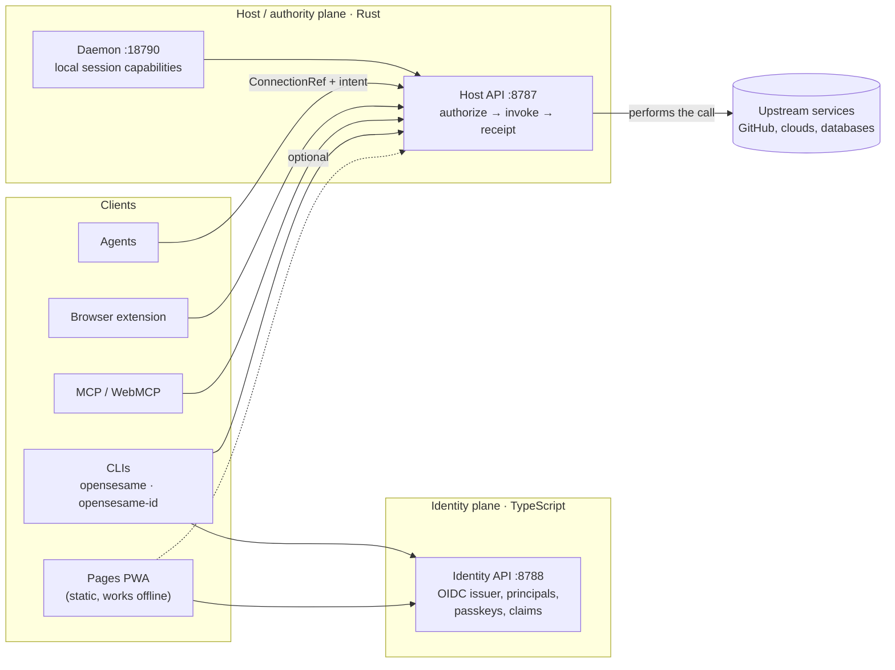

# OpenSesame

**An authorization fabric for the agentic era.** Agents get scoped,
revocable authority to act — never the secrets behind it. People keep their
own credentials on their own devices. Websites get "Sign in with OpenSesame"
without running a backend.

[Live app](https://tyler-r-kendrick.github.io/OpenSesame/) ·
[Documentation](docs/README.md) ·
[Getting started](docs/getting-started/README.md) ·
[Architecture](docs/architecture/README.md) ·
[Decisions](docs/adr/README.md) ·
[Security](docs/security/README.md)

---

## The idea in one paragraph

An agent that needs to call GitHub, a database or a payment API normally gets
handed a token, and from then on it *has* that token. OpenSesame inverts that.
The agent holds a **ConnectionRef** — a handle that names a connection but
contains nothing secret — and states an **intent**. The Host authorizes the
intent against policy and grants, performs the call itself, and returns a
signed **receipt**. There is no `getSecret()` anywhere in the agent-facing API,
so there is nothing for a prompt injection to exfiltrate
([ADR 0005](docs/adr/0005-authority-handle-connectionref.md)).

## What it does

| For | OpenSesame provides |
|-----|---------------------|
| **Agents** | ConnectionRef + intent → authorize → invoke → receipt. Task-scoped grants that can only narrow, JIT access with approval, MCP and WebMCP servers, CLI credential helpers for git, Docker, AWS and kubectl. |
| **Operators** | An authority console: connectors, grants, approvals, device login, certificates (private CA, ACME), rotation, security alerting, audit receipts. |
| **People** | An end-to-end-encrypted vault that lives on the device (passkey, PIN or password unlock), a git-native sealed store with `pass` parity, and bridges to KeePass, Bitwarden, `pass`/gopass and browserpass so existing tools keep working. |
| **Websites** | OIDC sign-in for static sites with no backend: an origin-derived public client, PKCE, pairwise subjects. |

## How it fits together



- **Two APIs, deliberately separate.** The Identity API answers *who*; the Host
  API answers *what they may do* and does it. They are never merged behind one
  backend ([ADR 0017](docs/adr/0017-host-client-product-topology.md)).
- **The static app is complete on its own.** The Pages PWA opens, signs in and
  keeps a vault with no Host, no Identity API and no server at all; each
  backend it can use is optional, per feature
  ([ADR 0090](docs/adr/0090-static-frontend-complete-without-backend.md)).
- **One client core.** The PWA, the client CLI and Android share
  `packages/app-core` and the vault-format kernel `packages/vault-core`
  ([ADR 0133](docs/adr/0133-shared-app-core.md)).

The full picture is in [docs/architecture](docs/architecture/README.md).

## Quick start

Prerequisites: Node 22+, pnpm 9 (via Corepack), and Rust 1.88 for the Host
plane. Details and troubleshooting: [getting started](docs/getting-started/README.md).

```bash
corepack enable
pnpm install
pnpm setup:hooks                             # lint + secret-scan hooks

# The app, no backend needed — open http://localhost:5180
pnpm --filter @opensesame/pages dev:web

# The app with a local Host, Identity API and mock IdP behind it
pnpm --filter @opensesame/pages dev
```

Or start the backends one at a time:

```bash
# Identity plane (Identity API on :8788, mock upstream IdP on :9090)
pnpm --filter @opensesame/mock-upstream-idp dev &
OPENSESAME_ENV=development pnpm --filter @opensesame/control-plane start

# Host plane (Host API on :8787, daemon on :18790)
cargo build -p opensesame-cli
./target/debug/opensesame host run --listen 127.0.0.1:8787
./target/debug/opensesame daemon run --listen 127.0.0.1:18790
./target/debug/opensesame login --flow device --server http://127.0.0.1:8787
```

## Repository layout

| Path | What lives there |
|------|------------------|
| [`apps/`](apps/README.md) | Deployable products: the Host API, daemon and CLI (Rust); the Identity API, Pages PWA, console, MCP servers and extension (TypeScript). |
| [`crates/`](crates/README.md) | Rust libraries for the Host / authority plane. |
| [`packages/`](packages/README.md) | TypeScript libraries: domain model, client core, SDKs, protocols. |
| [`examples/`](examples/README.md) | Runnable integrations: relying parties, agents, a headless device-login client. |
| [`marketplace/`](marketplace/README.md) | Vault item-type definitions — the built-in set and the installable catalogue. |
| [`spec/`](spec/README.md) | Language-neutral contracts: WIT worlds, the Host OpenAPI, the OpenFGA model, connector manifests. |
| [`tests/`](tests/README.md) | Cross-cutting suites: fuzzing, red team, visual contract, mTLS interop, shared fixtures. |
| [`tools/`](tools/README.md) | Development tooling: lint plugins, quality baselines, mutation configs, the mock IdP. |
| [`scripts/`](scripts/README.md) | Task scripts behind `pnpm` commands: gates, audits, release checks. |
| [`ops/`](ops/README.md) | Compose stacks, ingress and NATS references, repo governance, scheduled routines. |
| [`skills/`](skills/README.md) | Agent skills for using and developing OpenSesame. |
| [`docs/`](docs/README.md) | Everything else worth reading. |

## Everyday commands

```bash
pnpm typecheck        # every TypeScript workspace
pnpm test             # every TypeScript test suite
cargo +1.88.0 test --workspace --all-targets
pnpm lint             # Biome on files changed from origin/main
pnpm quality          # file-size, complexity and package-coupling ratchets
pnpm verify           # the full local gate: all of the above, Clippy, anti-slop, battle test
```

What each gate enforces and why: [contributing](docs/contributing/README.md).

## Contributing

Read [CONTRIBUTING.md](CONTRIBUTING.md), then [`AGENTS.md`](AGENTS.md) — it is
the canonical rulebook for humans and coding agents alike, and its design rules
gate merges. Consequential decisions get an [ADR](docs/adr/README.md).

## Security

Report vulnerabilities privately; see [SECURITY.md](SECURITY.md). The threat
models, trust boundaries and the running audit log are in
[docs/security](docs/security/README.md).

## License

MIT — see [LICENSE](LICENSE) and [NOTICE](NOTICE). What we build on instead of
reinventing, and under which licenses: [docs/reference/reuse.md](docs/reference/reuse.md).
