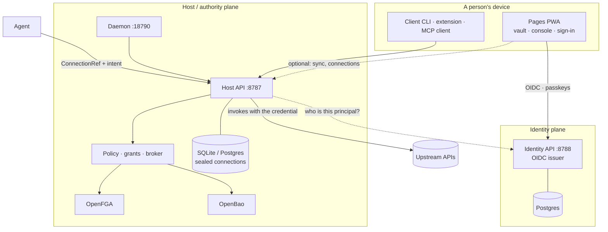

# Architecture

How OpenSesame is built, from the whole system down to individual mechanisms.
Decisions and their rationale live in [ADRs](../adr/README.md); these pages
describe what the decisions add up to.

## The system in one picture

Three planes, each answering one question:

| Plane | Answers | Built as | Never does |
|---|---|---|---|
| **Identity** | *Who is this?* | TypeScript: Hono, oidc-provider, Better Auth (`apps/control-plane`) | Hold a third-party credential or perform an invocation. |
| **Host / authority** | *May they do this — and do it.* | Rust: Axum, SQLx, OpenFGA, OpenBao (`apps/gateway`, `crates/`) | Hand a credential to a caller. |
| **Client** | *What does this person keep here?* | TypeScript + WebCrypto, Rust→Wasm (`apps/pages`, `packages/app-core`) | Depend on either backend to be useful. |

The Identity and Host APIs are separate services with separate stores, and
stay that way: no backend-for-frontend merges them, and neither proxies the
other ([ADR 0007](../adr/0007-dual-plane-identity-authority.md),
[ADR 0017](../adr/0017-host-client-product-topology.md)).

## How an agent acts without holding a secret

1. **A person connects a service once.** The Host runs the OAuth (or API-key,
   or certificate) ceremony and seals the resulting credential in its store.
   The person's device never sees it ([connection broker](connection-broker.md)).
2. **The agent receives authority, not material.** It gets a grant bounded by
   a capability ceiling and a **ConnectionRef** naming the connection. Grants
   delegate only by narrowing.
3. **The agent states an intent** — a typed operation, or at most a constrained
   HTTP call inside the connection's egress allowlist.
4. **The Host decides.** The policy enforcement point checks the grant, the
   relationship model in OpenFGA, and any approval the intent requires; a
   sensitive approval is bound to the exact request digest.
5. **The Host performs the call** with the credential it holds, and returns the
   result with a signed **receipt**.

Exporting the underlying credential is a separate, normally denied operation.
Possessing a handle never implies permission to resolve it
([ADR 0005](../adr/0005-authority-handle-connectionref.md)).

## Properties the design holds to

- **The static app is complete.** `apps/pages` boots, signs in, and keeps an
  encrypted vault with no Host, no Identity API and no localhost service; each
  panel is gated on exactly what it needs
  ([ADR 0090](../adr/0090-static-frontend-complete-without-backend.md)).
- **Vault keys never leave memory.** The master key is derived on unlock, the
  vault key is unwrapped in memory, and only ciphertext is persisted (OPFS in
  the browser) — see [vault format v1](vault-format-v1.md) and the
  [key hierarchy](../security/key-hierarchy.md).
- **Optional code is absent until consented.** A capability's module is not
  loaded before an operator's plan and a consent receipt cover it
  ([ADR 0130](../adr/0130-operator-controlled-capability-composition.md)).
- **Security facts share one path.** Every expiry, breach or stuck agent run
  becomes a `SecurityNotice` on one feed with one set of sinks
  ([ADR 0080](../adr/0080-security-event-hooks.md)).
- **Every hop is declared.** Loopback, server TLS, mutual TLS or trusted
  ingress — chosen per hop, and none is a fallback for another
  ([transport topology](transport-topology.md)).

## Pages in this section

### Foundations

| Page | Covers |
|---|---|
| [Host/client topology](host-client-topology.md) | Surfaces, ports, the crate/package dependency graph, the two CLIs, the WIT worlds. |
| [Identity plane](identity-plane.md) | The Identity API's parts and how principals relate to upstream accounts. |
| [Transport topology](transport-topology.md) | The hop profiles between planes and what a certificate does and does not prove. |
| [Modularity and refactoring](modularity-refactor-strategy.md) | Where the codebase's complexity actually comes from, and the refactoring strategy that follows. |

### Identity and sign-in

| Page | Covers |
|---|---|
| [Federated sign-in](federated-signin.md) | The wire contract for upstream IdPs and origin-brokered sign-in on static sites. |
| [Device authorization](device-auth.md) | RFC 8628 device login and its domain projection. |
| [Claims](claims.md) | Claim sessions that attach or transfer ownership — and why they are not device authorization. |
| [Identity linking](identity-linking.md) | Pairwise subjects, external-identity uniqueness, what links and what never does. |
| [Privacy](privacy.md) | The identity plane's privacy commitments. |

### Authority and connections

| Page | Covers |
|---|---|
| [Connection broker](connection-broker.md) | The connection lifecycle, statuses, bindings to organizations, projects and agents. |
| [General authority](general-authority.md) | One hierarchical authority model across projects, connectors and vault items. |
| [TaskBus and NATS](task-bus-nats.md) | Durable events on NATS JetStream without breaking the plane split or faking E2EE. |
| [Live session observation](live-session-observation.md) | Watching an agent work in your account, and taking control back. |

### Vaults and credentials

| Page | Covers |
|---|---|
| [Vault format v1](vault-format-v1.md) | The tomb header, key wraps and portable envelopes every vault reader must meet. |
| [Password-manager bridges](pm-bridges.md) | How KeePass, Bitwarden, `pass` and browserpass clients and stores reach OpenSesame. |
| [Web-login rotation](web-login-rotation.md) | Rotating a website password without the user. |
| [Rotation teaching and replay](rotation-teaching-and-replay.md) | Turning a failed rotation into a deterministic recipe. |
| [Rotation recipe schema](rotation-recipe-schema.md) | The signed recipe format a teaching session produces. |

### Interaction

| Page | Covers |
|---|---|
| [Wallet interaction layer](wallet-interaction-layer.md) | Handing a question to a second screen: QR, Wallet pass, push, CLI link — one envelope. |
| [AI contextual support](ai-contextual-support.md) | The in-product assistant that can point but never act. |

## Related

- [Security boundaries](../security/security-boundaries.md) and the
  [threat model](../security/threat-model.md) — the same system seen as trust
  boundaries.
- [Design](../design/README.md) — the same system seen as screens.
- [Reference](../reference/README.md) — protocol profiles, standards support,
  wire contracts.
