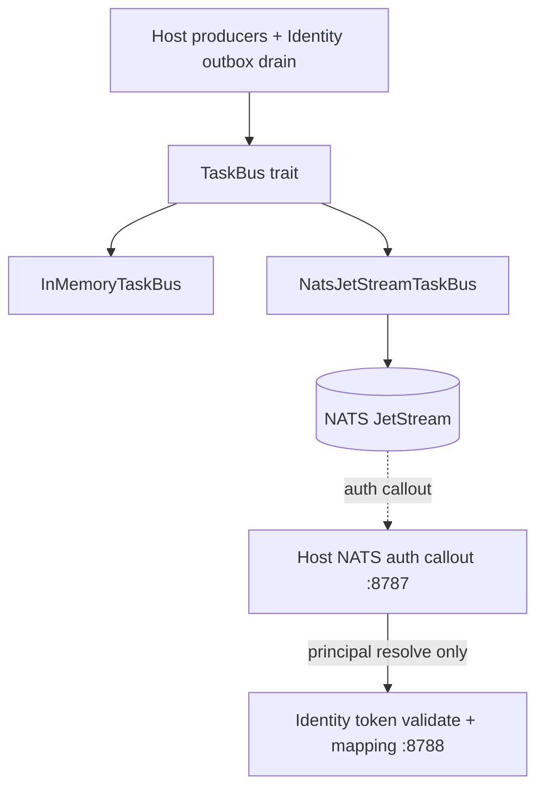

# TaskBus and NATS JetStream

How OpenSesame publishes durable Host/Identity events on a message bus without
collapsing dual-plane boundaries or faking E2EE. Decisions live in
[ADR 0042](../adr/0042-nats-taskbus-auth-callout-and-xkeys.md); foundations in
[ADR 0002](../adr/0002-foundations.md); outbox authority in
[ADR 0010](../adr/0010-postgres-authoritative-store.md). Projects / sync /
changelog producers are specified in
[ADR 0041](../adr/0041-projects-sync-targets-and-secret-changelog.md).

## Planes and trust boundary

```text
Pages / CLI / Agents / Workloads
        │
        ▼
┌──────────────────────────────────────────┐
│ Host (:8787)                             │
│  projects, sync targets, changelog       │
│  rotation scheduler (TaskBus publish)    │
│  NATS auth callout (authz / OpenFGA)     │
│  connection broker (sealed creds)        │
└───────────┬───────────────────┬──────────┘
            │                   │
            ▼                   ▼
     connector-host        TaskBus trait
     (Vercel/Railway/…)         │
            │                   ▼
            ▼            JetStream adapter
         receipts        (crates/task-bus)
                                │
┌───────────────────────────────┴──────────┐
│ Identity (:8788) — mapping / OIDC only   │
│  PrincipalMappingStore, pairwise sub     │
│  Postgres outbox → worker drain → bus    │
│  audit hash chain                        │
└──────────────────────────────────────────┘

E2EE path (separate keys):
  sealed-store / human-vault / Pages OPFS
  xkey (X25519) wrap → AEAD payload on bus
  Host deployment seal key NEVER used for xkey E2EE
```



## TaskBus contract

`crates/task-bus` owns:

| Type / trait | Role |
|--------------|------|
| `BusEvent` | CloudEvents-shaped envelope (`id`, `specversion`, `source`, `type`, `time`, `data`) |
| `TaskBus` | `publish` + `drain(max)` |
| `InMemoryTaskBus` | Default for unit tests |
| JetStream adapter | Production path when `NATS_URL` / `OPENSESAME_TASKBUS=nats` |

Subject / stream conventions (configurable):

- Events: `opensesame.events.>`
- Durable consumer: `opensesame-worker`
- Callout namespace reserved: `opensesame.callout.>`

## Auth callout

NATS auth callout HTTP terminates on **Host**, not Identity.

1. NATS sends an authorization request to the gateway callout route.
2. Host validates the presented token against configured Identity issuer(s)
   (and optional allowlisted OIDC issuers).
3. Host resolves canonical `principal_id` via Identity mapping API —
   **never** by email join.
4. Host authz (OpenFGA / AuthZEN) returns allow/deny + subject permissions.
5. Provisional principals get minimal pub/sub; verified org/project members
   get project-scoped subjects.

Pairwise or opaque capability tokens are preferred on public subjects/headers
over canonical principal IDs ([ADR 0011](../adr/0011-pairwise-subject-storage.md)).

## Outbox drain (no dual-write)

Identity mutations write Postgres `outboxEvents` first. Workers:

1. Read unpublished rows
2. `TaskBus::publish`
3. Mark published on success

JetStream is a **drain**, not a competing ledger. Do not dual-write Identity
mutations only to NATS ([ADR 0010](../adr/0010-postgres-authoritative-store.md)).

## xkeys (real E2EE)

Bus / sensitive payloads use client-held X25519 (age lineage) + AEAD open/seal.

| Allowed | Forbidden |
|---------|-----------|
| Recipient xkeys + human-vault-style AEAD | Sealing with `OPENSESAME_CONNECTION_KEY` |
| Sealed-store / Pages VRK-derived envelopes | Treating deployment seal as “E2EE on the wire” |

Deployment seal encrypts **authority connection credentials at rest** for Host
egress (ADR 0032). That key must not wrap TaskBus “E2EE” payloads.

## Event types (producers)

Non-exhaustive; frozen names used by projects / sync / rotation:

```text
project.personal.ensured
secret.config.created | secret.config.updated | secret.config.deleted
secret.value.changed
sync.target.created | sync.target.synced | sync.target.failed
credential.rotation.requested | credential.rotation.succeeded | credential.rotation.failed
```

Payloads carry metadata (ids, key **names**, versions) — never secret values.

## Operator pointers

Compose already runs JetStream (`nats:2.11.4` with `-js` on `:4222`). Point
gateway/worker at it with placeholders only — see
[docs/operators/local.md](../operators/local.md).
