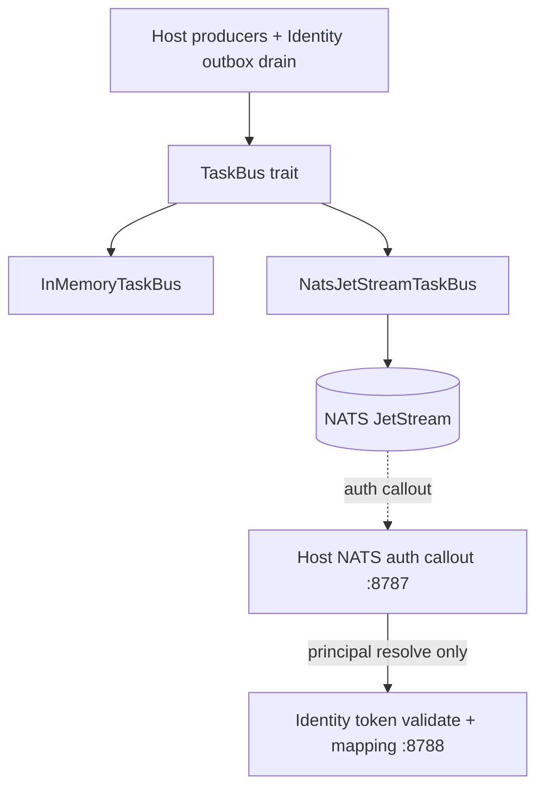

# TaskBus and NATS JetStream

How OpenSesame publishes durable Host/Identity events on a message bus without
collapsing dual-plane boundaries or faking E2EE. Decisions live in
[ADR 0042](../adr/0042-nats-taskbus-auth-callout-and-xkeys.md) and
[ADR 0141](../adr/0141-nats-feature-usage.md) (delivery semantics, the
callout bridge as a micro service, the sealed mixed-mode callout profile);
foundations in
[ADR 0002](../adr/0002-foundations.md); outbox authority in
[ADR 0010](../adr/0010-postgres-authoritative-store.md). Projects / sync /
changelog producers are specified in
[ADR 0041](../adr/0041-projects-sync-targets-and-secret-changelog.md).

## Planes and trust boundary

```text
Pages / CLI / Agents / Workloads
        │
        ▼
┌──────────────────────────────────────────┐
│ Host (:8787)                             │
│  projects, sync targets, changelog       │
│  rotation scheduler (TaskBus publish)    │
│  NATS auth callout (authz / OpenFGA)     │
│  connection broker (sealed creds)        │
└───────────┬───────────────────┬──────────┘
            │                   │
            ▼                   ▼
     connector-host        TaskBus trait
     (Vercel/Railway/…)         │
            │                   ▼
            ▼            JetStream adapter
         receipts        (crates/task-bus)
                                │
┌───────────────────────────────┴──────────┐
│ Identity (:8788) — mapping / OIDC only   │
│  PrincipalMappingStore, pairwise sub     │
│  Postgres outbox → worker drain → bus    │
│  audit hash chain                        │
└──────────────────────────────────────────┘

E2EE path (separate keys):
  sealed-store / human-vault / Pages OPFS
  xkey (X25519) wrap → AEAD payload on bus
  Host deployment seal key NEVER used for xkey E2EE
```



## TaskBus contract

`crates/task-bus` owns:

| Type / trait | Role |
|--------------|------|
| `BusEvent` | CloudEvents-shaped envelope (`id`, `specversion`, `source`, `type`, `time`, `data`) |
| `TaskBus::publish` | Idempotent on JetStream: `Nats-Msg-Id` = event `id`, `Nats-Expected-Stream` |
| `TaskBus::drain(max)` | At most once — events arrive already acked. For wakes whose work re-reads an outbox |
| `TaskBus::process(max, handler)` | At least once — ack (server-confirmed) after the handler succeeds, nak with delay on failure, `+TERM` for a payload that is not a `BusEvent` |
| `InMemoryTaskBus` | Default for unit tests; `process` re-publishes a failed event |
| `NatsJetStreamTaskBus` | Production path when `NATS_URL` / `OPENSESAME_TASKBUS=nats` |

Subject / stream conventions (configurable):

- Events: `opensesame.events.>` in stream `OPENSESAME_EVENTS`
- Durable consumers: `opensesame-worker`, `opensesame-backup` (system wakes)
- Callout namespace reserved: `opensesame.callout.>` (an application prefix,
  never the callout wire)

The stream is a bounded window, not a ledger (`StreamLimits`): file storage,
limits retention, discard-old, 7 days, 1 GiB, 1 MiB per message, a two-minute
duplicate window. Durables redeliver at most 8 times, 30 s apart unless a
handler asks sooner (`Redelivery`). Provisioning is create-or-update, so
running it again converges an existing stream and its durables.

## Auth callout

The server's native callout (`$SYS.REQ.USER.AUTH` in the AUTH account) is
answered by `opensesame-nats-auth-bridge` (`crates/nats-callout`), which asks
the Host for every decision over mTLS. The decision itself terminates on
**Host**, not Identity.

1. NATS sends an authorization request to the gateway callout route.
2. Host validates the presented token against configured Identity issuer(s)
   (and optional allowlisted OIDC issuers).
3. Host resolves canonical `principal_id` via Identity mapping API —
   **never** by email join.
4. Host authz (OpenFGA / AuthZEN) returns allow/deny + subject permissions.
5. Provisional principals get minimal pub/sub; verified org/project members
   get project-scoped subjects.

Pairwise or opaque capability tokens are preferred on public subjects/headers
over canonical principal IDs ([ADR 0011](../adr/0011-pairwise-subject-storage.md)).

**Mixed mode** (`ops/nats/secure-callout.conf`). The Host's service roles
(provisioner, host, publisher, consumer, backup — defined once in
`ops/nats/opensesame-roles.conf`) are static nkey users listed in
`auth_callout.auth_users`, so they bypass the callout. Everyone else — people
and agents from any issuer on `OPENSESAME_NATS_CALLOUT_ISSUER_JWKS`, or a
certificate the Host maps — is decided per connection, and the issued user
JWT's `exp` is enforced by the server with a disconnect.

**Sealed requests.** `auth_callout.xkey` makes the server seal each request
to the bridge's curve key (`xkv1`) and accept only a reply sealed back.

**The bridge is a NATS micro service** (`opensesame-auth-callout`, endpoint
`authorize`). Instances share one queue group, each decides up to 64 callouts
concurrently, and all of them answer `$SRV.PING|INFO|STATS` in the callout
account:

```bash
nats --context auth-account micro ls
nats --context auth-account micro stats opensesame-auth-callout
# endpoint data: {"allowed": N, "denied": N, "dropped": N}
```

## Outbox drain (no dual-write)

Identity mutations write Postgres `outboxEvents` first. Workers:

1. Read unpublished rows
2. `TaskBus::publish` (the row id is the `Nats-Msg-Id`)
3. Mark published on success

A failure between 2 and 3 republishes the row on the next pass; the stream's
duplicate window stores it once.

Host webhooks and backups follow the same pattern: a verified GitHub delivery
is written to the Host outbox, a `system.github.webhook.wake` /
`system.backup.wake` is published, and the `opensesame-backup` durable wakes
the outbox actor, whose `SQLite` claim remains the only claim path.

JetStream is a **drain**, not a competing ledger. Do not dual-write Identity
mutations only to NATS ([ADR 0010](../adr/0010-postgres-authoritative-store.md)).

## xkeys (real E2EE)

Bus / sensitive payloads use client-held X25519 (age lineage) + AEAD open/seal.

| Allowed | Forbidden |
|---------|-----------|
| Recipient xkeys + human-vault-style AEAD | Sealing with `OPENSESAME_CONNECTION_KEY` |
| Sealed-store / Pages VRK-derived envelopes | Treating deployment seal as “E2EE on the wire” |

Deployment seal encrypts **authority connection credentials at rest** for Host
egress (ADR 0032). That key must not wrap TaskBus “E2EE” payloads.

## Event types (producers)

Non-exhaustive; frozen names used by projects / sync / rotation:

```text
project.personal.ensured
secret.config.created | secret.config.updated | secret.config.deleted
secret.value.changed
sync.target.created | sync.target.synced | sync.target.failed
credential.rotation.requested | credential.rotation.succeeded | credential.rotation.failed
```

Payloads carry metadata (ids, key **names**, versions) — never secret values.

## Operator pointers

Compose runs JetStream (`nats:2.11.4` with `-js` on `:4222`) and points the
gateway and worker at it. Reference server profiles are in `ops/nats/`
(plaintext loopback, client mTLS, certificate mapping, callout, routes); see
[docs/operators/local.md](../operators/local.md) and
[docs/operators/mtls.md](../operators/mtls.md).
