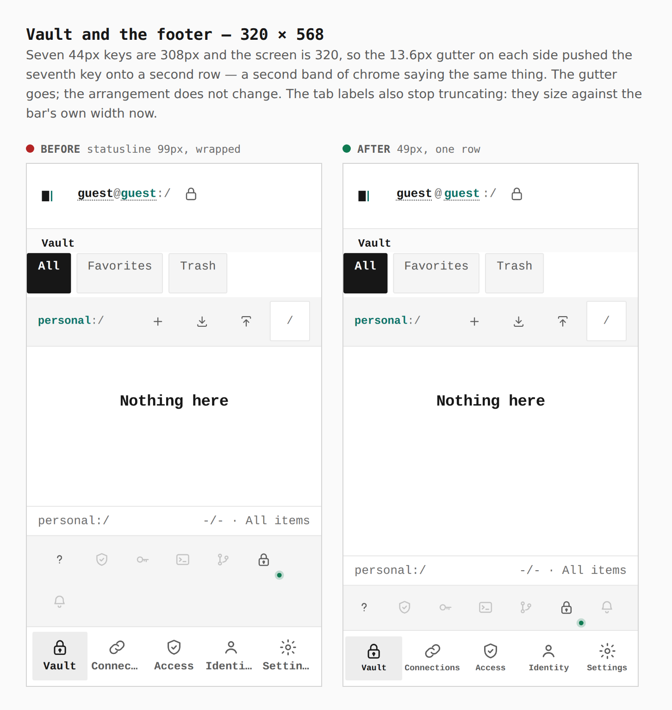
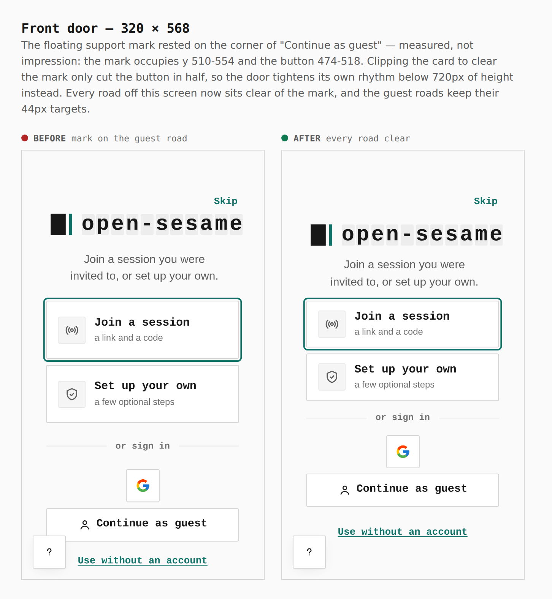
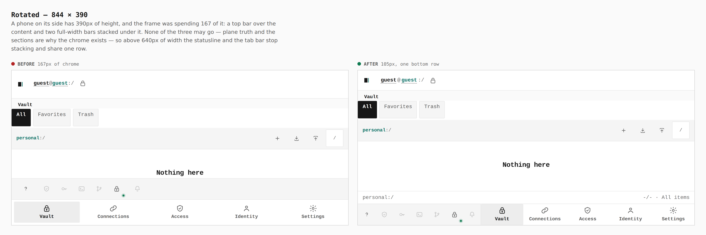
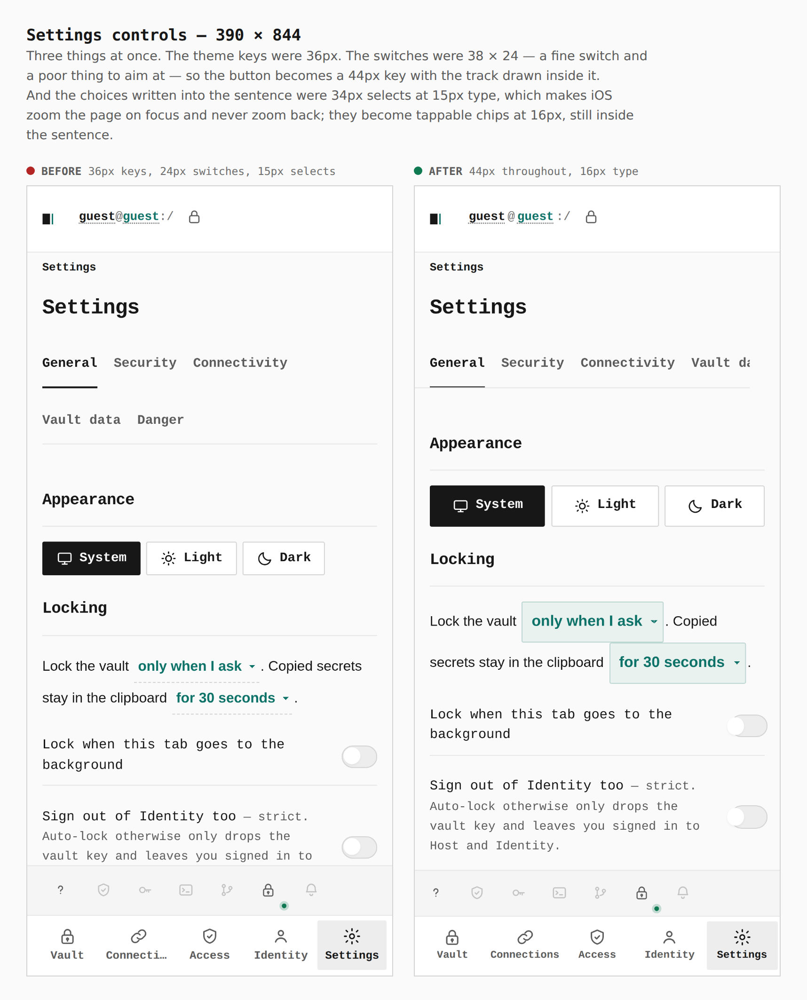
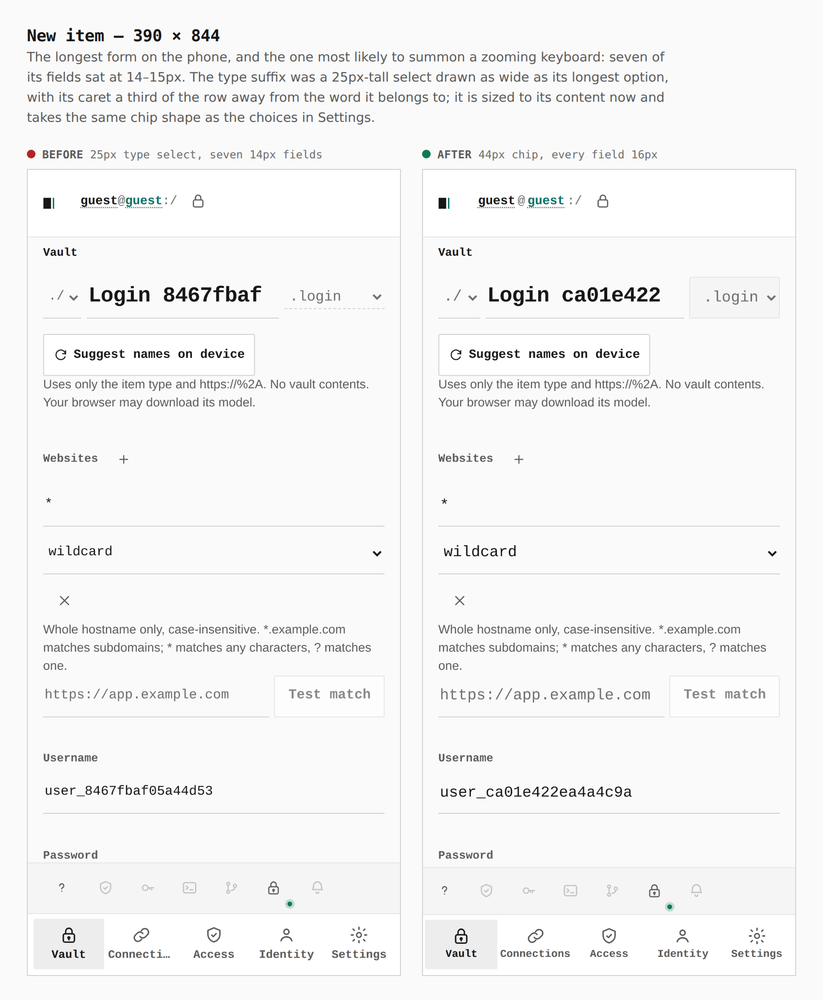
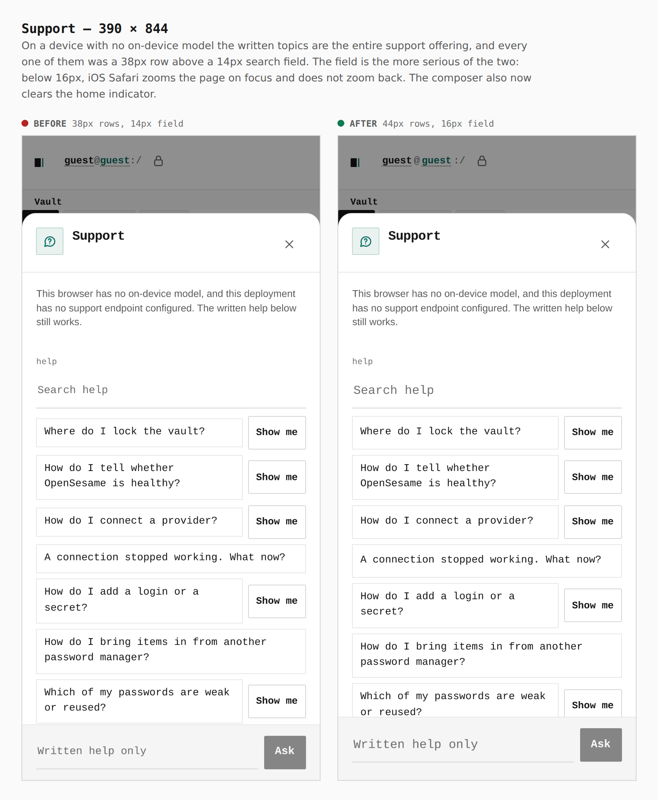
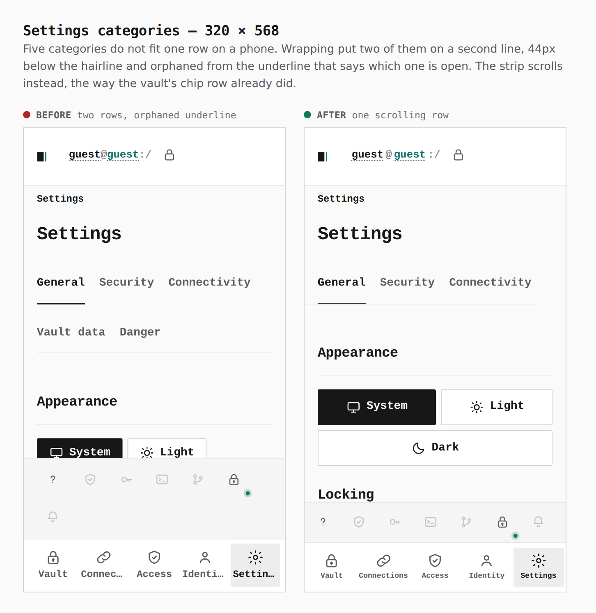
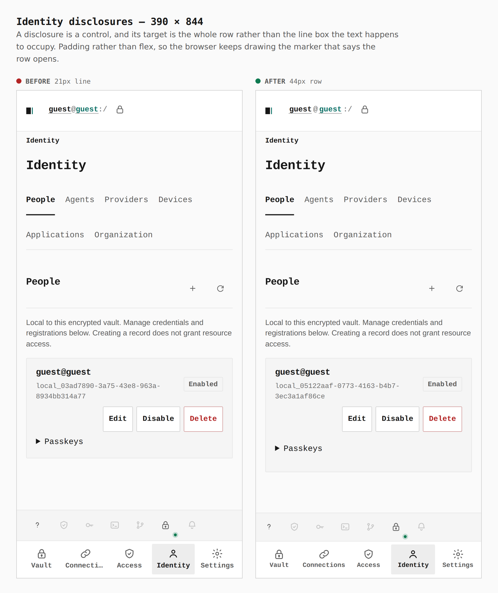

# The phone layout and touch contract

Before/after for [PR #396](https://github.com/Tyler-R-Kendrick/OpenSesame/pull/396).

Every pair below is the same screen captured from two real builds — `main`'s
for the before, the branch's for the after — walked the same way with the same
steps. Nothing is staged, nothing is cropped, and each pair carries the number
measured in the browser rather than an impression. The captions and the walk
itself are in [`journey.json`](journey.json); regenerate the set with
[`skills/visual-evidence`](../../../skills/visual-evidence/SKILL.md).

---

## Vault and the footer — 320 × 568

**`statusline 99px, wrapped → 49px, one row`** · the tab labels stop truncating

Seven 44px keys are 308px and the screen is 320, so the 13.6px gutter on each
side pushed the seventh key onto a second row — a second band of chrome saying
the same thing. The gutter goes; the accepted arrangement does not change.

## Front door — 320 × 568

**`mark on the guest road → every road clear`**

The floating support mark rested on the corner of "Continue as guest" — the
mark occupies y 510–554 and the button 474–518. Clipping the card to clear the
mark only cut the button in half, so the door tightens its own rhythm below
720px of height instead. Every road off this screen now sits clear of the mark,
and the guest roads keep their 44px targets.

## Rotated — 844 × 390

**`167px of chrome → 105px, one bottom row`**

A phone on its side has 390px of height, and the frame was spending 167 of it:
a top bar over the content and two full-width bars stacked under it. None of
the three may go — plane truth and the sections are why the chrome exists — so
above 640px of width the statusline and the tab bar stop stacking and share one
row.

## Settings controls — 390 × 844

**`36px keys, 24px switches, 15px selects → 44px throughout, 16px type`**

Three things at once. The theme keys were 36px. The switches were 38 × 24 — a
fine switch and a poor thing to aim at — so the button becomes a 44px key with
the track drawn inside it. And the choices written into the sentence were 34px
selects at 15px type, which makes iOS zoom the page on focus and never zoom
back; they become tappable chips at 16px, still inside the sentence.

## New item — 390 × 844

**`25px type select, seven 14px fields → 44px chip, every field 16px`**

The longest form on the phone, and the one most likely to summon a zooming
keyboard. The type suffix was a 25px-tall select drawn as wide as its longest
option, with its caret a third of the row away from the word it belongs to; it
is sized to its content now and takes the same chip shape as the choices in
Settings.

## Support — 390 × 844

**`38px rows, 14px field → 44px rows, 16px field`**

On a device with no on-device model the written topics are the entire support
offering, and every one of them was a 38px row above a 14px search field. The
field is the more serious of the two: below 16px, iOS Safari zooms the page on
focus and does not zoom back. The composer also now clears the home indicator.

## Settings categories — 320 × 568

**`two rows, orphaned underline → one scrolling row`**

Five categories do not fit one row on a phone. Wrapping put two of them on a
second line, 44px below the hairline and orphaned from the underline that says
which one is open. The strip scrolls instead, the way the vault's chip row
already did.

## Identity disclosures — 390 × 844

**`21px line → 44px row`**

A disclosure is a control, and its target is the whole row rather than the line
box the text happens to occupy. Padding rather than flex, so the browser keeps
drawing the marker that says the row opens.

