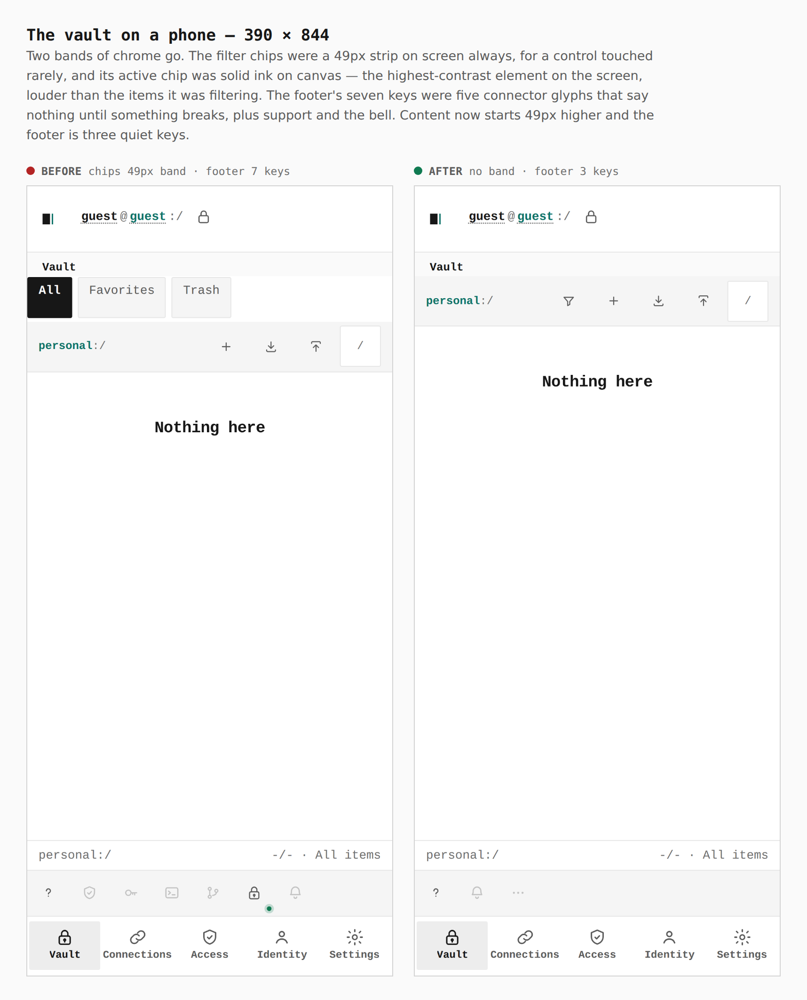
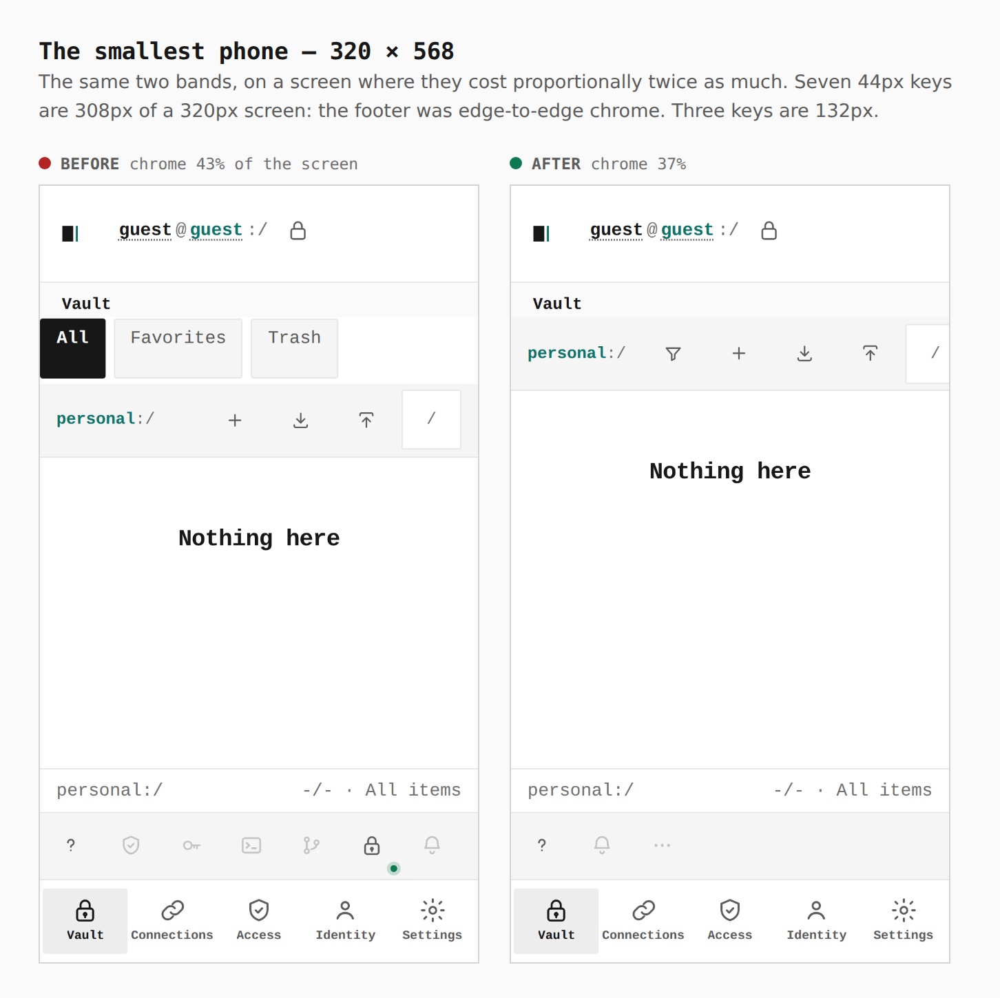
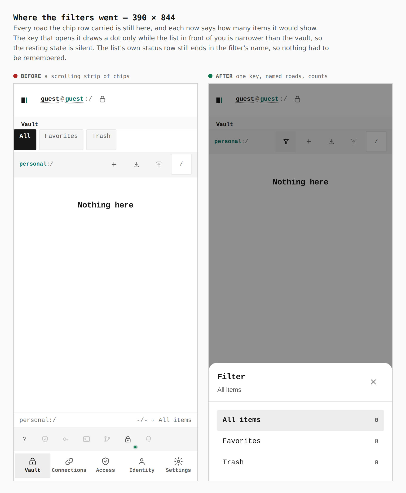
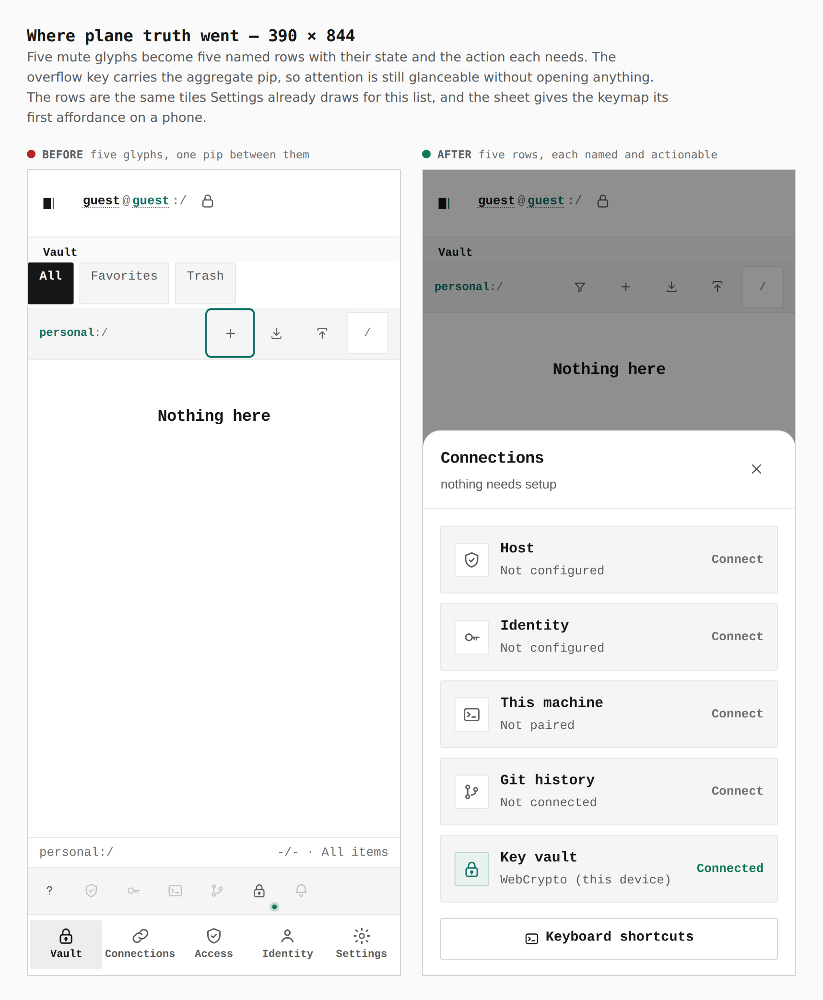
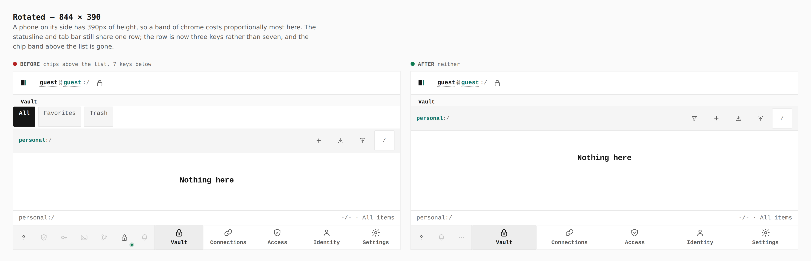
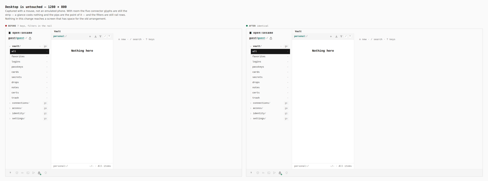

# Decluttering the phone: the status strip and the vault filters

Before/after for the phone declutter on
[PR #396](https://github.com/Tyler-R-Kendrick/OpenSesame/pull/396).

Every pair below is the same screen captured from two real builds — the
branch's previous head for the before, this one's for the after — walked the
same way with the same steps. Nothing is staged, nothing is cropped, and each
pair carries the number measured in the browser rather than an impression. The
captions and the walk itself are in [`journey.json`](journey.json); regenerate
the set with [`skills/visual-evidence`](../../../skills/visual-evidence/SKILL.md).

Chrome on a 390 × 844 phone: **362px → 313px of 844**, 43% → 37%. Content
starts 49px higher.

---

## The vault on a phone — 390 × 844

**`chips 49px band · footer 7 keys → no band · footer 3 keys`**

Two bands of chrome go. The filter chips were a 49px strip on screen always,
for a control touched rarely, and its active chip was solid ink on canvas — the
highest-contrast element on the screen, louder than the items it was filtering
and louder than the "new item" key beside it. The footer's seven keys were five
connector glyphs that say nothing until something breaks, plus support and the
bell.

## The smallest phone — 320 × 568

**`chrome 43% of the screen → 37%`**

The same two bands, on a screen where they cost proportionally twice as much.
Seven 44px keys are 308px of a 320px screen: the footer was edge-to-edge
chrome. Three keys are 132px.

## Where the filters went — 390 × 844

**`a scrolling strip of chips → one key, named roads, counts`**

Every road the chip row carried is still here, and each now says how many items
it would show. The key that opens it draws a dot only while the list in front of
you is narrower than the vault, so the resting state is silent. The list's own
status row still ends in the filter's name, so nothing had to be remembered.

## Where plane truth went — 390 × 844

**`five glyphs, one pip between them → five rows, each named and actionable`**

Five mute glyphs become five named rows with their state and the action each
needs. The overflow key carries the aggregate pip, so attention is still
glanceable without opening anything. The rows are the same tiles Settings
already draws for this list, and the sheet gives the keymap sheet its first
affordance on a phone — `?` opened it on a desktop and nothing opened it here.

## Rotated — 844 × 390

**`chips above the list, 7 keys below → neither`**

A phone on its side has 390px of height, so a band of chrome costs
proportionally most here. The statusline and tab bar still share one row; the
row is now three keys rather than seven.

## Desktop is untouched — 1280 × 800

**`7 keys, filters in the rail → identical`**

Captured with a mouse, not an emulated phone — `phoneContext` forces
`hasTouch`, and a width-and-pointer rule would otherwise show the phone
arrangement at 1280, which is evidence of a screen nobody sees. With room the
five connector glyphs are still the strip and the filters are still rail rows.

