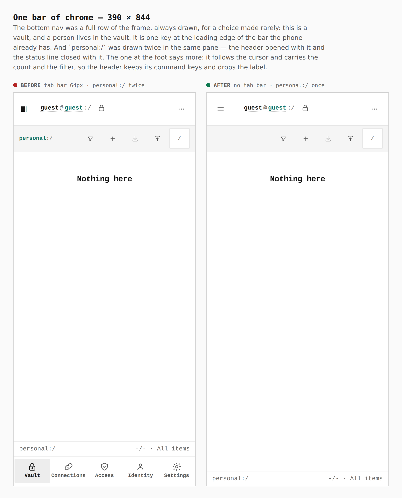
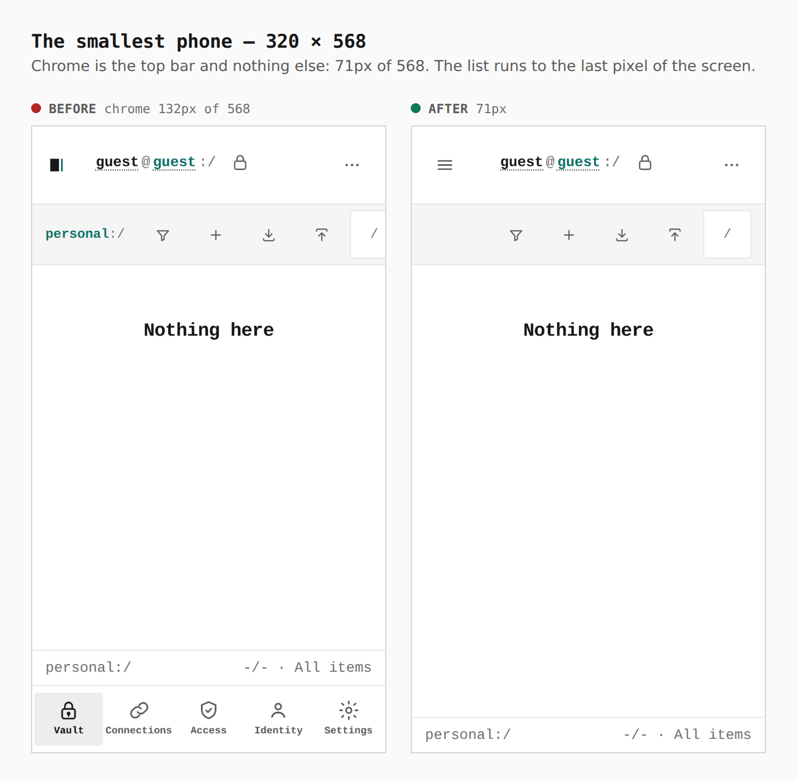
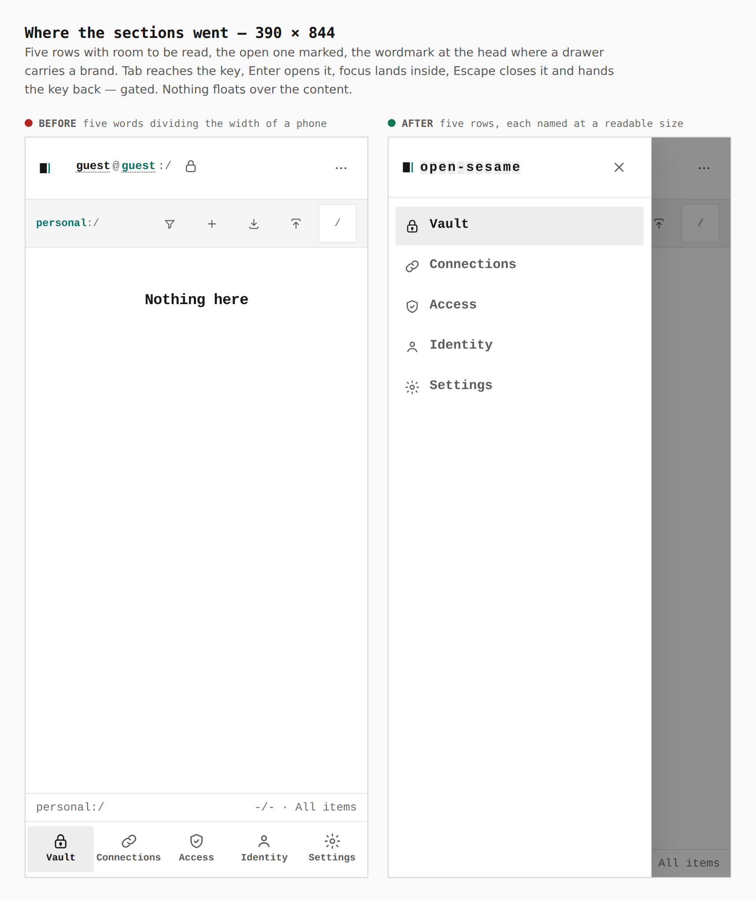
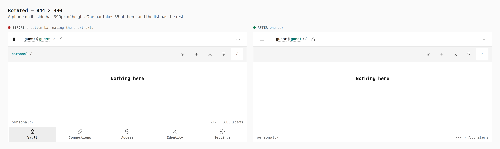
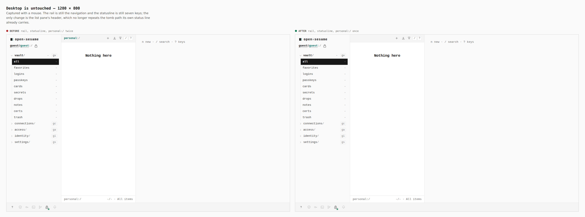

# One bar of chrome on a phone, and one tomb path per pane

Before/after for the third declutter pass on
[PR #396](https://github.com/Tyler-R-Kendrick/OpenSesame/pull/396).

Every pair below is the same screen captured from two real builds — the
branch's previous head for the before, this one's for the after — walked the
same way with the same steps. Nothing is staged, nothing is cropped, and each
pair carries the number measured in the browser. The captions and the walk are
in [`journey.json`](journey.json); regenerate the set with
[`skills/visual-evidence`](../../../skills/visual-evidence/SKILL.md).

Chrome on a 390 × 844 phone: **71px of 844**, where this branch started at
362px. The list runs to the last pixel of the screen.

---

## One bar of chrome — 390 × 844

**`tab bar 64px · personal:/ twice → no tab bar · personal:/ once`**

The bottom nav was a full row of the frame, always drawn, for a choice made
rarely: this is a vault, and a person lives in the vault. It is one key at the
leading edge of the bar the phone already has.

And `personal:/` was drawn twice in the same pane — the header opened with it
and the status line closed with it. The one at the foot says more: it follows
the cursor, so it reads `personal:/Work/Webmail` where the header never left
the root, and it carries the count and the filter beside it. The header keeps
its command keys and drops the label.

## The smallest phone — 320 × 568

**`chrome 132px of 568 → 71px`**

Chrome is the top bar and nothing else. The list runs to the last pixel.

## Where the sections went — 390 × 844

**`five words dividing the width of a phone → five rows, each named at a readable size`**

The open section is marked, the wordmark sits at the head where a drawer
carries a brand, and nothing floats over the content — a fixed button would
cover the thing it floated above.

Tab reaches the key, Enter opens it, focus lands inside, Escape closes it and
hands the key back. That path is gated in `verify:keyboard`, and it caught a
real bug on the way: `useModalFocus` resolves the topmost modal surface by
`.sheet` alone, so with no sheet open it found none and Escape closed nothing.

## Rotated — 844 × 390

**`a bottom bar eating the short axis → one bar`**

A phone on its side has 390px of height. One bar takes 55 of them.

## Desktop is untouched — 1280 × 800

**`rail, statusline, personal:/ twice → rail, statusline, personal:/ once`**

Captured with a mouse. The rail is still the navigation and the statusline is
still seven keys; the only change is the list pane's header, which no longer
repeats the tomb path its own status line already carries.

