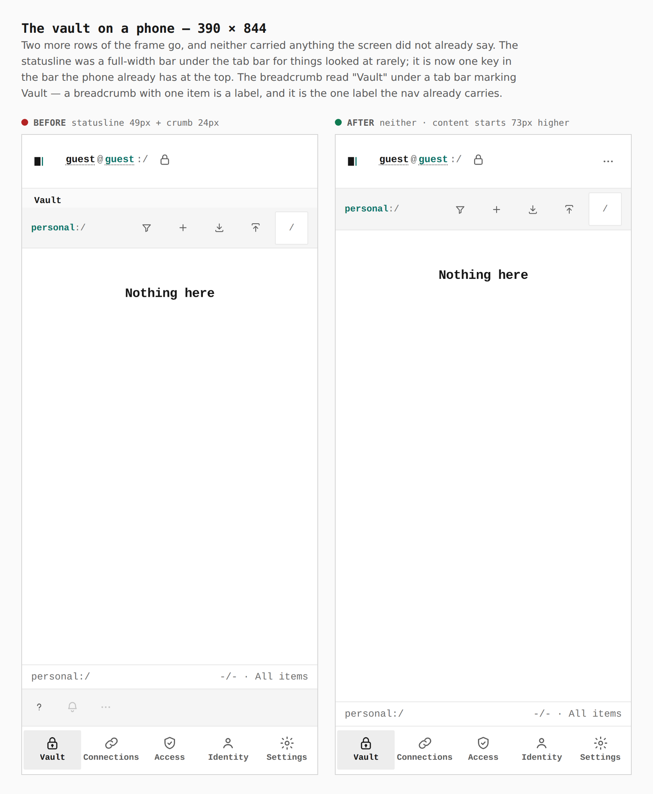
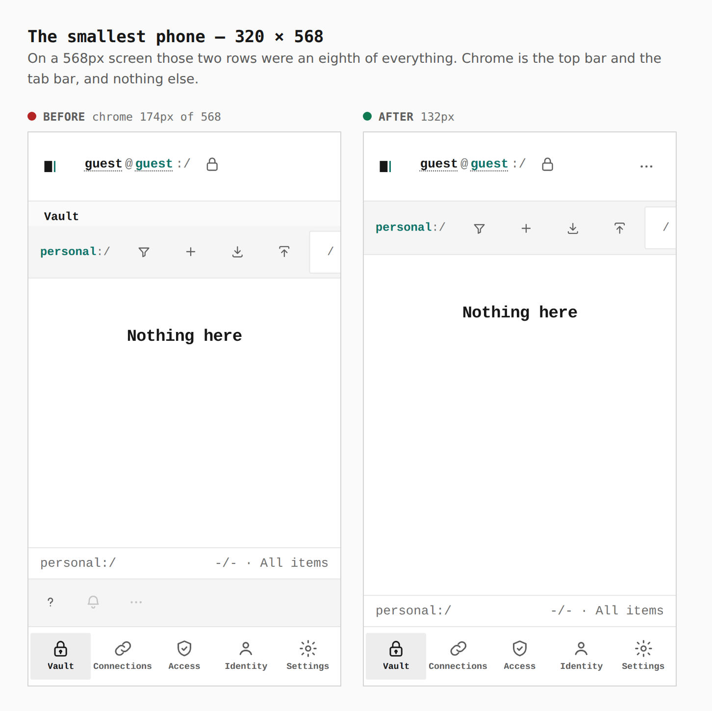
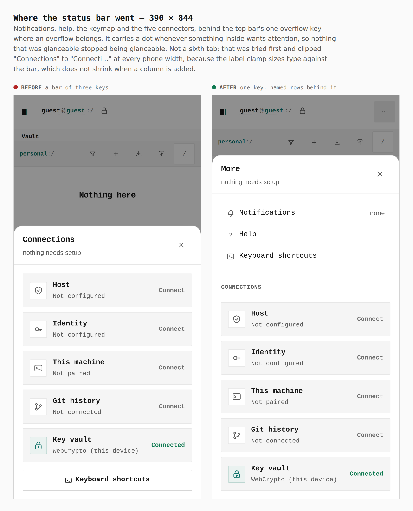
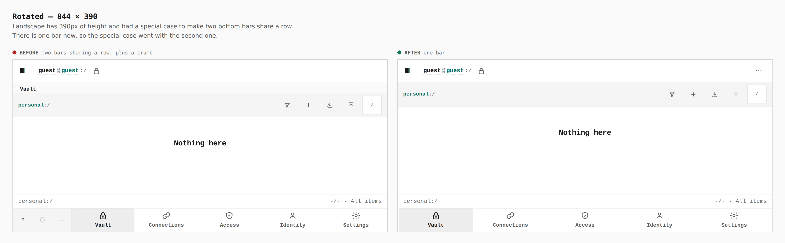
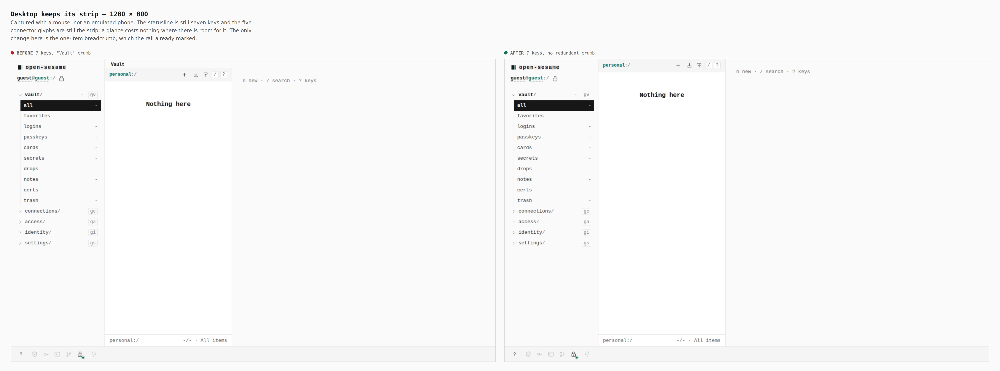

# A phone draws no status bar, and no line that only repeats the nav

Before/after for the second declutter pass on
[PR #396](https://github.com/Tyler-R-Kendrick/OpenSesame/pull/396).

Every pair below is the same screen captured from two real builds — the
branch's previous head for the before, this one's for the after — walked the
same way with the same steps. Nothing is staged, nothing is cropped, and each
pair carries the number measured in the browser. The captions and the walk are
in [`journey.json`](journey.json); regenerate the set with
[`skills/visual-evidence`](../../../skills/visual-evidence/SKILL.md).

Chrome on a 390 × 844 phone: **135px of 844**, down from 362px before this
branch. Content starts at 126px where it started at 199px.

---

## The vault on a phone — 390 × 844

**`statusline 49px + crumb 24px → neither, content starts 73px higher`**

Two more rows of the frame go, and neither carried anything the screen did not
already say. The statusline was a full-width bar under the tab bar for things
looked at rarely; it is one key in the bar the phone already has at the top.
The breadcrumb read "Vault" under a tab bar marking Vault — a breadcrumb with
one item is a label, and it is the one label the nav already carries.

## The smallest phone — 320 × 568

**`chrome 174px of 568 → 132px`**

On a 568px screen those two rows were an eighth of everything. Chrome is the
top bar and the tab bar, and nothing else.

## Where the status bar went — 390 × 844

**`a bar of three keys → one key, named rows behind it`**

Notifications, help, the keymap and the five connectors, behind the top bar's
one overflow key — where an overflow belongs. It carries a dot whenever
something inside wants attention, so nothing that was glanceable stopped being
glanceable.

Not a sixth tab: that was tried first and clipped "Connections" to "Connecti…"
at 320, 390 and 430 alike. The label clamp sizes type against the bar, which
does not shrink when a column is added, so a sixth column takes width from five
words and gives the type nowhere to go. Measured after the move: no label is
clipped at any phone width.

## Rotated — 844 × 390

**`two bars sharing a row, plus a crumb → one bar`**

Landscape has 390px of height and had a special case to make two bottom bars
share a row. There is one bar now, so the special case went with the second
one.

## Desktop keeps its strip — 1280 × 800

**`7 keys, "Vault" crumb → 7 keys, no redundant crumb`**

Captured with a mouse, not an emulated phone. The statusline is still seven
keys and the five connector glyphs are still the strip: a glance costs nothing
where there is room for it. The only change is the one-item breadcrumb, which
the rail already marked.

