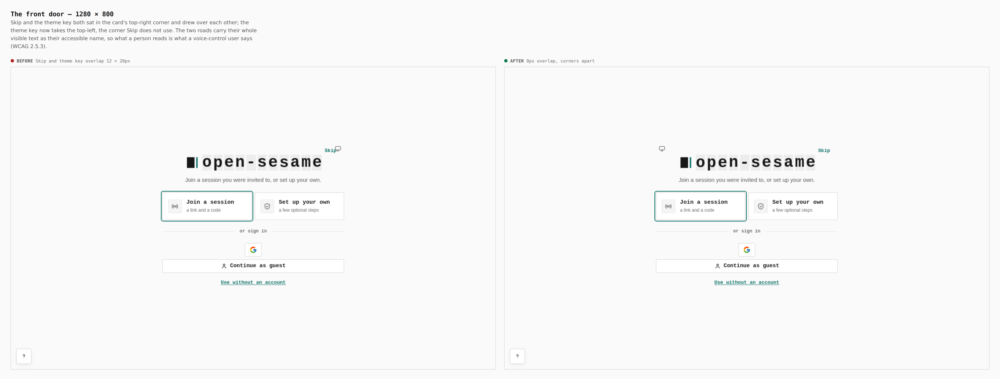
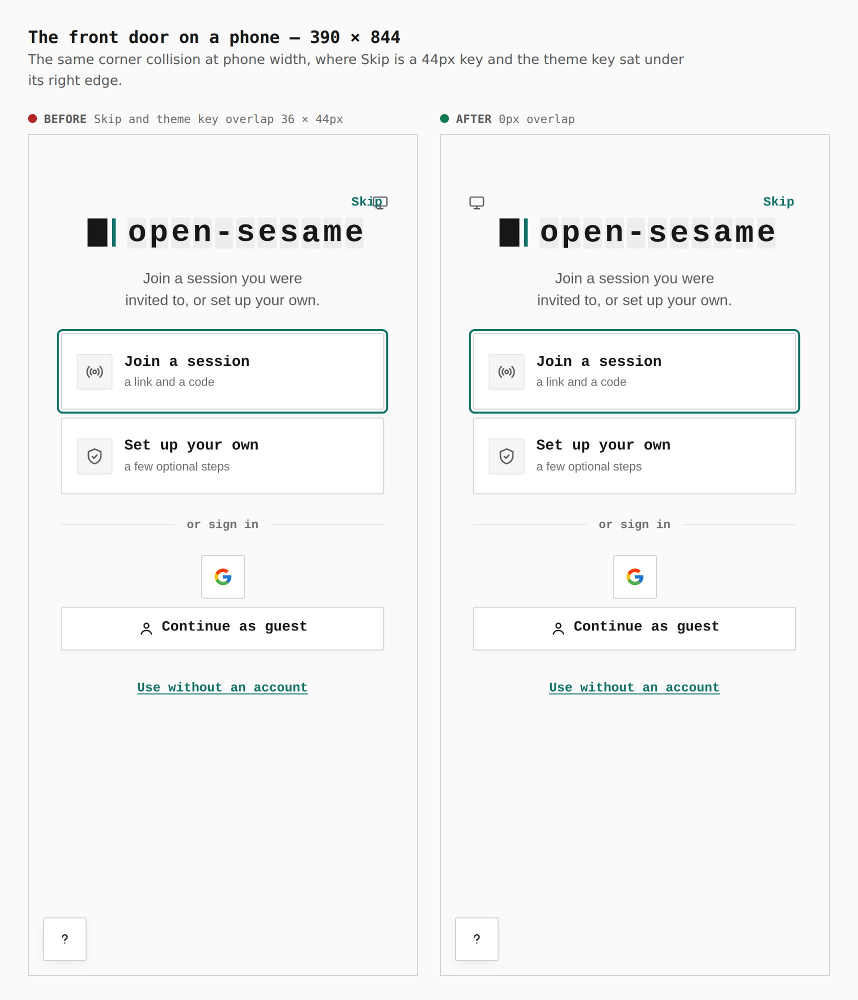
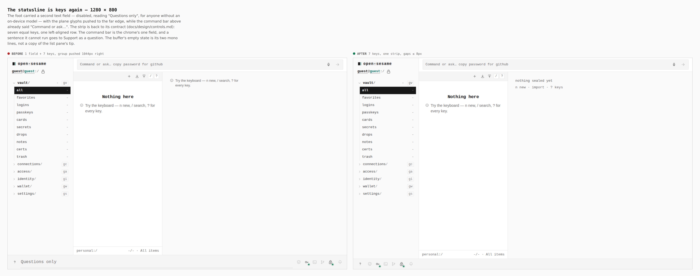
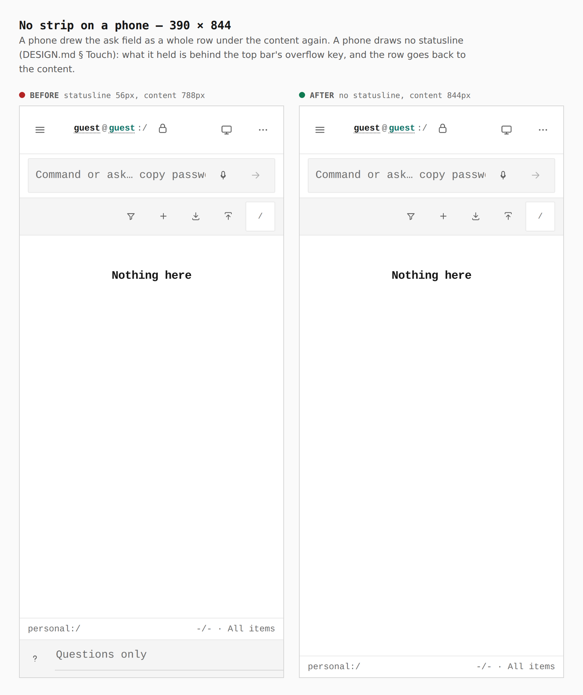
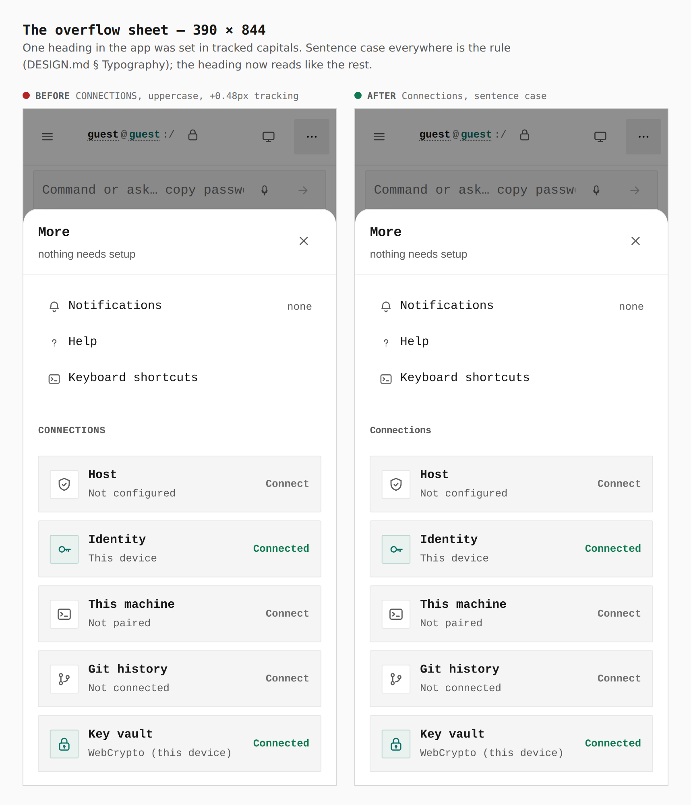
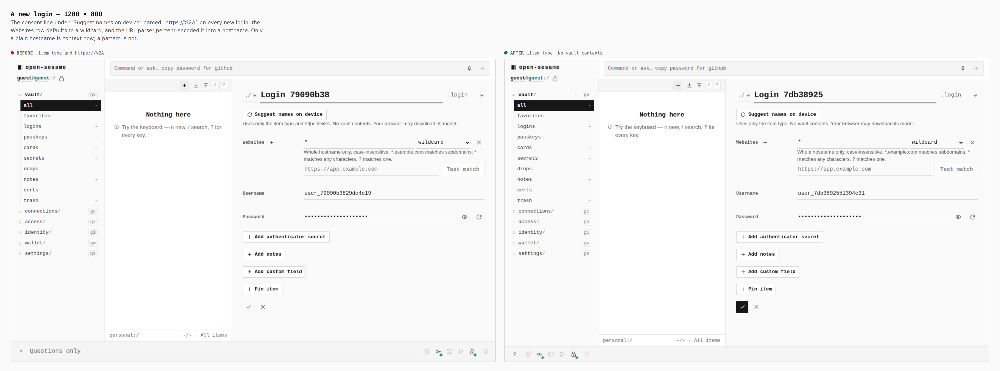
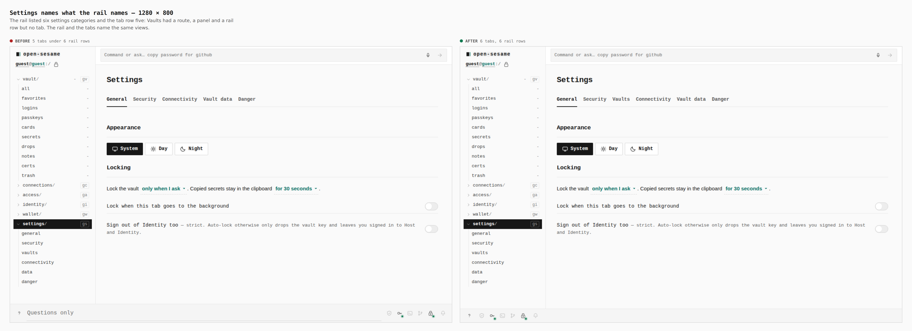
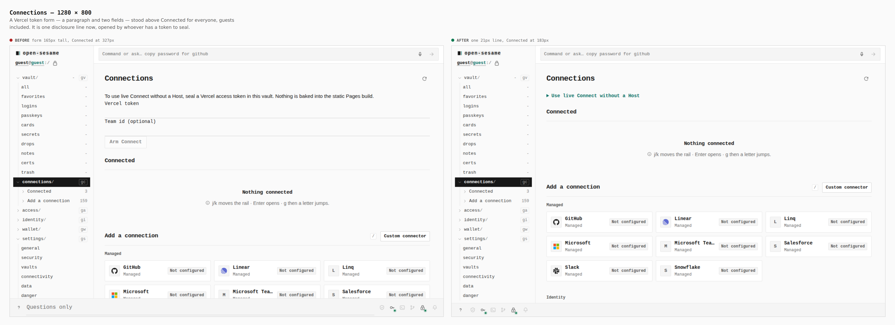

# One field in the chrome, the strip back to keys, the door's corners apart

Before/after images for the UI/UX polish pass on the Pages app. Every pair
below is the same screen captured from two real builds — `main`'s for the
before, this branch's for the after — walked the same way with the same
steps. Nothing is staged, nothing is cropped, and each pair carries the
number measured in the browser. The captions and the walk are in
[`journey.json`](journey.json); regenerate the set with
[`skills/visual-evidence`](../../../skills/visual-evidence/SKILL.md).

What the pass found and changed, in one line each:

- The statusline had grown a second text field beside the command bar, and
  the repo's own `verify:static` gate was red on `main` because of it.
- Skip and the theme key drew over each other in the front door's corner.
- The two front-door roads named less than they showed (WCAG 2.5.3).
- Every new login's consent line read `https://%2A`.
- Settings' rail listed six categories and its tab row five.
- A Vercel token form stood above Connected for everyone.
- One heading in tracked capitals, 11px captions, off-ramp radii, an
  accent-filled primary in the broker popup.
- A cold sign-in downloaded the whole workspace before it could paint.

---

## The front door — 1280 × 800

**`Skip and theme key overlap 12 × 20px → 0px, corners apart`**

Skip and the theme key both sat in the card's top-right corner and drew
over each other; the theme key now takes the top-left, the corner Skip does
not use. The two roads carry their whole visible text as their accessible
name — "Join a session, a link and a code" — so what a person reads is what
a voice-control user says.

## The front door on a phone — 390 × 844

**`overlap 36 × 44px → 0px`**

The same collision at phone width, where Skip is a 44px key and the theme
key sat under its right edge.

## The statusline is keys again — 1280 × 800

**`1 field + 7 keys, group pushed 1044px right → 7 keys, one strip, gaps ≤ 8px`**

The foot carried a second text field — disabled, reading "Questions only",
for anyone without an on-device model — with the plane glyphs pushed to the
far edge, while the command bar above already said "Command or ask…". The
strip is back to its contract ([controls.md](../../design/controls.md)):
seven equal keys, one left-aligned row. The command bar is the chrome's one
field, and a sentence it cannot run goes to Support as a question. The
buffer's empty state is its two mono lines, not a copy of the list pane's
tip.

## No strip on a phone — 390 × 844

**`statusline 56px, content 788px → no statusline, content 844px`**

A phone drew the ask field as a whole row under the content. A phone draws
no statusline (DESIGN.md § Touch): what it held is behind the top bar's
overflow key, and the row goes back to the content.

## The overflow sheet — 390 × 844

**`CONNECTIONS, uppercase, +0.48px tracking → Connections, sentence case`**

One heading in the app was set in tracked capitals. Sentence case everywhere
is the rule (DESIGN.md § Typography); the heading now reads like the rest.

## A new login — 1280 × 800

**`"…item type and https://%2A." → "…item type. No vault contents."`**

The consent line under "Suggest names on device" named `https://%2A` on
every new login: the Websites row defaults to a wildcard, and the URL parser
percent-encoded it into a hostname. Only a plain hostname is model context
now; a pattern is not.

## Settings names what the rail names — 1280 × 800

**`5 tabs under 6 rail rows → 6 tabs, 6 rail rows`**

Vaults had a route, a panel and a rail row but no tab. The rail and the tabs
name the same views.

## Connections — 1280 × 800

**`form 165px tall, Connected at 327px → one 21px line, Connected at 183px`**

A Vercel token form — a paragraph and two fields — stood above Connected for
everyone, guests included. It is one disclosure line now, opened by whoever
has a token to seal.

---

## What a screenshot cannot show

Measured on the same two builds, served gzip the way GitHub Pages serves
them, with Lighthouse 12 in headless Chromium (simulated slow 4G for mobile):

| | before | after |
| --- | --- | --- |
| Lighthouse mobile — performance | 84 | 90 |
| Lighthouse mobile — best practices | 96 | 100 |
| Lighthouse mobile — accessibility | 100, one failing audit (label in name) | 100, none |
| Lighthouse desktop | 100 / 96 / 100 / 100 | 100 / 100 / 100 / 100 |
| First contentful paint, mobile | 3.1 s | 2.6 s |
| Largest contentful paint, mobile | 3.4 s | 2.9 s |
| First-paint JavaScript (main chunk, gzip) | 391 KiB | 302 KiB |
| `verify:static` on `main` | 3 failed checks (statusline contract) | all pass |
| Impeccable detector findings | 30 | 11 (the documented display step and provider brand colours) |

The remaining best-practices audit that does not score is source maps, which
this PWA deliberately does not ship in `dist/`.
