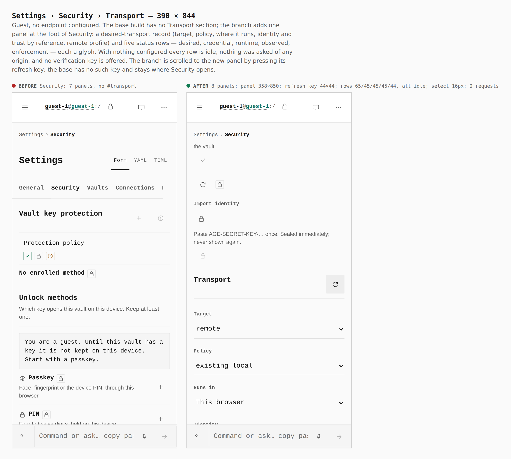
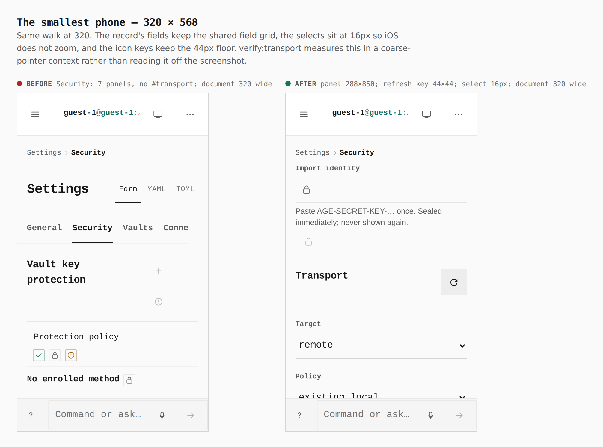
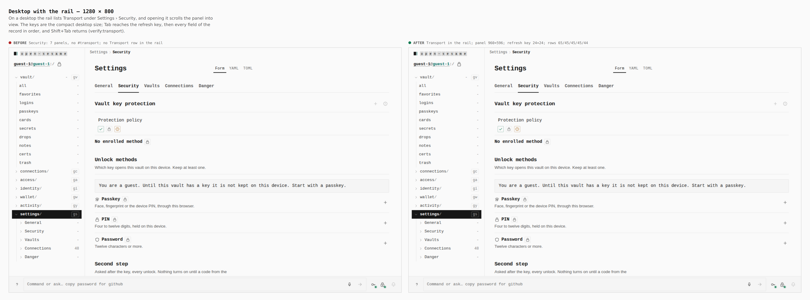

# Settings › Security › Transport — 2026-09-22

Before/after from two real Pages builds walked the same way: guest → Settings →
Security → open that branch of the rail → press the panel's refresh key, which
is what scrolls it into view (the base build has no such key, so it stays where
Security opens). Base is `424bc48` (the tree before any mTLS work — the
pre-directive baseline the coordinator recorded, built in a separate worktree);
after is this branch. Phone 390×844 and 320×568 in a coarse-pointer context,
desktop 1280×800 with a mouse. `journey.json` in this directory drove both.

Every number below was read from the browser by
`apps/pages/scripts/verify-transport.mjs` (branch) and
`scratchpad/measure-base.mjs` (base), not from the CSS.

| Sheet | Before (424bc48) | After (this branch) |
|---|---|---|
| `390-settings-security-transport.png` | Security: 7 panels, no `#transport` | Security: 8 panels; Transport panel 358 × 850 px; refresh key **44 × 44**; five rows 65/45/45/45/44 px, all idle; select 16px; 0 external requests |
| `320-settings-security-transport.png` | Security: 7 panels, no `#transport` | Transport panel 288 × 850 px; refresh key **44 × 44**; select **16px** (no iOS zoom); document no wider than 320 |
| `1280-settings-security-transport.png` | rail branch Settings › Security: Vault key protection / Formats / Age keys — 3 rows, 7 panels, no `#transport` | same branch adds **Transport** — 4 rows; panel 960 × 596 px; refresh key 24 × 24 (`icon-btn--sm`, desktop); five rows 65/45/45/45/44 px |

## What each sheet shows

### 390 — the panel on a phone


A guest with nothing configured. The desired-transport record (Target, Policy,
Runs in, Identity, Trust, Remote profile — every value a name or a choice) and
five status rows, one glyph each: desired, credential, runtime, observed,
enforcement. All five are idle; the page asked no origin anything; no
verification key is offered because there is no endpoint to ask.

### 320 — the smallest phone


Same panel at the floor width: keys hold 44px, selects hold 16px, and the
document is exactly 320 wide (verify:transport fails on any of those three).

### 1280 — desktop with the rail


The rail is a tree, and the Settings › Security branch is opened in both
builds. The base lists three panels there; the branch lists four, Transport
last. Tab reaches the refresh key and then each field in document order, and
Shift+Tab returns (verify:transport at 1280 and 390).

## Not shown as an image, and why

- **A degraded endpoint** (AT-STATIC-BADREMOTE): the harness refuses every
  non-static origin, so `https://bad-remote.invalid` set through the YAML
  settings file makes exactly one `GET …/operator/transport/status` leave the
  tab, the observed row turns `err` (measured: rows 65/45/45/**65**/44 with
  `observed=err`, all others idle), verification is offered and makes exactly
  one `POST …/verify`, and the vault, the guest prompt and the unlock screen are
  unchanged. It is measured, not screenshotted, because a capture of a refused
  request looks identical to a capture of nothing.
- **A verified / stale endpoint** (AT-EVIDENCE-POSITIVE, AT-EVIDENCE-STALE):
  there is no Host in a static build to answer; the row logic is pinned in
  `src/lib/transport-rows.test.ts` and `TransportPanel.test.tsx` against the
  wire fixture (`accepted_with_certificate` without `rejected_without_certificate`
  renders as an observation, never enforcement; a moved generation or a passed
  `fresh_until` renders Stale with the warn glyph on the panel head).

## How

```bash
J=docs/evidence/2026-09-22-transport-status/journey.json
# base: a worktree at 424bc48, built with VITE_BASE=/OpenSesame/; its dist swapped in
PLAYWRIGHT_CHROMIUM=/opt/pw-browsers/chromium node apps/pages/scripts/capture-evidence.mjs capture before "$J"
# branch
VITE_BASE=/OpenSesame/ pnpm exec turbo run build --filter=@opensesame/pages
PLAYWRIGHT_CHROMIUM=/opt/pw-browsers/chromium node apps/pages/scripts/capture-evidence.mjs capture after "$J"
PLAYWRIGHT_CHROMIUM=/opt/pw-browsers/chromium node apps/pages/scripts/capture-evidence.mjs compose "$J"
PLAYWRIGHT_CHROMIUM=/opt/pw-browsers/chromium pnpm --filter @opensesame/pages verify:transport
```
