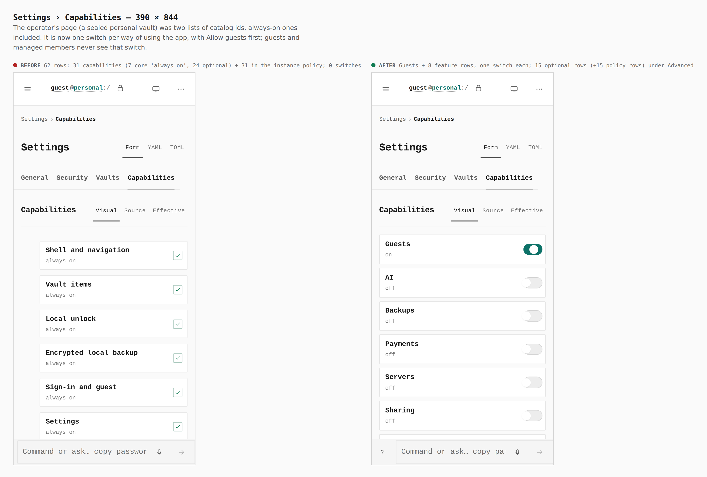
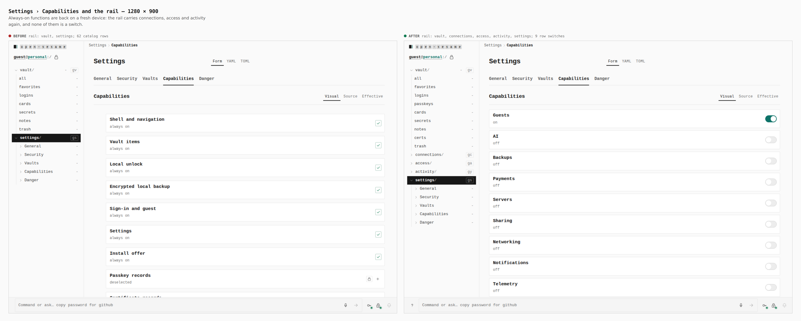
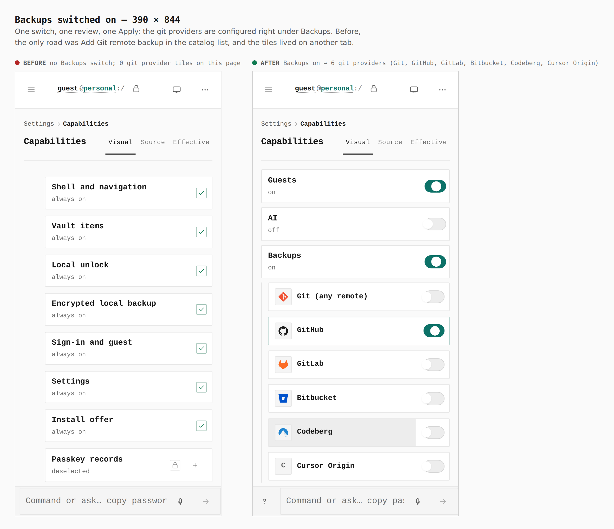
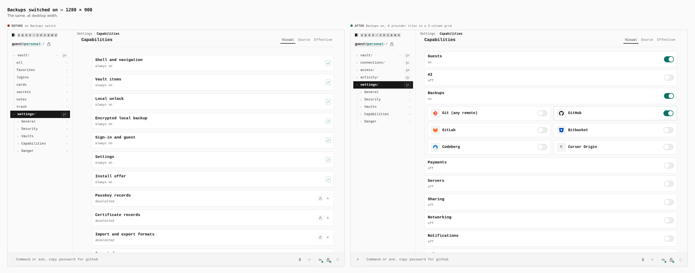
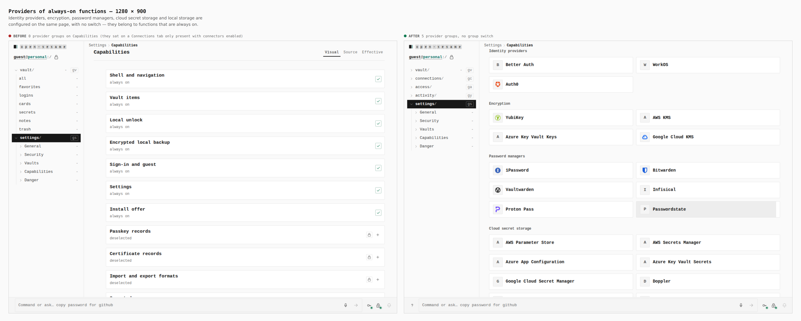

# Settings › Capabilities — features, always-on, Allow guests

Before/after from two real builds — the base (`9fa21d8`, current `main`) and
this branch — same journey (`journey.json`): seal a password vault on an empty
device (the operator's own installation), open Settings › Capabilities, switch
Backups on, apply. Counts were read from the browser by the journey's `count`
steps.

## Capabilities at phone width

`62 rows: 31 capabilities (7 core "always on", 24 optional) + 31 in the
instance policy, 0 switches` → `Guests + 8 feature rows, one switch each; 15
optional rows (+15 policy rows) under Advanced`. Allow guests is the
operator's: a guest, a project tomb or a managed member never sees it.

## Capabilities and the rail at desktop width

Rail `vault, settings` → `vault, connections, access, activity, settings`,
and the vault's own directories gain `passkeys` and `certs`: the always-on
functions are back on a fresh device, and none is a switch.

## Backups switched on — phone

`no Backups switch, 0 git provider tiles on this page` →
`Backups on → 6 git providers under it (Git, GitHub, GitLab, Bitbucket, Codeberg, Cursor Origin)`

## Backups switched on — desktop

## Providers of always-on functions

`0 provider groups on Capabilities` → `5 groups (identity providers,
encryption, password managers, cloud secret storage, local storage), no group
switch`

