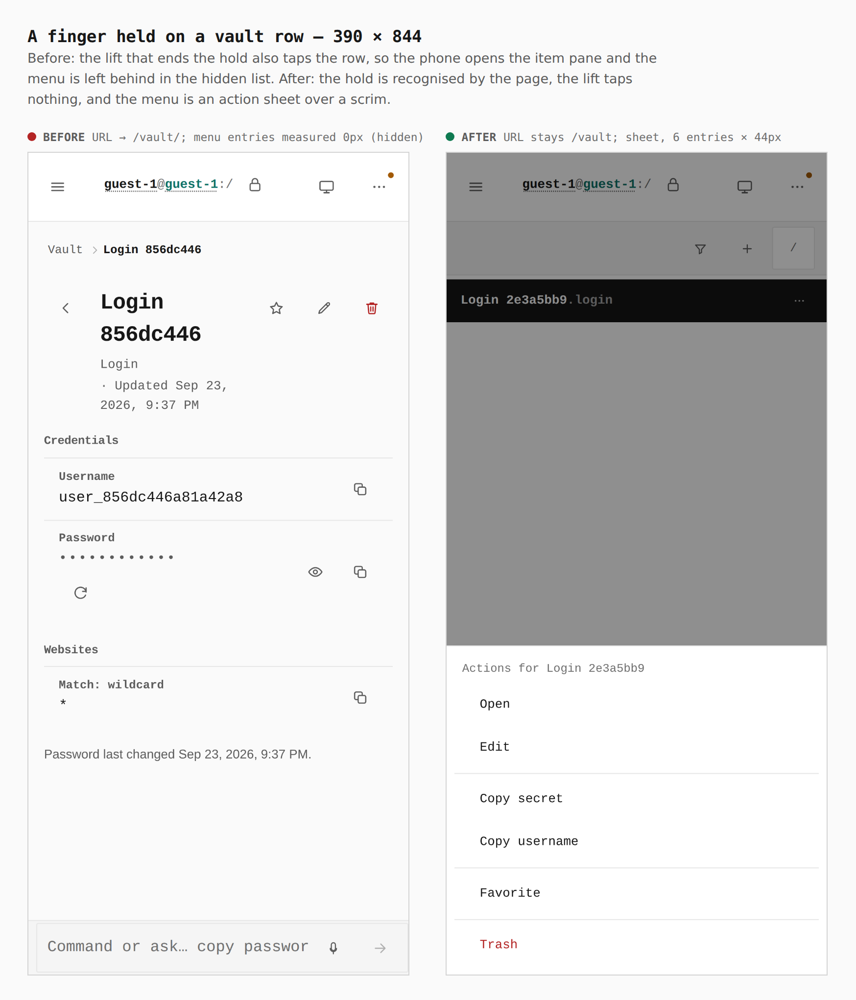
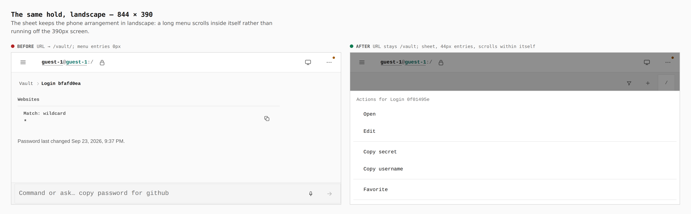

# Context menus by keyboard and by touch

Before/after from two real builds: this PR's previous head (`56cf633`) and
this commit, walked by `apps/pages/scripts/capture-evidence.mjs` with
[`journey.json`](journey.json). Each walk makes a vault item, then holds a
finger on its row with real CDP touch events (the same the touch gate uses).
The numbers are what the browser measured during the capture.

## 1. A finger held on a vault row — 390 × 844

`URL → /vault/<id>, menu entries 0px (hidden) → URL stays /vault; action
sheet, 6 entries × 44px`

The old build left the hold to the row's own recogniser and the lift that
ended it still tapped the row: the phone opened the item, and the menu it had
opened was left in the list the phone no longer showed. Now the page
recognises the hold (iOS sends no event for one), swallows the lift's tap, and
draws the menu as an action sheet on the bottom edge, over a scrim.

## 2. The same hold in landscape — 844 × 390

`URL → /vault/<id>, entries 0px → URL stays /vault; sheet, 44px entries,
scrolling inside itself`

## Not pictured: the keyboard

A screenshot does not show a key being pressed, so the keyboard road is proved
by `pnpm --filter @opensesame/pages verify:keyboard` instead, with real key
input only. On the rail, `Shift+F10` and `Shift+Enter` each open the cursor
row's menu with its first entry focused. `ArrowDown` moves, and a `j` pressed
while the menu is open leaves the tree where it was. `Escape` hands focus back
with the URL and cursor unchanged. `End` then `Enter` on "Show hidden items"
lists `trash/`, and the same again hides it. The `?` sheet now lists
`Shift-F10 / Shift-Enter`.
