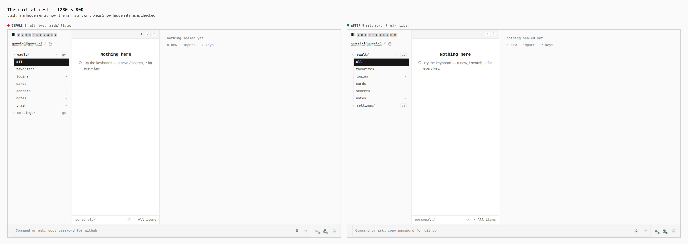
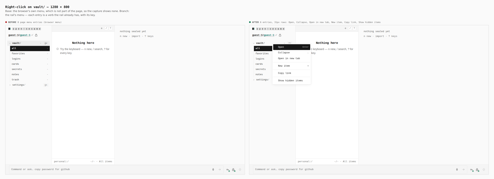
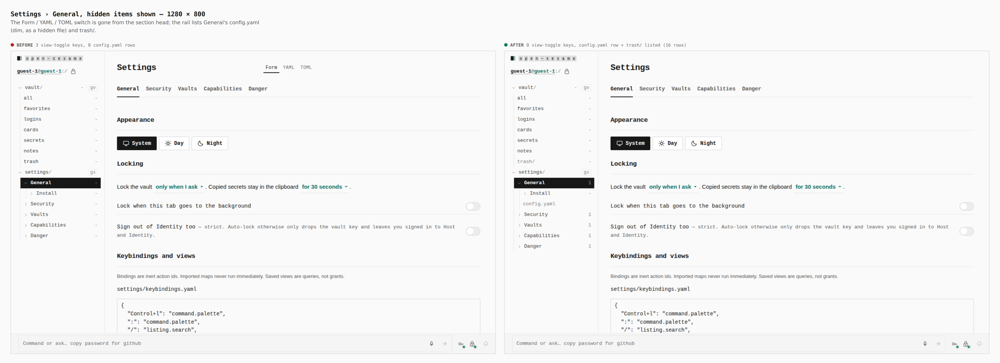
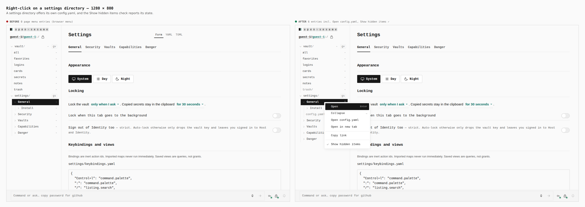
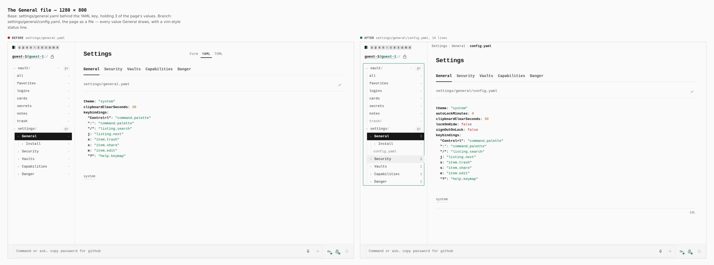
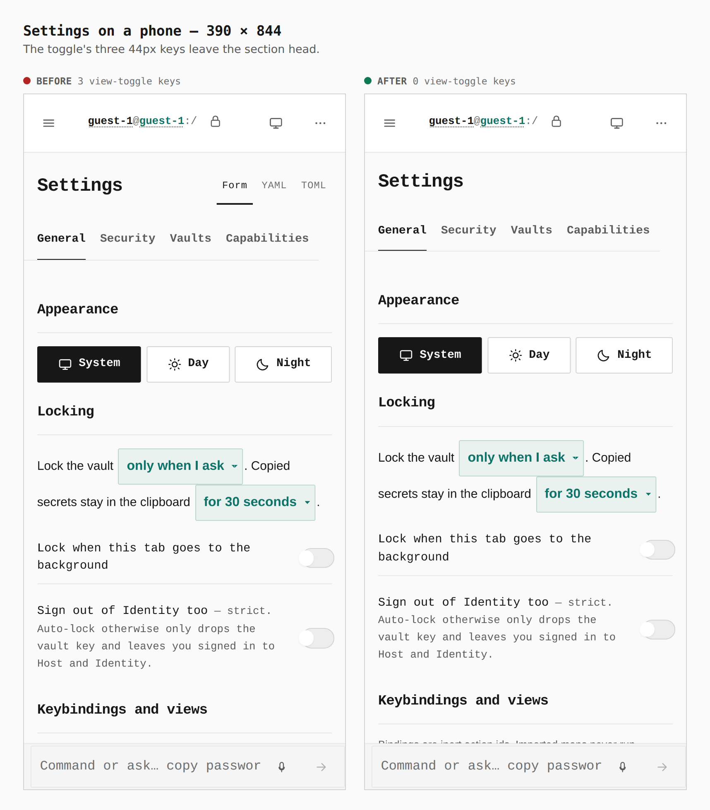
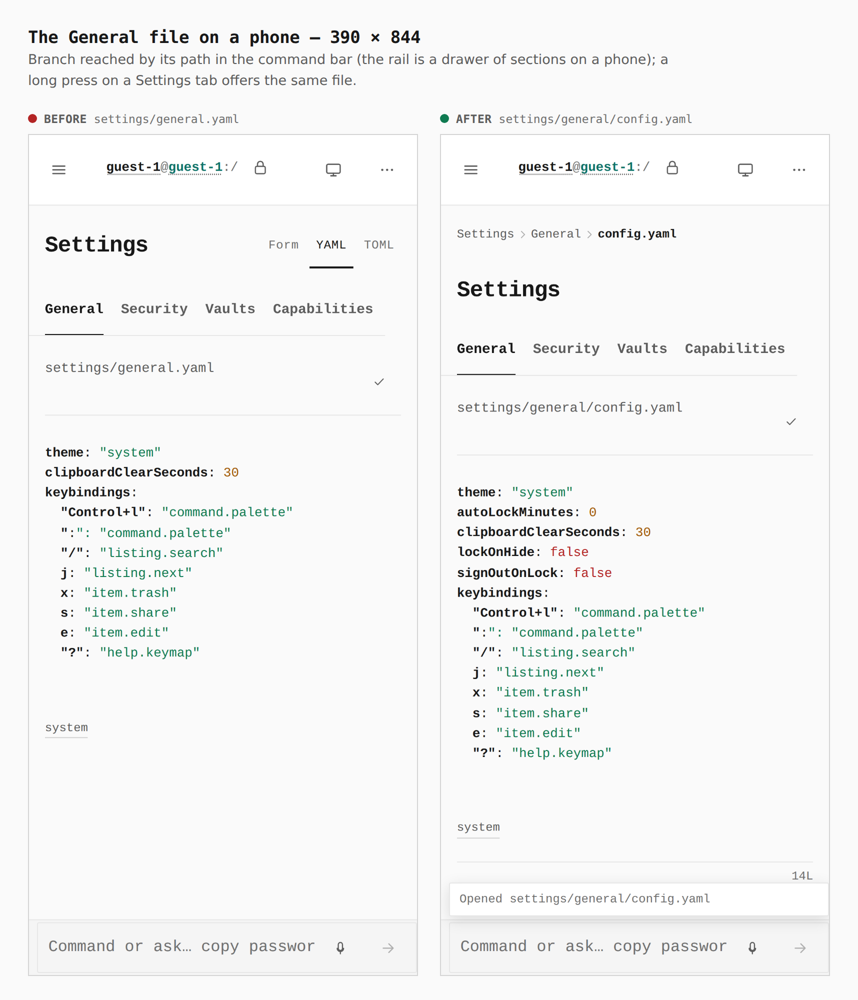

# Context menus, hidden items and settings `config.yaml`

Before/after from two real builds (`main` at `a5b0925` and this branch),
walked by `apps/pages/scripts/capture-evidence.mjs` with
[`journey.json`](journey.json). Every number is what the browser measured
during that capture (the `measure` step), not a reading of the CSS.

A page screenshot cannot contain the browser's own context menu, so on the
base build a right-click shows *nothing* in the image — that is the honest
picture of "the page offered no menu of its own".

## 1. The rail at rest — 1280 × 800

`9 rail rows, trash/ listed → 8 rail rows, trash/ hidden`

## 2. Right-click on `vault/` — 1280 × 800

`0 page entries (browser menu) → 6 entries, 31px rows`: Open (Enter),
Collapse (←), Open in new tab, New item (n), Copy link, Show hidden items.

## 3. Settings › General with hidden items shown — 1280 × 800

`3 view-toggle keys, 0 config.yaml rows → 0 keys; config.yaml and trash/
listed, dim (16 rows)`

## 4. Right-click on a settings directory — 1280 × 800

`0 → 6 entries`, including **Open config.yaml** and a checked
**Show hidden items**.

## 5. The General file — 1280 × 800

`settings/general.yaml (theme, clipboard, keymap) → settings/general/config.yaml`
— every value the General page draws (theme, the four locking values, the
keymap), 14 lines, with a status line (`[+]` when modified, `written` after a
save, the error glyph when the YAML is refused).

## 6. Settings on a phone — 390 × 844

`3 view-toggle keys → 0`

## 7. The General file on a phone — 390 × 844

`settings/general.yaml → settings/general/config.yaml`, opened by its path in
the command bar. (A long press on a Settings tab offers the same file.)

