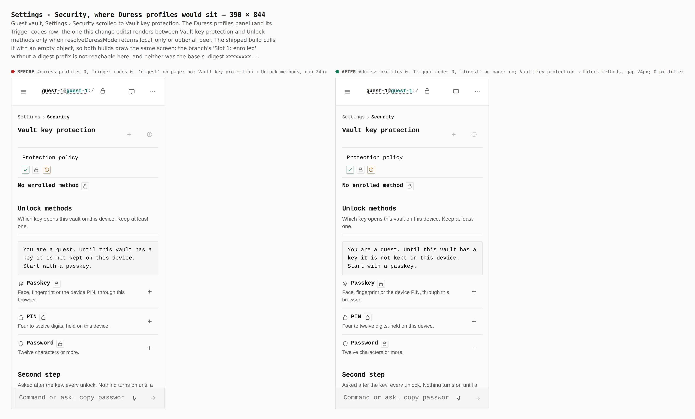
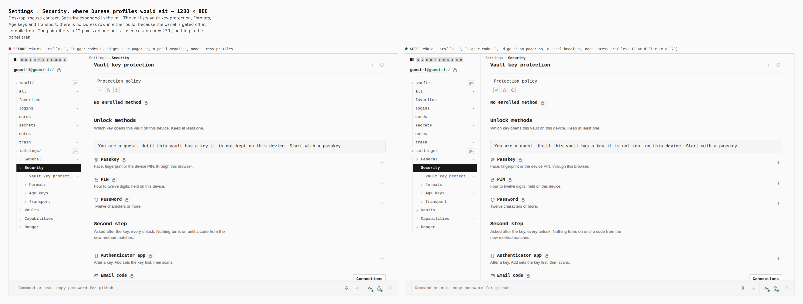

# Duress trigger codes: no digest prefix — visual evidence

Change: `c2f1067` "fix(duress): a decoy never destroys a vault…". In
Settings › Security › Duress profiles › Trigger codes, the row for an enrolled
code used to read `Slot slot-1: enrolled digest xxxxxxxx…`. That prefix was the
first eight hex characters of an unsalted SHA-256 of the code, so a screenshot
of a short numeric code could be reversed with a lookup table. The row now
reads `Slot slot-1: enrolled`, and the view model
(`packages/app-core/src/lib/duress/settings/codes.ts` `publicCodeSlotView`) no
longer carries `materialDigestPrefix`.

Two real builds, walked the same way by
`apps/pages/scripts/capture-evidence.mjs` with [`journey.json`](journey.json):

- **before**: merge base `38fcd1d` (`git merge-base HEAD origin/main`), with
  both `apps/pages/src` and `packages/app-core/src` reverted, since the change
  spans both
- **after**: branch `claude/security-architecture-review-0wxk77` at `1b60dde`

## The changed row cannot be reached in a shipped build

The Duress profiles panel, and the Trigger codes row inside it, renders only
when `resolveDuressMode` returns `local_only` or `optional_peer`
(`apps/pages/src/sections/SettingsSection.tsx`, `SecurityPanels`). The shell
calls it as `resolveDuressMode({})`, so the check reads an empty object, never
`VITE_DURESS_MODE`, and always gets `off`. Both builds compile it that way. In
the minified `SettingsSection-*.js` the call is
`Dn({})!=="off"?t.jsx(Ha,{}):null` before and `Un({})!=="off"?…` after.
There is no build flag, route, deep link (`#duress` redirects to
`#duress-profiles`) or setting that mounts the panel. So no browser can reach
the enrolled-code row in either build. Forcing the gate open in source would
produce a build nobody ships, which would be a staged screenshot.

What this gallery does show is the spot where the panel would render. The two
builds draw it identically, and the browser confirms the row is absent from
both.

### Settings › Security, 390 × 844 (phone, touch context)

| | before | after |
|---|---|---|
| `#duress-profiles` in DOM | 0 | 0 |
| `h3` "Trigger codes" | 0 | 0 |
| `Slot …` rows | none | none |
| "digest" anywhere in `body.innerText` | no | no |
| panel after Vault key protection | Unlock methods, 24px gap | Unlock methods, 24px gap |
| raw capture pixels that differ | | 0 of 1170 × 2532 |

### Settings › Security, 1280 × 800 (desktop, mouse context)

| | before | after |
|---|---|---|
| `#duress-profiles` in DOM | 0 | 0 |
| `h3` "Trigger codes" | 0 | 0 |
| panel headings | Vault key protection, Unlock methods, Second step, Recovery, Formats, Age keys, Transport, Master password | same 8 |
| "digest" anywhere in `body.innerText` | no | no |
| raw capture pixels that differ | | 12, all in one anti-aliased column at x = 279, outside any panel |

## What was verified instead

- **Bundles.** The base `SettingsSection-*.js` still holds the digest code:
  `digest ",s.materialDigestPrefix||"(none)"` appears once. The branch bundle
  has no `materialDigestPrefix` in any chunk. Its row compiles to
  `"Slot ",s.slotId,": ",s.enrolled?"enrolled":"empty"`. So a future build
  that turns the gate on cannot draw the prefix.
- **Unit coverage in the change.** `packages/app-core/src/lib/duress/settings/settings.test.ts`
  checks that the view model's keys are exactly
  `enrolled, lastReplacedAt, profileId, slotId`. It also checks that the
  serialized view does not contain the first eight characters of
  `materialDigest`. Re-run on the branch: 13 of 13 pass. The panel's own
  component test (`apps/pages/src/routes/settings/security/DuressEnrollmentPanel.test.tsx`,
  jsdom): 3 of 3 pass.

## Follow-up

Settings › Security never mounts the duress enrollment panel, because
`resolveDuressMode({})` ignores the build environment. That is a separate
issue from this change, and this change does not fix it.
