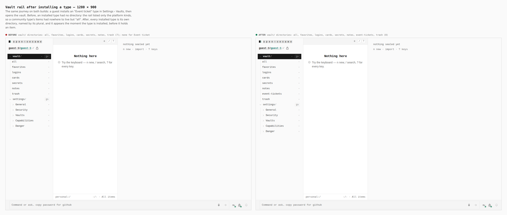
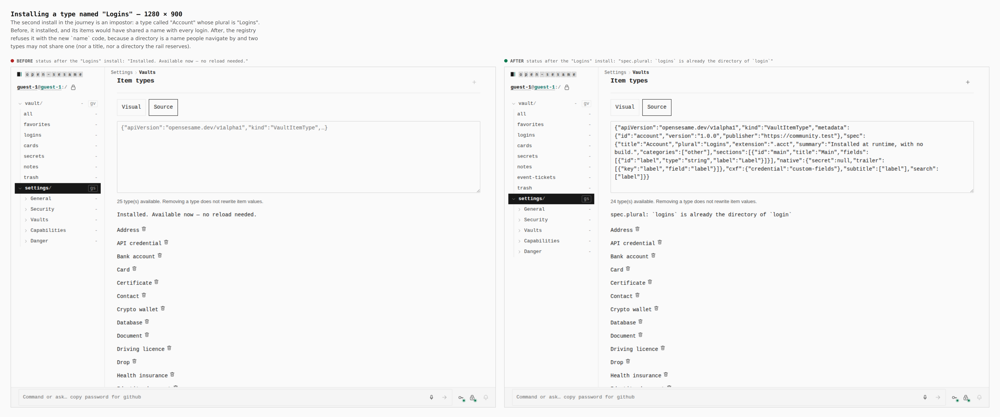
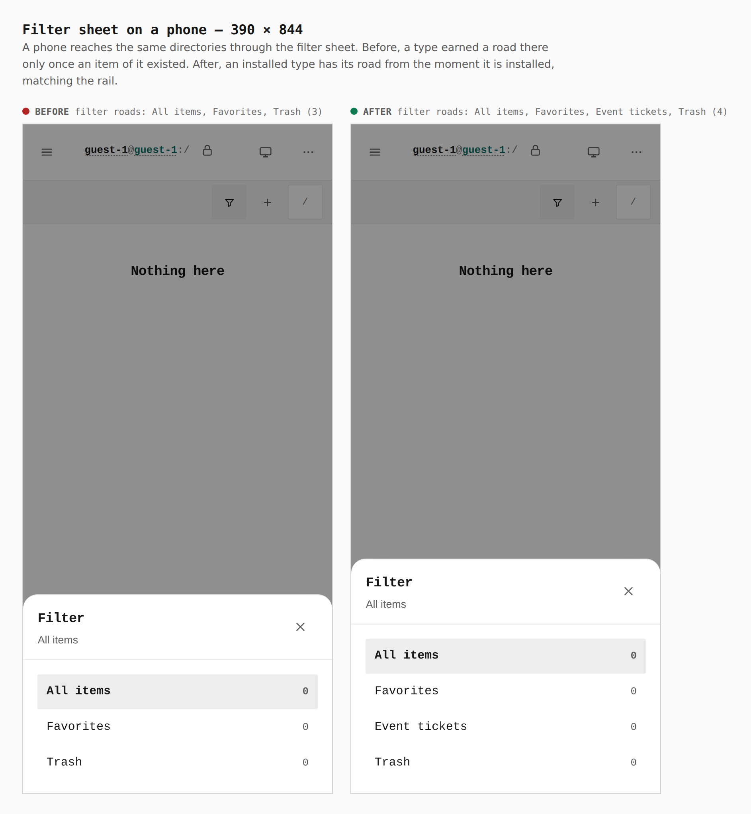
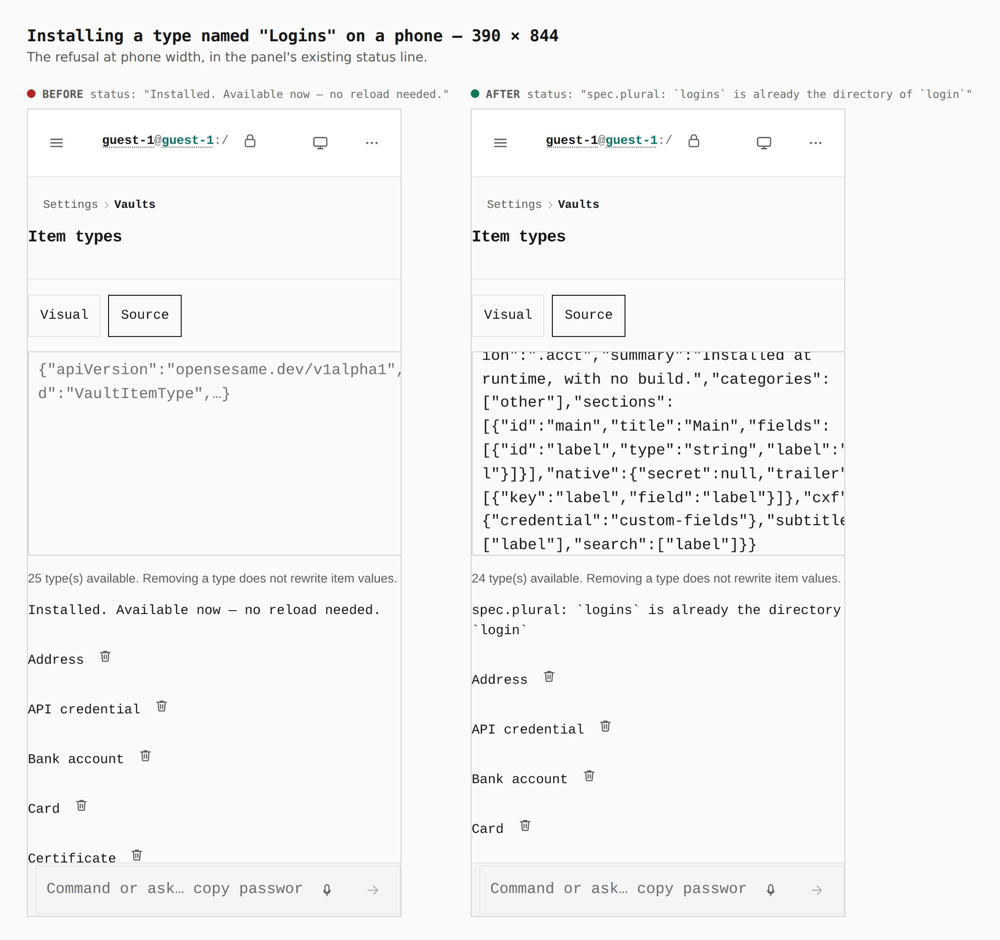

# Visual evidence — one vault directory per item type

Before/after sheets for "installed vault item types are reflected in vault
directories, one directory per type, and registered names are unique"
([ADR 0087 §7](../../adr/0087-vault-item-type-plugins.md)).

Both sides are **real builds**, walked identically by
`apps/pages/scripts/capture-evidence.mjs` with the journey in
[`journey.json`](journey.json): a guest opens Settings › Vaults, installs an
"Event ticket" type (plural "Event tickets"), then tries to install an
"Account" type whose plural is "Logins", then opens the vault.

| side | source | build |
| --- | --- | --- |
| before | `a5b0925d` (`main`, this branch's parent) — `apps/pages/src`, `packages/app-core/src`, `packages/vault-core/src`, `packages/vault-item-types/src` checked out from it | `VITE_BASE=/OpenSesame/`, production |
| after | this branch | `VITE_BASE=/OpenSesame/`, production |

Every before/after line is read from the browser by the journey's `report`
steps: the rail's `.railtree__row` texts, the phone filter sheet's road
links, and the Item types panel's `output[aria-live]` status after each
install.

## Vault rail, 1280 × 900

`vault/` directories: `all, favorites, logins, cards, secrets, notes, trash`
(7) → `all, favorites, logins, cards, secrets, notes, event-tickets, trash`
(8). The installed type has its own directory from the moment it is
installed.

## Installing a type named "Logins", 1280 × 900

Status after the second install: `Installed. Available now — no reload
needed.` → `` spec.plural: `logins` is already the directory of `login` ``.

## Filter sheet on a phone, 390 × 844

Filter roads: `All items, Favorites, Trash` (3) → `All items, Favorites,
Event tickets, Trash` (4).

## Installing a type named "Logins" on a phone, 390 × 844

Same refusal, in the panel's existing status line.
