# Layout smells — keys with a home, fields with a measure, a phone that can find its way

Before/after from two real builds of `apps/pages` — `main` at `9fa21d8` and this branch — walked the same way by
`apps/pages/scripts/capture-evidence.mjs` with [`journey.json`](journey.json). Every measurement is read from the
browser by the journey's `measure` steps, not from the CSS.

## Settings › General › Keybindings — 1280 × 900

The save and reset keys sat on a row of their own under a 960px textarea, and the Pin view star sat alone under a 960px input. Now the keys ride the file's label row at the editor's end, the star ends its field's row, and neither field is wider than its measure.

**Before:** `textarea 960px · save key alone @y605 · input 960px · star alone @y726` → **after:** `textarea 736px · keys on label row · input 450px · star beside it`

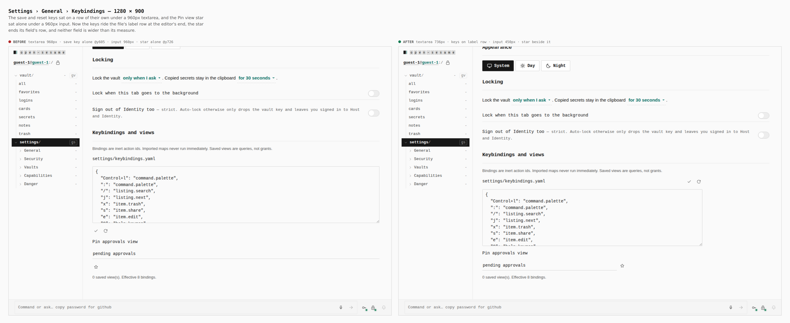

## Settings › Security › Age keys — 1280 × 900

Four keys used to stand on three rows of their own with nothing beside them. The panel's keys now sit in its head, Save recipients rides the Recipients label, Generate identity rides the Identity row, and Seal identity ends the import field.

**Before:** `recipients 960px · 5 keys on lone rows` → **after:** `recipients 736px · 0 keys on lone rows`

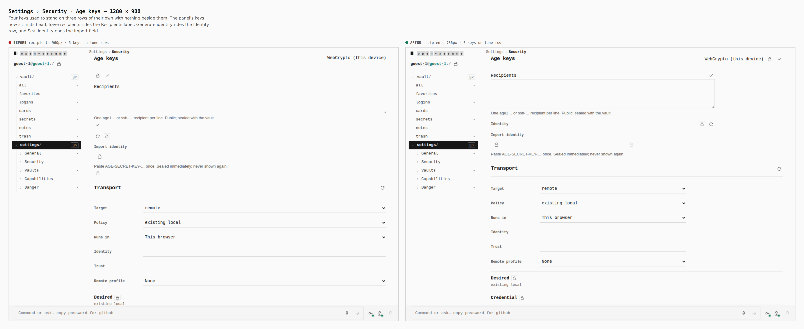

## Settings › Security › Transport — 1280 × 900

Three-option selects stretched to the panel. A field now stops at --field-max (30rem).

**Before:** `4 selects 798px wide` → **after:** `4 selects 480px wide`

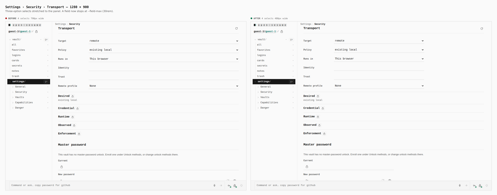

## Settings › Security › Formats — 1280 × 900

The R/W/Runtime marks were spread in fractions of the page, ~225px apart and far from each format's name. Columns now size to what they hold.

**Before:** `mark columns at x≈560 / 786 / 1012` → **after:** `marks beside the name, content-width columns`

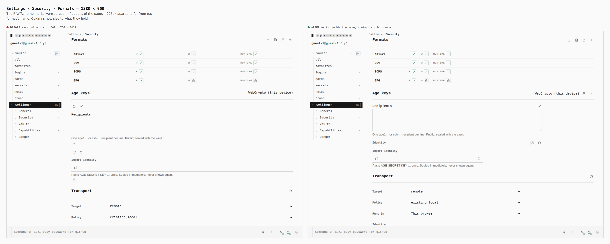

## Settings › Connections › Better Auth — 1280 × 900

The form's only commit was a 24px check under the label column with nothing beside it. A form of several fields now commits with FormCommit: the shared .go square with its verb. Inputs stop at their measure.

**Before:** `inputs 770px · commit 24×24, unlabelled` → **after:** `inputs 480px · commit 40×40 + "Save configuration"`

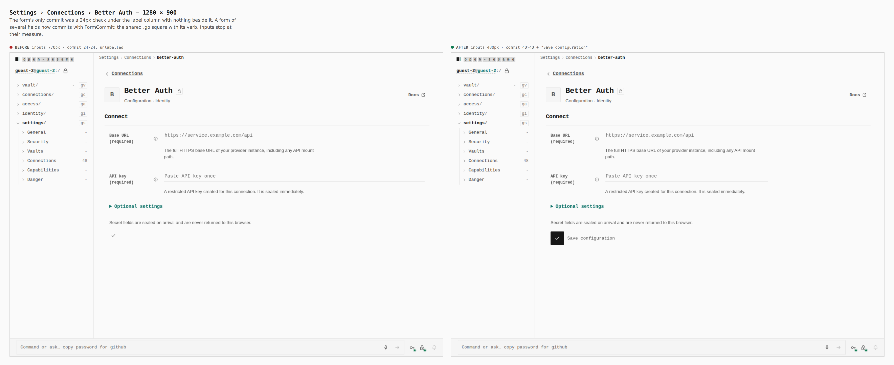

## Access › Requests — 1280 × 900

A four-option status filter was a 960px field under the panel title, and the tabs carried link underlines beside their own. The filter now sits with the head's keys at the width of its options, and the tabs read like every other strip.

**Before:** `filter 960px under the title · tabs underlined twice` → **after:** `filter 82px in the head · one underline`

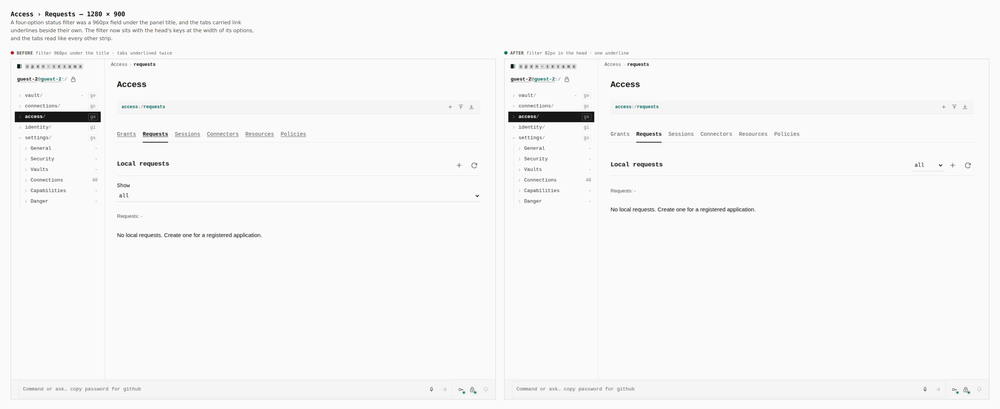

## Settings › Vaults — 390 × 844

A nowrap vault label widened the list's implicit grid column past the phone, so the whole section ran off the right edge: the view toggle and notes are cut, and each vault's status mark, open key and the Create vault key were off-screen with nothing to scroll them back. The column is pinned to minmax(0, 1fr).

**Before:** `tab strip 446px on a 390px phone · row keys off-screen` → **after:** `tab strip 390px · every key on screen`

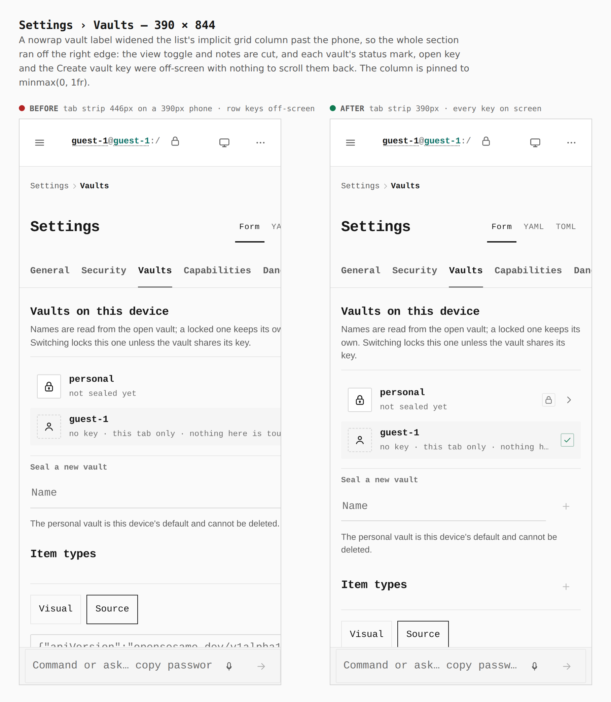

## Settings › Security — 390 × 844

Security is thousands of pixels long on a phone, and its panels were reachable by name only from the desktop rail. An "On this page" strip now draws the rail's entries under the tabs below 900px; the Settings tab strip bleeds to the edge like the others.

**Before:** `no page index` → **after:** `page index strip 390×48 · selected tab in view`

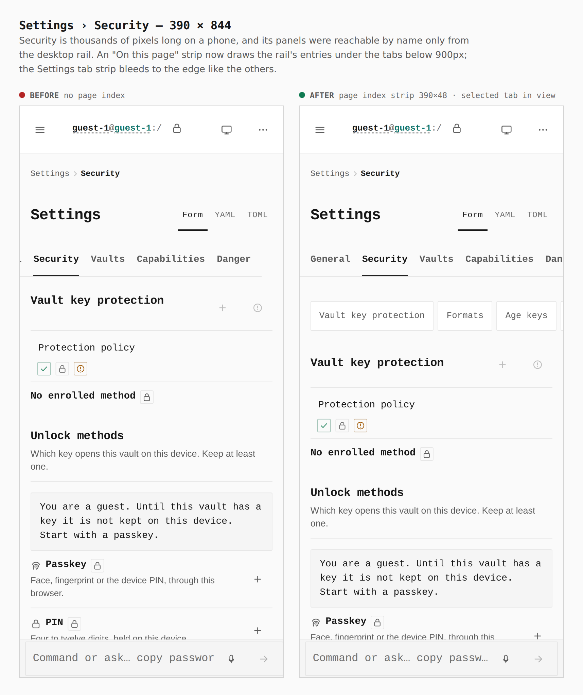

## Settings › Security › Master password — 390 × 844

The change-password key sat alone at the left under the strength meter. It now ends the meter's row, over the field it commits.

**Before:** `key alone @x16` → **after:** `key on the strength row @x330`

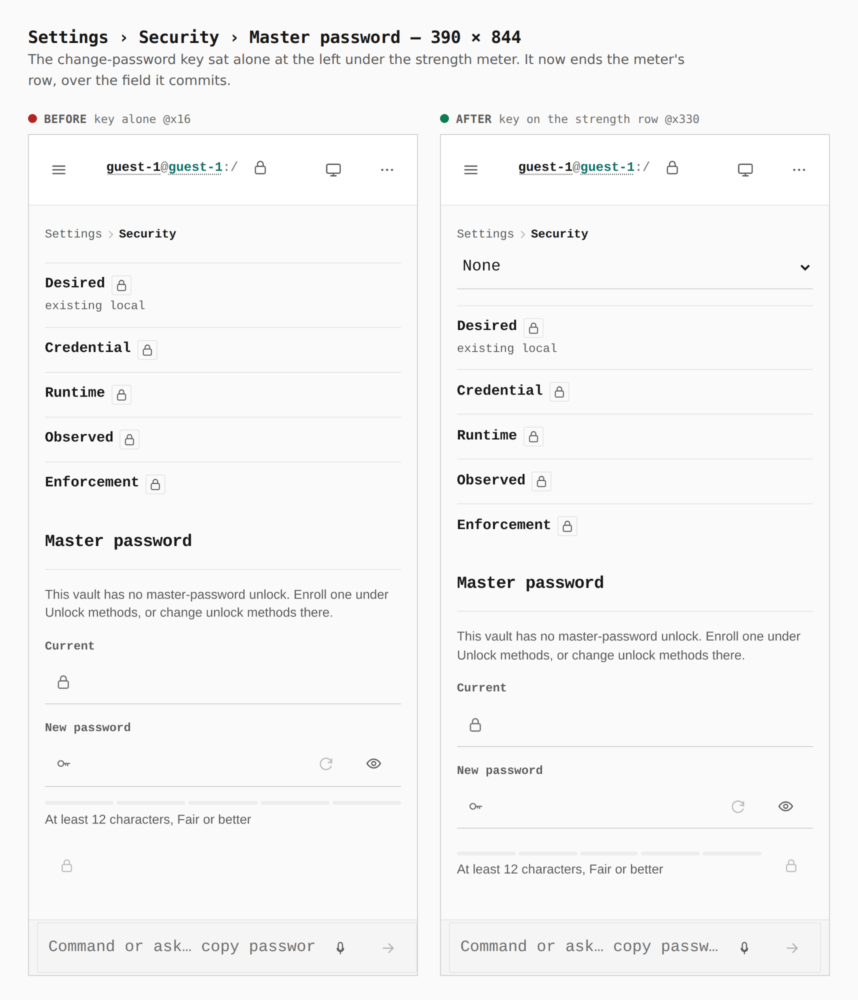

## Identity › Devices — 390 × 844

A record's key dropped to a line of its own under the record once its name and badge filled the row. The name now wraps instead, and the record's keys stay at the row's top end.

**Before:** `Rename on its own line @y409` → **after:** `Rename beside the record @y359`

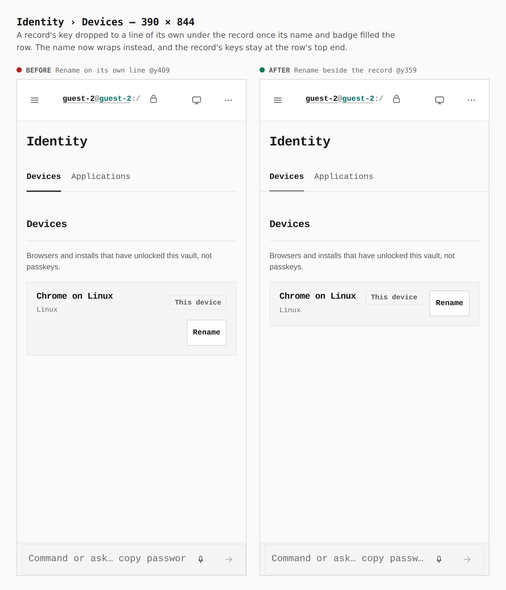

## Access › Resources — 390 × 844

A nowrap list of holders made the resource card 463px wide, pushing the path strip's keys and the card off a 390px phone. The holders wrap, and the reference chip is only as wide as the reference.

**Before:** `card 463px · strip 495px — past the edge` → **after:** `card 358px · strip 390px`

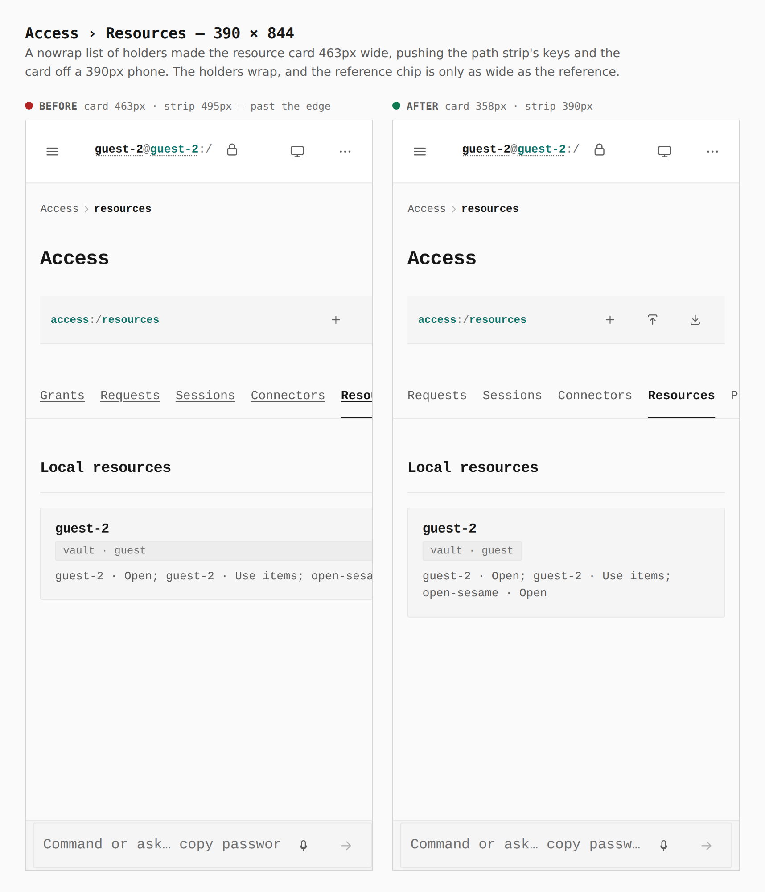

## Vault › New login — 390 × 844

On a phone the website row collapsed to three stacked rows: the pattern, a full-width three-word select, and the remove key alone at the left. Now the pattern and its match mode share two lines with the remove key beside both.

**Before:** `row 143px tall · remove key alone @x16` → **after:** `row 94px tall · remove key beside the address @x330`

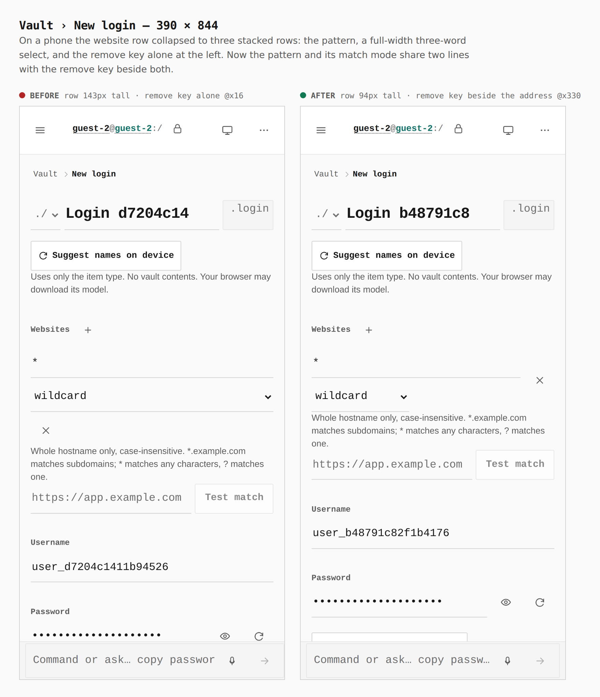
