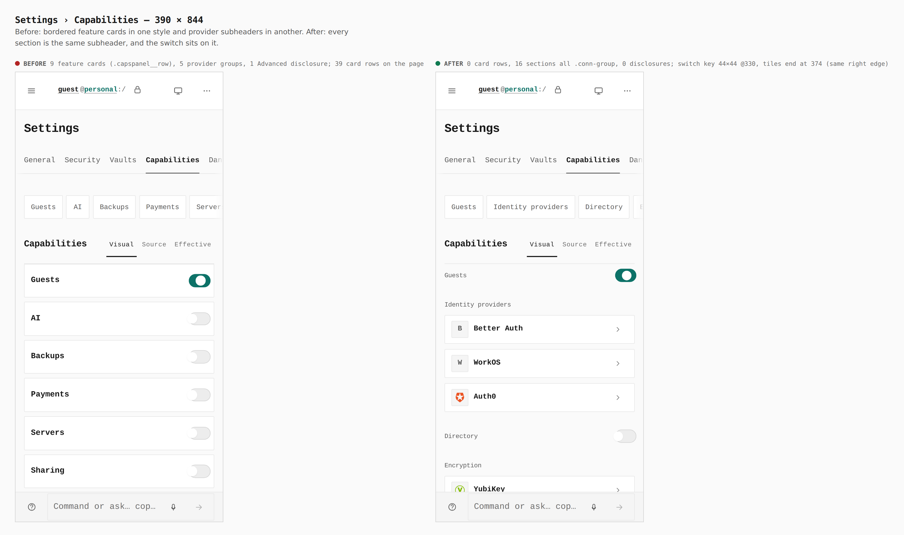
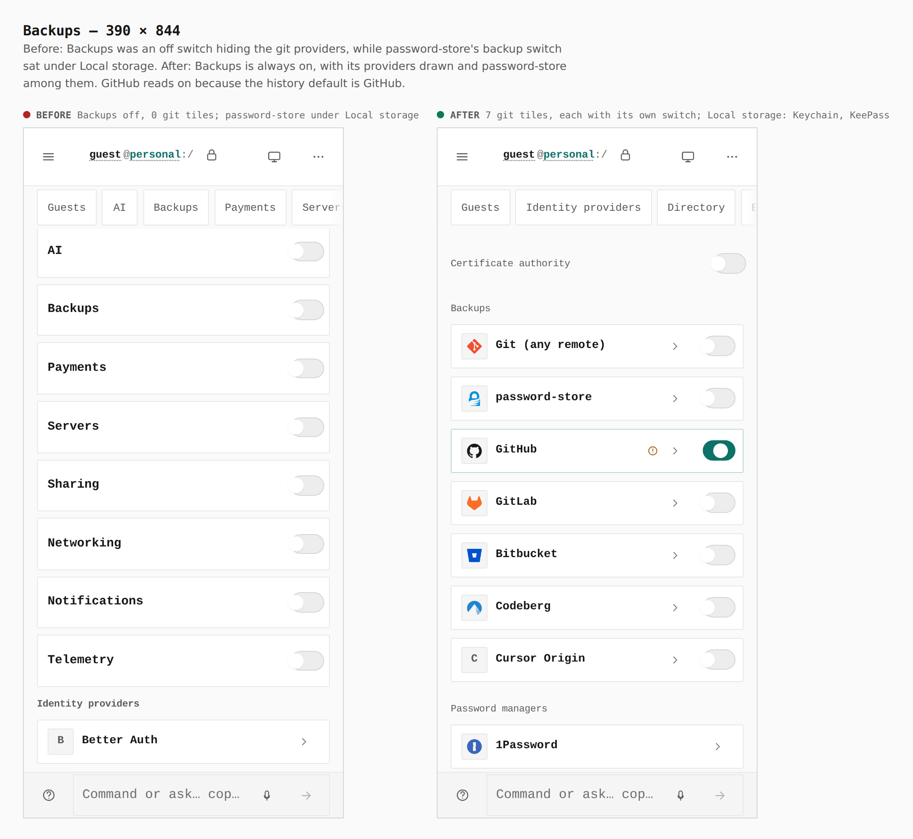
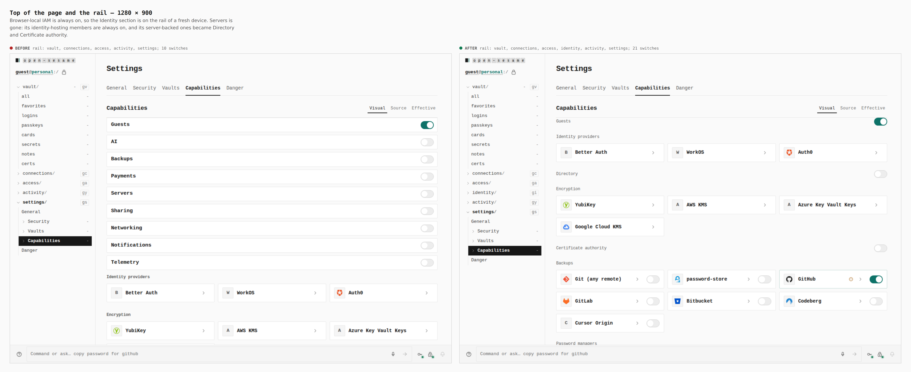
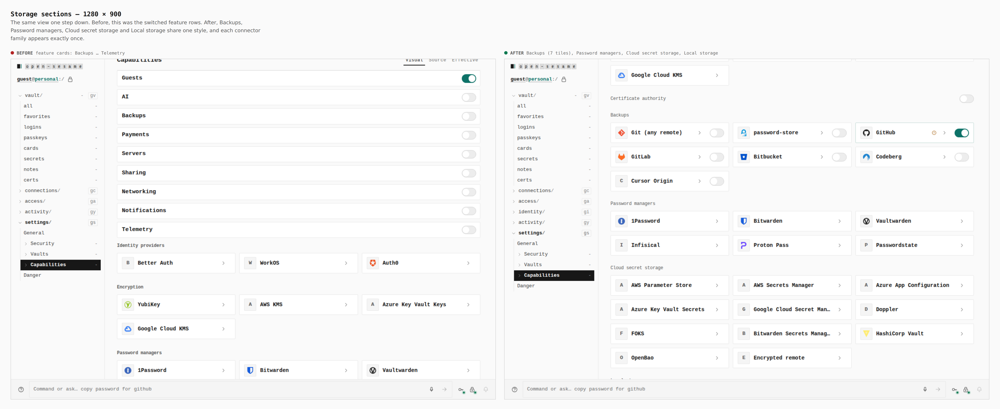
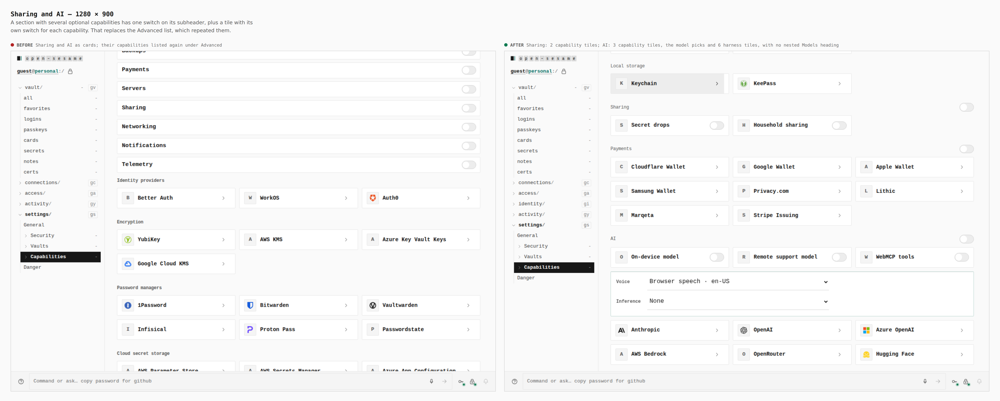
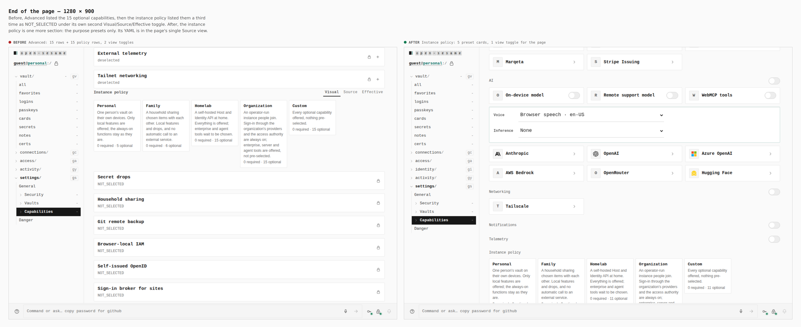

# Settings › Capabilities: one list, one style, honest defaults

These are before/after screenshots from two real builds: the base (`6771ed9`,
current `main`) and this branch. Both builds were walked the same way
(`journey.json`): seal a password vault on an empty device (the operator's
own installation), then open Settings › Capabilities. Every number below was
read from the browser by the journey's `count`, `report` and `measure` steps.

| | before | after |
|---|---|---|
| card rows (`.capspanel__row`) | 39 (9 features + 15 Advanced + 15 policy) | 0 |
| section styles | 3 (cards, subheaders, a disclosure) | 1 (`conn-group` subheader) |
| sections | 15 headings | 16 sections, each once |
| switches | 10 | 21 (Guests, 8 sections, 5 capability tiles, 7 backup roads) |
| Advanced disclosure | 1 | 0 |
| Visual/Source/Effective toggles | 2 | 1 |
| rail on a fresh device | vault, connections, access, activity, settings | + identity |

## Phone — top of the page

## Phone — Backups

## Desktop — top of the page and the rail

## Desktop — the storage sections

## Desktop — Sharing and AI

## Desktop — end of the page

