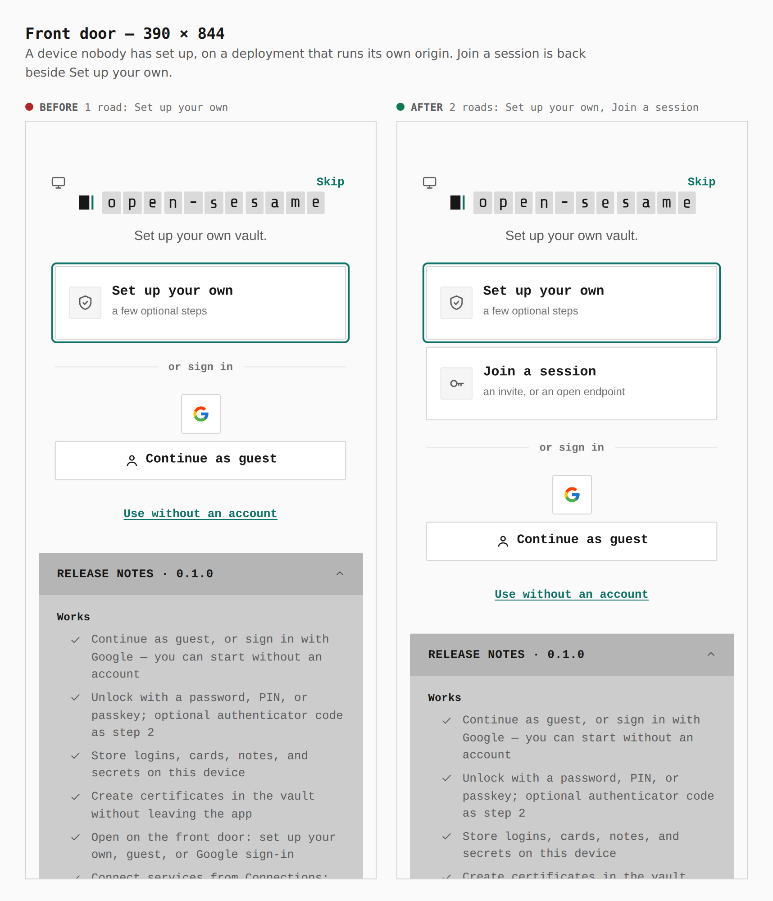
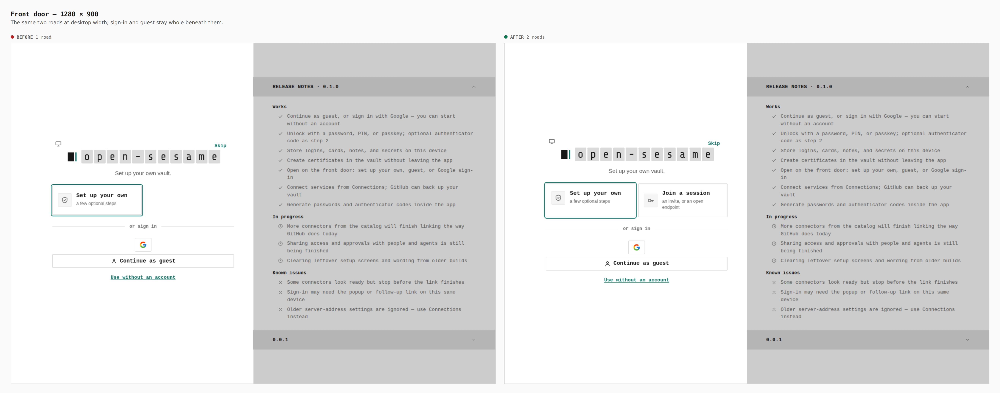
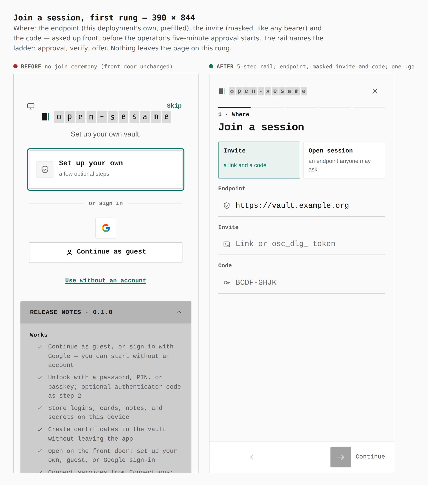
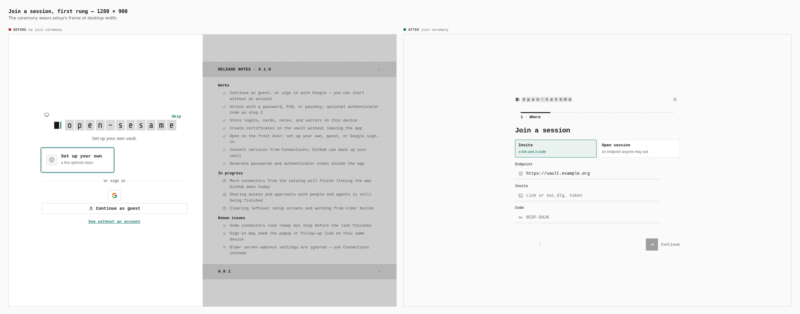
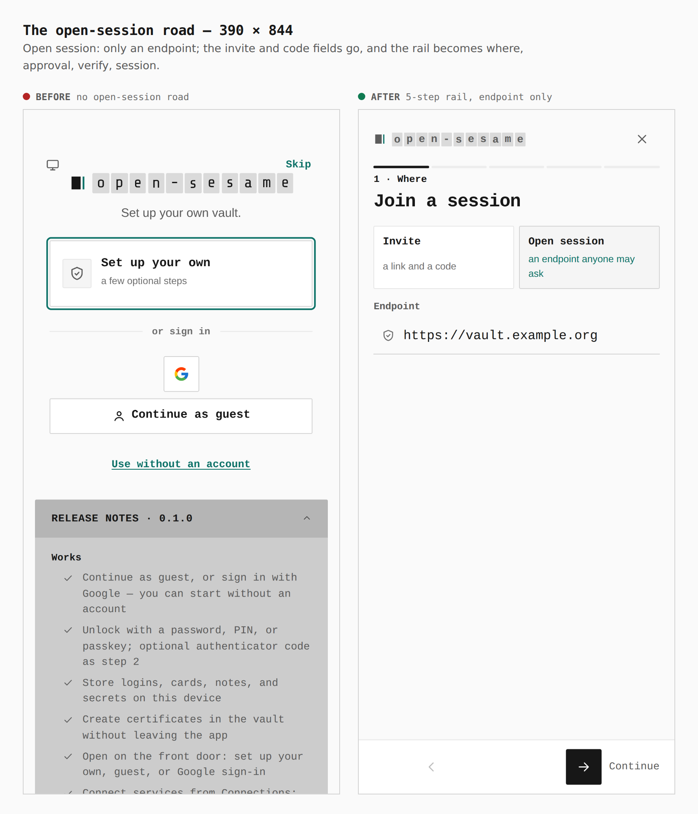
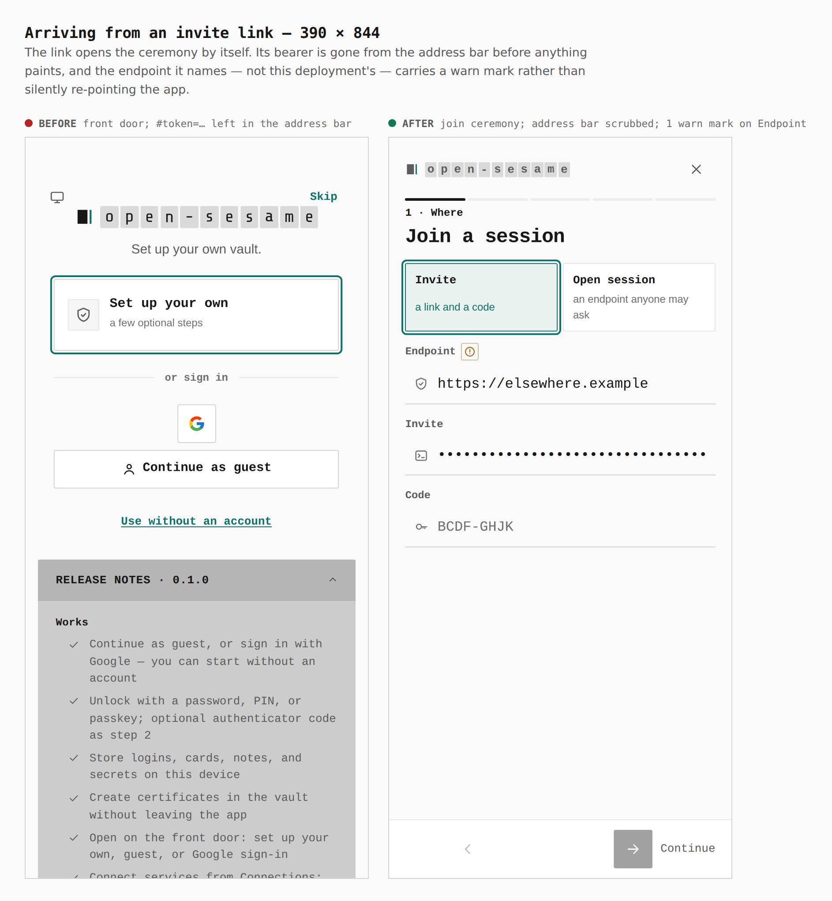
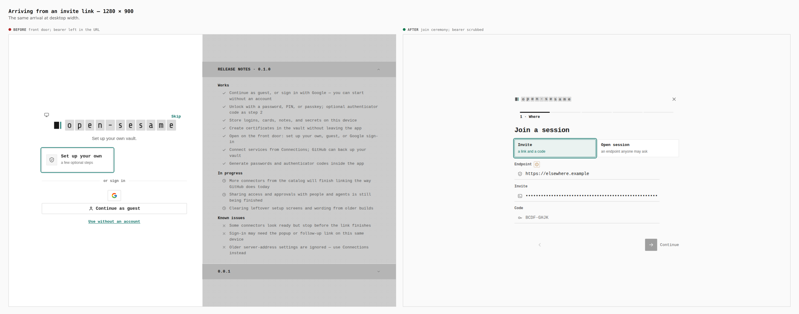

# Join a session, restored (ADR 0136)

Before/after from two real builds — `main`'s source and this branch — walked
the same way by `apps/pages/scripts/capture-evidence.mjs` (`journey.json`).

Both builds are stamped as a **dedicated deployment**
(`PAGES_DEPLOYMENT_PROFILE=dedicated_origin`, origin
`https://vault.example.org`, `VITE_HOST_API=https://vault.example.org`) and
served from that origin (`EVIDENCE_ORIGIN`). That is deliberate: on the shared
GitHub Pages origin a join can never be finished, so the road is not drawn
there — `verify:static` still asserts its absence on the production origin.

## Front door — 390 × 844

`.door__roads .road`: **1 → 2** (Set up your own, Join a session).

## Front door — 1280 × 900

`.door__roads .road`: **1 → 2**.

## Join a session, first rung — 390 × 844

Before: no join road, so the press is a no-op and the front door is unchanged.
After: a 5-step rail (Where, Approval, Verify, Offer, Joined), the
deployment's own endpoint prefilled, the invite (masked like any bearer) and
the code — asked up front, before the operator's five-minute approval starts —
and one `.go`. Nothing leaves the page on this rung.

## Join a session, first rung — 1280 × 900

## The open-session road — 390 × 844

After: the invite and code fields go and the rail becomes Where, Approval,
Verify, Session, Joined.

## Arriving from an invite link — 390 × 844

Cold load of `/#token=osc_dlg_…&endpoint=https%3A%2F%2Felsewhere.example`.

| | before | after |
|---|---|---|
| address bar after load | `…/OpenSesame/#token=osc_dlg_…&endpoint=…` | `…/OpenSesame/` |
| screen | front door | join ceremony, invite filled (masked) |
| `.status-mark--warn` on Endpoint | 0 | 1 ("Not this deployment's own endpoint") |

## Arriving from an invite link — 1280 × 900

## Not captured here

The rungs after *Where* need a live endpoint (operator approval of a browser
pairing, a passkey in the Identity window, a presented offer); they are
covered by `apps/pages/src/screens/JoinScreen.test.tsx`,
`JoinScreen.open.test.tsx` and `packages/app-core/src/lib/join/*.test.ts`,
which walk approval → verify → look-up → per-item choice → joined, and the
open road to a pending answer; and the Host side by
`apps/gateway/src/middleware/browser_join_tests.rs`, through the real guard. The shared-origin refusal ("This address cannot finish a join", no
invite spent) is asserted in the same suite.
