# Reviewer findings fixed — before / after

Two real builds walked the same way: `main` at f18815d3 (before) and this branch (after), 1280 × 900 and 390 × 844, guest vault, capabilities *External connectors*, *Access authority* and *Browser-local IAM* approved. Every AFTER/BEFORE line is a measurement from the browser (`capture-evidence.mjs` `measure` / `report` steps).

## Vault › New login — 1280 × 900

A new login drafted its website as a * wildcard — offered on every site if saved as drafted — with three lines of wildcard help and a tester under a pattern nobody wrote. It starts with one empty address. The path is the list strip's label instead of a shell row over both panes, the password's rule ends where the username's does, extras are chips on one row, and pin is a star on the title row.

- **Before:** address "*" wildcard · path row 1032px over both panes · password 403px vs username 478px · 4 stacked + buttons
- **After:** address empty · path in the list strip @y0 · password rule 478px = username · chips on 2 rows

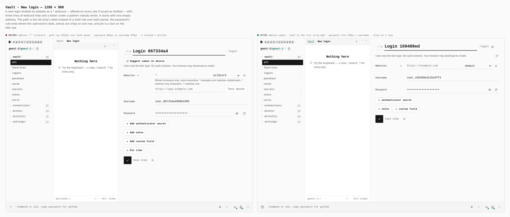

## Settings › General — 1280 × 900

Locking was one sentence with two selects inside it. It is two named rows whose selects share one width, like the switches under them.

- **Before:** one sentence, two inline selects
- **After:** 2 rows · selects 192px each @x1048

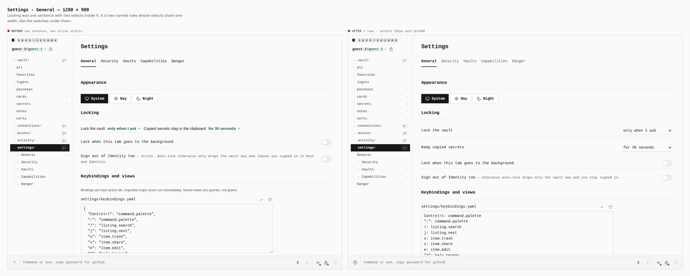

## Settings › General › Keybindings — 1280 × 900

settings/keybindings.yaml showed and demanded JSON. It is written and read as YAML; JSON still reads, because JSON is YAML.

- **Before:** JSON under a .yaml name
- **After:** YAML, one binding per line

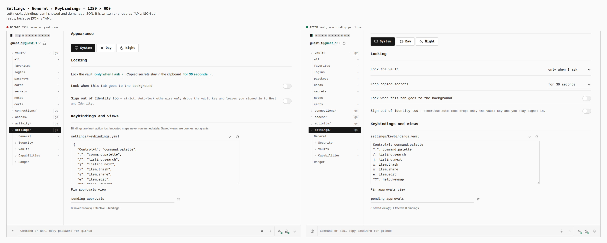

## Settings › Vaults — 1280 × 900

The new-vault + stood 24px past its field, under an explainer caption about the personal vault. The + ends its field (the shared field-inline row) and the caption is gone; the missing delete key says it. A vault never sealed no longer claims Locked.

- **Before:** field 480px, key @x768
- **After:** field 442px, key @x728 · no caption

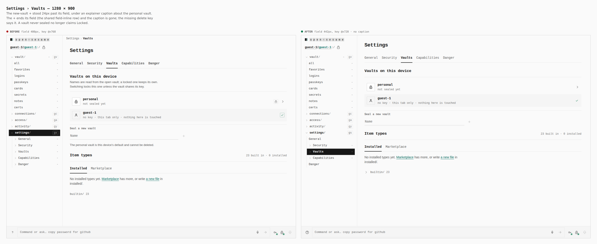

## Settings › Security › Formats — 1280 × 900

Each format was a 960px row whose read/write marks sat in fractions of the panel, a screen away from its name, with no header. It is a table: Format / Read / Write / Runtime, columns as wide as what they hold.

- **Before:** rows 960px, no header
- **After:** header row · columns 266/193/222/279px

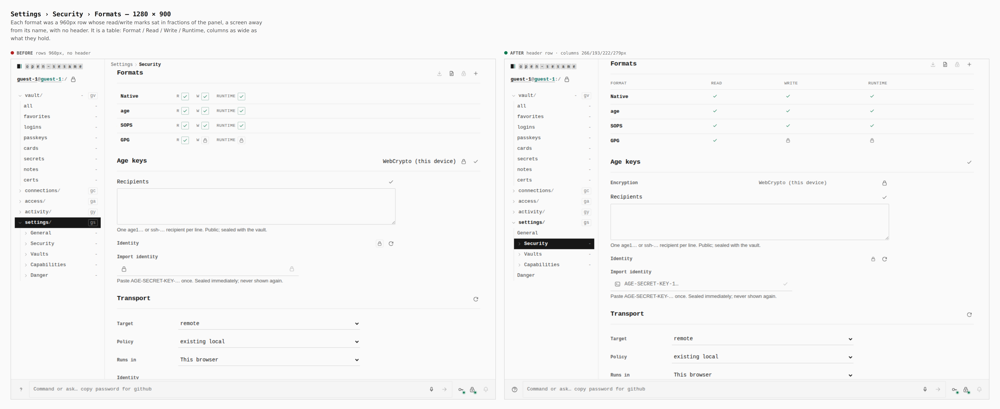

## Connections — 1280 × 900

Under Managed every tile said Managed; API Key said API key. A kind is drawn only where heading and name do not say it, names take the brand's spelling (OpenAI, OpenRouter, OpenBao), and each tile ends in the chevron that says it opens a page. Custom connector is a + key.

- **Before:** kind repeated on every Managed tile · no chevron
- **After:** kind only where it adds · chevron on every tile

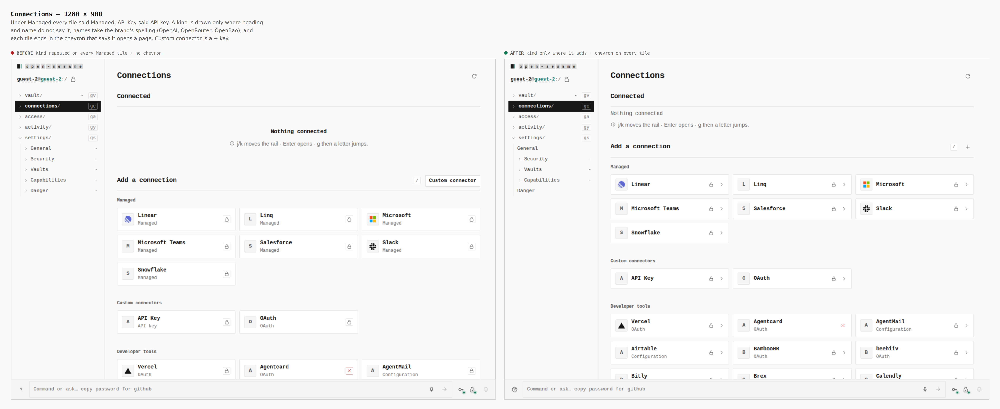

## Access › Grants — 1280 × 900

Access had a path strip of its own whose + opened nothing (its Host ceremony was removed) and pushed its tabs 75px below Identity's. The book's import and export keys end the title row; the Grants tab's + is Identity shares'. "No grants on this device yet" above twelve grants and "Application grants: -" are gone, head keys are one size, and a share's role is on its meta line.

- **Before:** tabs @y160 · dead + · 32px and 24px head keys
- **After:** tabs @y99 · import/export in title row · 24px head keys

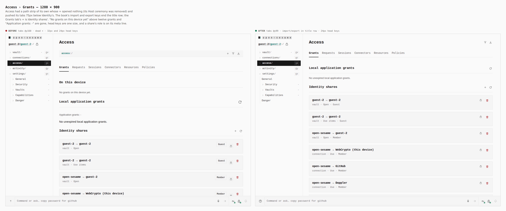

## Vault › New login — 390 × 844

A new login drafted a * wildcard address with its help and tester, and its × was centred across the address and its rule. The address starts empty, the × ends the address's row, the group's + stands over it, and the save row stays at the pane's foot while the fields scroll.

- **Before:** "*" wildcard · × @y381 beside address @y356 row
- **After:** × @y319 on the address row · save row sticky

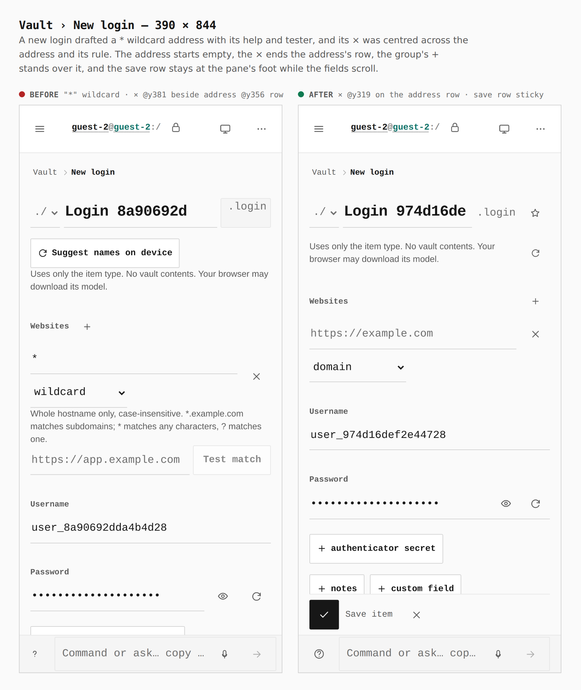

## Connections — 390 × 844

"Add a connection" wrapped onto two lines beside a / key and a Custom connector word button, and the status line's Support key sat against the glass. The heading is one line, Custom connector is a + key, and the strip keeps its 8px gutter.

- **Before:** heading 140×51 (2 lines) · Support @x0
- **After:** heading 158×26 (1 line) · Support @x8

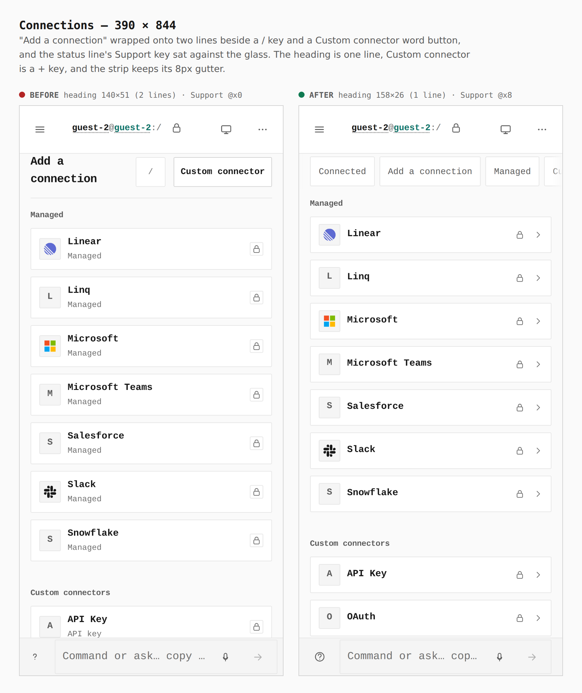

## Vault, empty — 390 × 844

A phone hid the keyboard tip and left a bare "Nothing here". A keyboard tip with a touch counterpart says that one on a phone.

- **Before:** "Nothing here" alone
- **After:** "The + above adds the first item."

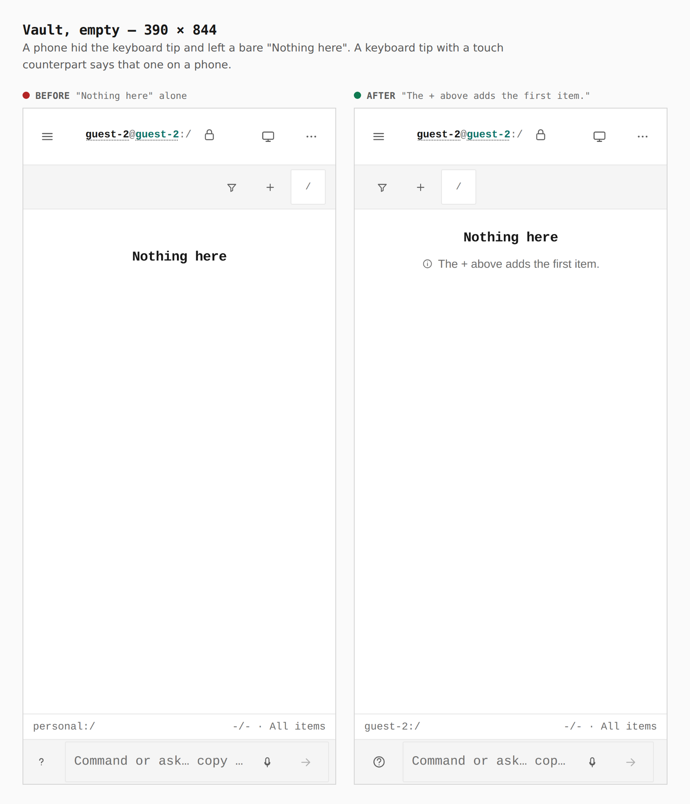

## Access › Identity shares — 390 × 844

Each share's title had 163px beside a role chip, a boxed lock and the trash, so names broke over three lines. The role is on the meta line and the status glyph is unframed.

- **Before:** titles 163px wide, up to 68px tall
- **After:** titles 236px wide, 23px (one line) for most

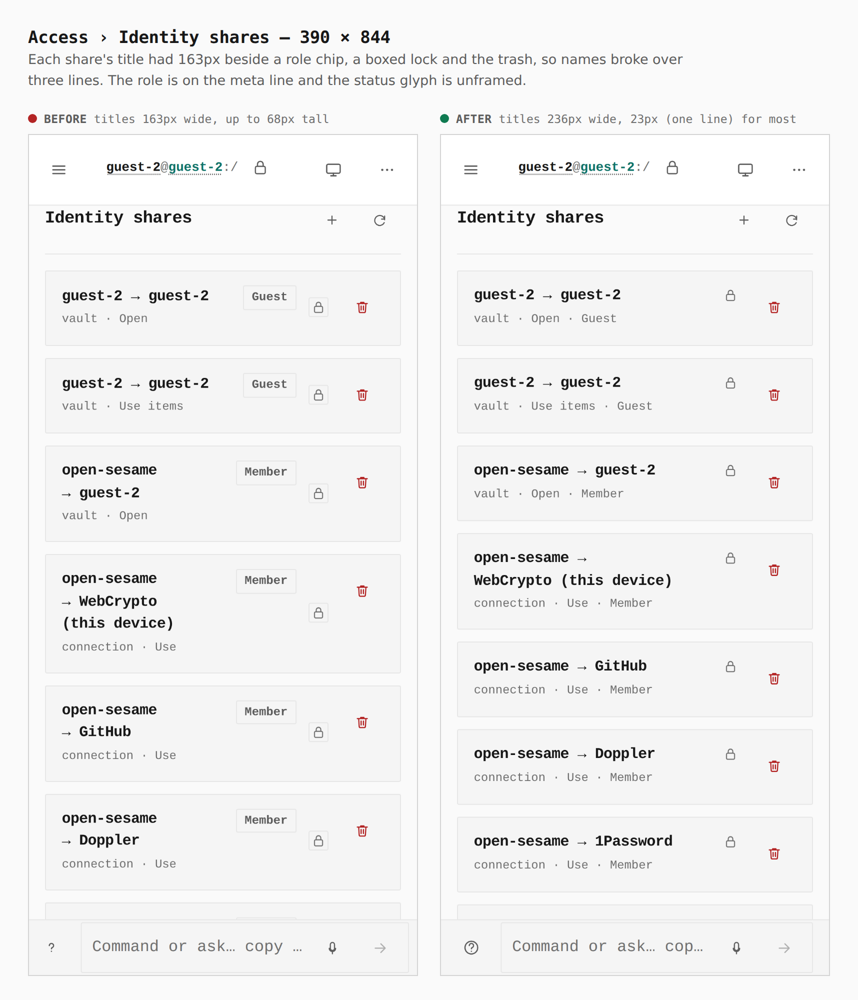

Reproduce: `skills/visual-evidence/SKILL.md` with this directory's `journey.json`.
