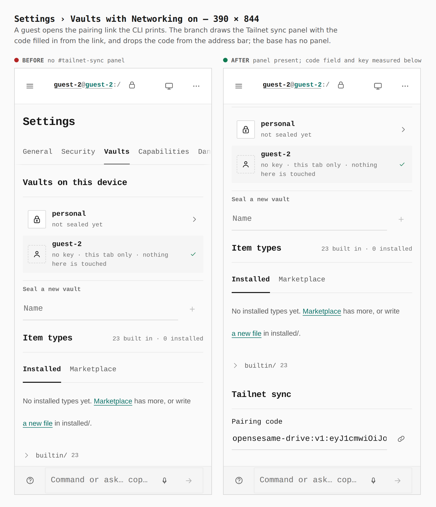
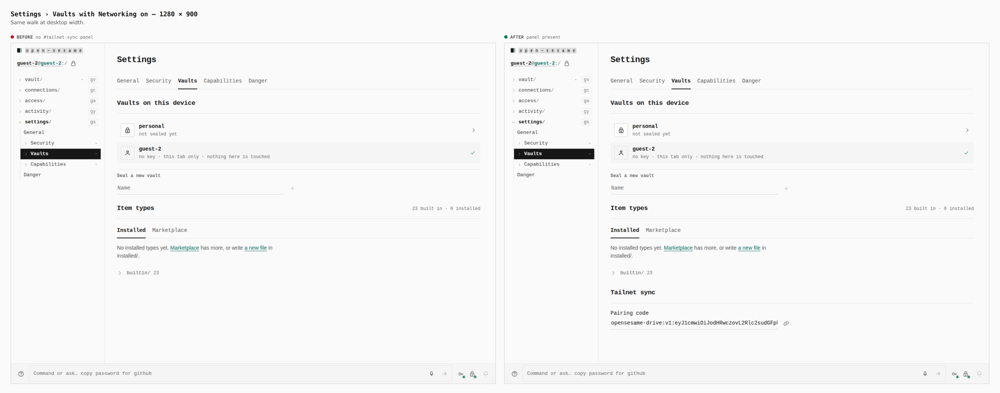
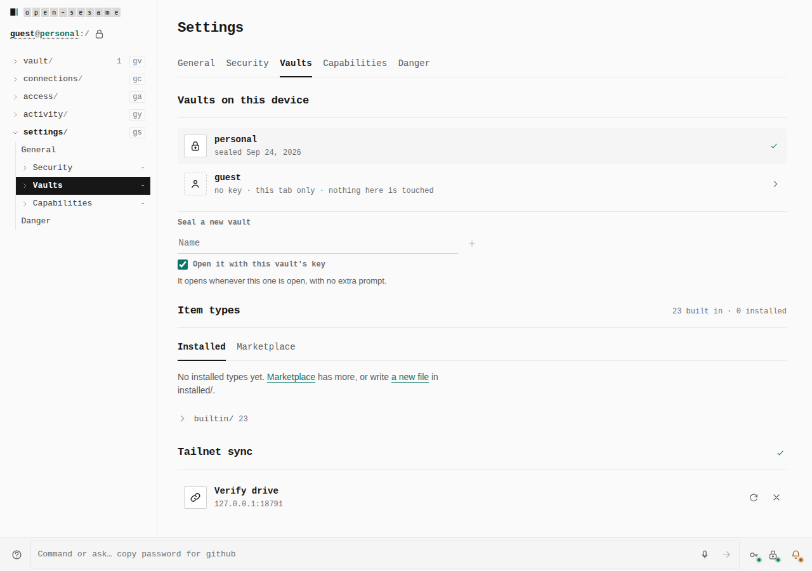
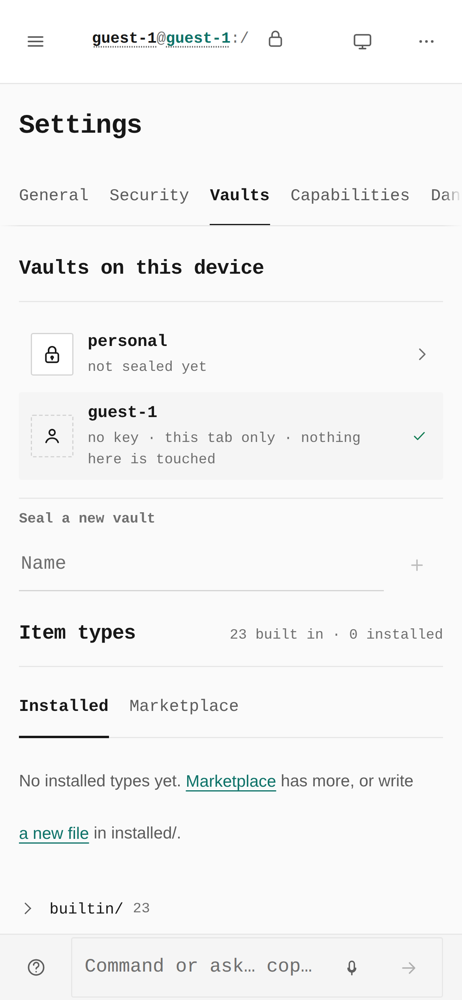
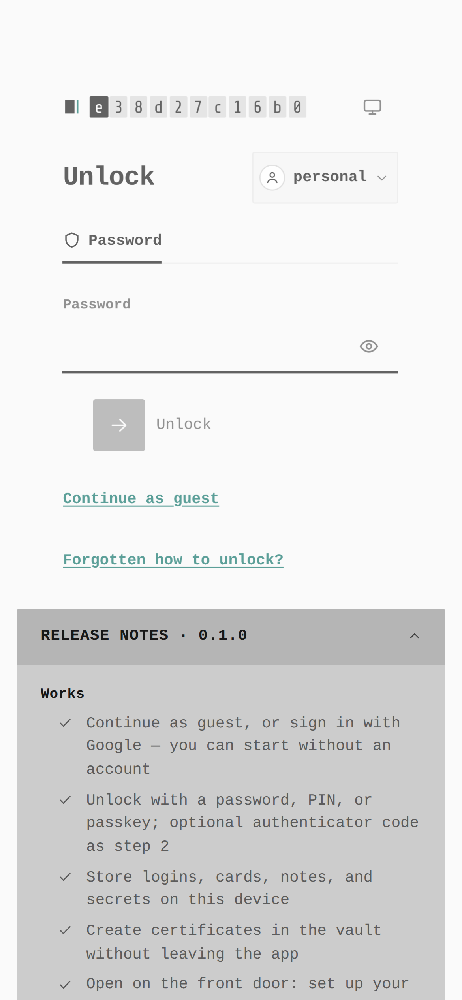
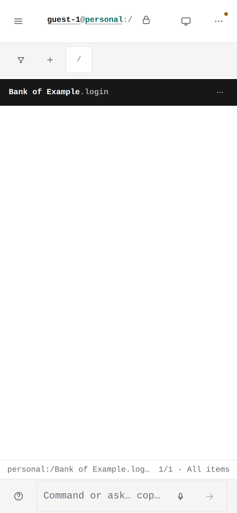
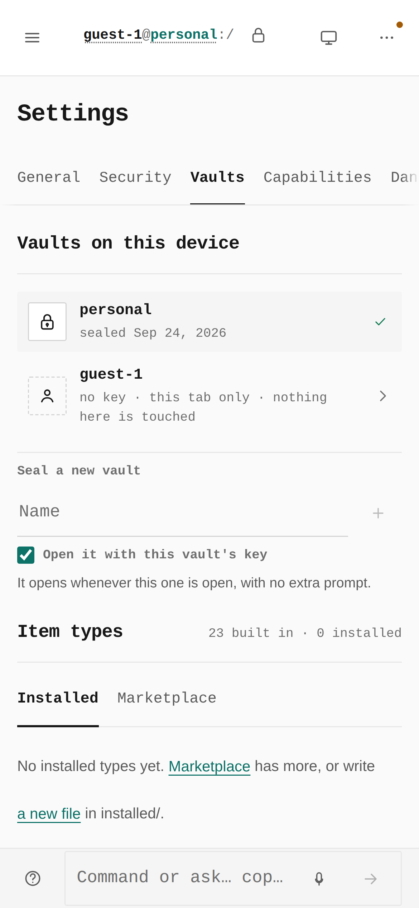
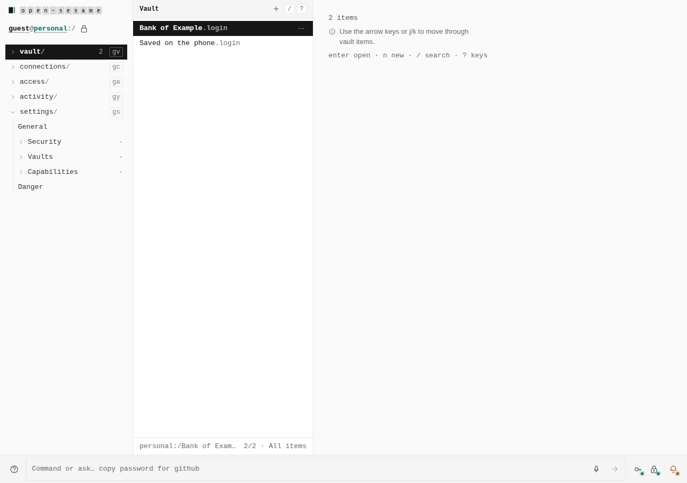

# Tailnet vault sync — a Settings › Vaults panel, and two devices in step

Two kinds of evidence for [ADR 0144](../../adr/0144-tailnet-vault-sync.md):

1. **Before/after** from two real builds of `apps/pages` — `main` at
   `a82b57c` and this branch — walked the same way by
   `apps/pages/scripts/capture-evidence.mjs` with [`journey.json`](journey.json).
   Measurements are read from the browser by the journey's `count`,
   `address` and `measure` steps.
2. **A real sync** between two devices, captured by
   `pnpm --filter @opensesame/pages verify:tailnet-sync`
   (`apps/pages/scripts/verify-tailnet-sync.mjs`): a real
   `opensesame daemon run` as the drive on loopback, and two browser
   contexts that share no storage — only the pairing code. There is no
   "before" for these: the base build has no way to sync at all.

The pairing code in the before/after journey is a made-up example; its key
opens nothing.

## Settings › Vaults with Networking on — 390 × 844

A guest turns on Networking and opens the pairing link
`opensesame daemon drive create` prints (`…/settings/vaults#pair-drive=<code>`).
The branch draws the Tailnet sync panel with the code taken from the link and
removes the code from the address bar; the base has no panel and leaves the
code in the address.

**Before:** `#tailnet-sync: 0 · address keeps #pair-drive=…` → **after:**
`#tailnet-sync: 1 · address …/settings/vaults · field 308×44 · key 44×44`

## Settings › Vaults with Networking on — 1280 × 900

The same walk at desktop width.

**Before:** `#tailnet-sync: 0` → **after:** `#tailnet-sync: 1 · field 442×32 · key 32×32`

## A real sync, device A (1280) — paired

Device A sealed a vault with a master password, saved *Bank of Example*,
turned Networking on and pasted the code. The panel's glyph reads
*In step at …*; the drive holds generation 1, and its stored snapshot does
not contain the item's name.

## Device B (390) — the link fills the code

A second device, a guest, opens the link. The key reads *Set this device up
from the drive*.

## Device B — the vault's own unlock screen

Pressing the key wrote the drive's sealed vault into this device and handed
over to the unlock screen. The PIN wrap never left device A.

## Device B — A's item, opened with A's master password

## Device B — its own edit, in step

B saved *Saved on the phone*; its panel reports in step.

## Device A — B's edit arrived

**2 items:** *Bank of Example* (A) and *Saved on the phone* (B).

