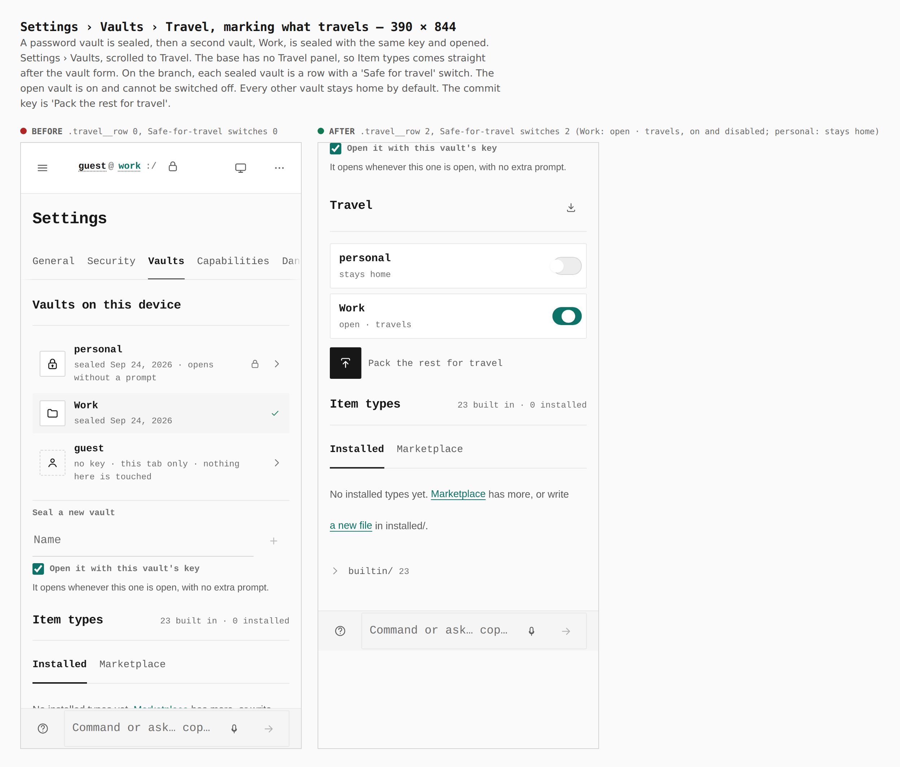
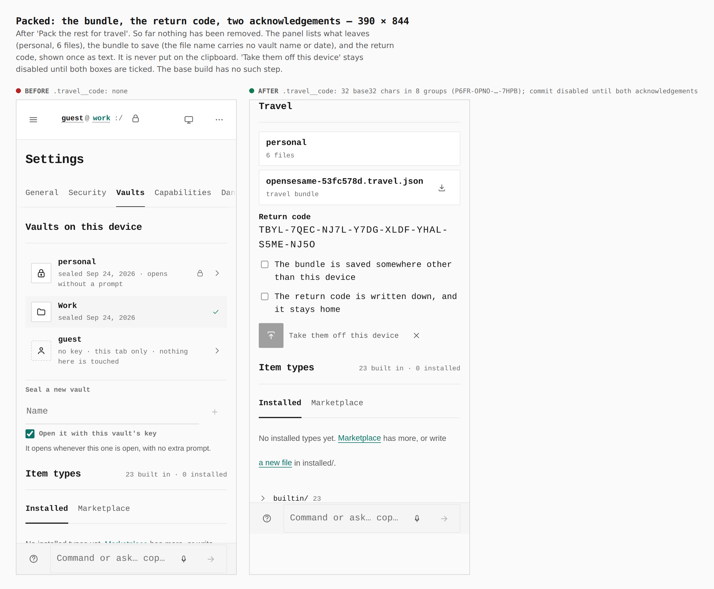
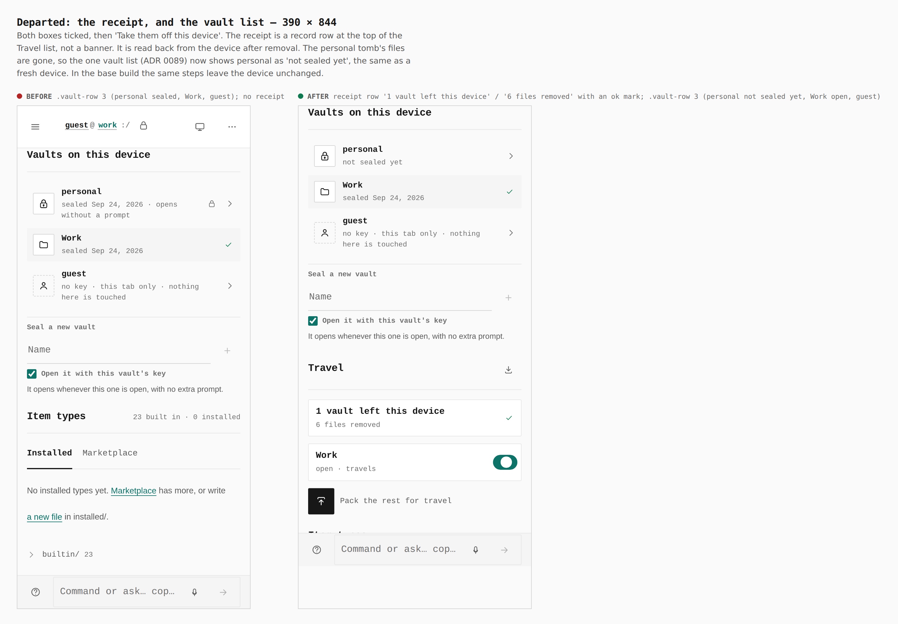
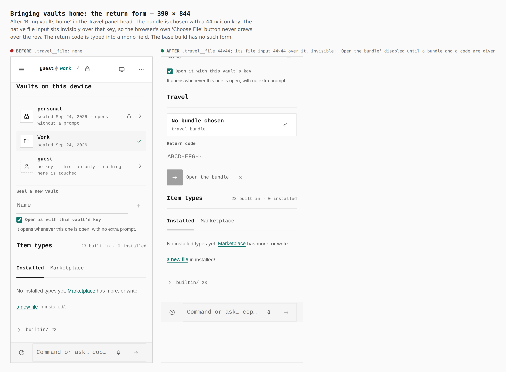
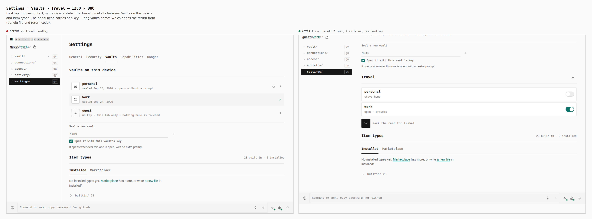
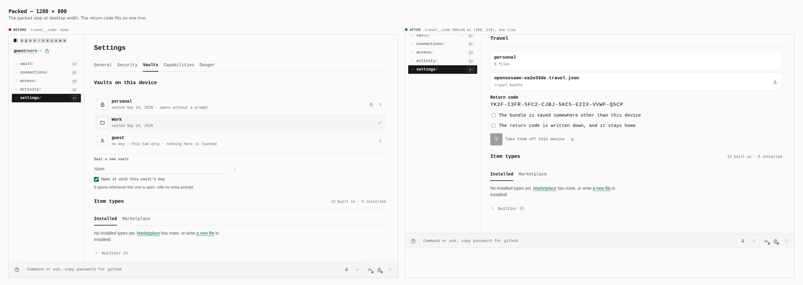

# Travel mode — visual evidence

Change: Settings › Vaults gains a **Travel** panel
([ADR 0143](../../adr/0143-travel-mode.md)). You mark the vaults that are
safe for travel. The rest are packed into a bundle under a return code, then
taken off the device once you confirm both are stored somewhere else.

Two real builds, walked the same way by
`apps/pages/scripts/capture-evidence.mjs` with [`journey.json`](journey.json):

- **before**: merge base `a7506d68` (`git merge-base HEAD origin/main`), with `apps/pages/src` reverted
- **after**: branch `claude/great-albattani-9wnj75`

Device state is the same in both builds. A password vault is sealed, then a
second vault, Work, is sealed with the same key and opened. Return codes and
bundle names are random on each capture.

## Marking what travels — 390 × 844

`.travel__row 0 → 2`, Safe-for-travel switches `0 → 2`. The open vault is
on and locked on. Every other vault stays home by default.

## Packed — 390 × 844

The return code is 32 base32 characters in 8 groups, shown once and never
put on the clipboard. The commit key stays disabled until both
acknowledgements are ticked. Nothing has been removed at this point.

## Departed — 390 × 844

The receipt is a record row reading `1 vault left this device`, with
`6 files removed` under it. It is measured on the device after removal. The one vault list now shows personal as
`not sealed yet`, the same as a fresh device.

## Bringing vaults home — 390 × 844

`.travel__file` is 44×44, and the native file input sits invisibly over it,
also 44×44. `Open the bundle` stays disabled until a bundle and a code are
given.

## Desktop — 1280 × 800

`.travel__code` is 960×26 and fits on one line.

## Not captured

The return road past the form (reading a chosen file, the per-vault preview,
bringing vaults home) needs a file upload, which this harness has no verb
for. `TravelPanel.test.tsx`, `lib/travel/travel.test.ts` and
`lib/travel/travel-return.test.ts` cover it instead:

- a byte-for-byte restore;
- `already_home` on a second return;
- `occupied`, which is never written over, even after the vault came home
  and was edited;
- a headerless bundle refused;
- a completion that reads the device again;
- wrong-code, typo and hostile-bundle refusals.
