# Account factors in Settings › Security (ADR 0140 D10, plan step 11b)

Before/after from two real Pages builds (`VITE_BASE=/OpenSesame/`), walked
with the same steps: `origin/main` at `5060ec42`, built in a separate
worktree and its `dist/` served for the "before" capture, and this branch
(its final build, the one the gates below ran against).
Phone 390×844 (touch context) and desktop 1280×900 (mouse). Every number
below was printed by the capture run (`report`, `count`, `measure`), not
written from the diff.

**The Identity API was a stand-in.** This environment has none. Both builds
were served with the same `os-runtime-config.json` naming
`https://identity.evidence.example`, and
`apps/pages/scripts/lib/capture-ceremony-steps.mjs` with
`capture-factor-steps.mjs` answered there: `GET /v1/principals/me` → 401,
`POST /v1/principals/provisional` (the guest road's provisional principal),
`GET /v1/mfa/factors`, `POST /v1/mfa/passkey/registration-options`,
`POST /v1/mfa/passkey/register` (refused unless the browser's
`clientDataJSON` is a `webauthn.create` over the challenge it was given),
`POST /v1/mfa/totp/enroll`, `POST /v1/mfa/totp/verify` (RFC 6238 for the
stand-in's seed, now), `DELETE /v1/mfa/factors/{totp|pk_…}`; everything else
is a 404. The passkey was made by a virtual WebAuthn authenticator over CDP
(`WebAuthn.addVirtualAuthenticator`, ctap2/internal, user-verifying — the
`passkey` capture verb `verify:local-iam` and the approval evidence use),
so the registration the page sent is a real attestation. The page, its
sheet, focus and requests are the real builds'.

The journey (`journey.json`), per width, on one fresh profile: Continue as
guest → Settings › Security → scroll to Recovery → Add on *Account passkey*
→ Create passkey → Add on *Account authenticator app* → I scanned it → type
the current code → Turn on → Done → Remove on the passkey → Remove passkey.
The second journey (`journey-no-identity.json`) is the same build with
`os-runtime-config.json` set to `{}`: guest → Settings › Security.

Requests the branch sent, as recorded (attestation elided):

- `POST /v1/principals/provisional {}`, `GET /v1/mfa/factors`
- `POST /v1/mfa/passkey/registration-options`, `POST /v1/mfa/passkey/register {"response":{…}}`, `GET /v1/mfa/factors`
- `POST /v1/mfa/totp/enroll {}`, `POST /v1/mfa/totp/verify {"code":"……"}`, `GET /v1/mfa/factors`
- `DELETE /v1/mfa/factors/pk_<32 hex>`, `GET /v1/mfa/factors`

The base build sent none of the `/v1/mfa/*` calls.

## Security, signed in with an Identity API

`h2` Vault key protection, Unlock methods, Second step, Recovery, Formats,
Transport; `.sw--method` 13 → adds **Your account**; `.sw--method` 15, of
them 2 account rows (390: 358×67, 358×66 px; 1280: 960×66, 960×65 px), one
Add key each.

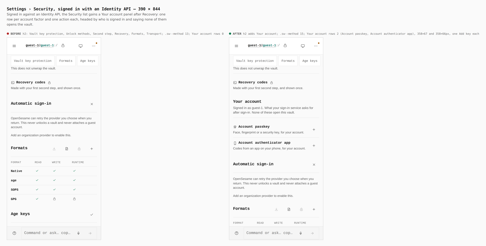
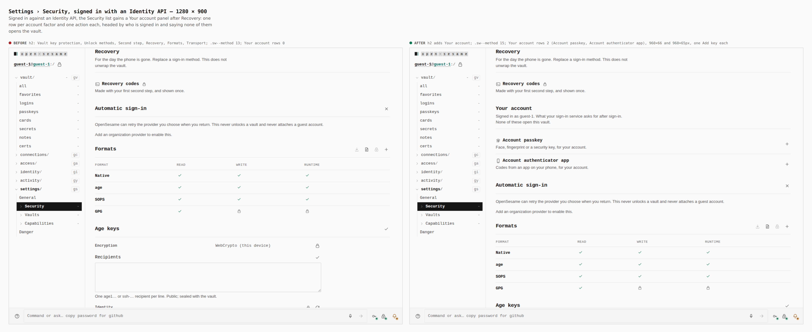

## Add on Account passkey — the one sheet

Base: no row, `[role=dialog]` 0 → dialog *Account passkey*, card
*Passkey · your account*, facts Proves / Asked / Vault, Create passkey
(390: 161×44 px).

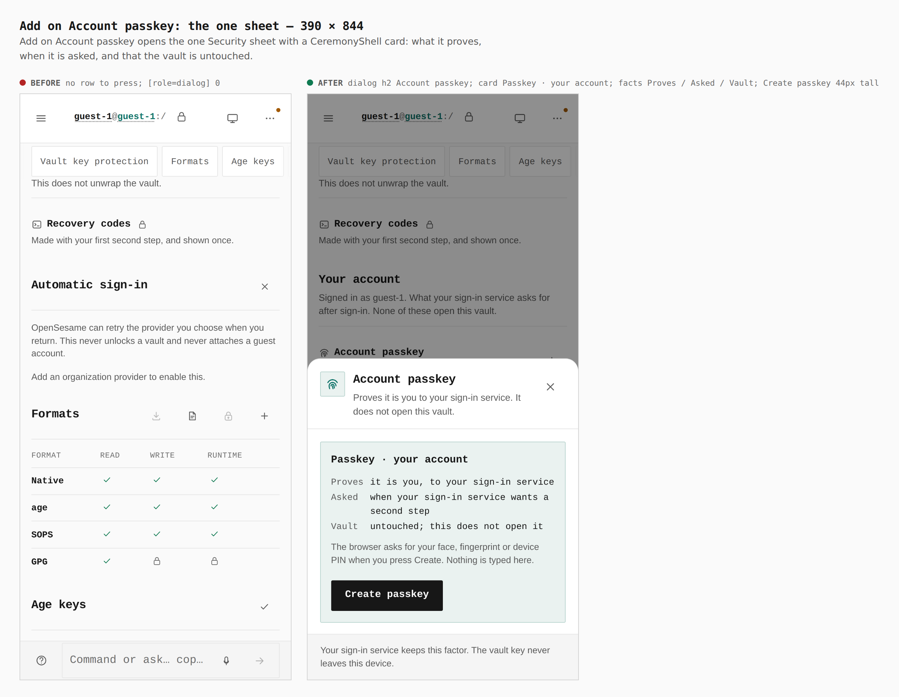
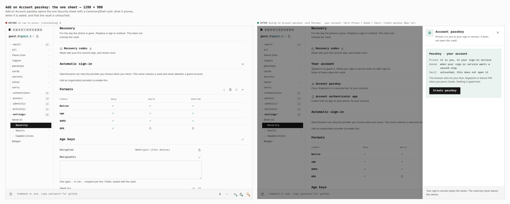

## After Create passkey

Account rows 0 → 3: *Account passkey · Added Sep 25, 2026 · key ####*
(Remove), *Another account passkey* (Add), *Account authenticator app* (Add).

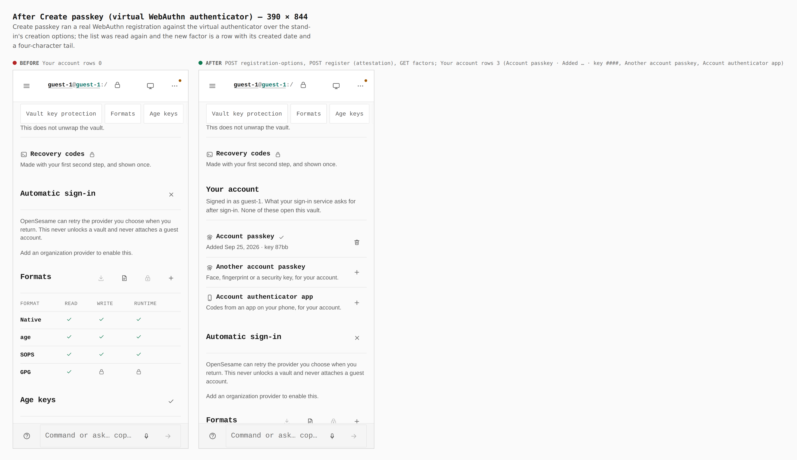
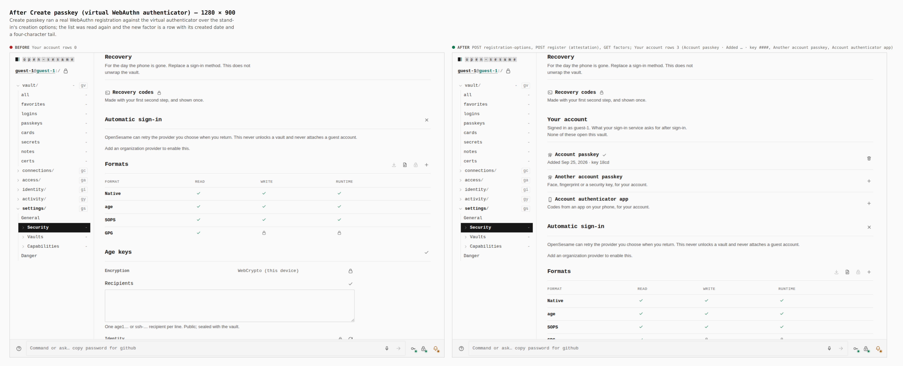

## Add on Account authenticator app — scan

`[role=dialog]` 0, QR 0 → rail *1 · Scan / 2 · Confirm*, QR 1, the setup
key one alternative away; foot: closing before a code matches removes the
setup.

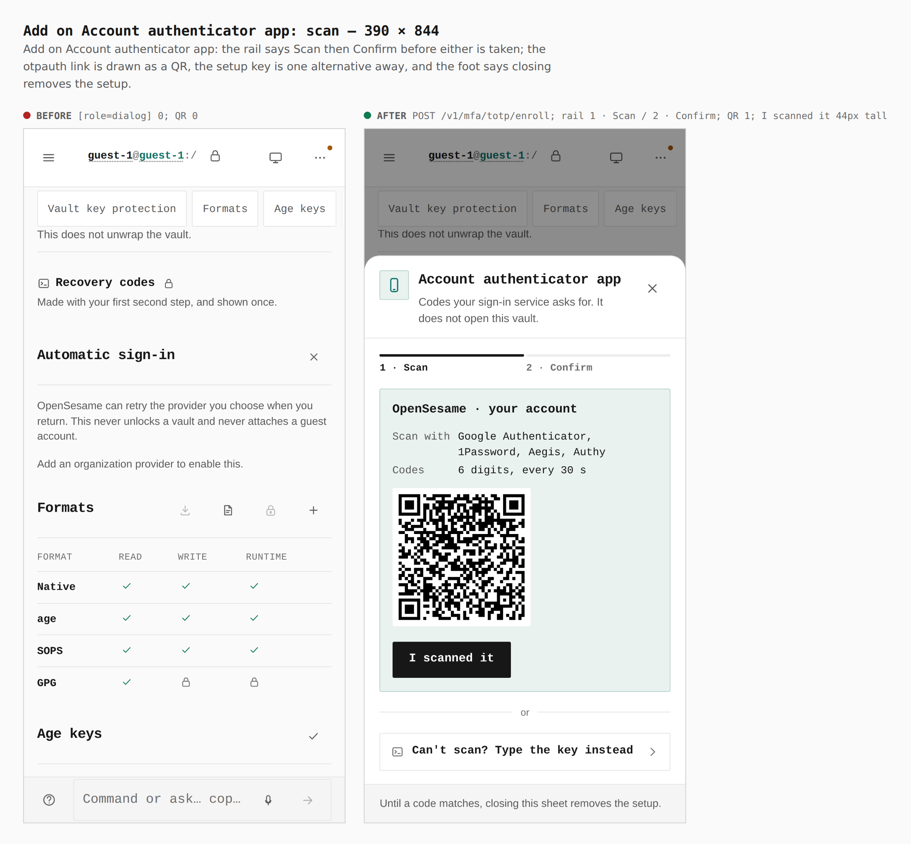
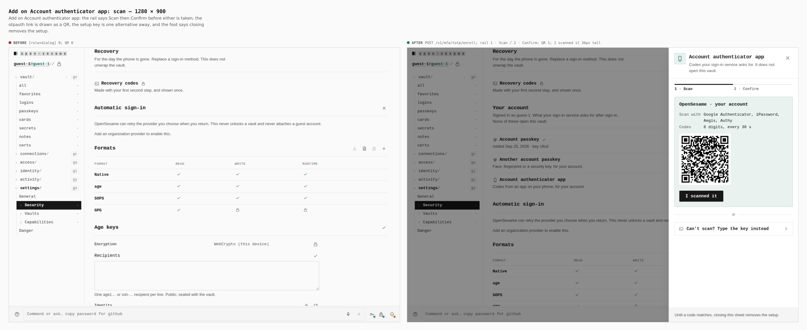

## A code from the app matched

`POST /v1/mfa/totp/verify` → 200; card *Authenticator on*, *Your sign-in
service asks for its code*, Vault untouched.

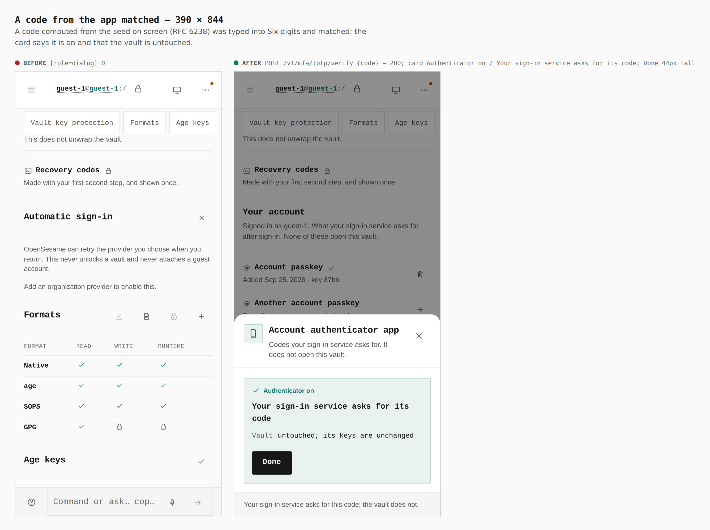
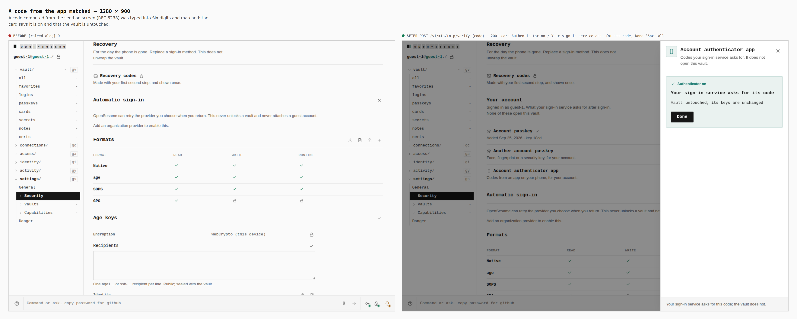

## Both account factors beside the vault's keys

Account rows 0 → 3, each with one action: Remove, Add, Remove (390:
358×67, 358×67, 358×84 px — the authenticator's line wraps; 1280: 960×66,
960×66, 960×65 px).

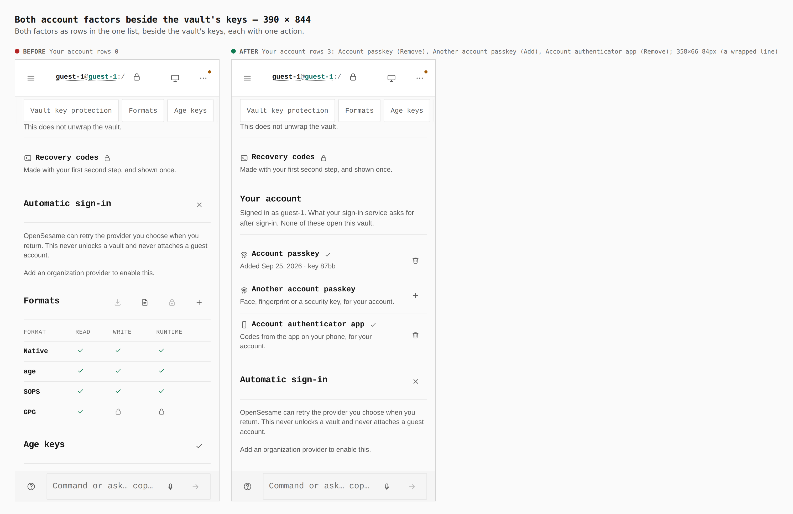
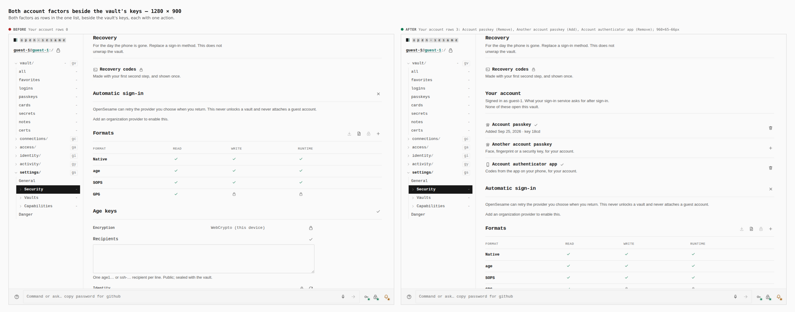

## Remove on the account passkey — confirmed in its card

Card *Remove this passkey?*, facts After (your sign-in service stops
accepting it) / Vault (untouched; its keys keep working), Remove passkey +
Keep it. No form under the row.

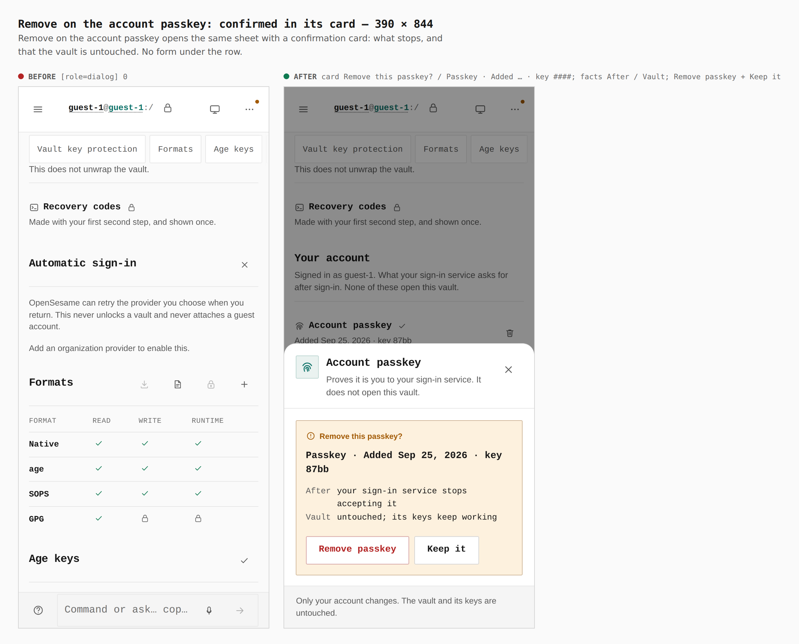
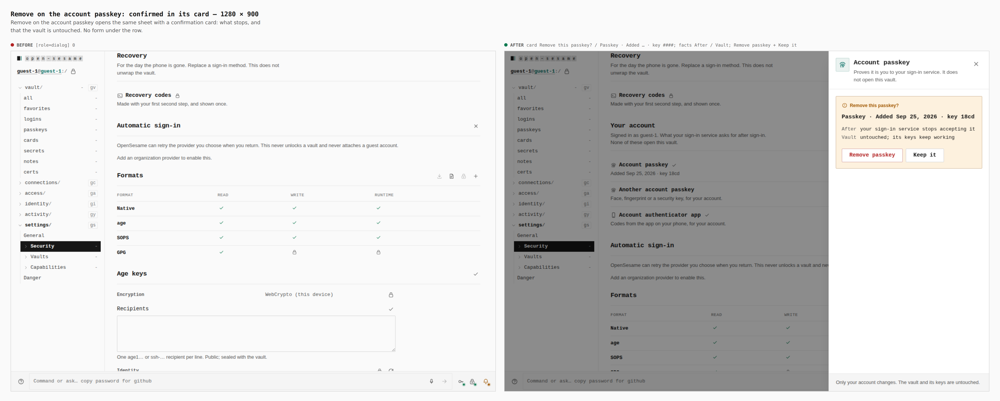

## After Remove passkey

`DELETE /v1/mfa/factors/pk_…` then the list read again: account rows 2,
*Account passkey* back to Add.

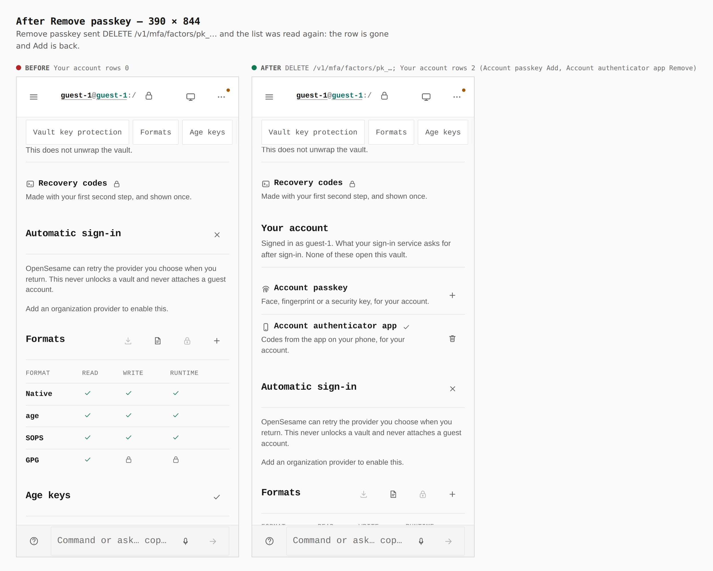
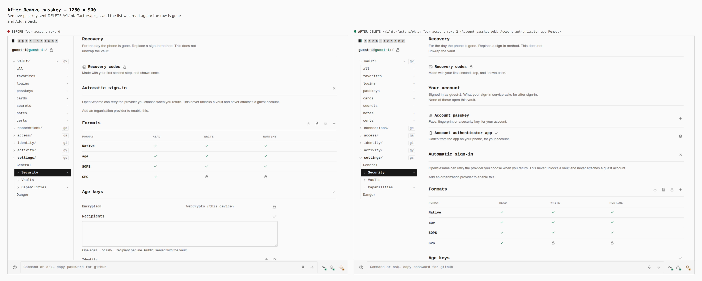

## No Identity API — no rows, no copy

`os-runtime-config.json` `{}`: before and after identical — `h2` six panels,
no *Your account*, `.sw--method` 13, and no account copy in any `.hint`.

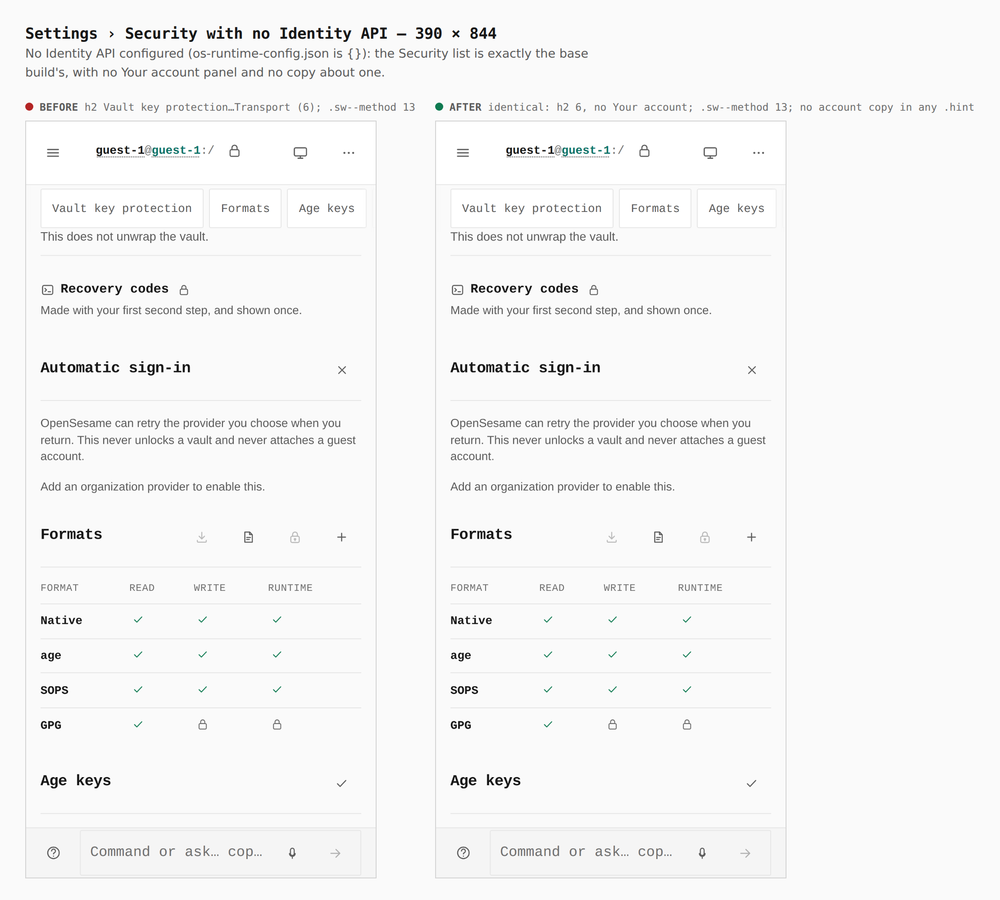
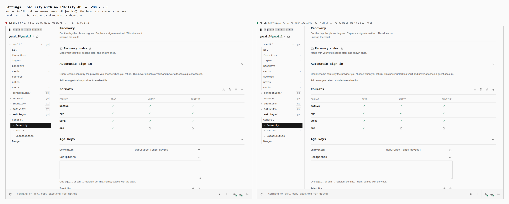
