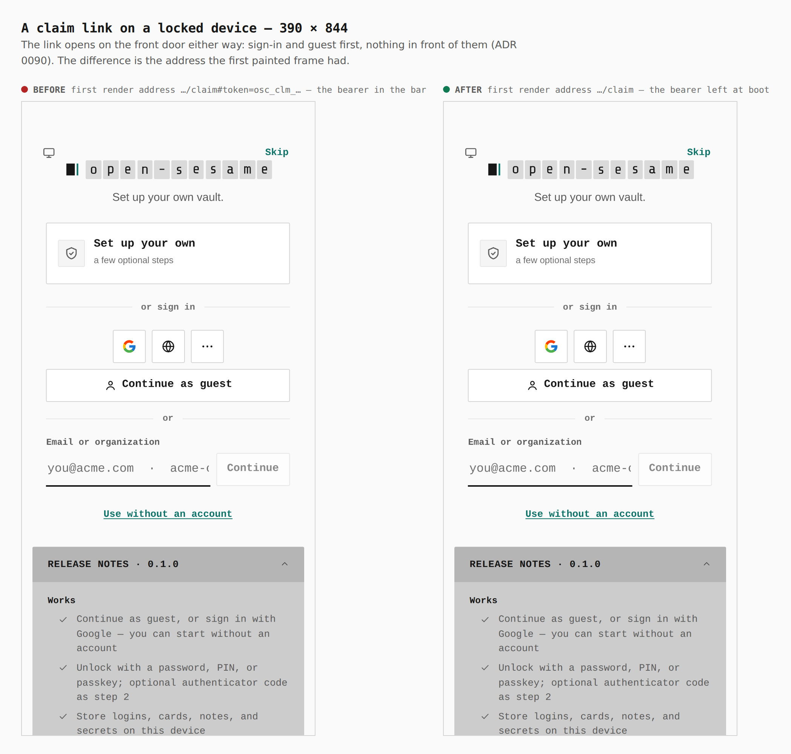
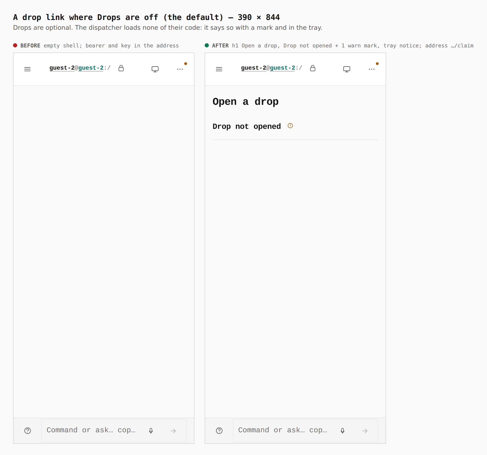
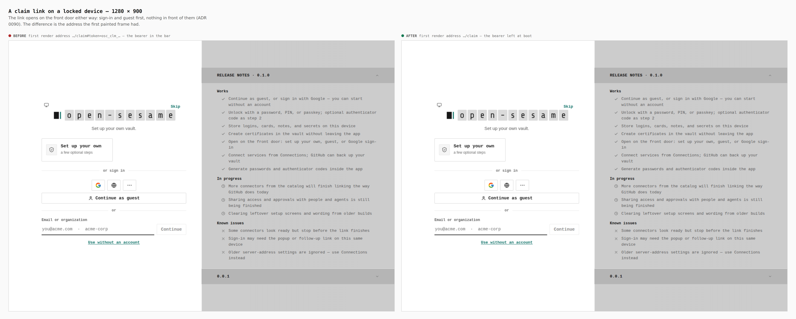
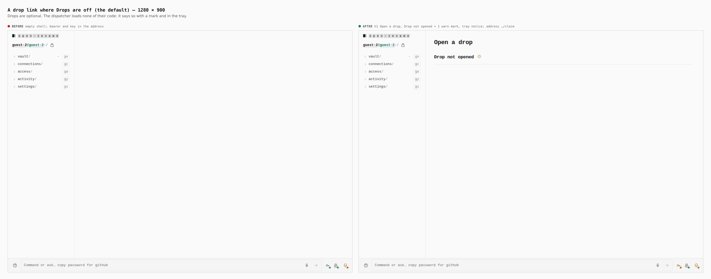

# `/claim` — one dispatcher for claim and drop links (ADR 0140 step 8)

Before/after from two real Pages builds (`VITE_BASE=/OpenSesame/`), walked
with the same steps: the stack-13 base (`38a6ee90`, built in a separate
worktree) and this branch. Phone 390×844 (touch context) and desktop
1280×900 (mouse). Every number below was printed by the capture run, not
written from the diff.

The journey, per width:

1. open `…/OpenSesame/claim#token=osc_clm_evidence.…` cold → Continue as guest
   → enter the consent code → Accept claim;
2. open `…/OpenSesame/claim#token=osc_clm_drop.…&key=…` cold → Continue as
   guest (Drops are off by default);
3. Settings › Capabilities → switch Sharing on → Apply → open the same drop
   link cold → Unlock the guest vault → enter the one-time code → Open drop.

**The Identity API was a stand-in.** This environment has none. Both builds
were served with the same `os-runtime-config.json` naming
`https://identity.evidence.example`, and
`apps/pages/scripts/lib/capture-ceremony-steps.mjs` answers exactly these
routes there: `GET /v1/principals/me` → 401, `POST /v1/principals/provisional`,
`POST /v1/claims/present` (one synthetic claim; with a user code, the sealed
synthetic drop in `drop-manifest.json`), `GET /v1/claims/clm_evidence`,
`POST /v1/claims/clm_evidence/complete`, `GET /v1/health/live`; everything
else is a 404. The drop is real ciphertext, sealed by `sealDrop` for this
gallery; its key is the `#key=` in `journey.json`. The page, its routing,
focus, decryption and requests are the real builds'. Requests the branch sent,
as recorded:

- `POST /v1/claims/present {"token":"osc_clm_evidence.c2VjcmV0"}`
- `POST /v1/claims/clm_evidence/complete {"acceptedItemIds":["item-1","item-2"],"userCode":"WXYZ-1234","claimToken":"osc_clm_evidence.c2VjcmV0"}`
- `POST /v1/claims/present {"token":"osc_clm_drop.c2VjcmV0","userCode":"ABCD-EFGH"}`

The first-render address is recorded by an init script that reads
`location.href` in the mutation callback for the first node React writes into
`#root` — before that frame paints.

| Sheet | Before | After |
|---|---|---|
| `390-claim-door`, `1280-claim-door` | first render address `…/claim#token=osc_clm_evidence.c2VjcmV0` | first render address `…/claim` — the bearer left at boot |
| `390-claim-review`, `1280-claim-review` | empty shell, no `h1`, focus on `body`, bearer still in the address | `h1` Accept a claim; Kind `resource_bundle` · Items 2 · Manifest `sha256:3f7a9c1e0b5d4…`; focus on Consent code (352×44 phone / 474×32 desktop, `:focus-visible`); `.go` 44×44 / 40×40 |
| `390-claim-done`, `1280-claim-done` | 0 ok marks, focus on `body` | 1 ok mark (Claim accepted), 0 `.note`, focus on the Claim accepted panel |
| `390-drop-off`, `1280-drop-off` | empty shell; bearer and key in the address | `h1` Open a drop, Drop not opened with 1 warn mark and a tray notice; address `…/claim`; no drop code loaded |
| `390-drop-arrival`, `1280-drop-arrival` | unframed Open a drop drawn on the locked device, first render and address still `…#token=…&key=…`; focus on `body` | framed behind the guest unlock; first render address `…/claim`; focus on One-time code (352×44 / 474×32, `:focus-visible`) |
| `390-drop-open`, `1280-drop-open` | payload shown; the key left the address only once opened | payload shown with 1 ok mark (Drop opened), 0 `.note`; address `…/claim` throughout |

## A claim link on a locked phone

The front door is untouched: sign-in and the guest road come first, nothing in
front of them (ADR 0090). The difference is the address bar — before, the
bearer sat in it for as long as the tab lived.



## After Continue as guest

Before, `/claim` on a guest vault was no route at all: the drops module owned
it and Drops are off by default. After, the always-on ceremonies module serves
it: the claim is presented once and shown for review. With an Identity API
configured the guest road already minted a provisional principal, so the
claim did not have to wait for one; that wait (the Connect note `/device`
shows, and the model's guest road) is covered by `ClaimRoute.test.tsx`.


## Accepted


## A drop link where Drops are off

The dispatcher imports no drop code. With `sharing.drops` unapproved nothing of
it is loaded; the route says so with a mark and in the notifications tray.



## The same drop link with Sharing on

Now the route draws the opener `sharing.drops` contributed (`claim-opener`).


## Desktop







## How

```bash
J=docs/evidence/2026-09-25-claim-route/journey.json
# before: the base tree's own build (a separate worktree at 38a6ee90), copied to apps/pages/dist
# both builds: dist/os-runtime-config.json = {"identityApi":"https://identity.evidence.example"}
PLAYWRIGHT_CHROMIUM=/opt/pw-browsers/chromium node apps/pages/scripts/capture-evidence.mjs capture before "$J"
VITE_BASE=/OpenSesame/ pnpm exec turbo run build --filter=@opensesame/pages
PLAYWRIGHT_CHROMIUM=/opt/pw-browsers/chromium node apps/pages/scripts/capture-evidence.mjs capture after "$J"
PLAYWRIGHT_CHROMIUM=/opt/pw-browsers/chromium node apps/pages/scripts/capture-evidence.mjs compose "$J"
```
