# `/claim` and `/device` open before unlock (ADR 0140 step 8, §2, D2, D7)

Before/after from two real Pages builds (`VITE_BASE=/OpenSesame/`), walked
with the same steps: the stack-13 base (`38a6ee90`, built in a separate
worktree) and this branch. Phone 390×844 (touch context) and desktop
1280×900 (mouse). Every number below was printed by the capture run, not
written from the diff.

The journey, per width, on one fresh browser profile with no vault:

1. open `…/OpenSesame/claim#token=osc_clm_evidence.…` cold → Continue as
   guest → enter the consent code → Accept claim;
2. open `…/OpenSesame/claim#token=osc_clm_drop.…&key=…` cold (Sharing off,
   the default) → enter the one-time code → Open drop;
3. open `…/OpenSesame/device?user_code=ABCD-EFGH` cold → Connect → Approve
   device;
4. open the base → take the guest road → Settings › Capabilities → switch
   Sharing on → Apply → wait 30 s → follow an in-app link to `/device`.

The two builds diverge at step 1 by design: the base's "Continue as guest" is
the front door's, which seals a guest vault, so from step 2 on the base
device has a guest vault behind its unlock screen. The branch's is the claim
ceremony's guest road, which mints a provisional principal and seals nothing:
the branch device still has no vault at step 3.

**The Identity API was a stand-in.** This environment has none. Both builds
were served with the same `os-runtime-config.json` naming
`https://identity.evidence.example`, and
`apps/pages/scripts/lib/capture-ceremony-steps.mjs` answers exactly these
routes there: `GET /v1/principals/me` → 401, `POST /v1/principals/provisional`,
`POST /v1/device/approve`, `POST /v1/claims/present` (one synthetic claim;
with a user code, the sealed synthetic drop in `drop-manifest.json`),
`GET /v1/claims/clm_evidence`, `POST /v1/claims/clm_evidence/complete`,
`GET /v1/health/live`; everything else is a 404. The drop is real
ciphertext, sealed by `sealDrop` for this gallery; its key is the `#key=` in
`journey.json`. The page, its routing, focus, decryption and requests are the
real builds'. Requests the branch sent, as recorded:

- `POST /v1/principals/provisional {}` (the claim's guest road)
- `POST /v1/claims/present {"token":"osc_clm_evidence.c2VjcmV0"}`
- `POST /v1/claims/clm_evidence/complete {"acceptedItemIds":["item-1","item-2"],"userCode":"WXYZ-1234","claimToken":"osc_clm_evidence.c2VjcmV0"}`
- `POST /v1/claims/present {"token":"osc_clm_drop.c2VjcmV0","userCode":"ABCD-EFGH"}`
- `POST /v1/device/approve {"user_code":"ABCD-EFGH"}`

The first-render address is recorded by an init script that reads
`location.href` in the mutation callback for the first node React writes into
`#root`, before that frame paints. `.unlock` counts the unlock/front-door
screen.

| Sheet | Before | After |
|---|---|---|
| `*-claim-arrival` | first render `…/claim#token=osc_clm_…`; front door (`.unlock` 1); focus on the sign-in field | first render `…/claim`; `.unlock` 0; h1 Accept a claim, Claim waiting (warn mark), the Connect note; focus on Continue as guest (176×44 phone / 176×36 desktop, `:focus-visible`) |
| `*-claim-review` | empty shell, no h1, focus on `body` | Kind `resource_bundle` · Items 2 · Manifest; focus on Consent code (352×44 / 474×32); `.go` 44×44 / 40×40 |
| `*-claim-done` | 0 ok marks | 1 ok mark (Claim accepted), 0 `.note` |
| `*-drop-arrival` | unlock screen (`.unlock` 1), bearer and key in the address, focus on Unlock | first render `…/claim`; `.unlock` 0; h1 Open a drop; focus on One-time code (352×44 / 474×32, `:focus-visible`) |
| `*-drop-open` | not reached | payload shown, 1 ok mark (Drop opened), 0 `.note`; address `…/claim` |
| `*-device-arrival` | unlock screen (`.unlock` 1), focus on Unlock | h1 Approve a device and the Connect note; `.unlock` 0; focus on Connect (44×44 / 32×32) |
| `*-device-approved` | unlock screen, no code, 0 ok marks | User code `ABCD-EFGH`, focus on Approve device (`.go` 44×44 / 40×40), 1 ok mark |
| `*-after-change` | 30 s after enabling Sharing, a link to `/device` lands on `…/vault` | `…/device`, h1 Approve a device, inside the shell |

## A claim link on a device with no vault

No unlock, no vault: the ceremony opens by itself (ADR 0140 §2). It needs
someone to accept as, so the Connect note and the claim's guest road are on
the route. The front door is unchanged for every other path (ADR 0090).

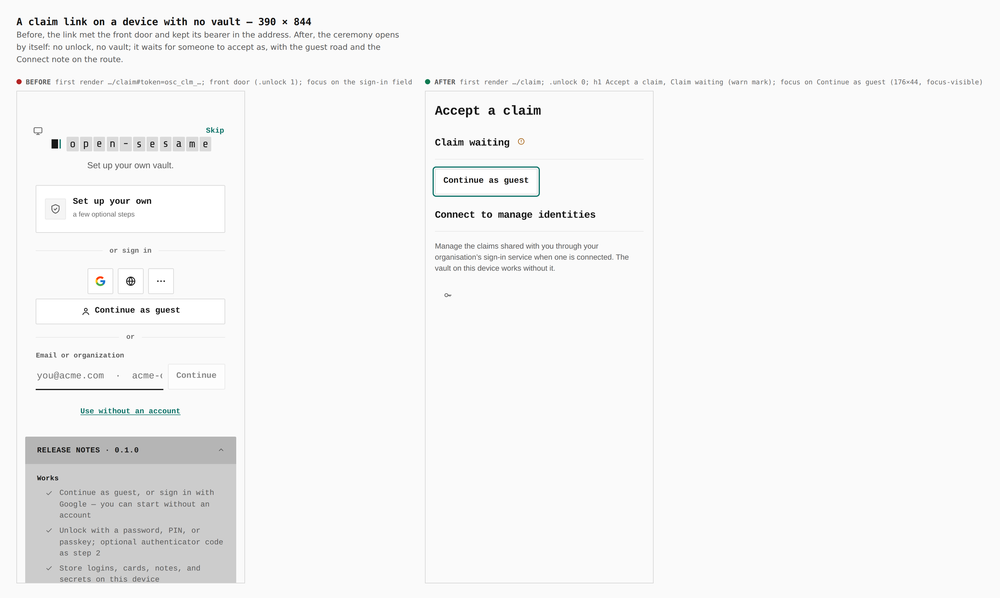

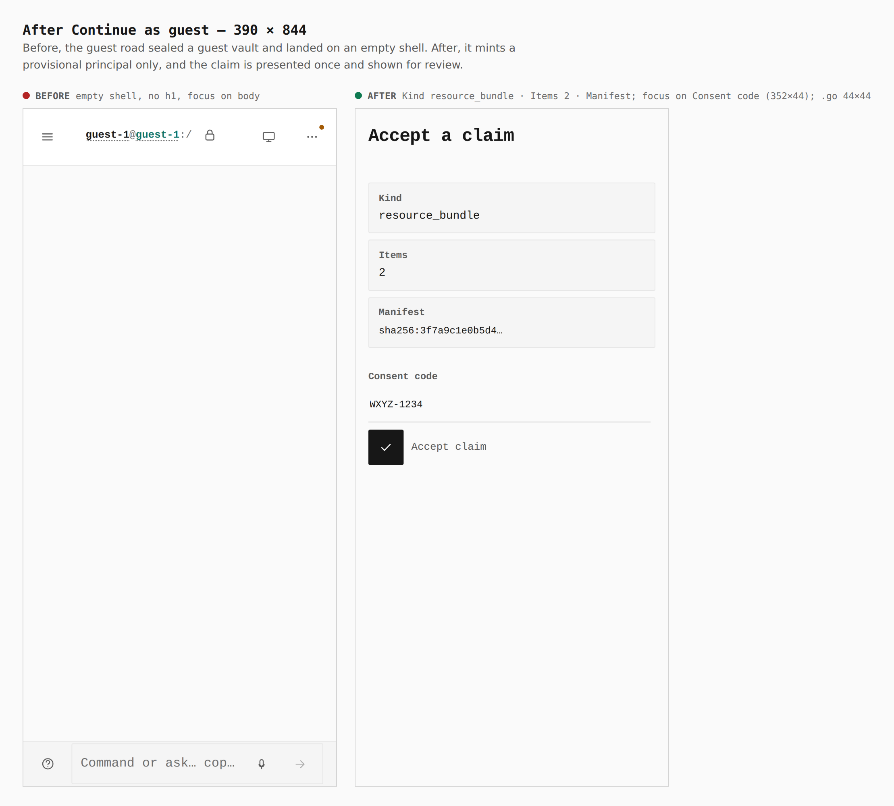

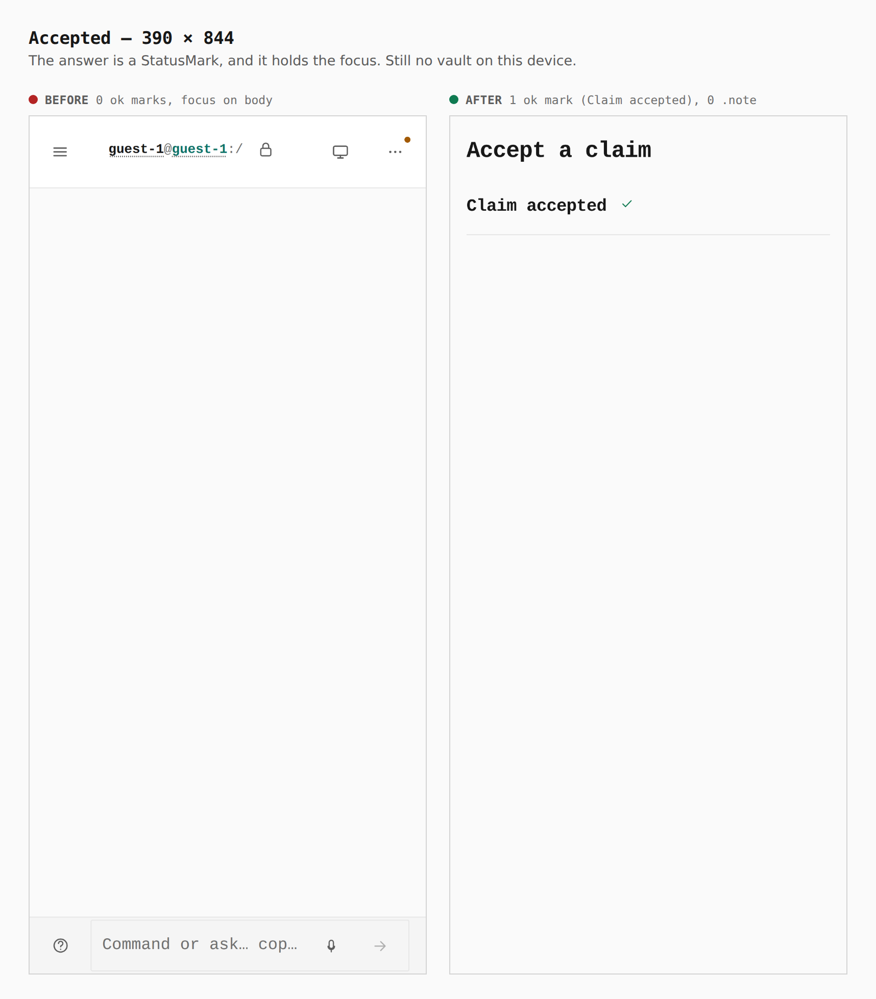

## A drop link on a default installation (Sharing off)

The recipient's side of a drop is always-on (D2). Before, a default
installation had no drop screen at all.

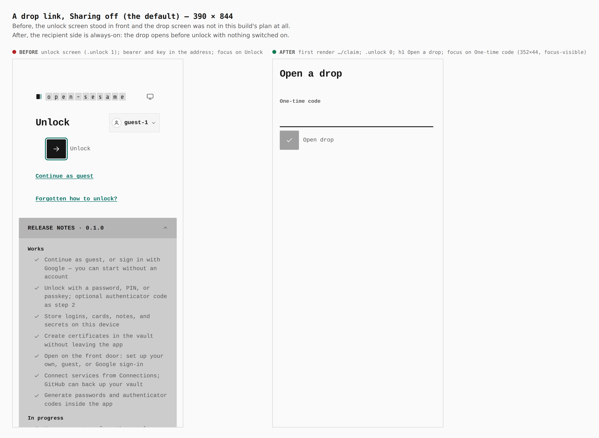

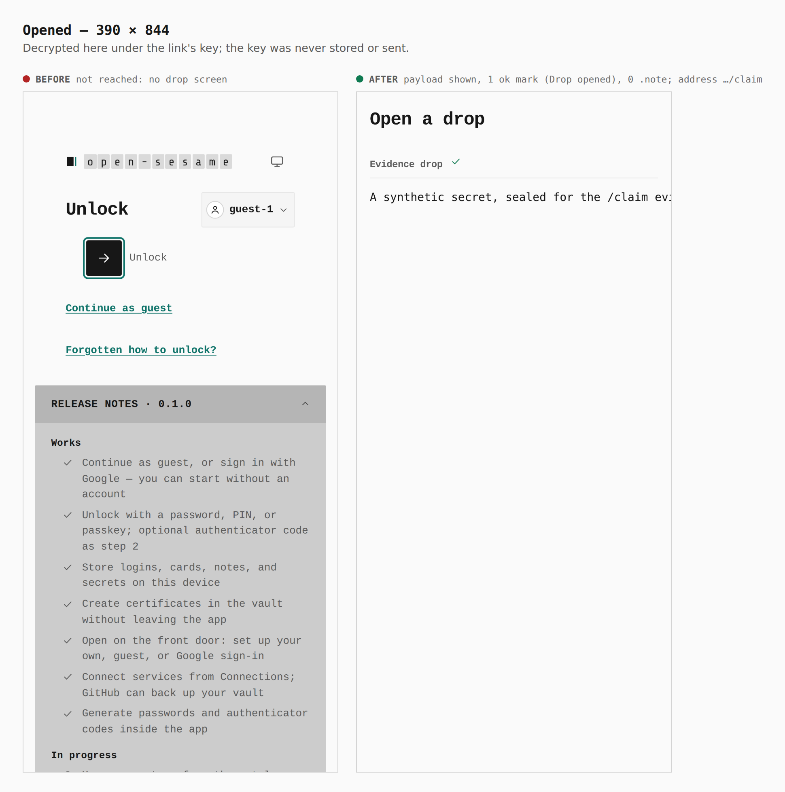

## `/device` on an empty device

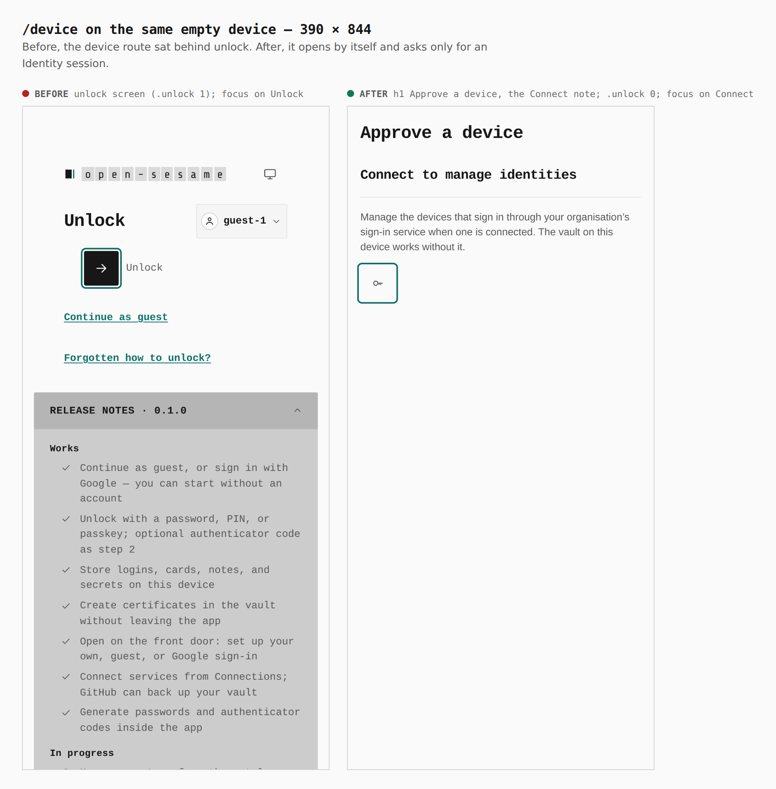

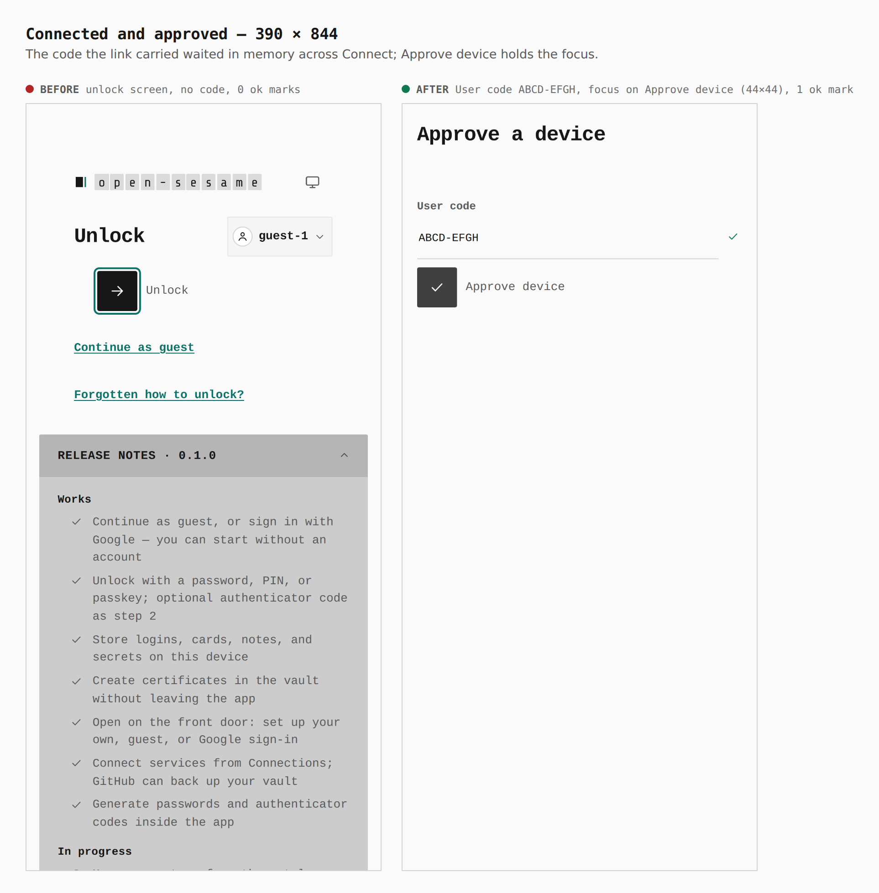

## A link to `/device` 30 s after a capability change

The bounce was the shell's denied-route fallback, not the capability runtime
(see the commit "Stop the shell bouncing links from a section to non-section
routes"). Any navigation from a section to a route that is not a rail
section went back to the vault.

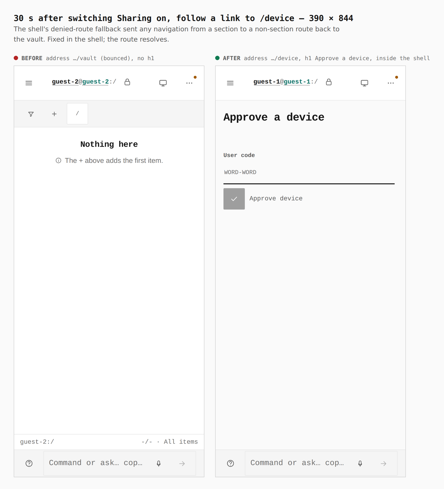

## Desktop

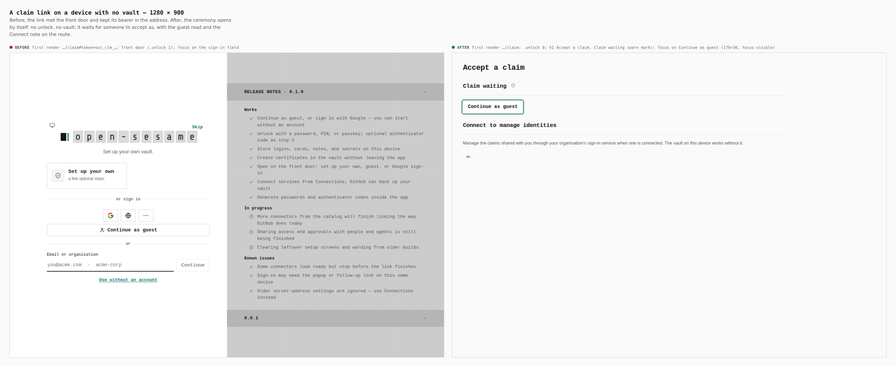

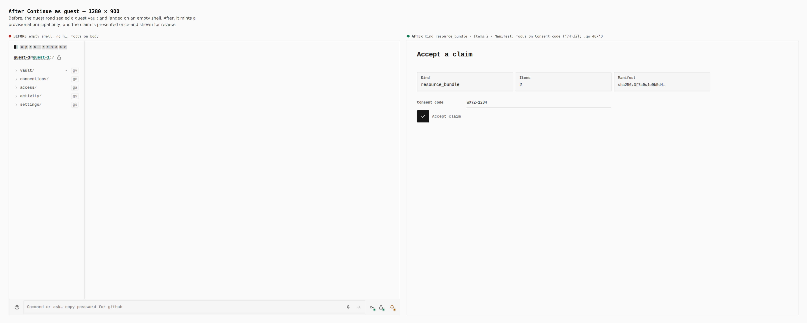

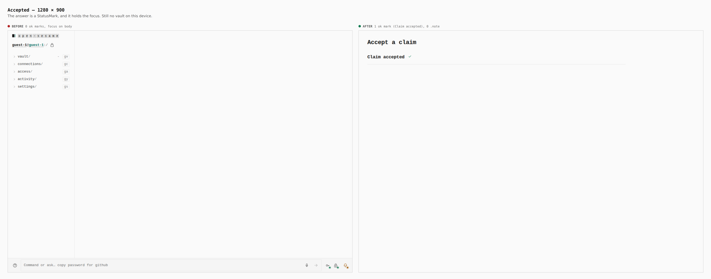

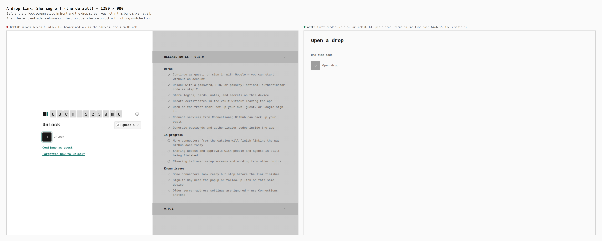

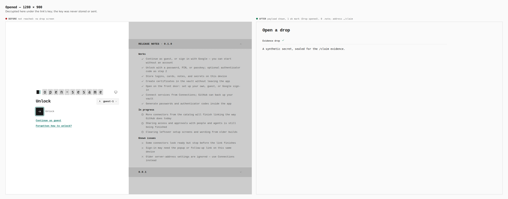


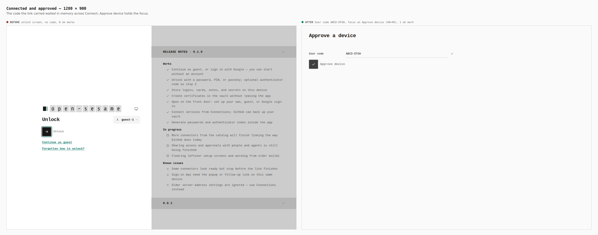

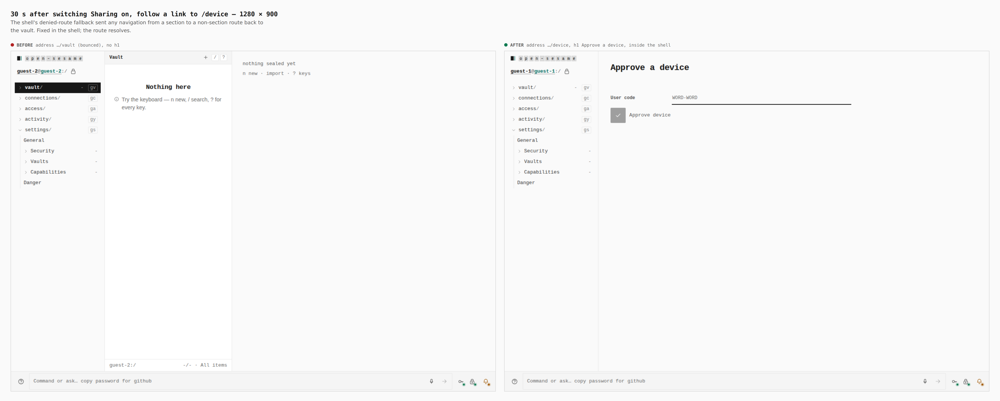

## How

```bash
J=docs/evidence/2026-09-25-claim-route/journey.json
# before: the base tree's own build (a separate worktree at 38a6ee90), copied to apps/pages/dist
# both builds: dist/os-runtime-config.json = {"identityApi":"https://identity.evidence.example"}
PLAYWRIGHT_CHROMIUM=/opt/pw-browsers/chromium node apps/pages/scripts/capture-evidence.mjs capture before "$J"
VITE_BASE=/OpenSesame/ pnpm exec turbo run build --filter=@opensesame/pages
PLAYWRIGHT_CHROMIUM=/opt/pw-browsers/chromium node apps/pages/scripts/capture-evidence.mjs capture after "$J"
PLAYWRIGHT_CHROMIUM=/opt/pw-browsers/chromium node apps/pages/scripts/capture-evidence.mjs compose "$J"
```
