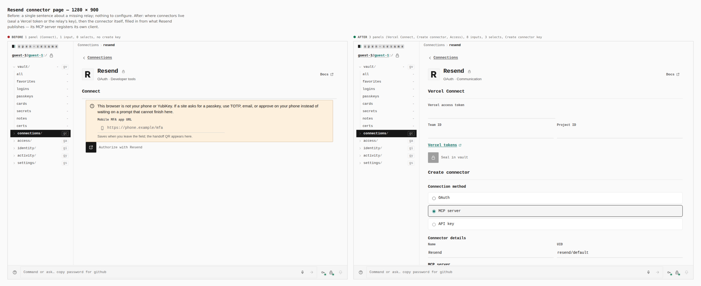
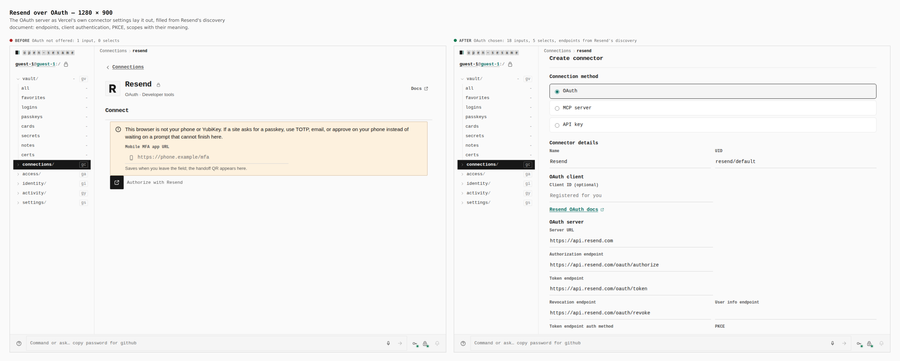
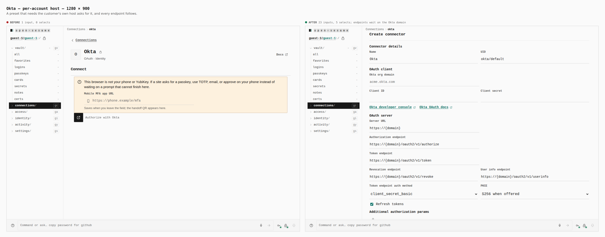
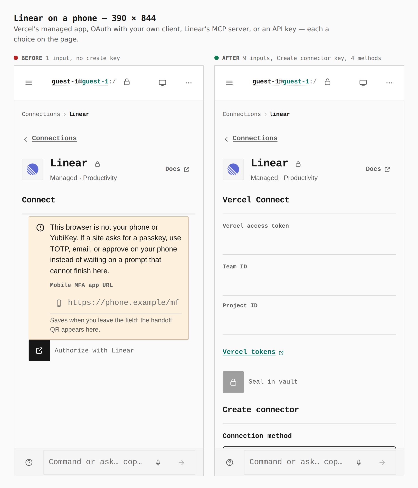
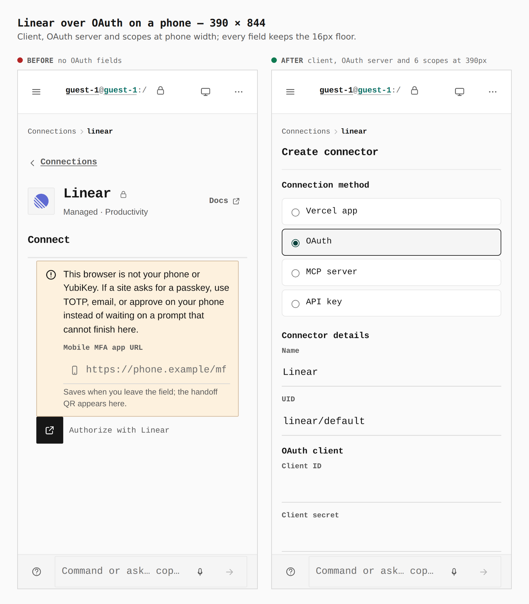

# Connections: every connector configurable, with a proven user token (ADR 0146)

Before/after from two real builds — `main` and this branch — walked the same
way by `apps/pages/scripts/capture-evidence.mjs` ([`journey.json`](journey.json)),
as a guest on the static build with no relay and nothing sealed. Numbers are
counted in the browser (`count` / `report` steps).

## Resend — 1280 × 900

`1 panel (Connect), 1 input, 0 selects, no create key` →
`3 panels (Vercel Connect, Create connector, Access), 8 inputs, 3 selects, Create connector key`

Before, the only action was "Authorize with Resend", which led to the Host
flow Pages no longer speaks (ADR 0128). After, the page says where connectors
live and opens the connector filled in: Resend's MCP server registers its own
client, so nothing needs pasting.

## Resend over OAuth — 1280 × 900

`OAuth not offered: 1 input, 0 selects` → `18 inputs, 5 selects`

The OAuth server laid out as Vercel's connector settings do, filled from
Resend's discovery document. The client ID is optional and the secret is
hidden: Resend is a public client registered by metadata document.

## Okta — per-account host — 1280 × 900

`1 input, 0 selects` → `23 inputs, 5 selects; endpoints wait on the Okta domain`

Reached by moving from Resend inside the app: the form starts from Okta's own
plan (a first capture showed Resend's state carried over — fixed, with a
regression test).

## Linear on a phone — 390 × 844

`1 input, no create key` → `9 inputs, Create connector key, 4 methods`

## Linear over OAuth on a phone — 390 × 844

`no OAuth fields` → `client, OAuth server and 6 scopes at 390px`; the
`verify:mobile` touch contract passes at 320–1366px.

## What the images cannot show: the token

| Evidence | File |
| --- | --- |
| Every connector × method, created through the real relay, authorized for a person against a strict OAuth provider emulator, and its token acquired and accepted by the service's verify call — 224 paths, 189 services, all verified | [`conformance.json`](conformance.json) |
| Every real endpoint answering live, read-only — 47 OAuth servers, 98 MCP servers, 67 API-key endpoints | [`live-preflight.json`](live-preflight.json) |
