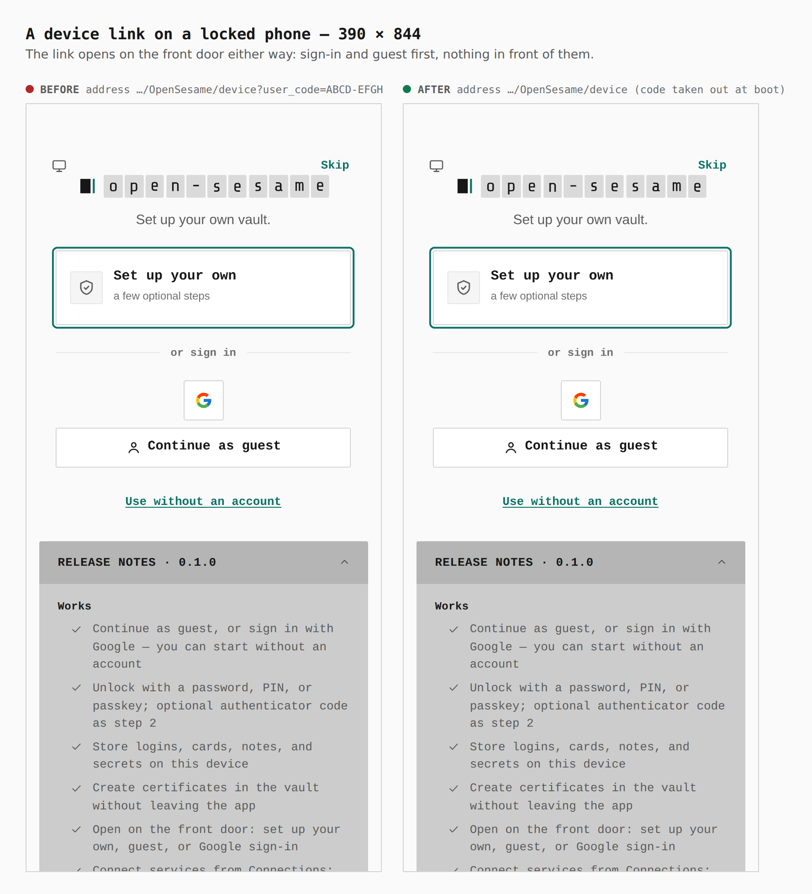
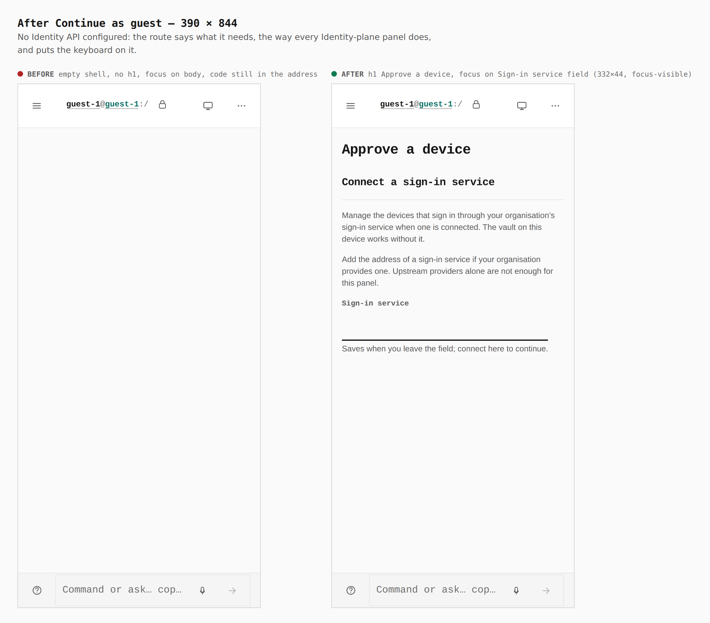
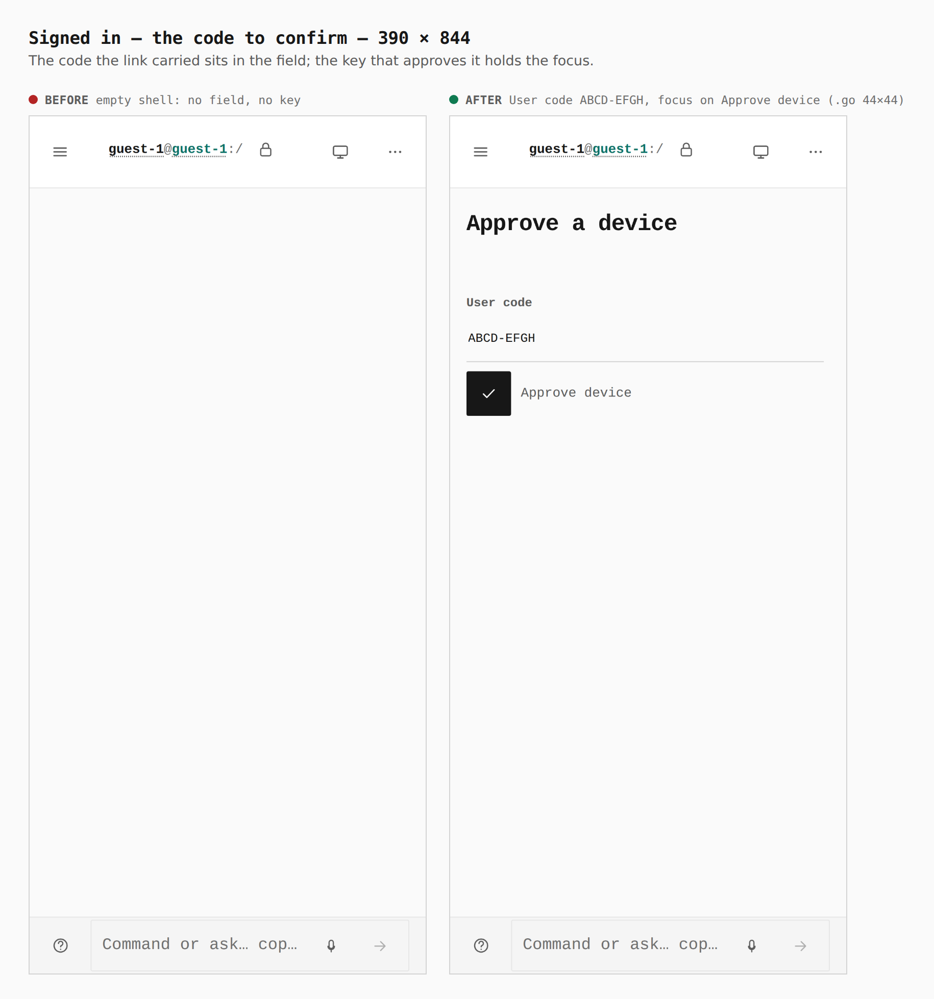
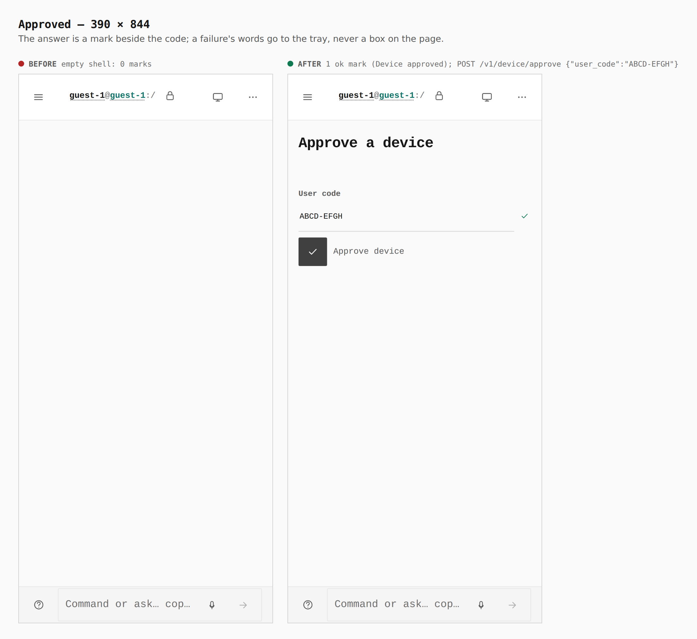
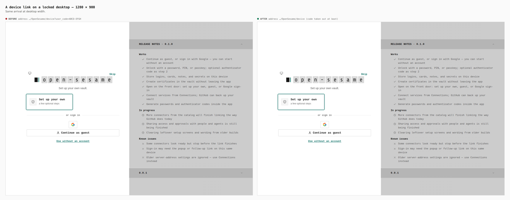
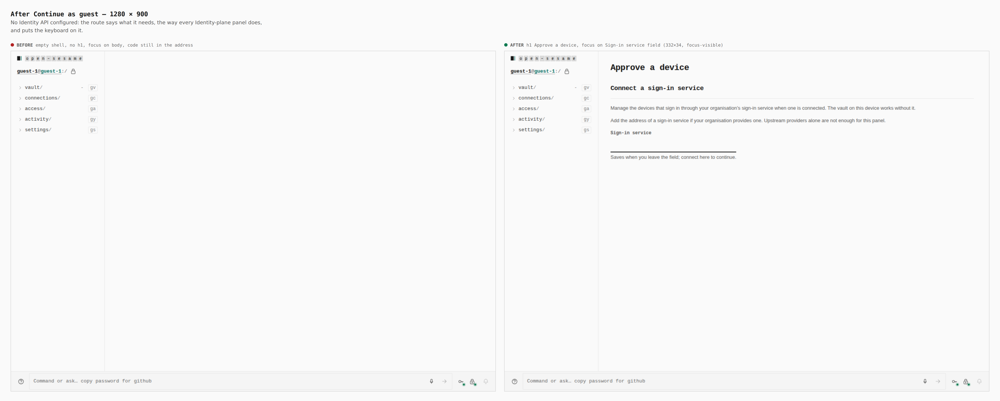
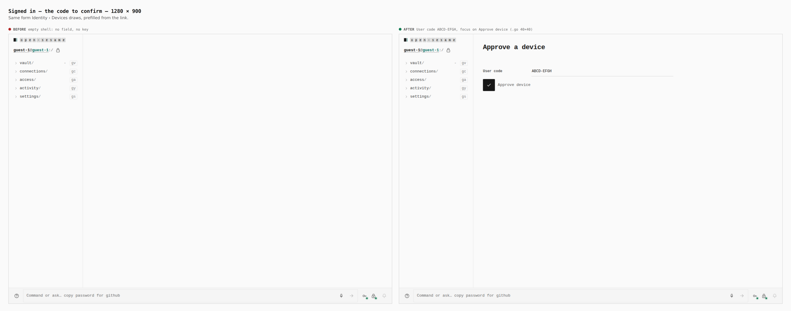
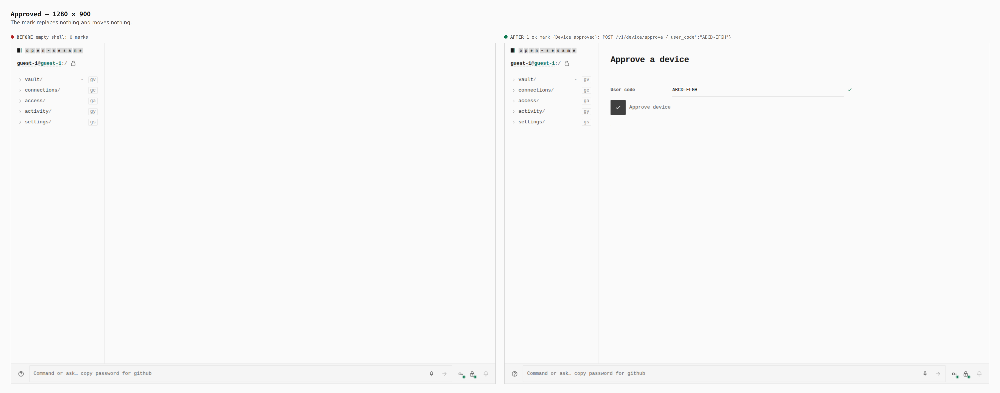

# `/device` — approve a device sign-in from its link (ADR 0140 step 7)

Before/after from two real Pages builds (`VITE_BASE=/OpenSesame/`), walked
with the same steps: the stack-12 base (`3678bb30`) and this branch. Phone
390×844 (touch context) and desktop 1280×900 (mouse). Every number below was
printed by the capture run, not written from the diff.

The journey: open `…/OpenSesame/device?user_code=ABCD-EFGH` cold → Continue as
guest → type an Identity API address into the route's own field → Connect →
Approve device.

**The Identity API was a stand-in.** This environment has none, and the
approval screen is gated on a signed-in Identity session. `journey.json`
names `identityStub`; `apps/pages/scripts/lib/capture-ceremony-steps.mjs`
answers exactly four routes at that origin (`GET /v1/principals/me` → 401,
`POST /v1/principals/provisional`, `POST /v1/device/approve` → `{ok, status}`,
`GET /v1/health/live`) and 404s the rest. The page, its routing, its focus and
its request are the real build's. The request the page sent, as recorded:
`POST /v1/device/approve {"user_code":"ABCD-EFGH"}`.

| Sheet | Before | After |
|---|---|---|
| `390-door`, `1280-door` | address `…/device?user_code=ABCD-EFGH` | address `…/device` — the code left at boot, before first paint |
| `390-arrival`, `1280-arrival` | empty shell, no `h1`, focus on `body`, code still in the address | `h1` Approve a device; no Identity API, so Connect a sign-in service; focus on its field (332×44 phone, 332×34 desktop, `:focus-visible`) |
| `390-confirm`, `1280-confirm` | empty shell, no field, no key | User code `ABCD-EFGH` prefilled; focus on Approve device (`.go` 44×44 phone, 40×40 desktop) |
| `390-approved`, `1280-approved` | 0 marks | 1 ok mark labelled Device approved, beside the code |

## A device link on a locked phone

The front door is untouched: sign-in and the guest road come first, nothing in
front of them (ADR 0090). The difference is the address bar.



## After Continue as guest

Before, `/device` was no route at all: an empty shell. After, the route says
what it needs — the same Connect note every Identity-plane panel shows — and
puts the keyboard on it.



## Signed in: the code to confirm

The code the link carried is in the field; the key that approves it holds the
focus, so Enter approves it. The focus ring reads `focus-visible=false` here
only because the capture pressed Connect with a finger — a keyboard arrival
shows it (unit-tested in `DeviceRoute.test.tsx`, gated by `verify:keyboard`).



## Approved

The answer is a `StatusMark` beside the code. A failure's words go to the
notifications tray; nothing is drawn as a box on the page.



## Desktop









## How

```bash
J=docs/evidence/2026-09-25-device-route/journey.json
# before: the base tree's own build (a separate worktree at 3678bb30), copied to apps/pages/dist
PLAYWRIGHT_CHROMIUM=/opt/pw-browsers/chromium node apps/pages/scripts/capture-evidence.mjs capture before "$J"
VITE_BASE=/OpenSesame/ pnpm exec turbo run build --filter=@opensesame/pages
PLAYWRIGHT_CHROMIUM=/opt/pw-browsers/chromium node apps/pages/scripts/capture-evidence.mjs capture after "$J"
PLAYWRIGHT_CHROMIUM=/opt/pw-browsers/chromium node apps/pages/scripts/capture-evidence.mjs compose "$J"
```
