# Settings › Notifications: the `notifications.routing` capability (ADR 0140 step 11a)

Before/after from two real Pages builds (`VITE_BASE=/OpenSesame/`), walked
with the same steps (`journey.json`): `origin/main` at `5060ec42`, built from
a separate copy of that tree (`git archive origin/main`, its own
`pnpm install` and `turbo run build`), its `dist/` put in place for the
capture; and this branch. Phone 390×844 (touch context) and desktop 1280×900
(mouse). Every number below was printed by the capture run, not written from
the diff.

The journey, per width, on one fresh browser profile:

1. Continue as guest → Settings › Capabilities → the Notifications section
   (off, the default);
2. its section switch → the consent review's Apply (the receipt covers both
   Notifications capabilities) → the section again;
3. reload, Continue as guest, open `/settings/notifications` (a guest session
   connects a provisional Identity principal on its own);
4. the order panels, then the `routing.json` open-file key on a panel head;
5. paste a `routing.json` that adds `native_push` to "Someone asks to use your
   authority", a class whose policy refuses Push.

**The Identity API was a stand-in.** This environment has none. Both builds
were served with the same `os-runtime-config.json` naming
`https://identity.evidence.example`, and
`apps/pages/scripts/lib/capture-ceremony-steps.mjs` with
`capture-routing-steps.mjs` answered these routes there: `GET
/v1/principals/me` → 401, `POST /v1/principals/provisional`,
`GET /v1/notification-channels` (in_app, Telegram and Push configured, Slack
not), `GET /v1/notification-channels/bindings` (one active Telegram
destination), `GET|PUT /v1/notification-preferences`,
`GET /v1/notification-preferences/effective?class=` (planned as
`planNotificationRoute` plans it: policy ∩ preference ∩ live bindings ∩
configured adapters, the inbox appended; policy refuses Push for
authorization requests and allows it for security events), and
`POST|DELETE /v1/notification-channels/bindings…`. Everything else is a 404.
The page, the capability plan and consent, the module load, the file viewer
and every request are the real builds'. Requests the branch sent, as
recorded: `GET /v1/notification-channels`, `…/bindings`,
`GET /v1/notification-preferences` and three
`GET /v1/notification-preferences/effective` (one per class). No `PUT`,
`POST` or `DELETE` to a routing route was sent — the refused file never left
the page. The base build sent none of these.

## Measured pairs

| Shot | Before (`origin/main`) | After (this branch) |
|---|---|---|
| Capabilities, off | `#feature-notifications`: 1 switch, 0 tiles | 3 switches (section, Push notifications, Notification routing), 2 tiles, all off |
| Capabilities, on | 1 switch on | 3 switches `aria-checked=true` |
| Notifications: channels | `/settings/notifications` falls back to General (h2 Appearance, Locking, Keybindings and views); 5 settings tabs | 6 tabs, Notifications current (109×44 phone, 109×37 desktop); h2 Channels, Destinations and the three classes; 4 channel rows, 1 destination row; panel-head keys 44×44 phone, 24×24 desktop; `.note` 0 |
| Notifications: order | General's panels | order keys 44×44 phone, 24×24 desktop; Add select 308×44 phone, 442×32 desktop; marks read from the route, including "Your operator's policy does not allow this kind of prompt to go here, so your preference for it is ignored." on a Push listed before policy tightened |
| File viewer | no file (address stays `/settings/notifications`) | `?file=settings/notifications/routing.json`; files `routing.json`, `channels.json` (read-only), `bindings.json` (read-only); no `config.yaml` |
| Refused preference | no file | mark "Your operator's policy does not allow Push notification for "Someone asks to use your authority". A preference can reorder and narrow what policy allows; it cannot add to it."; `textarea[aria-invalid=true]` 1; Save disabled 1; no request sent |

## Phone

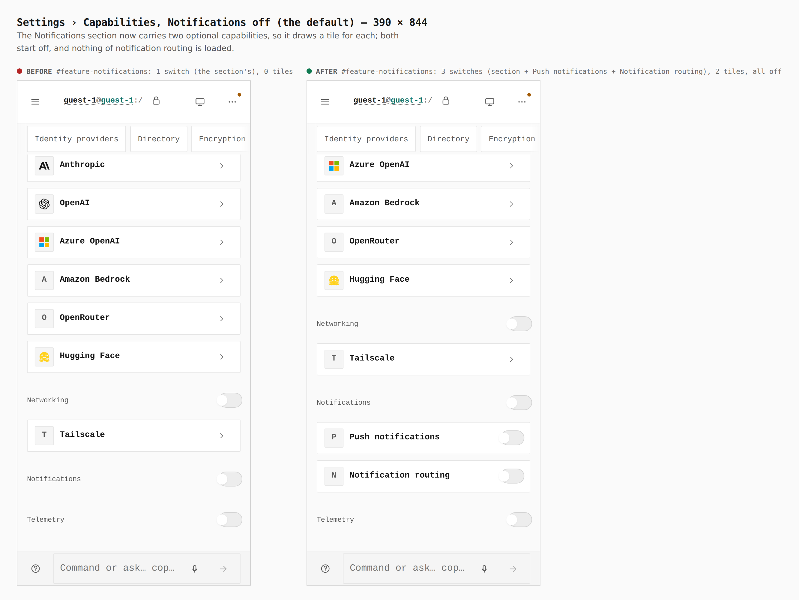

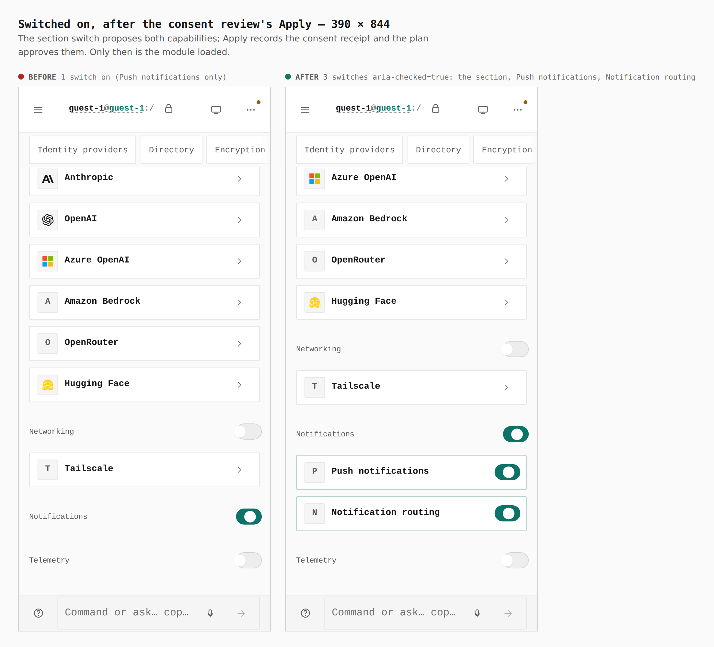

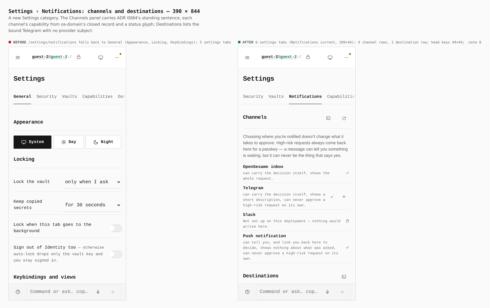

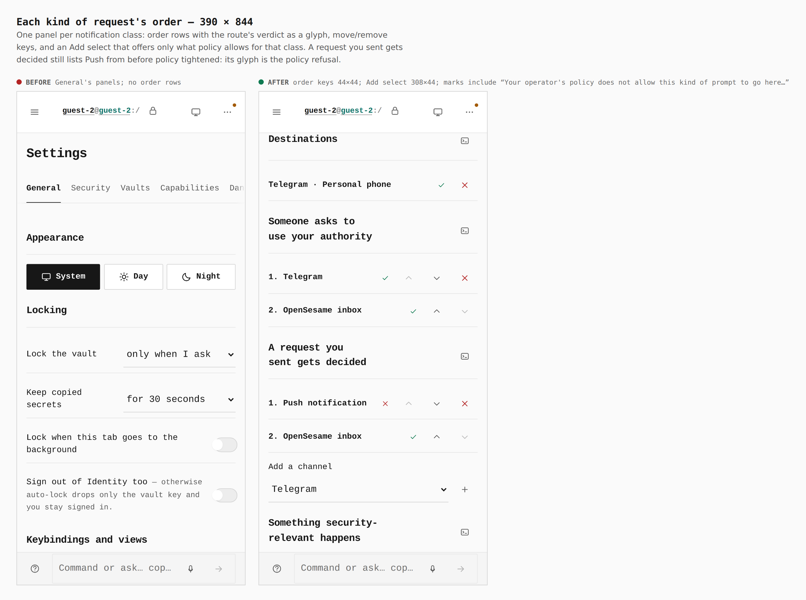

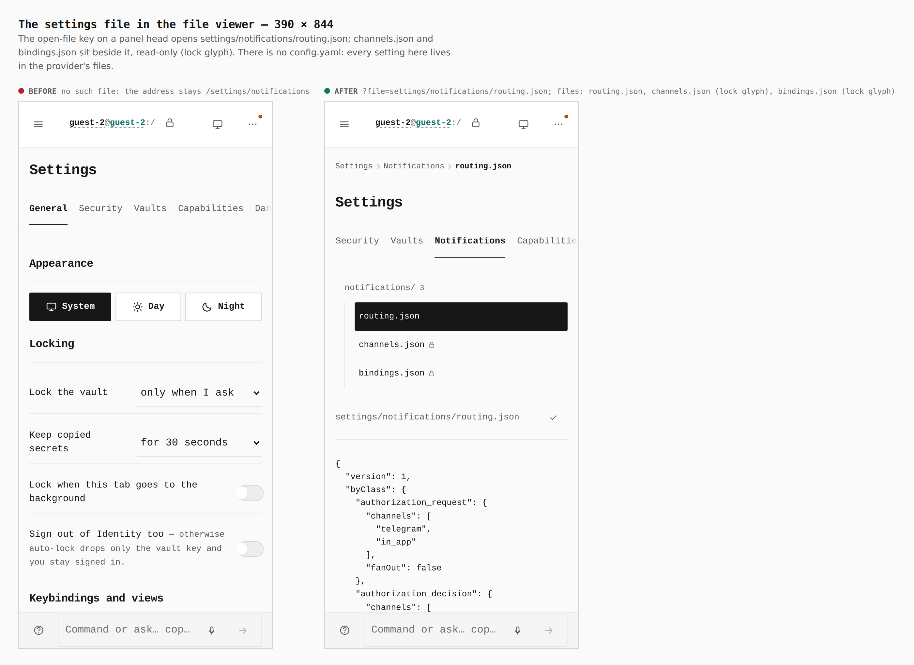

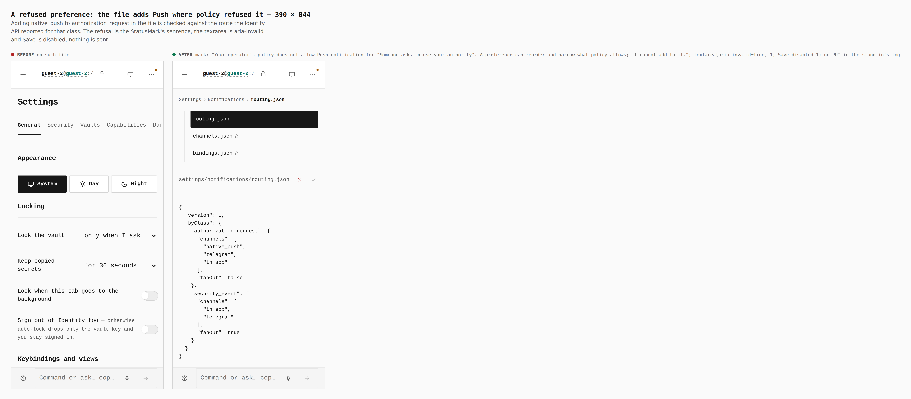

## Desktop

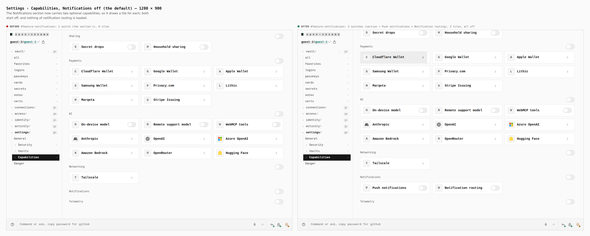

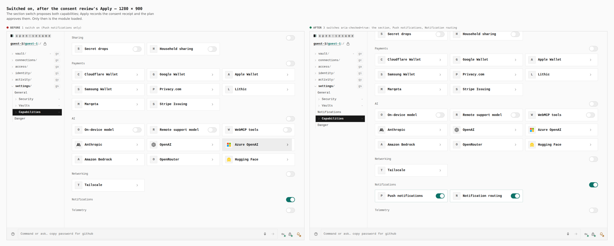

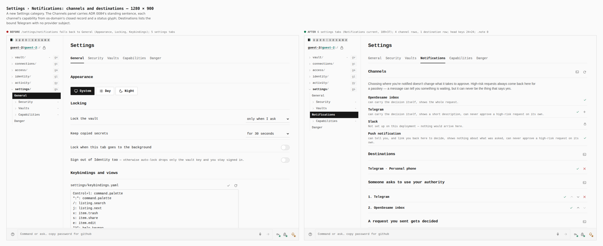

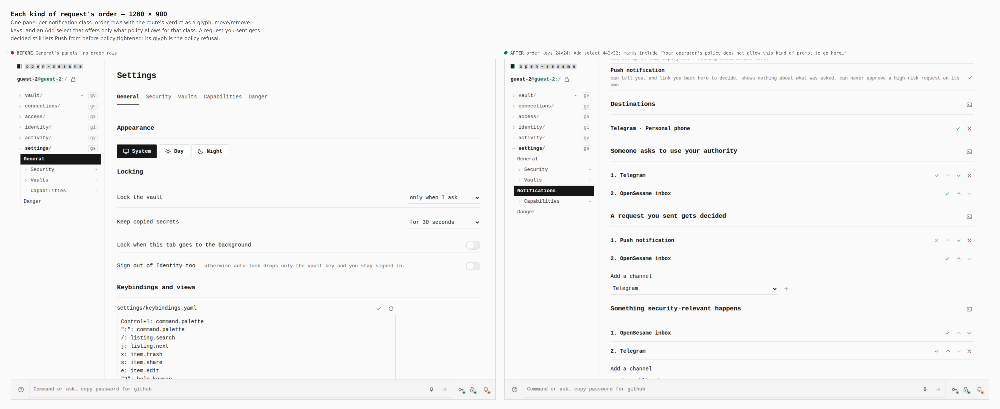

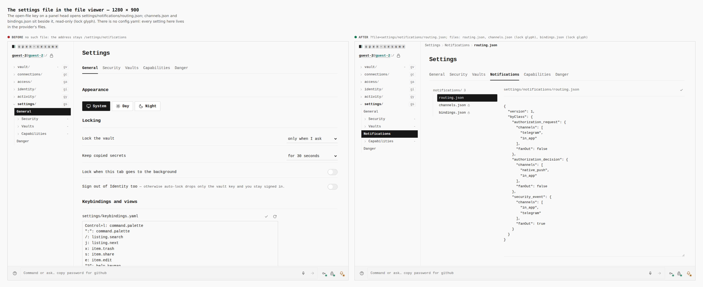

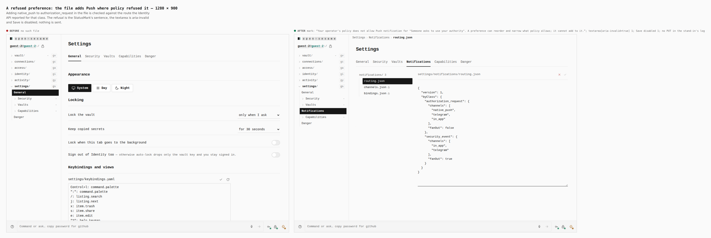

## How

```bash
J=docs/evidence/2026-09-25-notification-routing/journey.json
# before: origin/main (5060ec42) built in its own tree, its dist/ copied to apps/pages/dist
# both builds: dist/os-runtime-config.json = {"identityApi":"https://identity.evidence.example"}
PLAYWRIGHT_CHROMIUM=/opt/pw-browsers/chromium node apps/pages/scripts/capture-evidence.mjs capture before "$J"
VITE_BASE=/OpenSesame/ pnpm exec turbo run build --filter=@opensesame/pages
PLAYWRIGHT_CHROMIUM=/opt/pw-browsers/chromium node apps/pages/scripts/capture-evidence.mjs capture after "$J"
PLAYWRIGHT_CHROMIUM=/opt/pw-browsers/chromium node apps/pages/scripts/capture-evidence.mjs compose "$J"
```

The capture harness gained two verbs for this journey
(`capture-routing-steps.mjs`): `centre` (bring a section to the middle of the
viewport, for one near the end of a long page) and `fillFile` (replace an
open settings file's text by its path; the file's pane shares its name with
its textarea, so a label lookup finds the pane).
