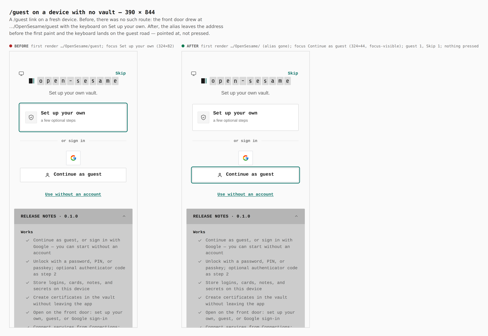
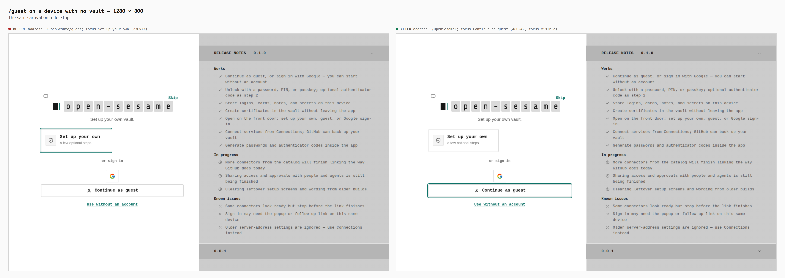
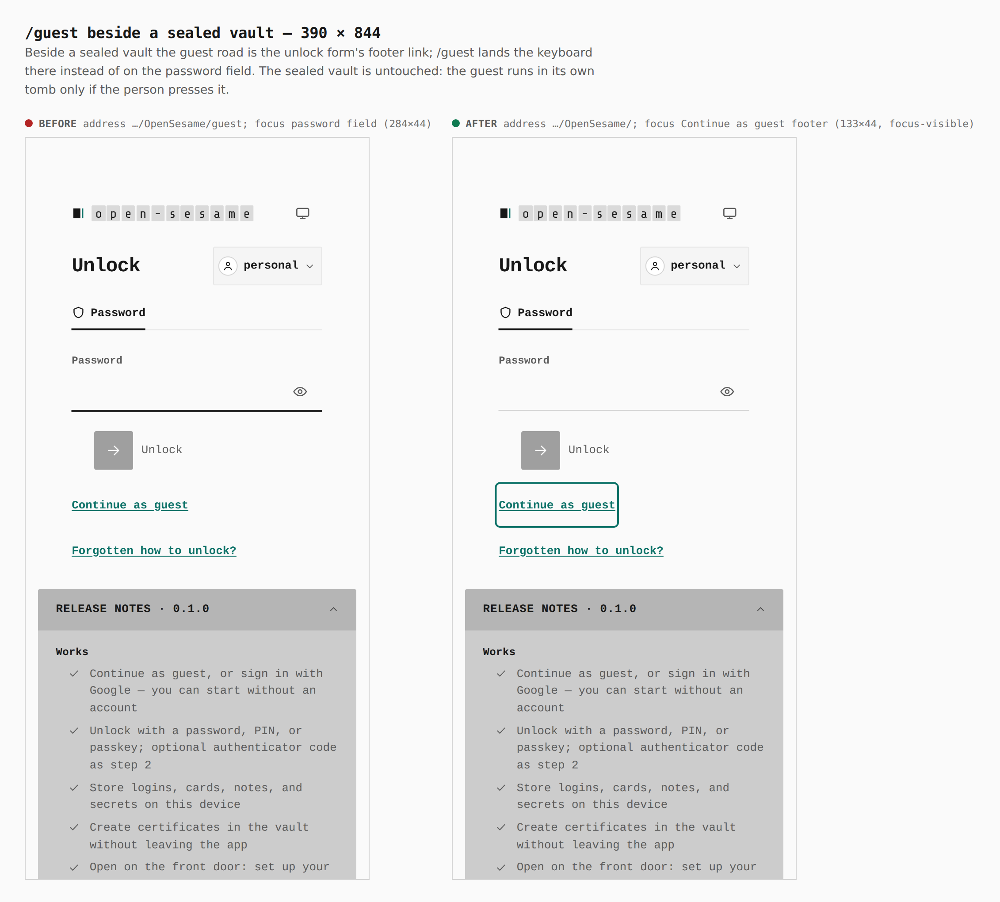
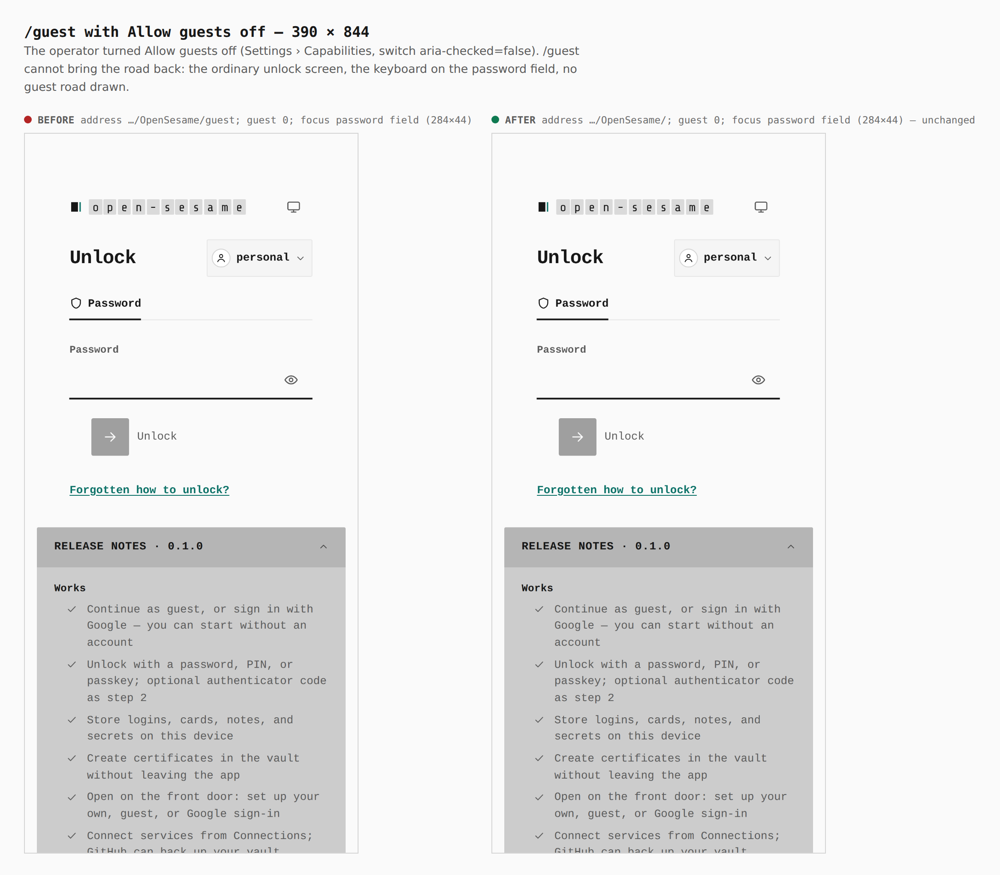
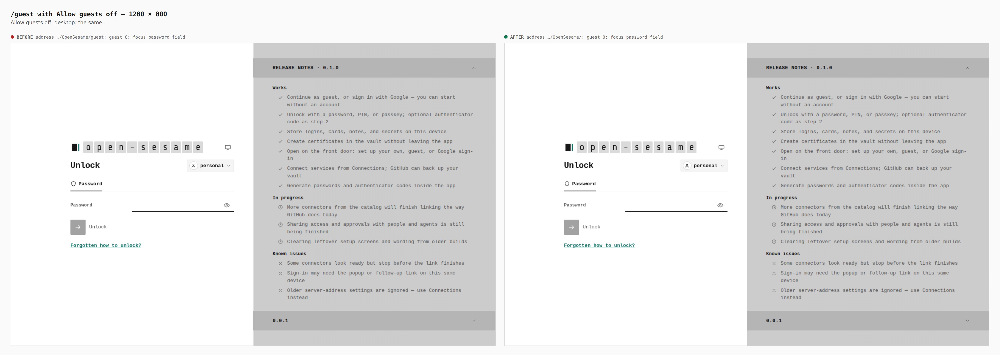
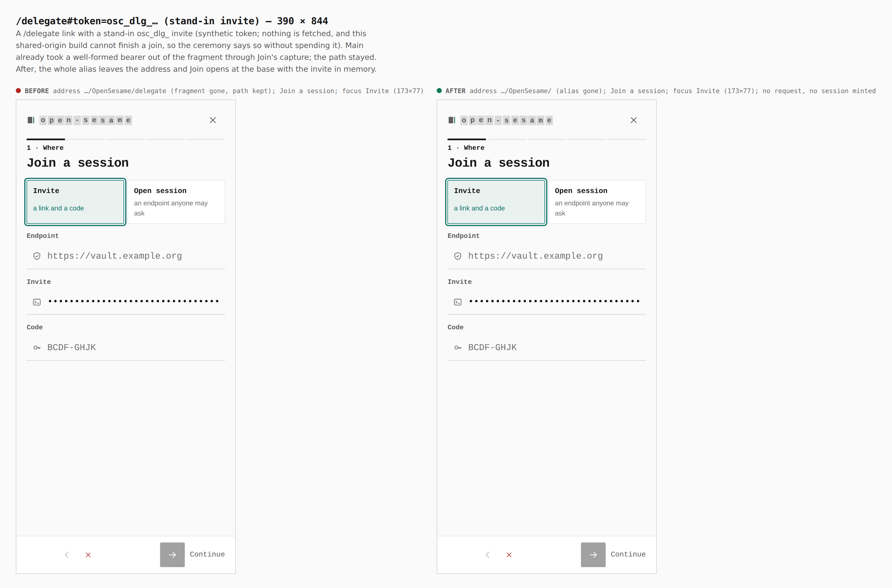
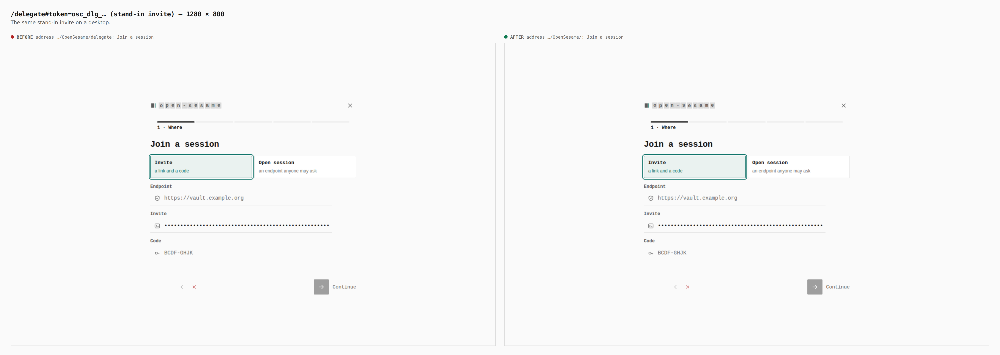
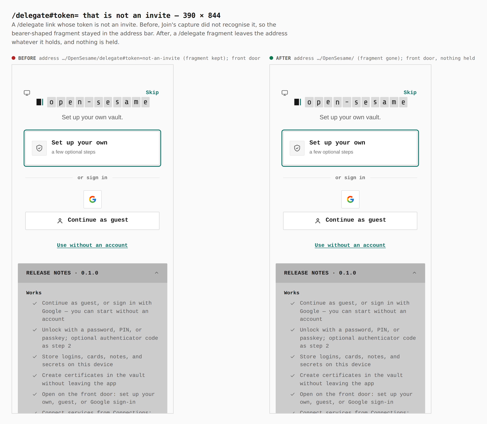

# `/guest` and `/delegate` aliases — before/after

ADR 0140 plan step 13. Two real builds, the same journey
([`journey.json`](journey.json)): **before** is `main` at `cf655749`
(`apps/pages/src` and `packages/app-core/src` checked out from it), **after**
is this branch. Both are `VITE_BASE=/OpenSesame/` builds served at
`https://tyler-r-kendrick.github.io/OpenSesame/` by the static-origin harness,
each arrival a cold load. Every number below was printed by the capture from
the browser (`address`, `first render address`, `focused`, `count`).

## `/guest` on a device with no vault

- before: first render `…/OpenSesame/guest`; focus *Set up your own* (324×82)
- after: first render `…/OpenSesame/`; focus *Continue as guest* (324×44,
  focus-visible); guest 1, Skip 1; nothing pressed

- before: `…/OpenSesame/guest`; focus *Set up your own* (236×77)
- after: `…/OpenSesame/`; focus *Continue as guest* (480×42, focus-visible)

## `/guest` beside a sealed vault

- before: `…/OpenSesame/guest`; focus password field (284×44)
- after: `…/OpenSesame/`; focus the footer's *Continue as guest* (133×44,
  focus-visible). The sealed vault is untouched; nothing was pressed.

## `/guest` with *Allow guests* off

The vault was sealed with a password, then Settings › Capabilities' *Allow
guests* switch was turned off in the UI (`aria-checked="false"`, count 1 on
both builds) before the link was opened.

- before: `…/OpenSesame/guest`; guest roads 0; focus password field (284×44)
- after: `…/OpenSesame/`; guest roads 0; focus password field (284×44) — the
  alias cannot bring the road back

- before: `…/OpenSesame/guest`; guest roads 0; focus password field
- after: `…/OpenSesame/`; guest roads 0; focus password field

## `/delegate#token=osc_dlg_…`

A **stand-in** invite: `osc_dlg_evidence1.` followed by 40 `a`s — the shape
Join accepts, minted by nobody. This shared-origin build cannot finish a join,
so the ceremony says so without spending it; no request leaves the page.

- before: `…/OpenSesame/delegate` — Join's capture already took a well-formed
  bearer out of the fragment on `main`, but the path stayed; *Join a session*
- after: `…/OpenSesame/` — the whole alias left the address before the first
  paint; *Join a session* with the invite in memory; focus *Invite* (173×77)

- before: `…/OpenSesame/delegate`; *Join a session*
- after: `…/OpenSesame/`; *Join a session*

## `/delegate` with a token that is not an invite

- before: `…/OpenSesame/delegate#token=not-an-invite` — the bearer-shaped
  fragment stayed in the address bar
- after: `…/OpenSesame/` — a `/delegate` fragment leaves whatever it holds;
  nothing is held, the front door opens

## What has no picture

The rest of step 13 changes no screen, and was verified by tests instead:

- the Identity API's claim `verificationUri` (`<OPENSESAME_CLIENT_APP_URL>/claim`,
  or the zero-JS `/v1/claims/<id>/verify` fallback) and the `/i/<ref>`
  launcher — `packages/control-plane/src/__tests__/claim-link-origin.test.ts`,
  `src/interactions/ceremony-routes.test.ts`;
- CORS (`ceremonies-cors.test.ts`: the Pages origin only), `.env.schema`,
  `pages-dev.sh`, the root `dev` script, the visual contract's port;
- a drop link is always this deployment's `/claim`
  (`local-drop-claims.test.ts`, `drop.test.ts`).
