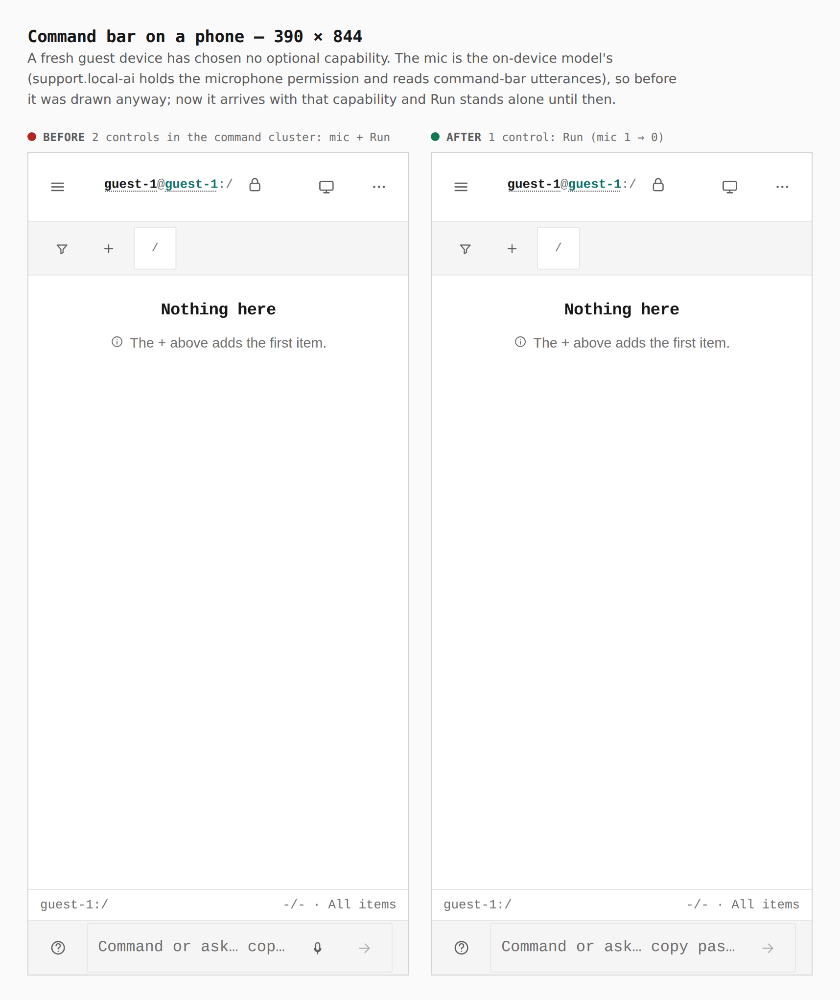
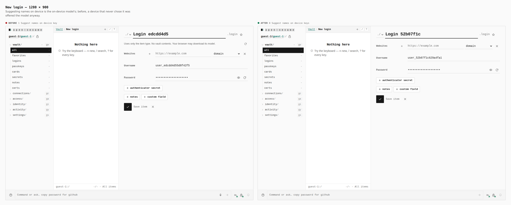
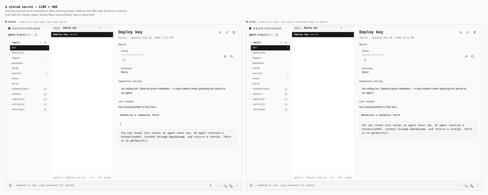

# Capability isolation: controls arrive with their capability (ADR 0130)

A fresh guest device has chosen no optional capability. Before this change,
three controls from optional capabilities were drawn on it anyway, because
core screens imported their code directly — the same imports that made every
hardened build emit modules its profile excluded (BUILD-07). They now arrive
as their capabilities' contributions, so they appear once the capability is
chosen and not before.

Before is `4ec3f3b3`, the head of the branch this one stacks on. Both builds
were walked the same way by `apps/pages/scripts/capture-evidence.mjs`
([`journey.json`](journey.json)) as a guest on the static build, counts taken
in the browser.

## Command bar on a phone — 390 × 844

`2 controls: mic + Run` → `1 control: Run (mic 1 → 0)`

The mic is `support.local-ai`'s: its descriptor holds the `microphone`
permission and "interprets command-bar utterances". The bar still reads a
command with its own parser, and hands a question to Support.

## New login — 1280 × 900

`1 Suggest names on device key` → `0`

## A stored secret — 1280 × 900

`1 Share once key` → `0`; the secret saves and draws as before.

Sharing a secret once is sending a drop, `sharing.drops`'s. A device without
drops already had no drop kind in its New menu.

## What the images cannot show

| Evidence | Where |
| --- | --- |
| All eight profile builds pass the capability graph from disk; the three hardened builds emit none of their excluded modules | `node apps/pages/scripts/build-profile.mjs --all`, recorded as `run-profile-matrix` in [`../capability-composition/contract-test-matrix.json`](../capability-composition/contract-test-matrix.json) |
| Each control is drawn once its capability is on | `apps/pages/src/sections/vault/item-contributions.test.tsx`, `modules/*/runtime.test.tsx` |
| The WebMCP surface exposes only tools whose operations the plan approves | `apps/pages/src/modules/agents.webmcp/surface.test.ts` |
