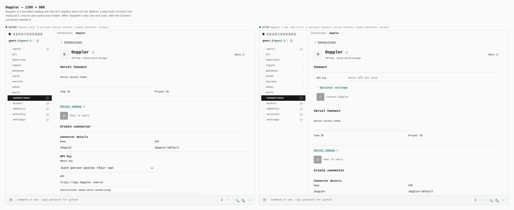
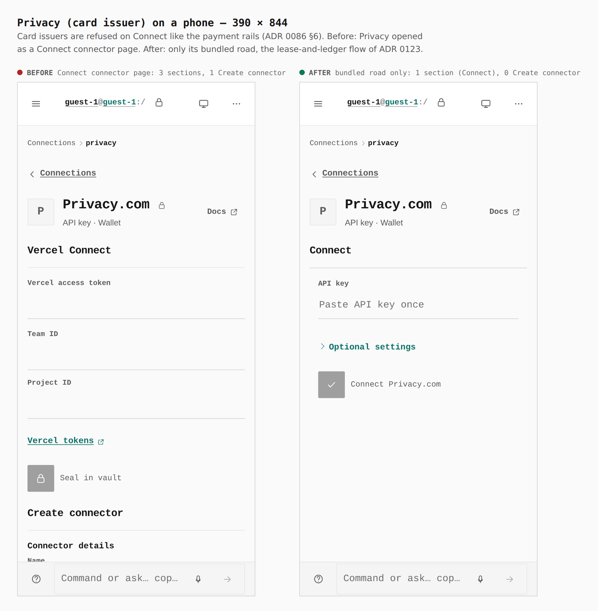

# Connections: which rows Connect owns (ADR 0146)

The connector plans cover every row of the integration catalog, and the
previous head (`c67940e5`) let a plan replace any row it matched: bundled rows
Vercel's registry does not list lost their own panel, and the card issuers
opened as Connect connector pages. Connect now owns a row only when Vercel's
registry lists it, when it is a git forge, or when Pages bundles no row of its
own. Card issuers are refused on Connect.

Before is `c67940e5`, this pull request's previous head, not `main`: `main`
has no connector pages of this kind. Both builds were walked the same way by
`apps/pages/scripts/capture-evidence.mjs` ([`journey.json`](journey.json)) as a
guest on the static build. The numbers are counted in the browser.

## Doppler — 1280 × 900

`3 sections: Vercel Connect, Create connector, Access` →
`4 sections: Connect, Vercel Connect, Create connector, Access`

Doppler's own API-key road is back, and the Connect connector sits beside it.

## Privacy (card issuer) on a phone — 390 × 844

`3 sections, 1 Create connector` → `1 section (Connect), 0 Create connector`

Payment authorization is in scope; card issuing goes through the bundled row's
leases and conserved ledger (ADR 0123), never a Connect connector (ADR 0086
§6).

## What the images cannot show

| Evidence | Where |
| --- | --- |
| Doppler and Hugging Face keep their bundled rows; Discord and Groq, bundled nowhere, are listed from their plans; the four card issuers are refused on Connect | `packages/app-core/src/lib/vercel-connect-catalog.test.ts` |
| 220 paths across 185 services end in a person's token the service's verify call accepts (the four card-issuer API-key paths are gone) | [`../2026-09-25-connect-connectors/conformance.json`](../2026-09-25-connect-connectors/conformance.json) |
