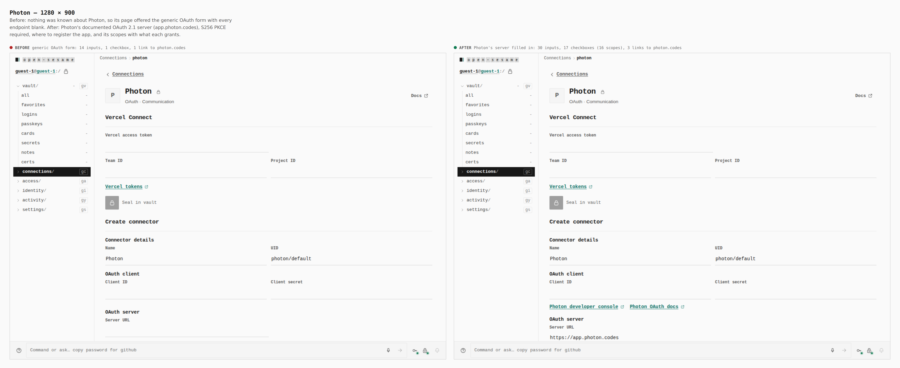
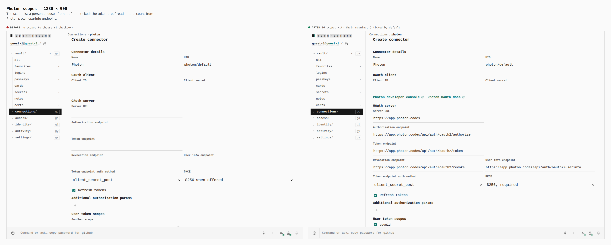
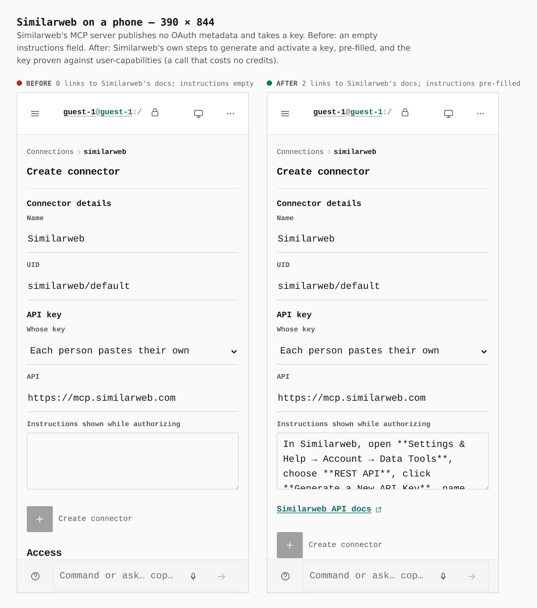

# Connections: Photon and Similarweb presets (ADR 0146)

These two connectors were the last conformance paths that reached a token
without the service confirming it: nothing was known about Photon's OAuth
server, and Similarweb's MCP server publishes no OAuth metadata and takes a
key. With both presets in `spec/connectors/connect-presets.json`, every
conformance path (224 across 189 services) ends in a token the service's own
verify call accepts.

Before is this pull request's previous head (`ae30640a`), not `main`: `main`
has no connector pages of this kind, and the change shown is these two
presets. Both builds were walked the same way by
`apps/pages/scripts/capture-evidence.mjs` ([`journey.json`](journey.json)) as a
guest on the static build. The numbers are counted in the browser.

## Photon — 1280 × 900

`generic OAuth form: 14 inputs, 1 checkbox, 1 link to photon.codes` →
`30 inputs, 17 checkboxes (16 scopes), 3 links to photon.codes`

Photon documents an OAuth 2.1 server at `app.photon.codes/api/auth/oauth2`:
apps are registered by hand in the dashboard (Developer → Apps), S256 PKCE is
required for every client, and `offline_access` issues rotating refresh
tokens. The page now opens with that server, a link to register the app,
and its scopes.

## Photon scopes — 1280 × 900

`no scopes to choose` → `16 scopes with their meaning, 5 ticked by default`

## Similarweb on a phone — 390 × 844

`0 links to Similarweb's docs; instructions empty` →
`2 links to Similarweb's docs; instructions pre-filled`

The instructions each person sees while authorizing are Similarweb's own
steps to generate and activate a key. The relay proves the key against
`GET api.similarweb.com/user-capabilities`, which costs no data credits.

## What the images cannot show

| Evidence | Where |
| --- | --- |
| Photon and Similarweb each end in a person's token accepted by the service's verify call (Photon's `userinfo`; Similarweb's `user-capabilities`), with the rest of the 224 paths | [`../2026-09-25-connect-connectors/conformance.json`](../2026-09-25-connect-connectors/conformance.json) |
| Photon's authorize endpoint and Similarweb's verify endpoint answer live, read-only | [`../2026-09-25-connect-connectors/live-preflight.json`](../2026-09-25-connect-connectors/live-preflight.json) |
