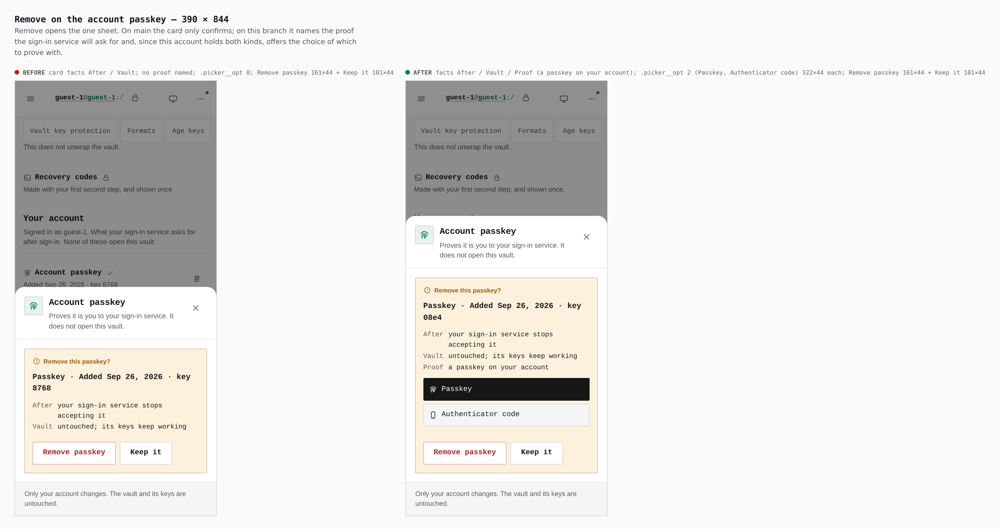
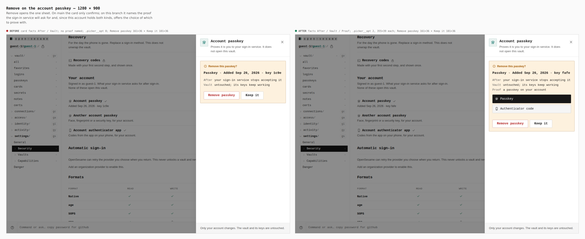
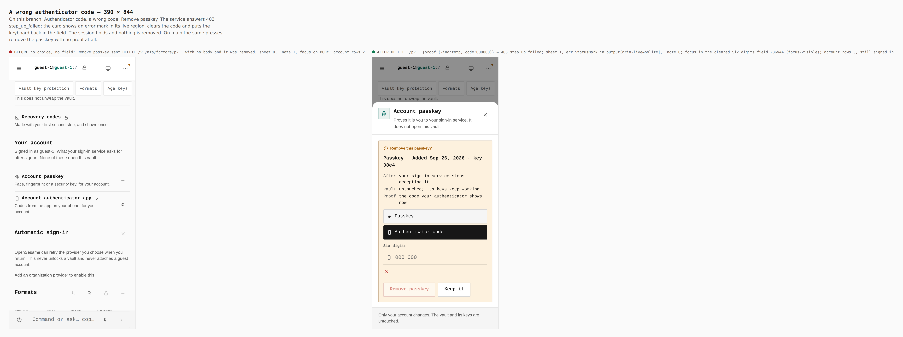
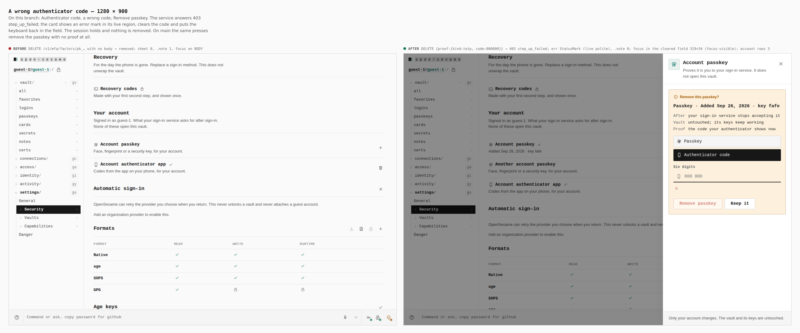
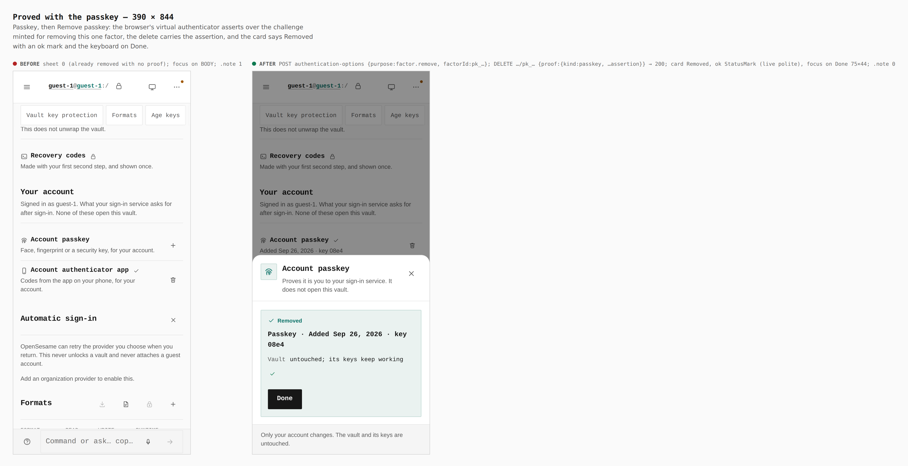
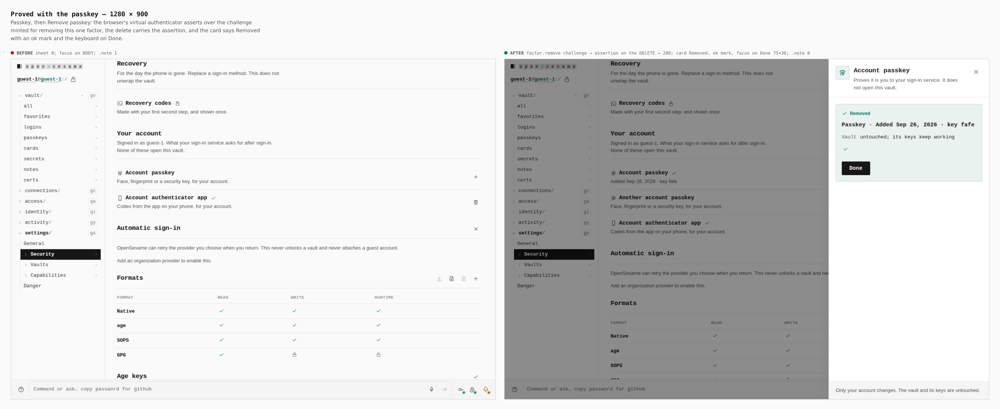
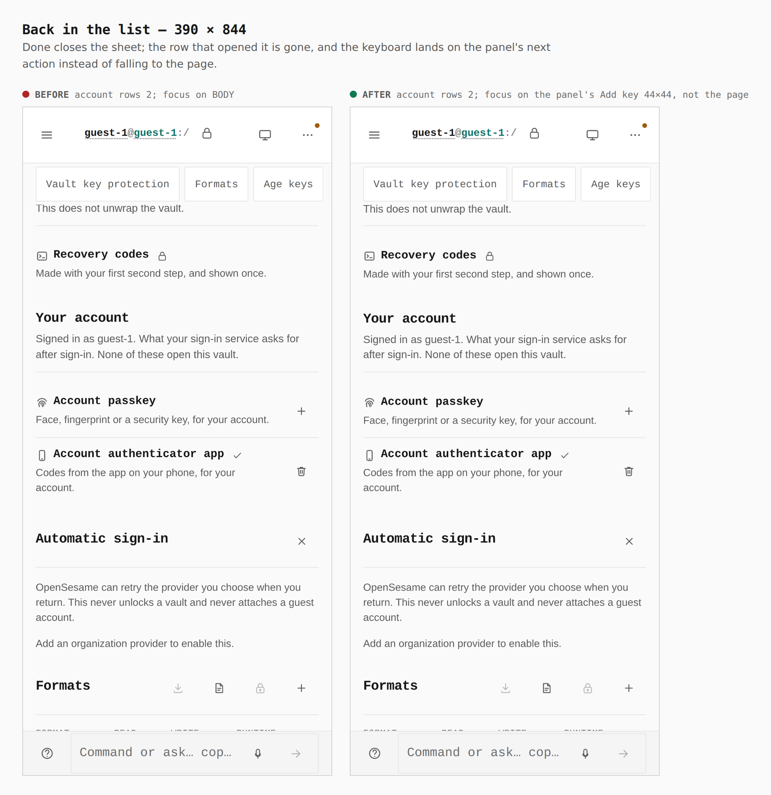
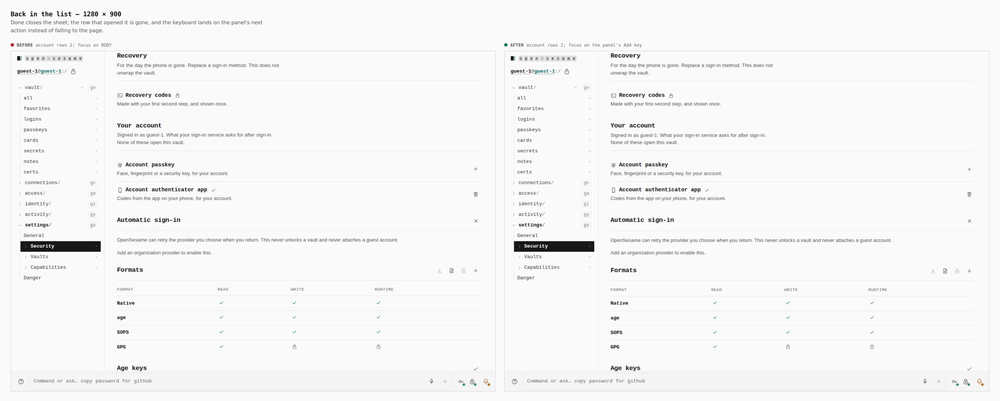
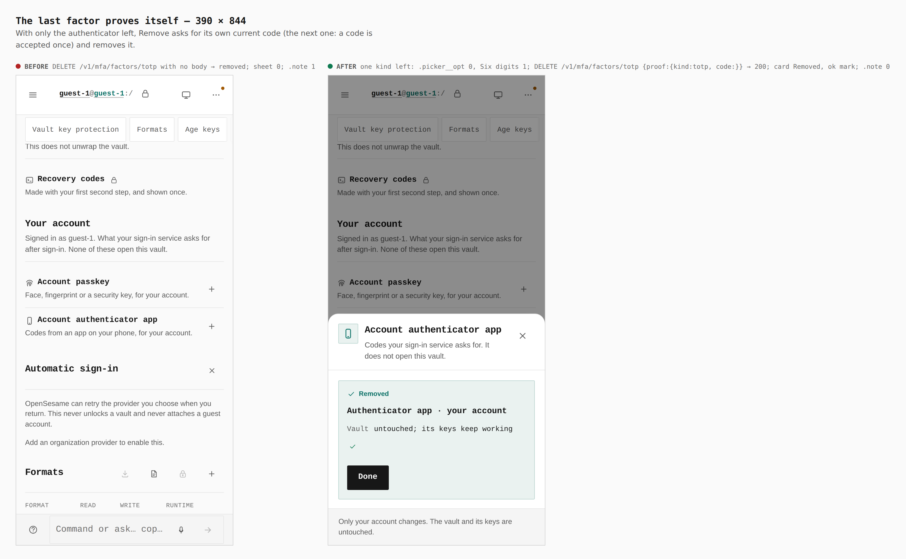

# Removing an account factor takes a step-up (ADR 0146)

Before/after from two real Pages builds (`VITE_BASE=/OpenSesame/`), walked
with the same steps: `origin/main` at `c68753bd` (its `apps/pages/src` and
`packages/app-core/src` checked out in place and built) for "before", and
this branch for "after". Phone 390×844 (touch context) and desktop 1280×900
(mouse). Every number below was printed by the capture run (`report`,
`count`, `measure`, `focused`, `sheetMarks`), not written from the diff.

**The Identity API was a stand-in.** This environment has none. Both builds
were served with `os-runtime-config.json` naming
`https://identity.evidence.example`
(`PAGES_IDENTITY_API=… node apps/pages/scripts/write-runtime-config.mjs`), and
`apps/pages/scripts/lib/capture-factor-steps.mjs` answered there. For this
change it verifies a removal's proof the way the Identity API now does: a
code must be the seed's current RFC 6238 code and a step is accepted once
(shared with `/totp/verify`); an assertion must be a `webauthn.get` over the
challenge minted by `authentication-options` with
`{purpose: "factor.remove", factorId}` for that one factor, spent once; a
wrong proof is `403 step_up_failed`. A delete with no proof at all is
answered as the service before ADR 0146 answered it (removed), so the base
build walks the base's own flow. The server's own refusal of a proofless
delete is proven by `packages/control-plane/src/__tests__/mfa-factor-step-up*.security.test.ts`,
not by these images. Passkeys were made and asserted by a virtual WebAuthn
authenticator over CDP (ctap2/internal, user-verifying).

The journey (`journey.json`), per width, on one fresh profile: guest →
Settings › Security → add an account passkey and the authenticator app →
Remove on the passkey → *Authenticator code* → a wrong code → Remove passkey
→ *Passkey* → Remove passkey → Done → Remove on the authenticator app → its
next code → Remove authenticator.

Requests the branch sent, as recorded (assertion elided):

- `DELETE /v1/mfa/factors/pk_<32 hex> {"proof":{"kind":"totp","code":"000000"}}` → 403
- `POST /v1/mfa/passkey/authentication-options {"purpose":"factor.remove","factorId":"pk_<32 hex>"}`
- `DELETE /v1/mfa/factors/pk_<32 hex> {"proof":{"kind":"passkey","credentialId":…,"clientDataJSON":…,"authenticatorData":…,"signature":…}}` → 200
- `DELETE /v1/mfa/factors/totp {"proof":{"kind":"totp","code":"……"}}` → 200

The base sent `DELETE /v1/mfa/factors/pk_<32 hex>` and `DELETE /v1/mfa/factors/totp`
with no body at all.

## 1. Remove on the account passkey

- before: facts After / Vault; no proof named; `.picker__opt` 0
- after: facts After / Vault / **Proof** (a passkey on your account);
  `.picker__opt` 2 (Passkey, Authenticator code), 322×44 each at 390,
  355×39 at 1280; the Security list itself is unchanged (one row, one action)

## 2. A wrong authenticator code

- before: no choice and no field; the same presses sent a proofless DELETE
  and the passkey was gone; sheet 0, a `.note` box 1, focus on `BODY`
- after: `403 step_up_failed`; the sheet stays; an error `StatusMark` in
  `output[aria-live=polite]` ("Your sign-in service did not accept that
  proof. Nothing was removed."); `.note` 0; focus in the cleared *Six digits*
  field (286×44 at 390, focus-visible); account rows still 3 — still signed in

## 3. Proved with the passkey

- before: nothing left to do (already removed); focus on `BODY`
- after: a `factor.remove` challenge, the assertion on the DELETE → 200; card
  *Removed* with an ok `StatusMark` (live polite); focus on Done (75×44 at
  390, 75×36 at 1280); `.note` 0

## 4. Back in the list

- before: account rows 2; focus on `BODY`
- after: account rows 2; focus on the panel's next action (the passkey row's
  Add key), not the page

## 5. The last factor proves itself

- before: proofless `DELETE /v1/mfa/factors/totp` → removed; `.note` 1
- after: one kind left, so no choice (`.picker__opt` 0) and the field (1);
  the authenticator's next code (a step is accepted once) → 200; card
  *Removed*, ok mark; `.note` 0

