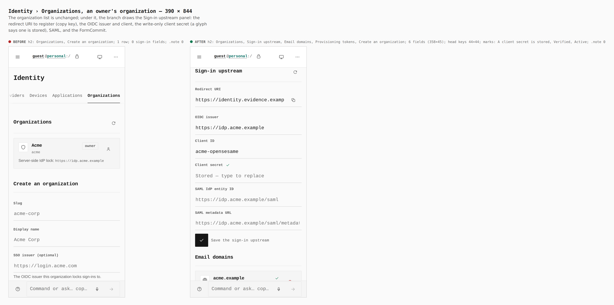
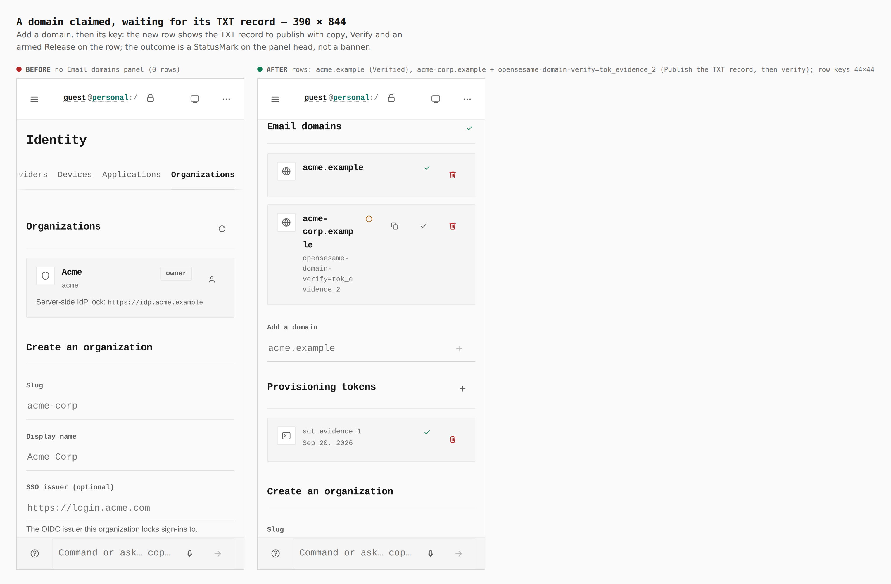
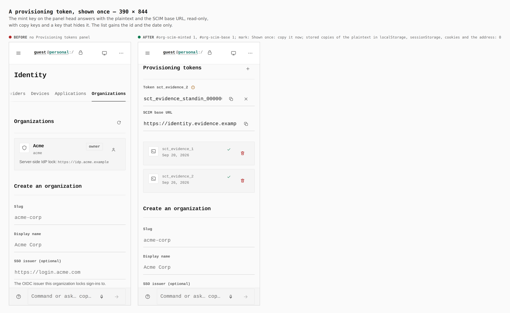
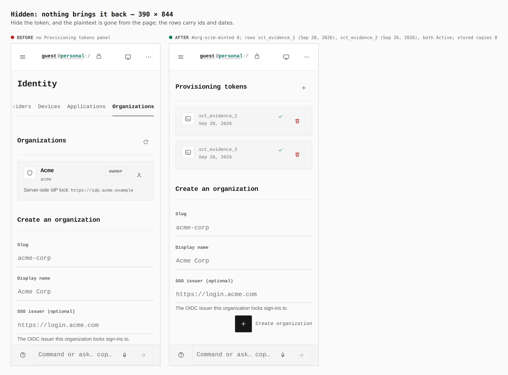
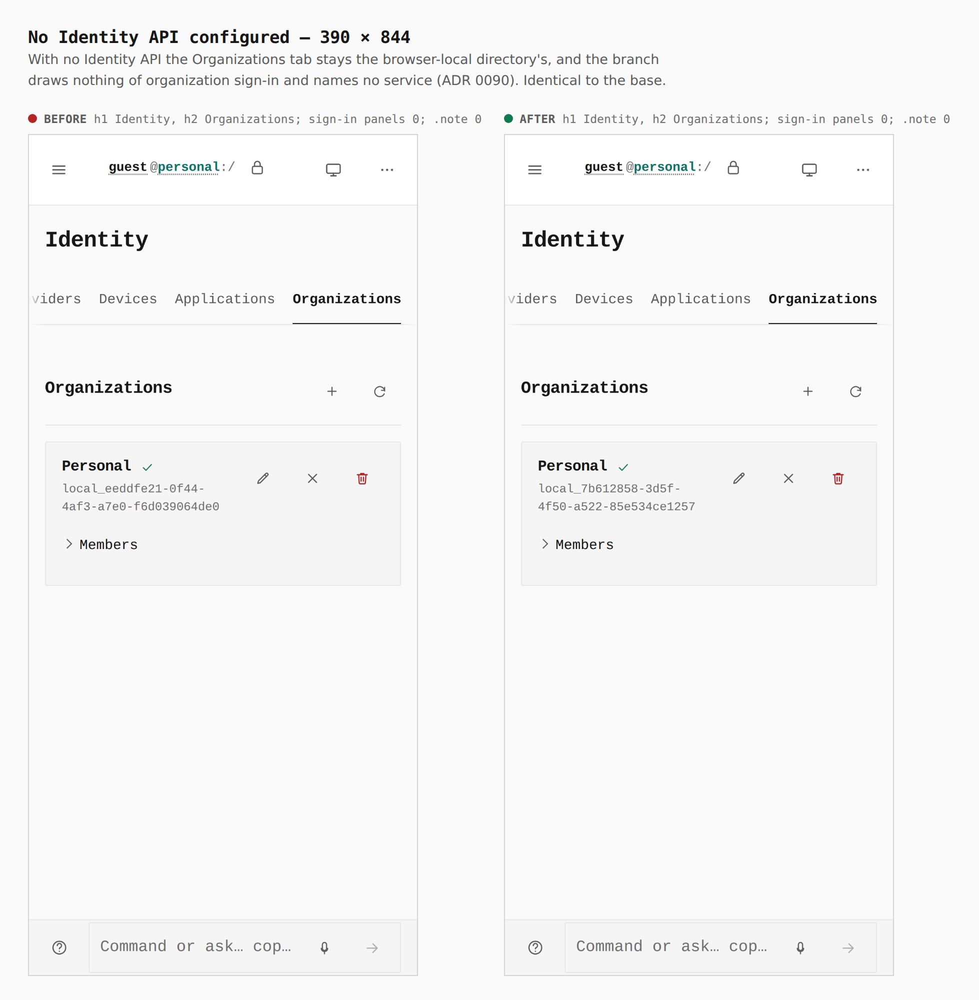
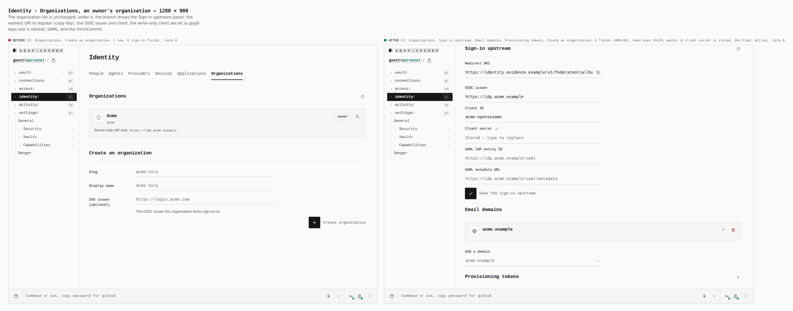
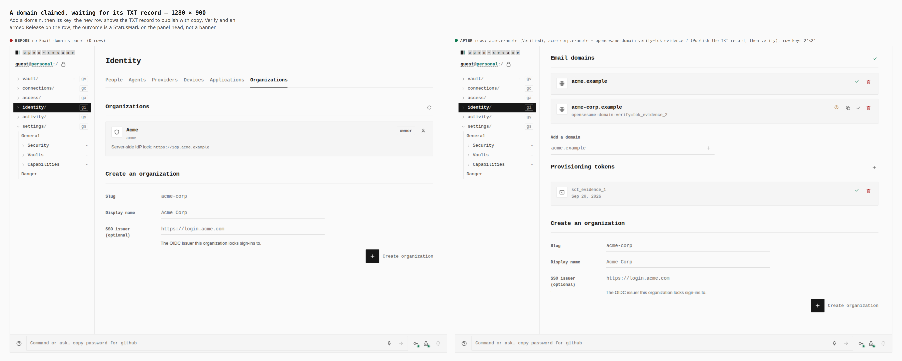
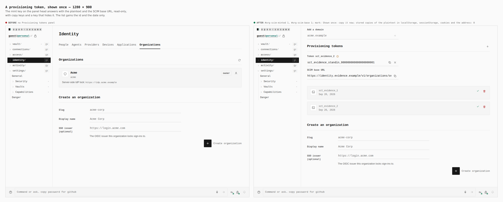
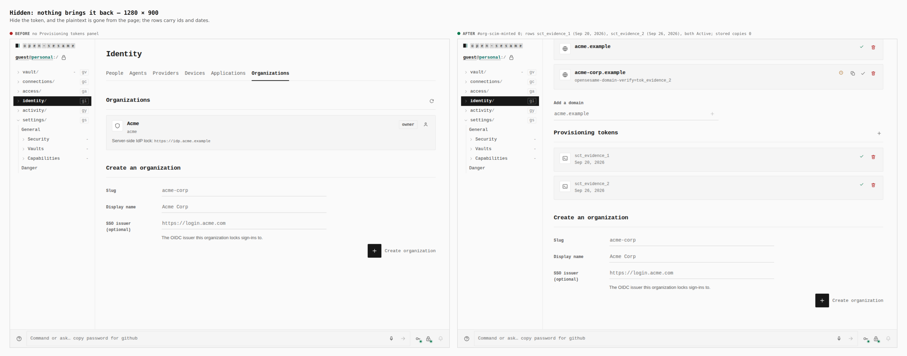
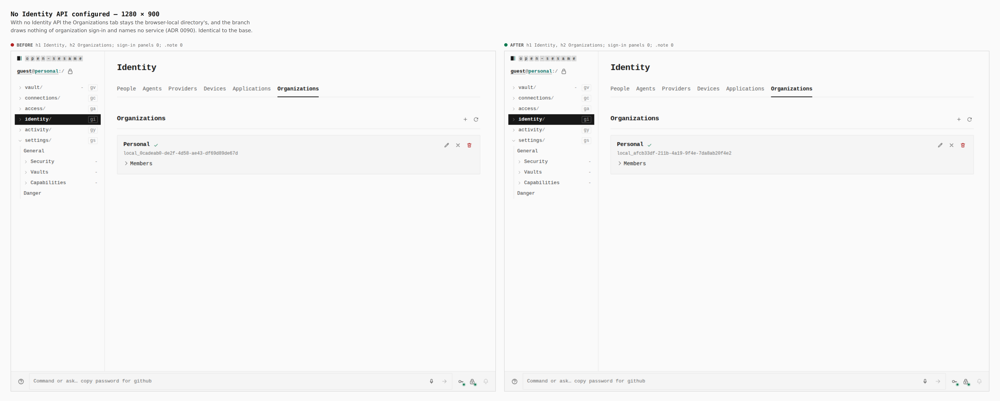

# Organization sign-in in Identity › Organizations (ADR 0140 plan step 12)

Before/after from two real Pages builds (`VITE_BASE=/OpenSesame/`), walked
with the same steps: `origin/main` at `2ff5b72d`, built in a separate copy of
that tree (`git archive origin/main`, its own `pnpm install` and
`turbo run build`) with its `dist/` put in place for the "before" capture;
and this branch's final build. Phone 390×844 (touch context) and desktop
1280×900 (mouse). Every number below was printed by the capture run
(`report`, `count`, `marks`, `measure`, `storedCopies`), not written from the
diff.

**The Identity API was a stand-in.** This environment has none. For
`journey.json` both builds were served with the same `os-runtime-config.json`
naming `https://identity.evidence.example`, and
`apps/pages/scripts/lib/capture-ceremony-steps.mjs` with
`capture-org-signin-steps.mjs` answered there: `GET /v1/principals/me` → 401,
`POST /v1/principals/provisional`, `GET /v1/organizations` (one organization,
Acme, which the session owns, with an OIDC issuer and client and a stored
secret), `GET|POST /v1/organizations/org_evidence/domains`, `…/domains/{d}/verify`,
`DELETE …/domains/{d}`, `GET|POST …/scim/tokens` and `DELETE …/scim/tokens/{id}`;
everything else is a 404. The minted token is the stand-in's
(`sct_evidence_standin_…`), good for nothing. The page, the capability plan
and consent, the module load and every request are the real builds'.
`journey-no-identity.json` is the same walk with `os-runtime-config.json` set
to `{}` and no stand-in.

The journey, per width, on one fresh profile: seal a password vault (a guest
vault keeps Identity browser-local, so the organization panel needs a sealed
one) → Settings › Capabilities → the Directory section's switch → Apply →
`/identity?view=organization` → Connect (a provisional principal) → type
`acme-corp.example` in *Add a domain* → its key → the mint key on
*Provisioning tokens* → *Hide the token*.

Requests the branch sent, as recorded: `POST /v1/principals/provisional {}`,
`GET /v1/organizations` twice (the section's list, then the panels' read of
the same list with each organization's upstream), `GET …/domains`,
`GET …/scim/tokens`, `POST …/domains {"domain":"acme-corp.example"}`,
`POST …/scim/tokens`. The base build sent `GET /v1/organizations` once and
nothing after it.

## Measured pairs

| Shot | Before (`origin/main`) | After (this branch) |
|---|---|---|
| Organizations | h2 Organizations, Create an organization; 1 row; no sign-in fields | h2 Organizations, **Sign-in upstream, Email domains, Provisioning tokens**, Create an organization; 6 fields (358×45 phone, 480×36 desktop), head keys 44×44 phone / 24×24 desktop, FormCommit 44×44 / 40×40; marks *A client secret is stored*, *Verified*, *Active*; `.note` 0 |
| Domain claimed | nothing to claim with | rows acme.example (*Verified*) and acme-corp.example with `opensesame-domain-verify=tok_evidence_2` (*Publish the TXT record, then verify*); copy, Verify and Release keys on the row, 44×44 phone / 24×24 desktop; head mark *Publish the TXT record for acme-corp.example, then verify it.* |
| Token minted | no tokens panel | `#org-scim-minted` 1, `#org-scim-base` 1, mark *Shown once: copy it now*; copies of the plaintext in localStorage, sessionStorage, cookies and the address: **0** |
| Token hidden | no tokens panel | `#org-scim-minted` 0; rows sct_evidence_1 (Sep 20, 2026) and sct_evidence_2 (Sep 26, 2026), both *Active*; stored copies 0 |
| No Identity API | h1 Identity, h2 Organizations (the browser-local directory); `.note` 0 | identical: sign-in panels 0, `.note` 0, no request to any Identity API |

## Phone











## Desktop











## How

```bash
J=docs/evidence/2026-09-26-org-signin/journey.json
N=docs/evidence/2026-09-26-org-signin/journey-no-identity.json
# before: origin/main (2ff5b72d) built in its own tree, its dist/ copied to apps/pages/dist
# journey.json: dist/os-runtime-config.json = {"identityApi":"https://identity.evidence.example"}
# journey-no-identity.json: dist/os-runtime-config.json = {}
PLAYWRIGHT_CHROMIUM=/opt/pw-browsers/chromium node apps/pages/scripts/capture-evidence.mjs capture before "$J"
PLAYWRIGHT_CHROMIUM=/opt/pw-browsers/chromium node apps/pages/scripts/capture-evidence.mjs capture before "$N"
VITE_BASE=/OpenSesame/ pnpm exec turbo run build --filter=@opensesame/pages
PLAYWRIGHT_CHROMIUM=/opt/pw-browsers/chromium node apps/pages/scripts/capture-evidence.mjs capture after "$J"
PLAYWRIGHT_CHROMIUM=/opt/pw-browsers/chromium node apps/pages/scripts/capture-evidence.mjs capture after "$N"
PLAYWRIGHT_CHROMIUM=/opt/pw-browsers/chromium node apps/pages/scripts/capture-evidence.mjs compose "$J"
PLAYWRIGHT_CHROMIUM=/opt/pw-browsers/chromium node apps/pages/scripts/capture-evidence.mjs compose "$N"
```

The capture harness gained the organization half of the stand-in and one
verb (`capture-org-signin-steps.mjs`): `storedCopies` prints how many of
localStorage, sessionStorage, cookies and the address hold a given text.
