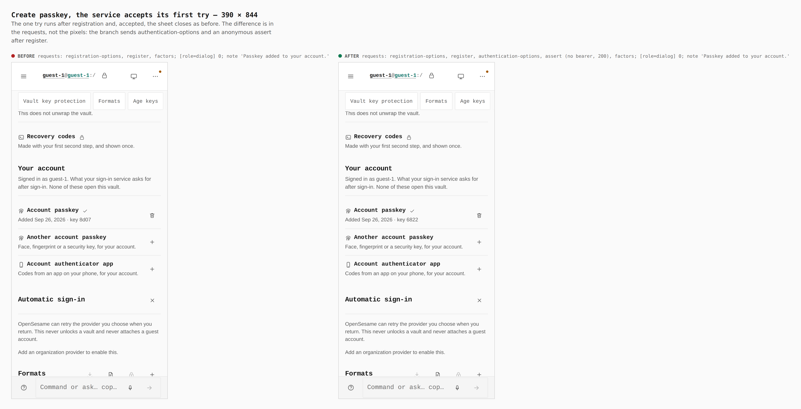
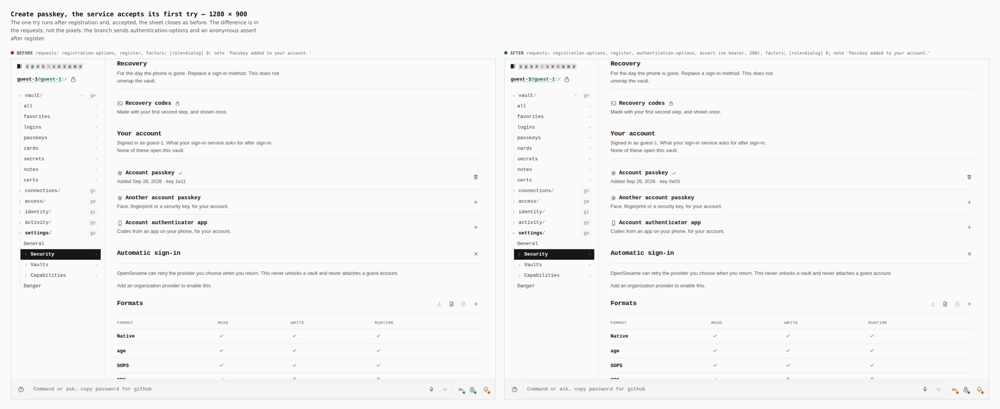
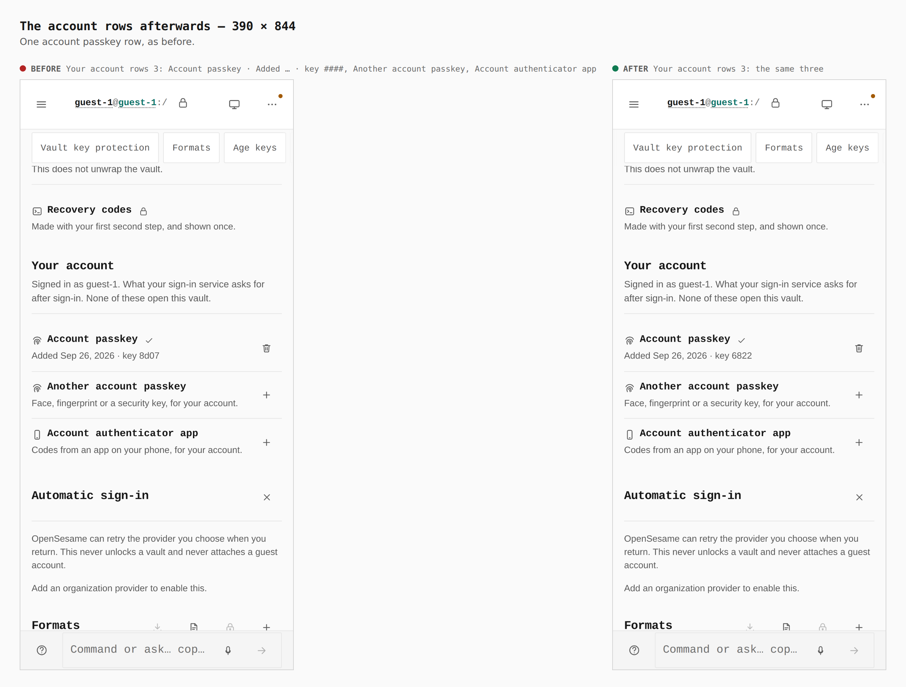
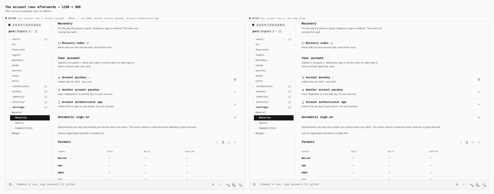
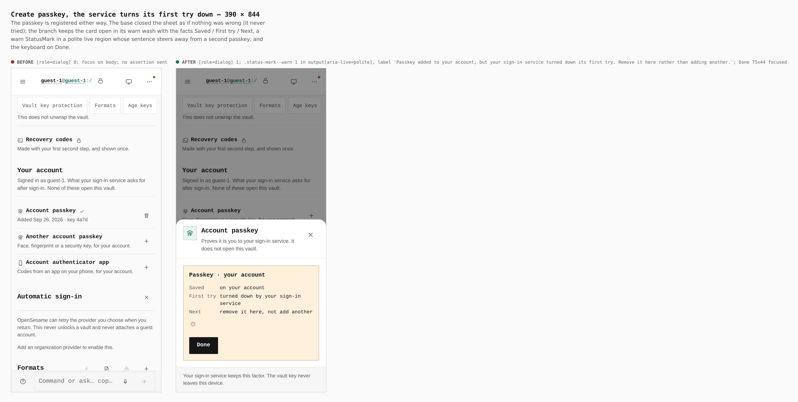
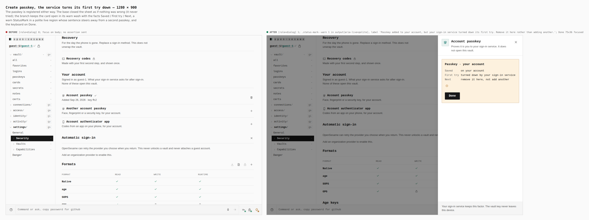
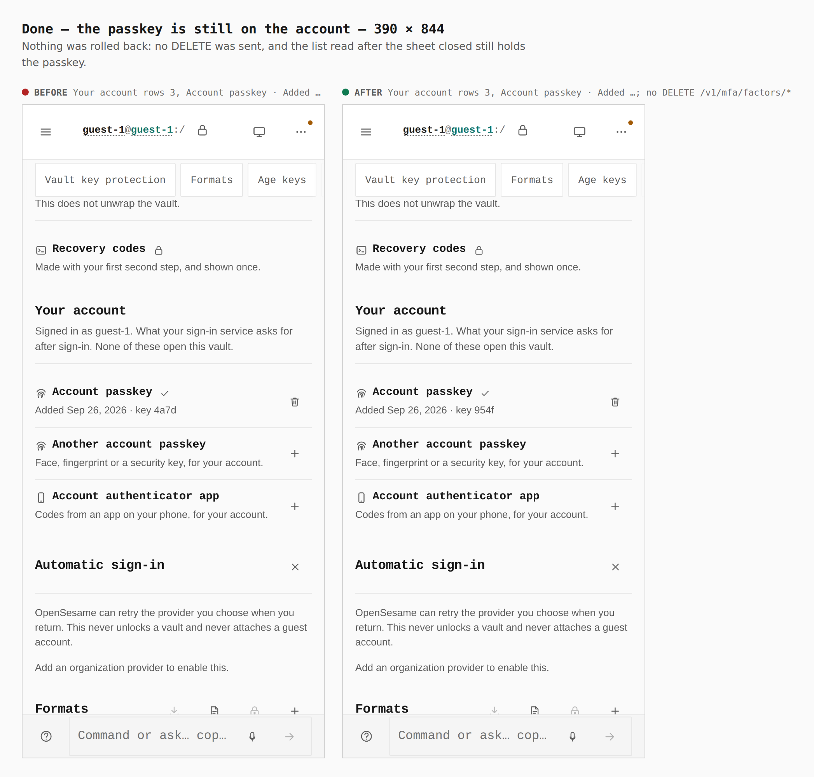
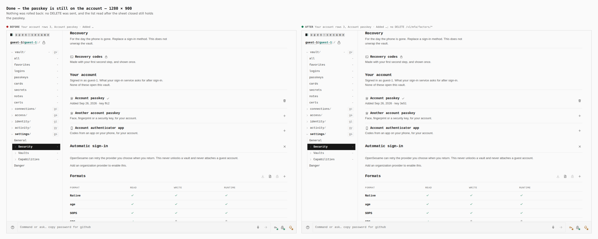

# A new account passkey is tried once (ADR 0140 plan step 11c)

Before/after from two real Pages builds (`VITE_BASE=/OpenSesame/`), walked
the same way:

- **Before:** `origin/main` at `bad8b555`, built in a separate worktree, with
  its `dist/` served.
- **After:** this branch, from its own build.

Both were captured at phone 390×844 (a touch context) and desktop 1280×900
(a mouse). Every number below was printed by the capture run (`count`,
`measure`, `sheetMarks`, `focused`, `report`). None was written from the
diff.

**The Identity API was a stand-in.** This environment has none. Both builds
were served with `os-runtime-config.json` naming
`https://identity.evidence.example`
(`PAGES_IDENTITY_API=… node apps/pages/scripts/write-runtime-config.mjs`).
`apps/pages/scripts/lib/capture-factor-steps.mjs` answered there, as it did
for step 11b. It now also answers the two routes of the one try:

- `POST /v1/mfa/passkey/authentication-options` gives a fresh challenge,
  with `allowCredentials` set to the credential that was just registered.
- `POST /v1/mfa/passkey/assert` is accepted only when the browser's
  `clientDataJSON` is a `webauthn.get` over that challenge.
- `journey-unverified.json` sets `"passkeyAssert": "refuse"`. The stand-in
  then answers the assertion with the Identity API's own `401 { ok: false }`.

The passkey was made and asserted by a virtual WebAuthn authenticator over
CDP (ctap2/internal, user-verifying). The attestation and the assertion the
page sent are real.

The journey, per width, on one fresh profile:

1. Continue as guest.
2. Settings › Security, then scroll to Recovery.
3. Press Add on *Account passkey*.
4. Press Create passkey.
5. Read what the sheet shows.
6. Press Done (only where it is drawn).
7. Read the account rows.

`journey.json` is the path the service accepts, and
`journey-unverified.json` is the path it refuses.

Requests sent by the base build, as recorded:
`POST /v1/mfa/passkey/registration-options`, `POST /v1/mfa/passkey/register`,
`GET /v1/mfa/factors`. It never tries the passkey.

The branch sends the same requests, then
`POST /v1/mfa/passkey/authentication-options` and
`POST /v1/mfa/passkey/assert {"credentialId","clientDataJSON","authenticatorData","signature"}`.
The assertion goes on the anonymous plane, with no bearer and no cookie. The
route is anonymous, and its refusal is a 401 that would end the session on
the session plane. No `DELETE` is sent on either path.

## Accepted: the sheet closes as before

Both builds: `[role=dialog]` 0 after Create, and the panel's note says
*Passkey added to your account.* The difference is in the requests only.
The branch's `assert` returned 200.

The rows afterwards are the same on both builds: *Account passkey · Added
Sep 26, 2026 · key ####*, *Another account passkey*, *Account authenticator
app* (3 rows).

## Refused: saved, marked, and nothing rolled back

- **Base:** `[role=dialog]` 0, and focus is on `body`. It never knew.
- **Branch:** `[role=dialog]` 1, and the card stays open in its warn wash.
  - It shows the facts *Saved: on your account*, *First try: turned down by
    your sign-in service* and *Next: remove it here, not add another*.
  - `.status-mark--warn` 1 (20×20 px), inside `output[aria-live=polite]`,
    labelled *Passkey added to your account, but your sign-in service turned
    down its first try. Remove it here rather than adding another.*
  - The keyboard is on Done: 75×44 px at 390, 75×36 px at 1280.
  - No note box is drawn for it.

After Done, the list is read again and still holds the passkey (3 rows,
*Account passkey · Added …*). No `DELETE /v1/mfa/factors/*` was sent.

The other two misses are covered by tests, not images:

- a dismissed sheet (`cancelled`);
- a try that could not finish (`assert_failed`: request options refused,
  the assertion unreachable, or rate-limited).

The tests are in `packages/app-core/src/lib/account-factors-verify.test.ts`
and `apps/pages/src/sections/settings/security/AccountPasskeyCheck.test.tsx`.
