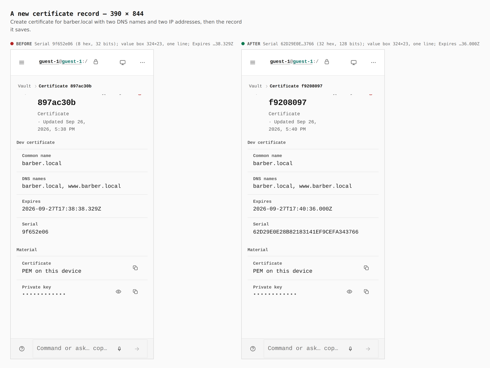
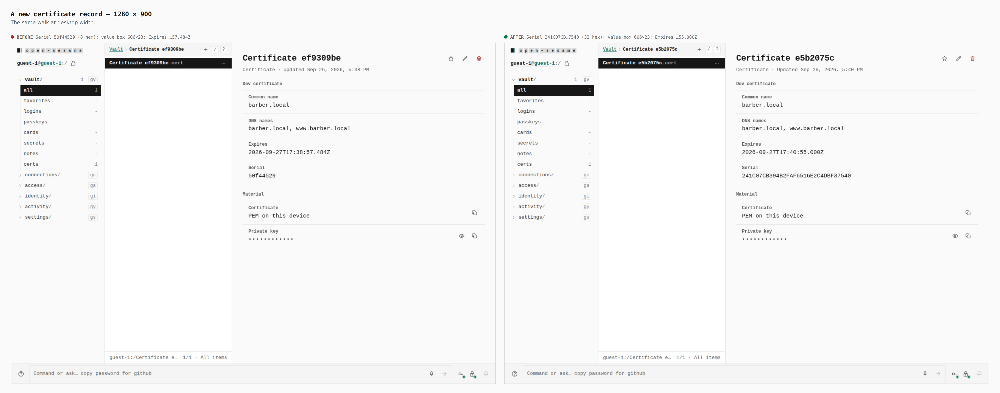
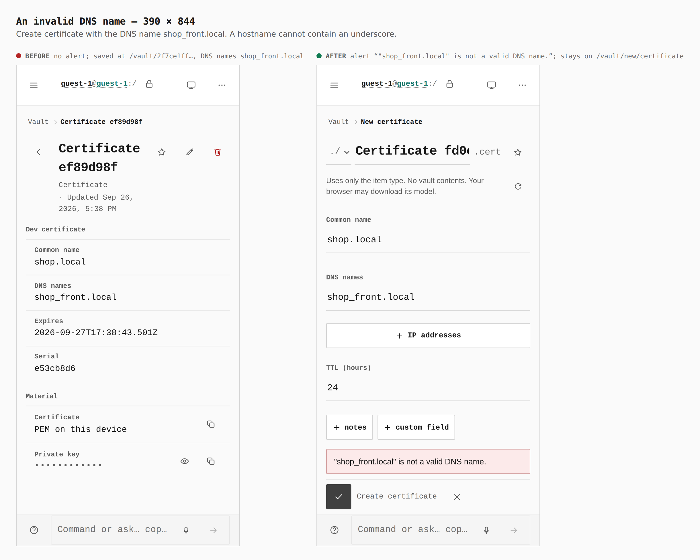
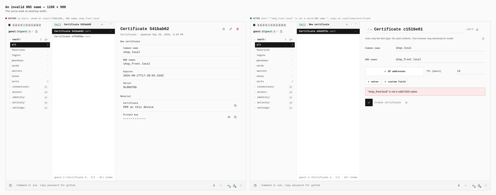

# Local certificates are real X.509 now

These are before/after shots from two real Pages builds
(`VITE_BASE=/OpenSesame/`), walked the same way:

- **Before:** `origin/main` at `c68753bd`. `apps/pages/src` and
  `packages/app-core/src/lib/certs.ts` were checked out from that commit.
- **After:** this branch.

Both builds were captured at 390×844 in a touch context and at 1280×900 with
a mouse, by `apps/pages/scripts/capture-evidence.mjs` driving
[`journey.json`](journey.json). Every value below was printed by the capture
run (`report`, `measure`, `address`). None was written from the diff.

At each width, the journey is:

1. Continue as guest.
2. Open `vault/new/certificate`.
3. Create a certificate:
   - Common name `barber.local`;
   - DNS names `barber.local, www.barber.local`;
   - IP addresses `127.0.0.1, ::1`.
4. Read the saved record.
5. Open `vault/new/certificate` again.
6. Create a certificate:
   - Common name `shop.local`;
   - DNS names `shop_front.local`.

The screen changes only a little. What changed is the material behind the
*Certificate* and *Private key* rows:

- **Before**, those rows held a string OpenSSL rejects
  (`PEM routines::bad end line`) and an RSA-OAEP key.
- **After**, they hold an X.509 v3 certificate that `openssl x509 -text`
  and Node's `X509Certificate` read and verify, and its ECDSA P-256 key.

The tests that prove this are listed in
[`docs/security/audits/2026-09-26-local-certificate-issuance.md`](../../security/audits/2026-09-26-local-certificate-issuance.md).

## A new certificate record, 390

| | Serial | Serial value box | Expires |
|---|---|---|---|
| Before | `9f652e06`: 8 hex digits (32-bit `Math.random`) | 324×23, one line | `…38.329Z` |
| After | `62D29E0E28B82183141EF9CEFA343766`: 32 hex digits (16 CSPRNG bytes) | 324×23, one line | `…36.000Z` |

The longer serial still fits on one line at phone width, in a box of the
same height. *Expires* now shows whole seconds, because that is what the
certificate itself records.

## A new certificate record, 1280

| | Serial | Serial value box | Expires |
|---|---|---|---|
| Before | `50f44529`: 8 hex digits | 606×23 | `…57.484Z` |
| After | `241C07CB394B2FAF6516E2C4DBF37540`: 32 hex digits | 606×23 | `…55.000Z` |

## An invalid DNS name, 390

| | Alert | Address after Create |
|---|---|---|
| Before | none | `/vault/2f7ce1ff…`, a record saved with DNS names `shop_front.local` |
| After | `"shop_front.local" is not a valid DNS name.` | `/vault/new/certificate`, nothing saved |

The message appears in the editor's existing error line (`role=alert`),
the same one the editor already uses for a missing common name.

## An invalid DNS name, 1280

| | Alert | Address after Create |
|---|---|---|
| Before | none | `/vault/7360cb98…`, a record saved |
| After | `"shop_front.local" is not a valid DNS name.` | `/vault/new/certificate`, nothing saved |
