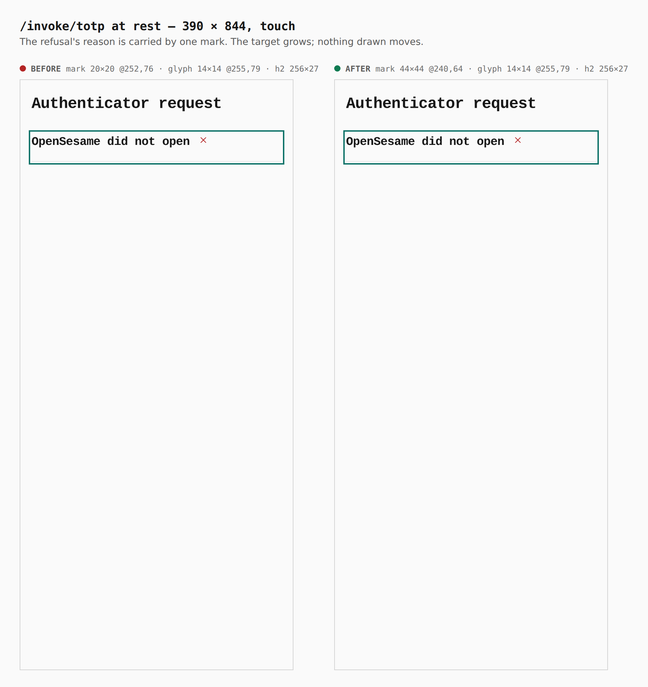
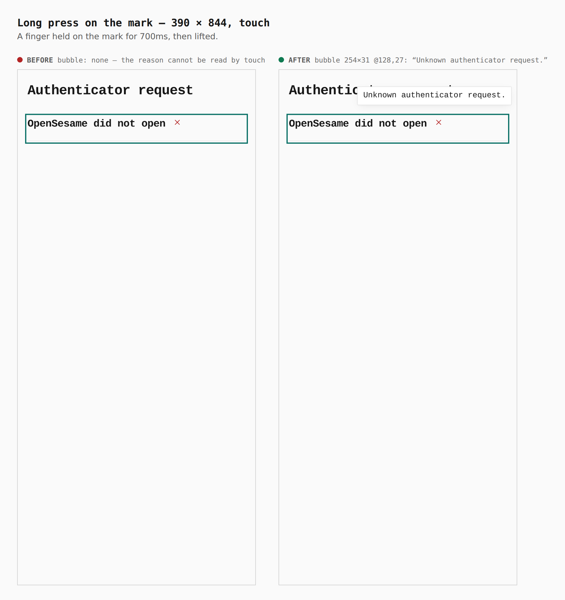
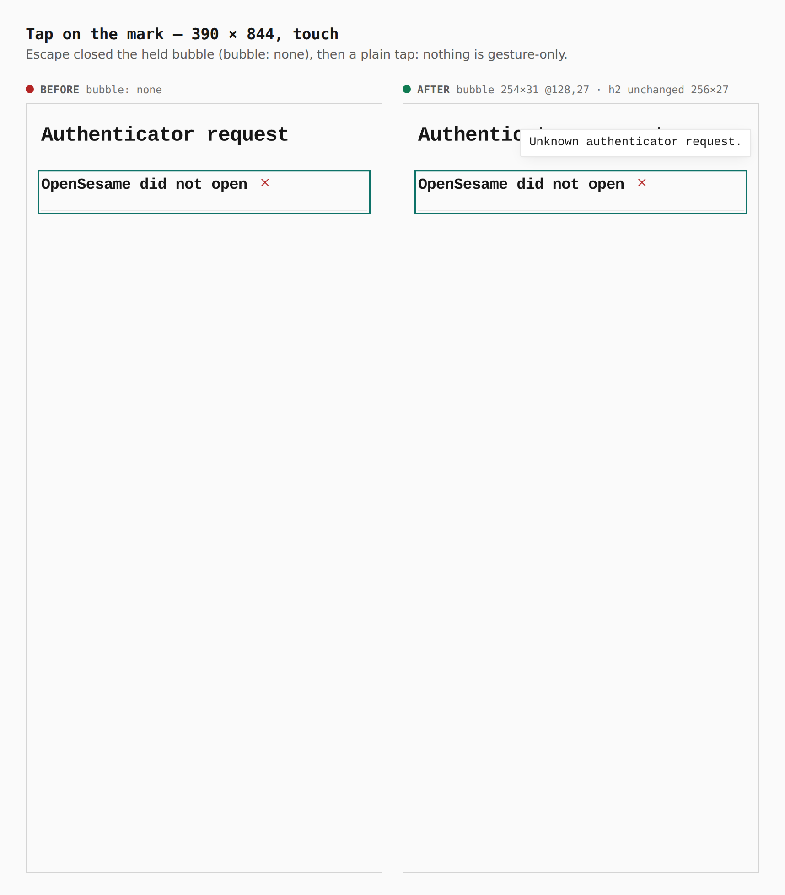
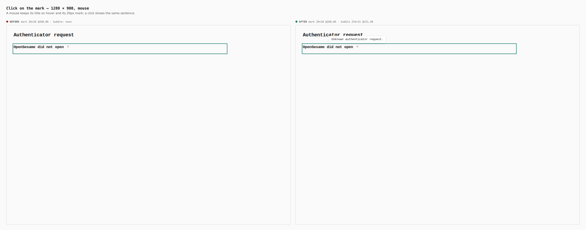

# A status mark's touch twin

`StatusMark` carried its sentence only in `aria-label` and `title`. A screen
reader read the first and a mouse hovered for the second; a finger has
neither, so on a phone a refusal whose reason is a mark could not be read at
all. On this branch a tap or a long press on a mark shows the same sentence
in a transient, `aria-hidden` bubble (DESIGN.md § Status is a symbol, § Touch).

Before/after from two real Pages builds (`VITE_BASE=/OpenSesame/`), walked
with the same steps (`journey.json`): `origin/main` at `c68753bd` (only
`apps/pages/src` reverted, per `skills/visual-evidence/SKILL.md`) and this
branch. Phone 390×844 in a touch context and desktop 1280×900 with a mouse.
Every number below was printed by the capture run
(`apps/pages/scripts/lib/capture-mark-steps.mjs`: `tapMark`, `holdMark`,
`bubble`), not written from the diff.

The journey, per width, on a fresh profile with no vault: open
`…/OpenSesame/invoke/totp` cold (an authenticator kind the hand-off refuses,
"OpenSesame did not open" with one err mark, "Unknown authenticator
request."); at 390 hold the mark 700ms through the DevTools touch protocol,
press Escape, then tap it; at 1280 click it.

## At rest, 390 — nothing moves

| | mark box | glyph | heading |
|---|---|---|---|
| before | 20×20 @252,76 | 14×14 @255,79 | 256×27 @16,76 |
| after | **44×44** @240,64 | 14×14 @255,79 | 256×27 @16,76 |

The target is the mark's own box: 0.75rem of padding on a 1.25rem glyph box
(2.75rem = 44px), with the same 0.75rem taken back as negative margin, so the
margin box — what the row lays out — is still 20×20.

## Long press, 390

Before: no bubble — the sentence exists only for a screen reader and a
hover. After: bubble 254×31 @128,27, "Unknown authenticator request.", placed
above the target and clamped 8px inside the viewport.

## Tap, 390

Escape closed the held bubble first (`bubble: none` after the key), then a
plain tap showed it again, 254×31. Nothing is gesture-only.

## Click, 1280

A mouse keeps the `title` tooltip on hover and the 20×20 mark (the 44px rule
is under `(pointer: coarse), (max-width: 900px)`); a click shows the same
bubble, 254×31 @151,48.

## Layout across the app (not a sheet)

A scratch probe walked both builds over 16 screens — `invoke/totp`, the front
door, then as a guest vault, connections, access (+ policies, sessions),
identity (+ devices), settings (+ security, vaults, capabilities, general,
connections) and wallet — and recorded every `.status-mark`'s glyph box and
its parent's size:

| width | marks | tappable | tappable ≥ 44×44 | glyphs moved | parents resized |
|---|---|---|---|---|---|
| 390 (touch) | 139 | 42 | 42 | 0 | 0 |
| 1280 (mouse) | 139 | 42 | — (20×20 by design) | 0 | 0 |

The other 97 marks sit inside a link, button, tab, tree row or similar and
leave the tap to their parent (no `data-touch-twin`, no enlarged box).

`verify:mobile` now counts `[data-touch-twin]` as a control. As a negative
control, the same build with the padding and negative margin removed failed
it with 34 `TARGET-UNDER-44` faults on marks (e.g. `Not connectable 20x20` on
a blocked connector tile, `This device 20x20` in the identity sheet); with
them, it passes at 320, 390, 430, landscape and both tablets.
