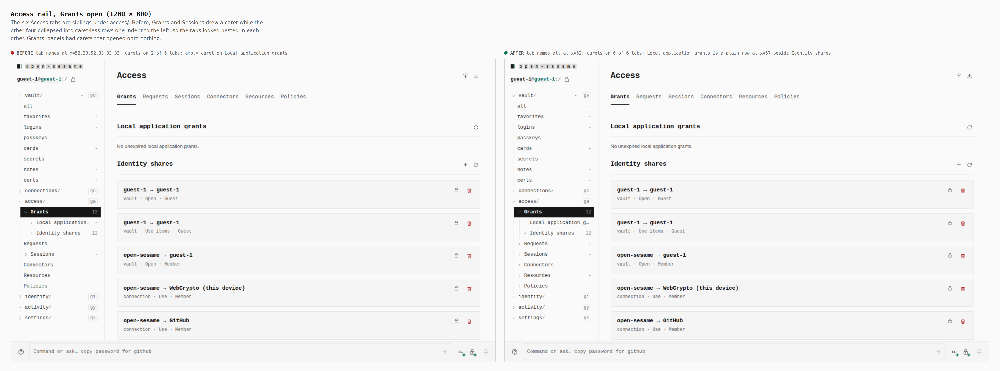
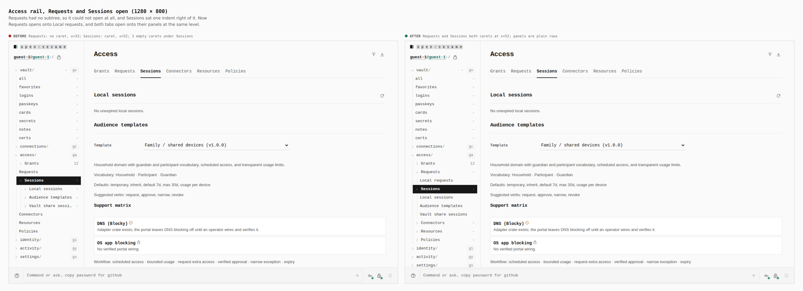
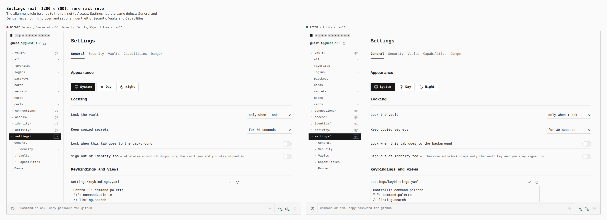
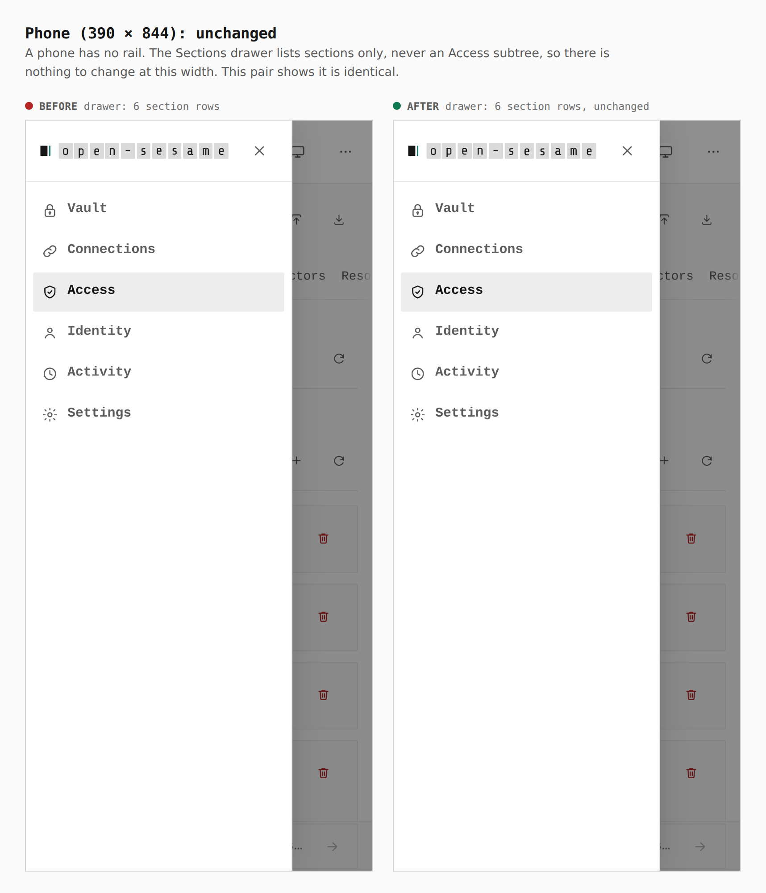

# Access tabs are siblings in the rail

The six Access tabs (Grants, Requests, Sessions, Connectors, Resources,
Policies) are children of `access/` and siblings of each other. Before this
change the rail drew two kinds of tab row. A tab whose page shows two or more
panels (Grants, Sessions) got a caret and a subtree. A tab with one panel was
collapsed into a caret-less row, and a caret-less row puts its name where a
caret row puts its caret. So the tabs sat one indent apart, and Sessions read
as a child of Requests. Under Grants and Sessions, every panel also got a
caret that opened onto nothing.

Now every tab is the same kind of row: a caret that opens onto the panels its
page shows. A panel with no records to list is a plain row. Only Identity
shares, which lists the share grants, can open. And the rail keeps a caret's
width on any caret-less row that sits beside caret rows, so sibling names
line up wherever the two kinds mix. That rule fixes Settings too.

Before/after come from two real Pages builds (`VITE_BASE=/OpenSesame/`),
walked with the same steps (`journey.json`). The base is `2338c69c` (only
`apps/pages/src` reverted, per `skills/visual-evidence/SKILL.md`). Every
x-position below is the left edge of a row's `.railtree__name`, printed by
the capture run's `measure` step.

## Access, Grants open, 1280

| | tab name x (Grants → Policies) | carets on tabs | Grants' panels |
|---|---|---|---|
| before | 52, 33, 52, 33, 33, 33 | 2 of 6 | both carets, one opening onto nothing |
| after | **52, 52, 52, 52, 52, 52** | **6 of 6** | Local application grants is a plain row; Identity shares (12) opens; both names at x=67 |

## Access, Requests and Sessions open, 1280

| | Requests | Sessions | panels under Sessions |
|---|---|---|---|
| before | no caret, x=33, cannot open | caret, x=52 | 3 carets opening onto nothing |
| after | caret, x=52, opens onto Local requests | caret, x=52 | 3 plain rows |

## Settings, 1280: the same rail rule

| | General | Security, Vaults, Capabilities | Danger |
|---|---|---|---|
| before | x=33 | x=52 | x=33 |
| after | **x=52** | x=52 | **x=52** |

## Phone, 390: unchanged

A phone has no rail. The Sections drawer lists sections only, never an
Access subtree, so nothing at this width changes. The pair shows it is
identical.
