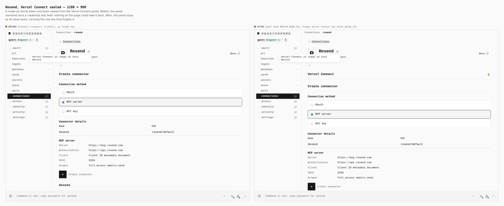
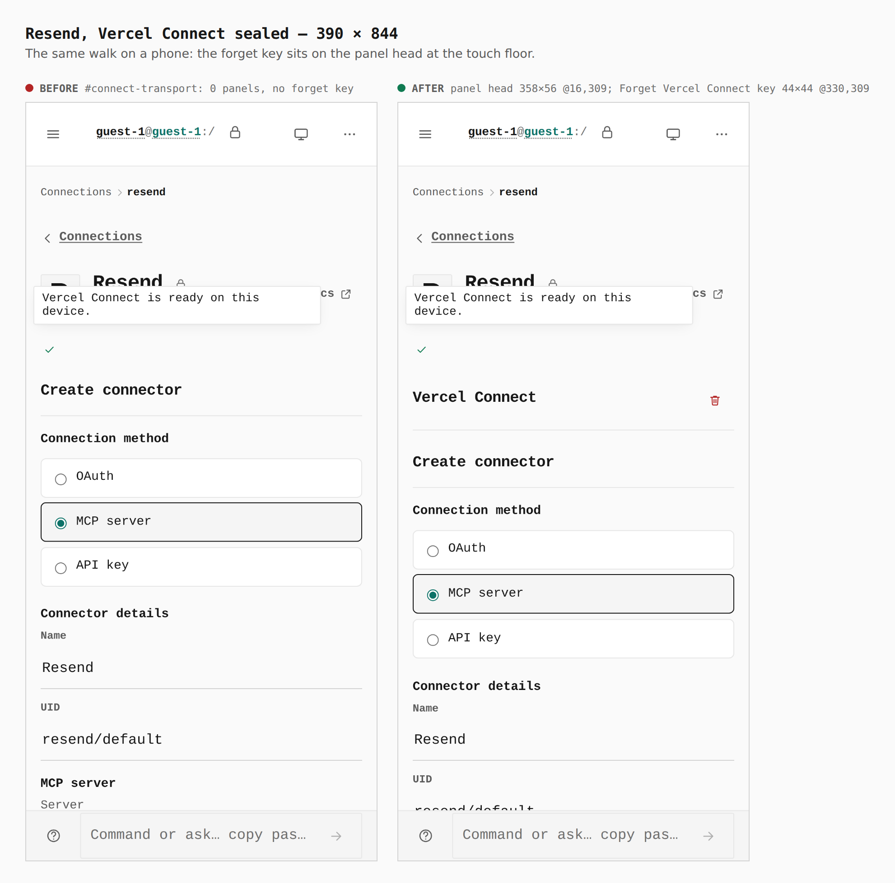
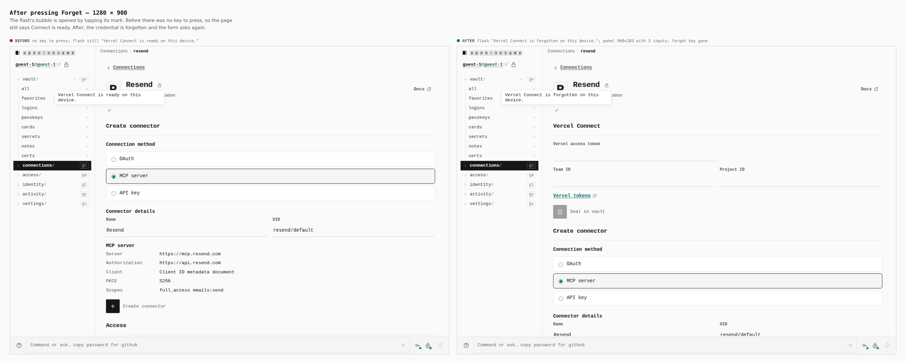
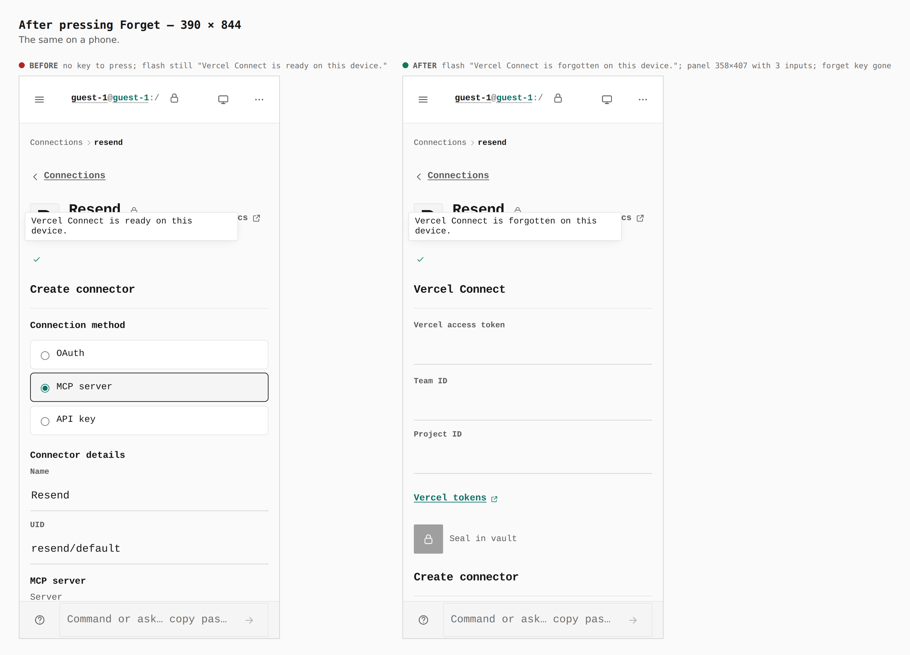
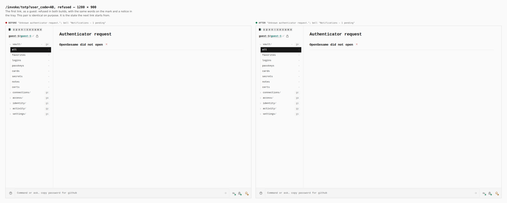
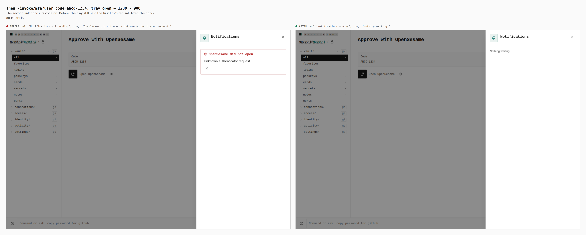
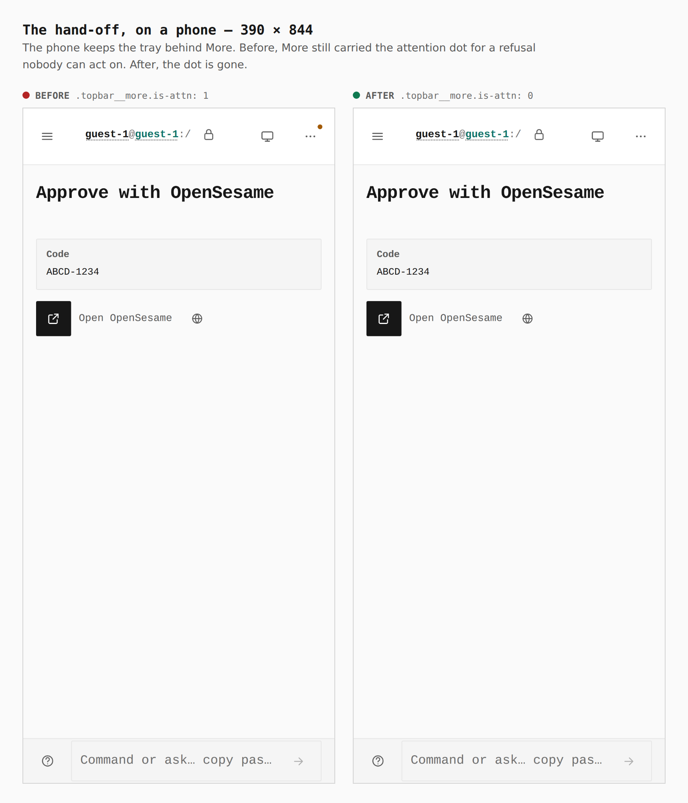
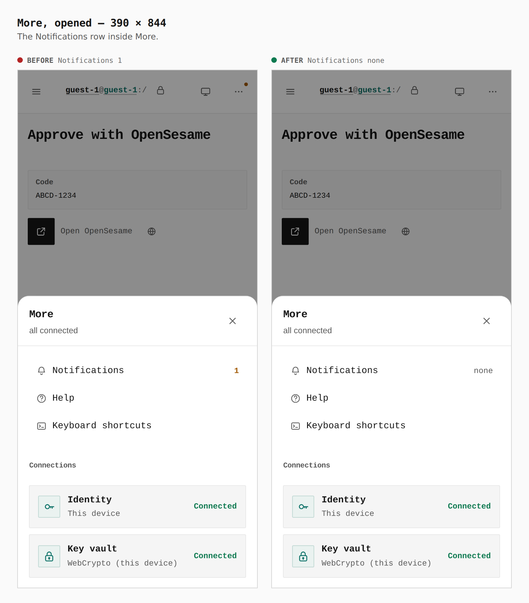

# Forget Vercel Connect, and a hand-off that clears an earlier refusal

Before/after captures from two real builds, walked the same way by
`apps/pages/scripts/capture-evidence.mjs` over [`journey.json`](journey.json):
`main` at `24124002` (built in its own worktree, captured with `EVIDENCE_DIST`)
and this branch at `ca4b41cb`. Every number below was read from the browser by
the journey's `measure`, `count`, `marks`, `bubble` and `report` steps.

**Connect.** As a guest, open `connections/resend`, type a made-up Vercel
access token (`made-up-evidence-token-0000`) and team (`team_evidence_example`)
into the Vercel Connect panel, and press *Seal in vault*. Then press *Forget
Vercel Connect* if the build has that key. The flash is a status glyph whose
words are in its label, so the journey taps it (`tapMarkNamed`) and the bubble
shows the sentence.

**Invoke.** As a guest, follow `/invoke/totp?user_code=AB` in the app, which is
refused. Go to the vault, then follow `/invoke/mfa?user_code=abcd-1234` in the
same tab, and open the tray. Notices live in the tab's memory, so the second link is an
in-app navigation (`visit`). A cold load would empty the tray in both builds
and show nothing.

| screen | before → after |
|---|---|
| sealed, 1280 | no `#connect-transport` panel, no forget key → panel head 960×40 @280,221; forget key 24×24 @1216,223 |
| sealed, 390 | no panel, no forget key → panel head 358×56 @16,309; forget key 44×44 @330,309 |
| forget pressed, 1280 / 390 | no key to press, flash still “Vercel Connect is ready on this device.” → “Vercel Connect is forgotten on this device.”; form back (3 inputs, 960×283 / 358×407); key gone |
| refused link, 1280 | “Unknown authenticator request.”, bell “1 pending” → the same (unchanged, the starting state) |
| handed-on link, tray, 1280 | bell “Notifications — 1 pending”, tray still shows the refusal → bell “Notifications — none”, tray “Nothing waiting.” |
| handed-on link, 390 | `.topbar__more.is-attn` 1 → 0 |
| More opened, 390 | “Notifications 1” → “Notifications none” |

## Resend, Vercel Connect sealed — 1280 × 900

Before: once a credential is held the panel disappears, and nothing on the page
can take it back. After: the panel keeps its head, with the trash icon key
(`icon-btn icon-btn--sm icon-btn--danger`, aria-label “Forget Vercel Connect”).

`#connect-transport: 0` → `panel head 960×40 @280,221; Forget Vercel Connect 24×24 @1216,223`

## Resend, Vercel Connect sealed — 390 × 844

`#connect-transport: 0` → `panel head 358×56 @16,309; Forget Vercel Connect 44×44 @330,309`
(the key meets the 44px touch floor)

## After pressing Forget — 1280 × 900

`no key; flash “…is ready on this device.”` → `flash “Vercel Connect is forgotten on this device.”; panel 960×283, 3 inputs; forget key count 0`

## After pressing Forget — 390 × 844

`no key; flash “…is ready on this device.”` → `flash “Vercel Connect is forgotten on this device.”; panel 358×407, 3 inputs; forget key count 0`

## `/invoke/totp?user_code=AB`, refused — 1280 × 900

The same in both builds: the first link's refusal, on the mark and in the tray.
This is the state the next link starts from.

`“Unknown authenticator request.”; bell “Notifications — 1 pending”` in both

## Then `/invoke/mfa?user_code=abcd-1234`, tray open — 1280 × 900

`bell “1 pending”; tray “OpenSesame did not open · Unknown authenticator request.”` →
`bell “Notifications — none”; tray “Nothing waiting.”`

## The hand-off on a phone — 390 × 844

A phone keeps the tray behind More. Its attention dot stayed on for a refusal
that nobody can act on any more.

`.topbar__more.is-attn: 1` → `0`

## More, opened — 390 × 844

`Notifications 1` → `Notifications none`

## What this does not show

- The relay variant was not walked. In that variant a *Relay management key* is
  sealed on a deployment that serves the Connect relay, and this static build has
  no relay. The key is the same component with the same handler, and
  `useConnectTransport` sets `held` from either the management key or the token.
  The unit tests cover only the direct-token case.
- Nothing here proves that the vault copy was deleted. The images show the page's
  state. `ConnectTransportPanel.test.tsx` asserts that the sealed record is gone
  (`readVercelConnectAuth` → `null`, no `config/vercel-connect-auth` key).
- A refusal before unlock has no tray to show: `/invoke/*` draws no statusline
  before a vault is open. So the invoke pair is walked as a guest.
