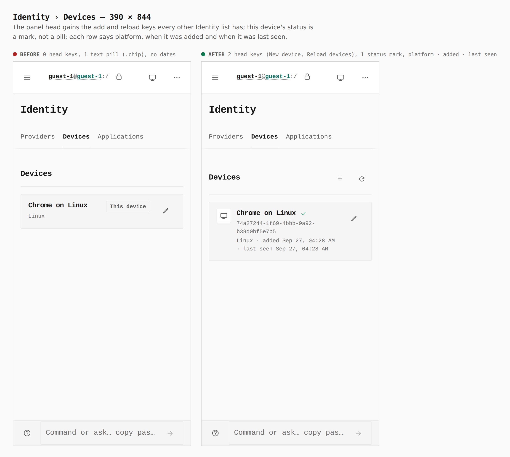
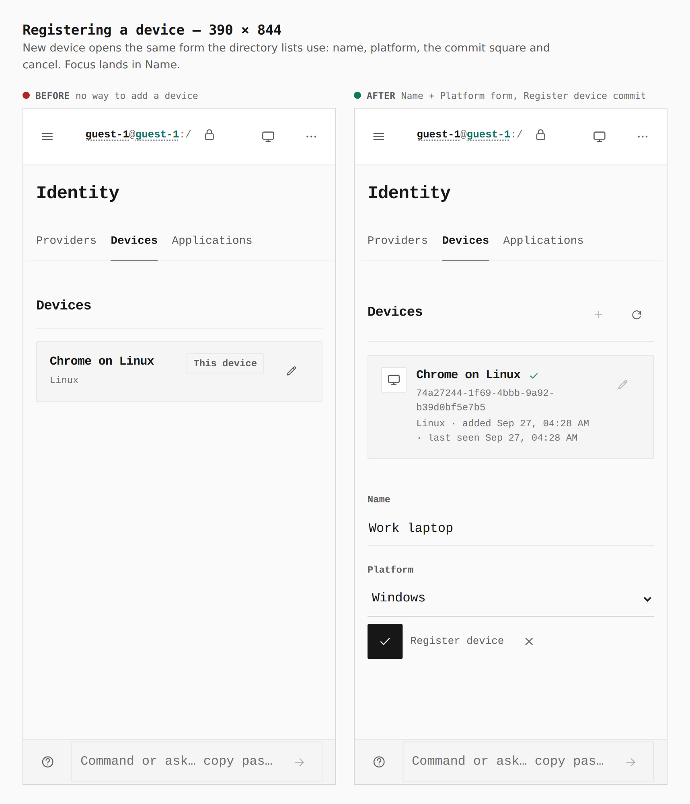
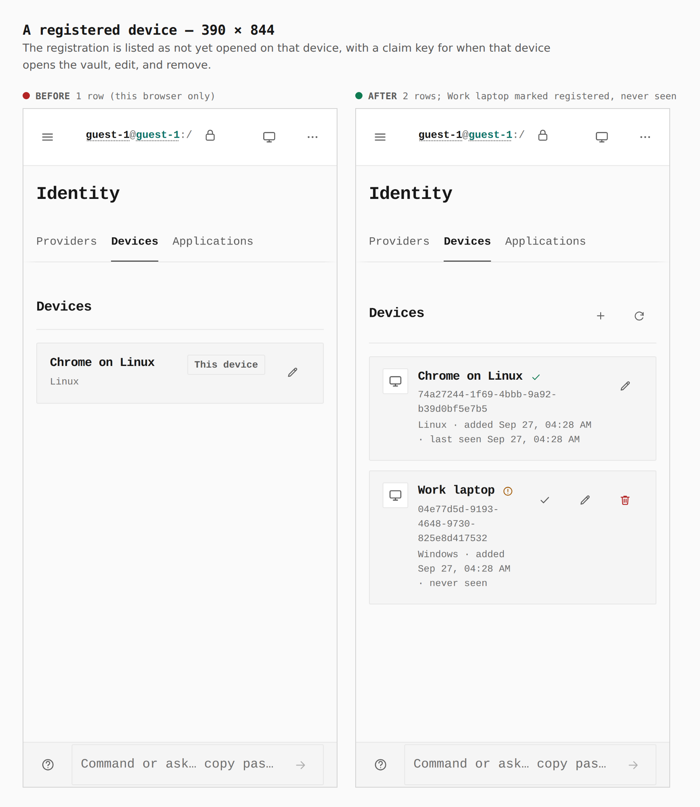
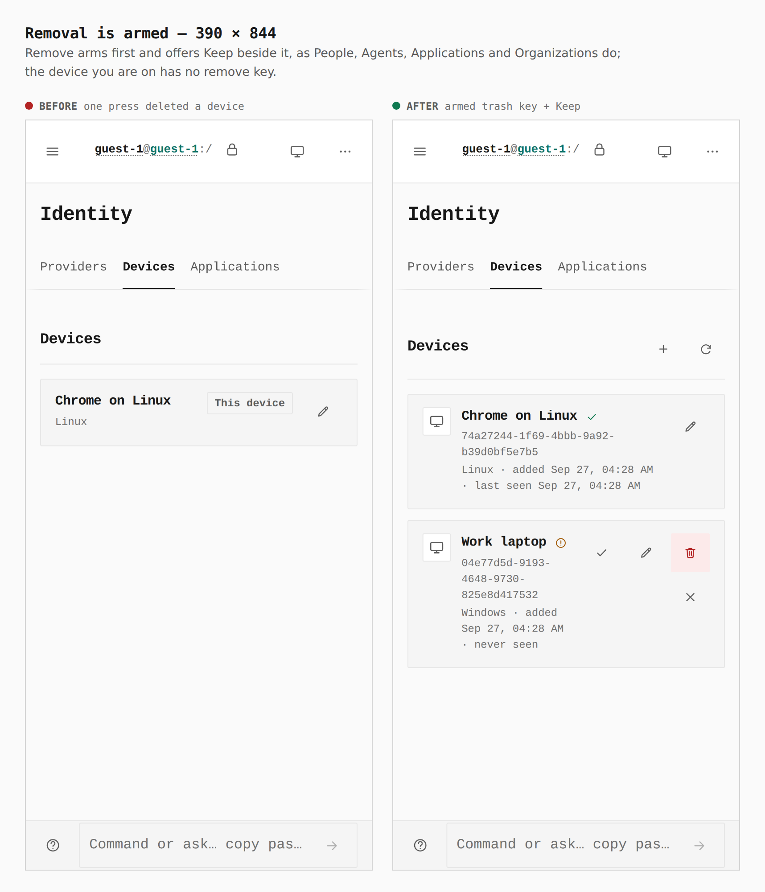
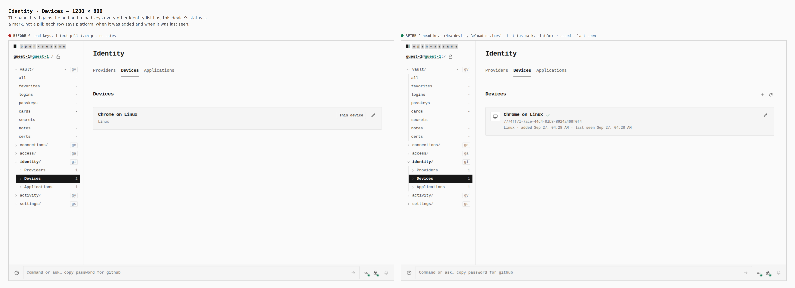
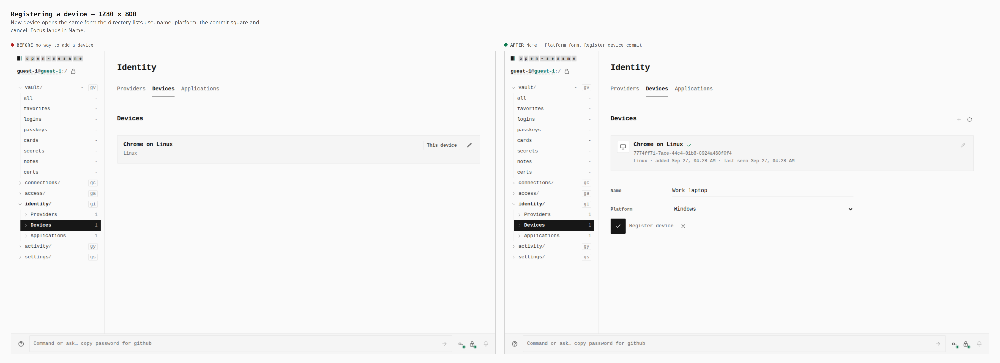
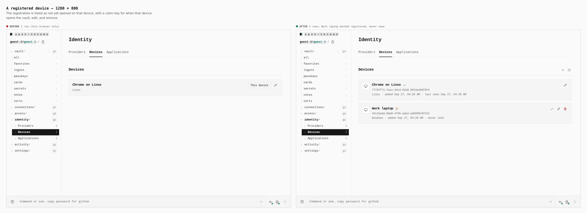
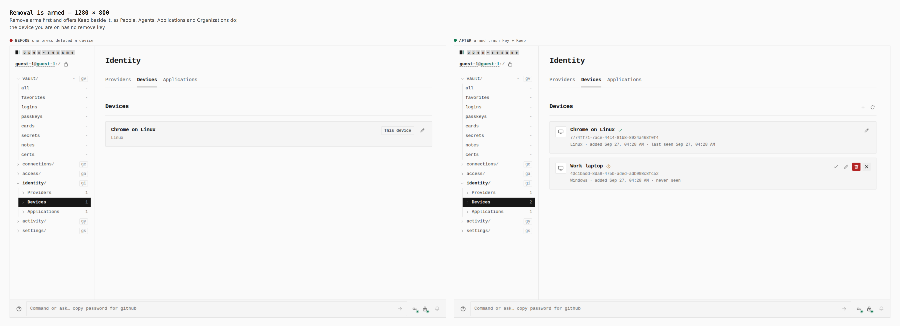

# Identity › Devices — register, edit, claim and remove, like every other Identity list

Before/after from two real Pages builds (`VITE_BASE=/OpenSesame/`), walked
with the same steps: the base (`2338c69c`) and this branch. Phone 390×844
(touch context) and desktop 1280×800 (mouse). Every number below was printed
by the capture run (`journey.json`), not written from the diff.

The journey: Continue as guest → Identity → Devices → New device → Name
`Work laptop`, Platform `Windows` → Register device → Remove Work laptop
(arms, does not delete).

| Sheet | Before | After |
|---|---|---|
| `390-list`, `1280-list` | 0 keys in the panel head; 1 text pill (`.chip` "This device"); 0 status marks; no dates | 2 head keys (New device, Reload devices); 0 pills; 1 status mark ("This device"); `Linux · added Sep 27, 04:28 AM · last seen Sep 27, 04:28 AM` |
| `390-form`, `1280-form` | no add key, so no form; still 1 row | Name + Platform form with the `.go` commit "Register device" and a cancel key |
| `390-registered`, `1280-registered` | 1 row (`Chrome on Linux`) | 2 rows (`Chrome on Linux`, `Work laptop`); Work laptop marked "Registered, not yet opened on that device", `Windows · added … · never seen`, with claim ✓, edit ✎ and remove 🗑 keys |
| `390-armed`, `1280-armed` | a single press on the trash key deleted a device outright | Remove arms the trash key and puts Keep beside it; the device you are on has no remove key |

## 390 × 844

## 1280 × 800

## Not captured here

- **Claim** (✓ on a registration, pressed on the device it names) needs a
  second browser that opened the same vault; it is covered by
  `LocalDevicesPanel.test.tsx` ("claims a registration as this browser…")
  and `local-devices.test.ts`.
- **Focus.** The capture's `fillOptional` step blurs the field it filled, so
  the `focused` line reads `body`. Focus landing in Name when the form opens,
  and Keep returning focus to the trash key, are asserted by the unit tests
  and by the keyboard-only contract `scripts/lib/local-device-contract.mjs`
  in `verify:keyboard`.
- **Providers** (moved out of `IdentitySection.tsx`) gains a head reload, an
  armed remove and a status mark in place of its in-page error box; the
  guest journey has no removable provider to show, so it is covered by
  `IdentitySection.test.tsx`.
