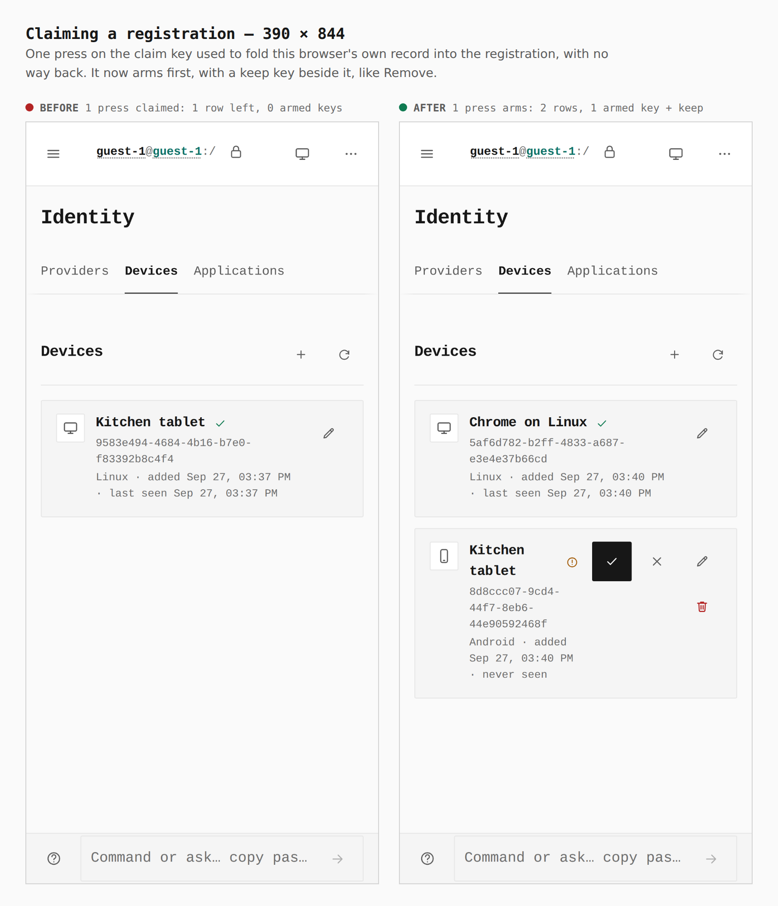
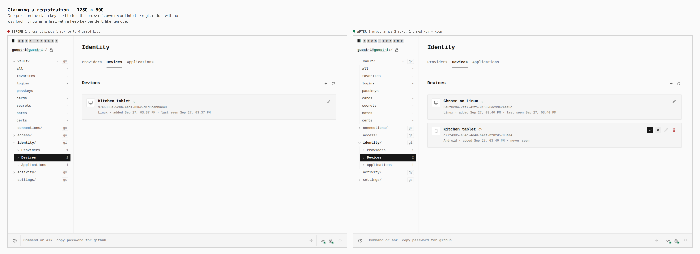

# Identity follow-ups — the claim key arms before it fires

Before/after from two real Pages builds (`VITE_BASE=/OpenSesame/`), walked
with the same steps: the Devices change as it stood (`97cda45b`) and this
branch. Phone 390×844 (touch context) and desktop 1280×800 (mouse). Every
number below was printed by the capture run (`journey.json`).

The journey: Continue as guest → Identity → Devices → New device → Name
`Kitchen tablet`, Platform `Android` → Register device → press the claim key
once.

| Sheet | Before | After |
|---|---|---|
| `390-claim`, `1280-claim` | one press claimed: 1 row left (this browser's own record folded away), 0 armed keys, focus on `body` | one press arms: 2 rows, 1 armed key (`is-armed`, ink-filled) with "Leave Kitchen tablet unclaimed" beside it; focus stays on "Confirm claiming Kitchen tablet as this device" |

## Not captured here, and what verifies it instead

- **Focus after a remove, a claim or a delete** lands on the panel's add key
  or the claimed row's edit key. A screenshot shows nothing of focus; it is
  asserted by `LocalDevicesPanel.test.tsx`, `LocalDirectoryRows.test.tsx` and
  the keyboard-only `verify:keyboard` contracts
  (`scripts/lib/local-device-contract.mjs`,
  `scripts/lib/local-directory-contract.mjs`).
- **A provider's kind as text, not a pill**, and the operator note moved into
  the armed Remove key's label: the guest journey has no removable or custom
  provider to show (registering one needs a sign-in service this capture has
  none of). Asserted by `ProvidersPanel.test.tsx`.
- **The full-list warning** needs 64 devices in one vault; asserted by
  `LocalDevicesPanel.test.tsx` and `local-devices.test.ts`.
