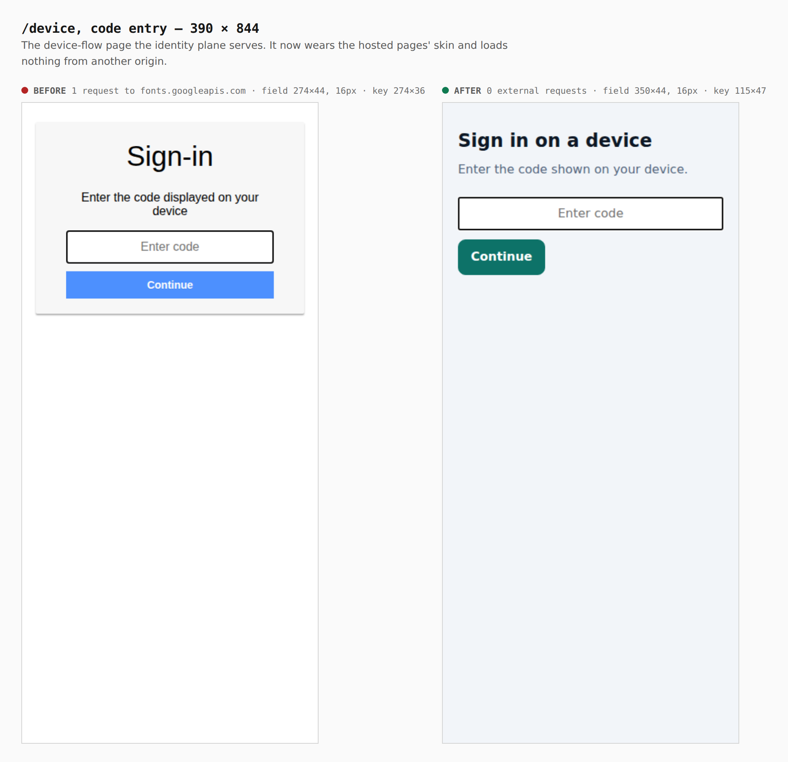
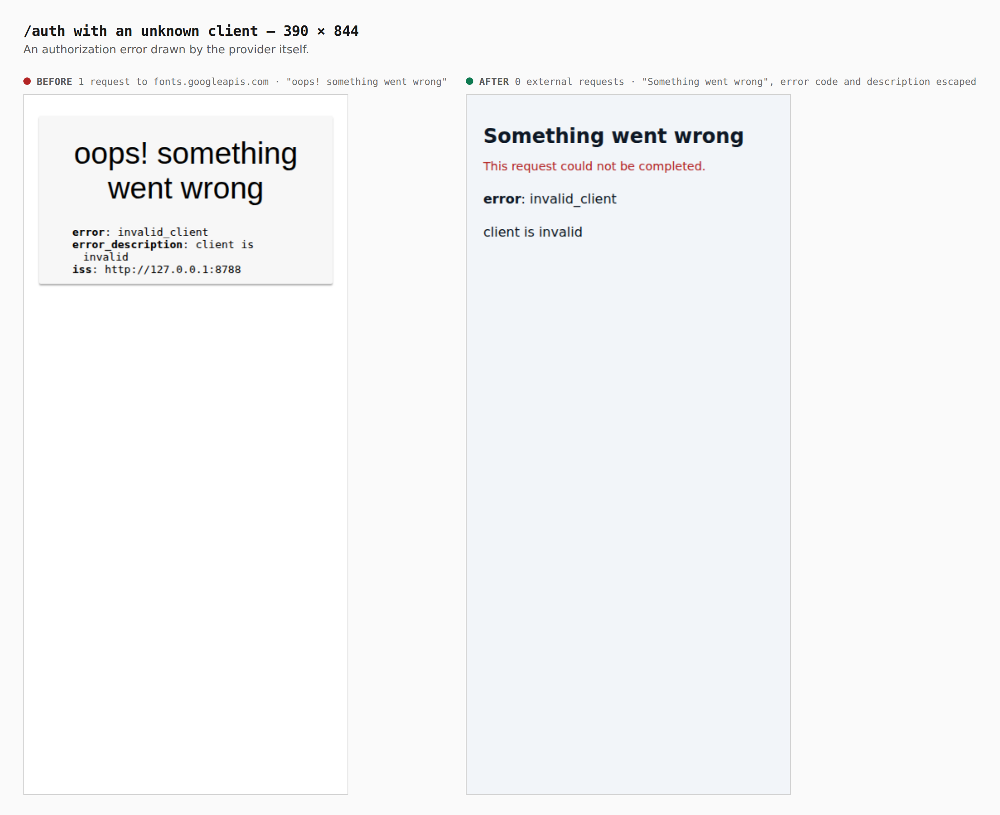
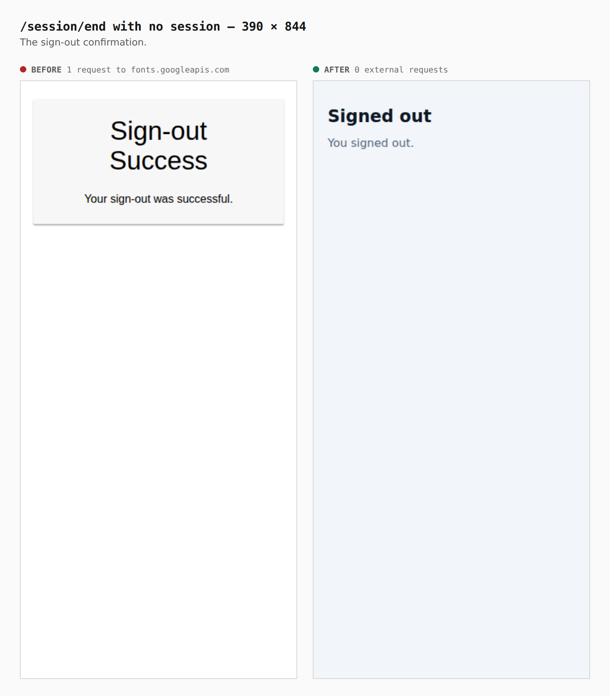
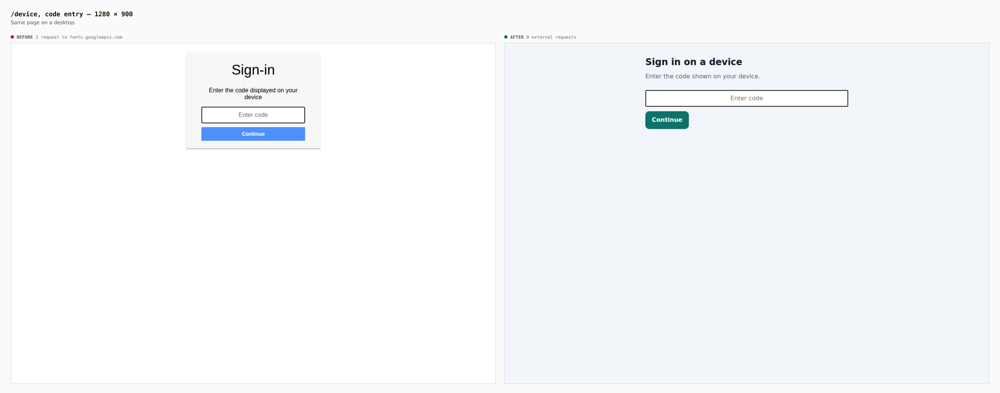
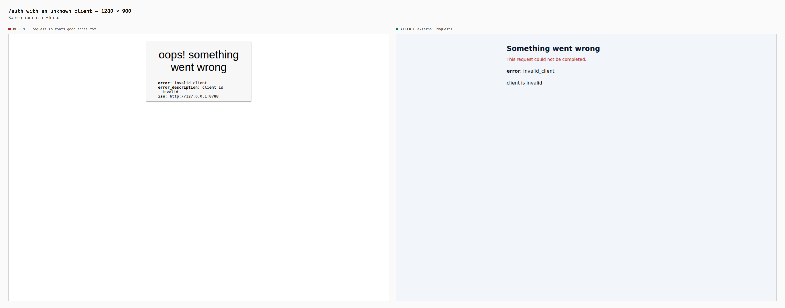

# The identity provider's own pages

These are before/after captures of the pages oidc-provider draws itself, served by
two real control-plane builds: `main` at `2338c69c` and this branch. Each was run
locally with `OPENSESAME_ENV=development` and visited in Chromium at 390 × 844
and 1280 × 900. Every request that left `127.0.0.1:8788` was recorded, and the
field and key sizes were read from the browser.

| page | before | after |
|---|---|---|
| `/device` | 1 request to `fonts.googleapis.com` | 0 external requests |
| `/auth` (unknown client) | 1 request to `fonts.googleapis.com` | 0 external requests |
| `/session/end` | 1 request to `fonts.googleapis.com` | 0 external requests |
| `/device` code field, 390 | 274×44, 16px | 350×44, 16px |
| `/device` Continue key, 390 | 274×36 (under the 44px floor) | 115×47 |
| provider `NOTICE` lines at start | 4 | 0 |

## /device, 390 × 844

## Authorization error, 390 × 844

## Sign-out, 390 × 844

## Desktop, 1280 × 900

