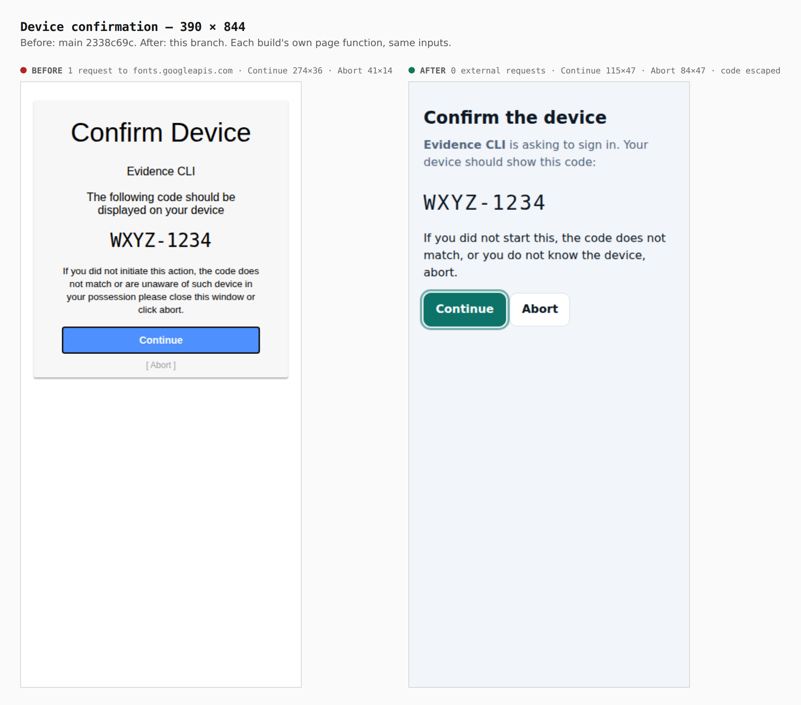
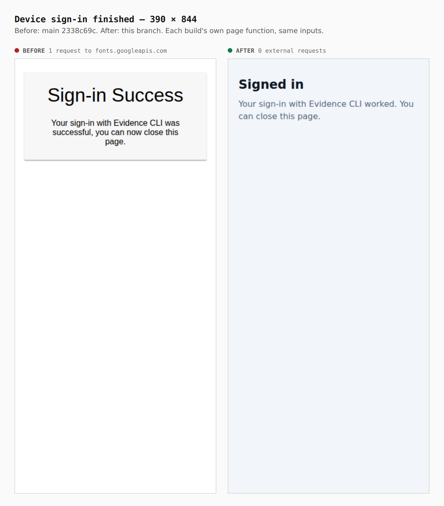
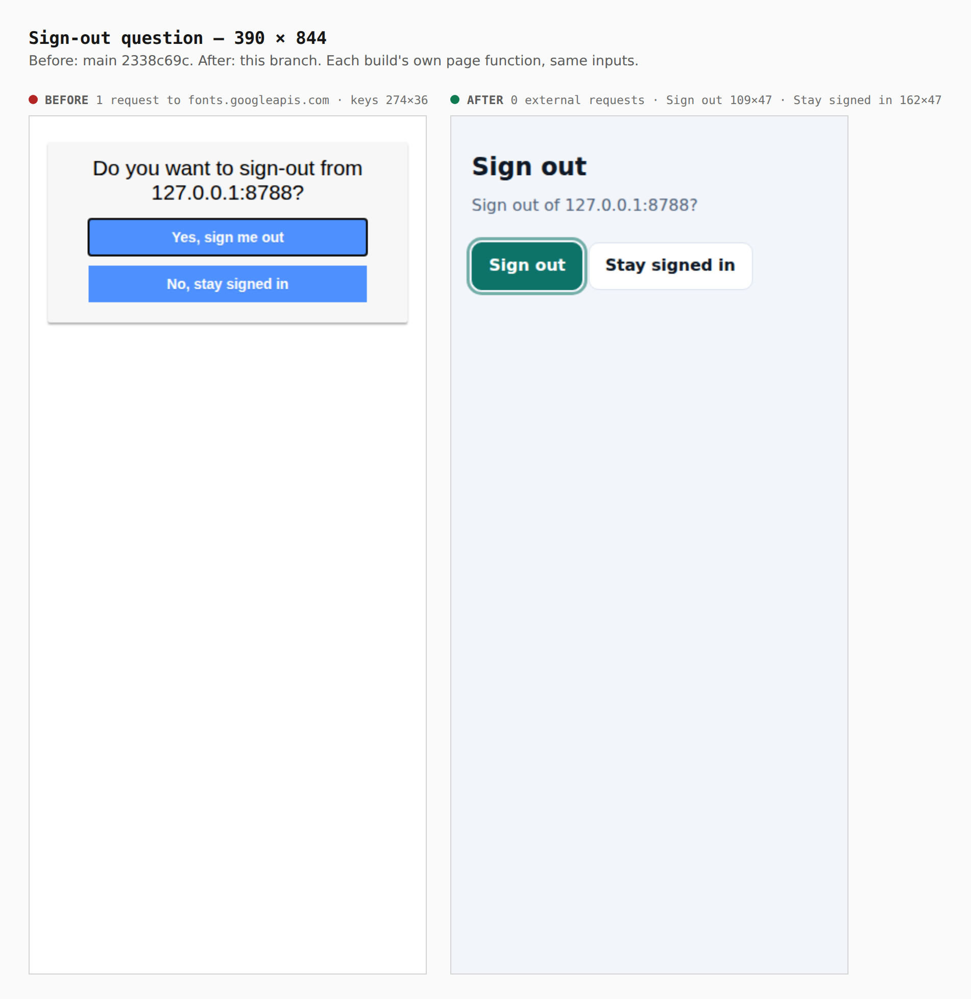
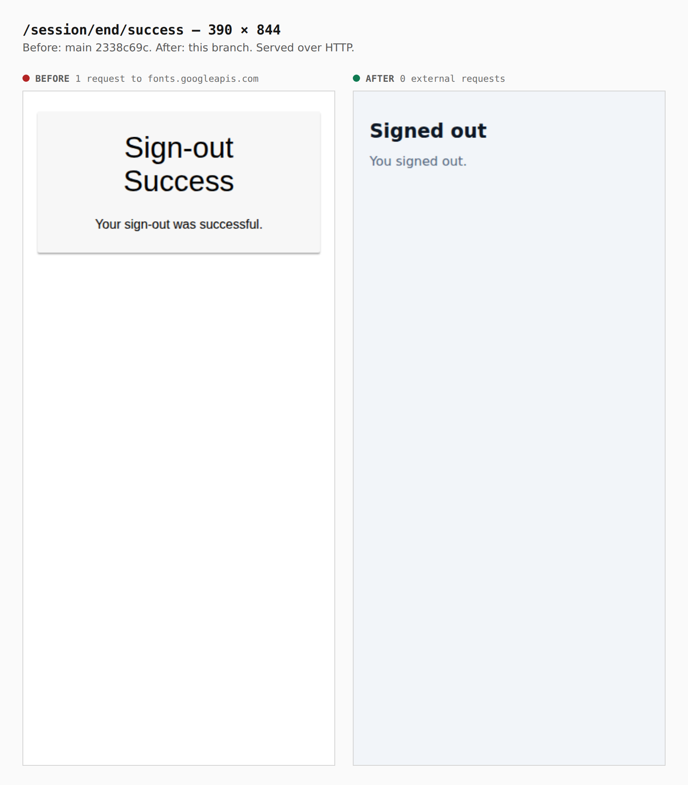
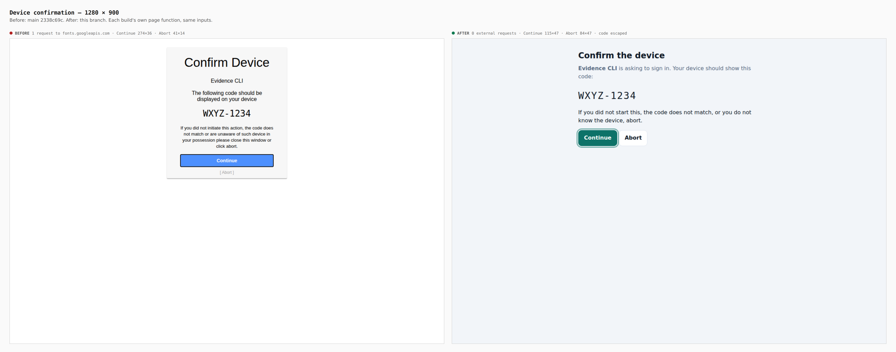
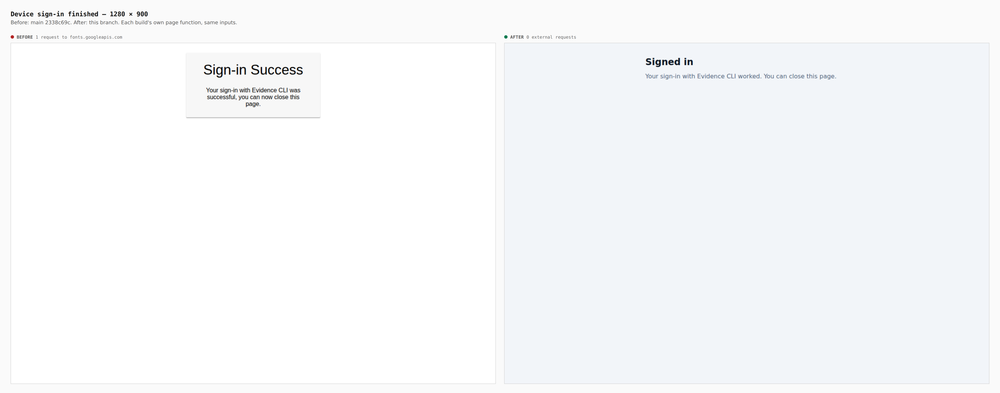
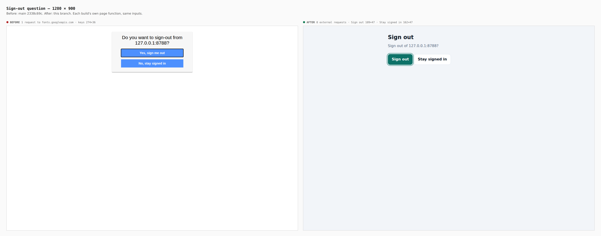
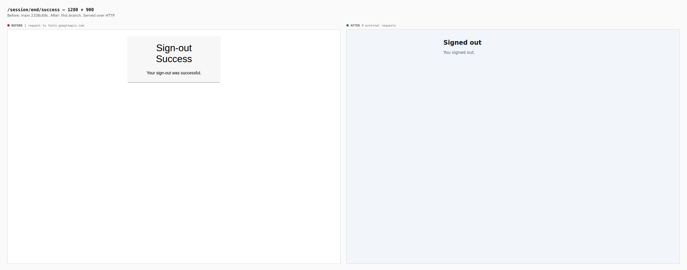

# The identity provider's own pages

Before/after captures of every page oidc-provider draws itself, from two real
control-plane builds: `main` at `2338c69c` (the library's default pages) and
this branch. Each was viewed in Chromium at 390 × 844 and 1280 × 900. Every
request that left the page's own origin was recorded, and key and field sizes
were read from the browser.

**How each page was reached.** The code-entry page, the authorization error and
the sign-out success page were served over HTTP by each build run locally with
`OPENSESAME_ENV=development`. The device confirmation, the device sign-in
success and the sign-out question need state a local run cannot produce: a
device code from a registered device-grant client (this issuer only registers
pairwise clients, which must authenticate with `private_key_jwt`), a finished
sign-in, or a live session. Those three were drawn by each build's own page
function — the library default on `main`, `providerPages` with the Identity
plane's stylesheet on this branch — with the same inputs (client "Evidence
CLI", user code `WXYZ-1234`, the form markup the provider hands over), and
served from a local origin.

| page | before | after |
|---|---|---|
| every page | 1 request to `fonts.googleapis.com` | 0 external requests |
| `/device` code field, 390 | 274×44 | 350×44, 16px |
| `/device` Continue, 390 | 274×36 | 115×47 |
| device confirmation, Continue / Abort | 274×36 / 41×14 | 115×47 / 84×47 |
| sign-out question, keys | 274×36 each | Sign out 109×47, Stay signed in 162×47 |
| provider `NOTICE` lines at start | 4 | 0 |

## Phone, 390 × 844

## Desktop, 1280 × 900

