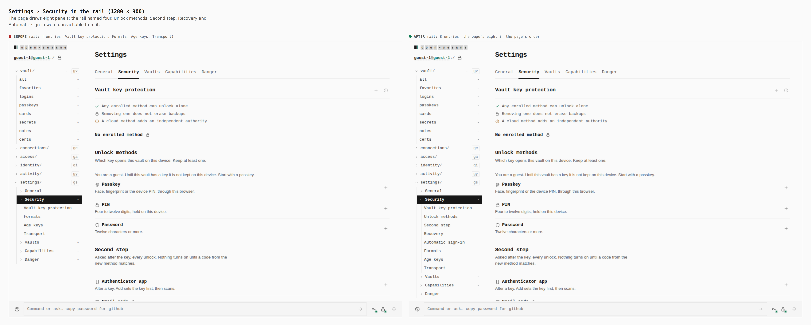
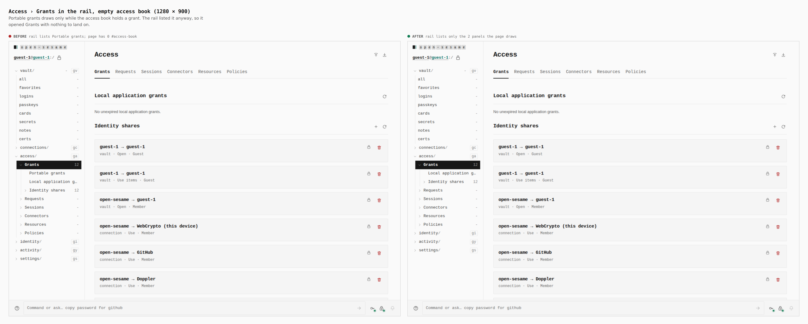
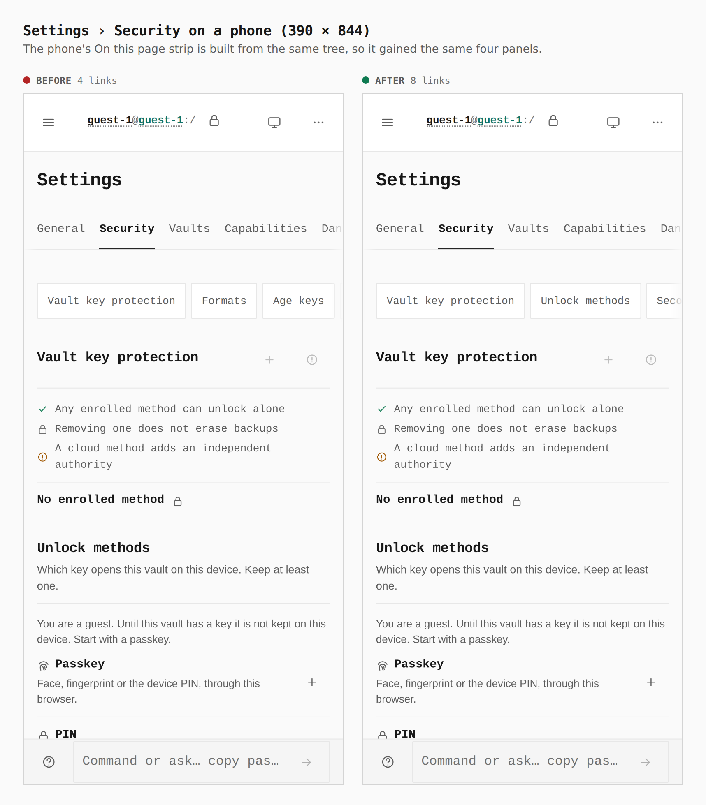

# Every rail entry is a panel the page draws

A second audit, after the rail's tabs became siblings
(`../2026-09-27-rail-siblings/`), compared each Access and Settings tab in a
real build against the rail: the panels the page draws (their headings and
ids) beside the entries the rail lists. Six mismatches remained, in both
directions.

| Tab | Before | Now |
|---|---|---|
| Settings › Security | Unlock methods, Second step, Recovery, Automatic sign-in drawn, not listed | listed, in page order |
| Settings › Security | Duress profiles, Your account: drawn only when they apply, never listed | listed when drawn |
| Settings › Vaults | Item types drawn, not listed | listed |
| Settings, any tab | Formats and Sealed store listed whether or not their capability draws them | listed from the active contributions |
| Settings, contributed tab | Notifications had no entries, so it drew as a caret-less row | opens onto Channels |
| Access › Grants | Portable grants listed while the page drew nothing for it | listed only while the book holds a grant |
| Access › Sessions | Receipts drawn with an Identity session, never listed | listed when drawn |

Before/after come from two real Pages builds (`VITE_BASE=/OpenSesame/`),
walked with the same steps (`journey.json`): the rail-siblings branch at
`8e65035f` (this change's base) and this branch. The lists below were
printed by the capture run (`report`, `count`).

## Settings › Security, 1280

| | rail entries under Security |
|---|---|
| before | Vault key protection, Formats, Age keys, Transport (4) |
| after | Vault key protection, **Unlock methods, Second step, Recovery, Automatic sign-in**, Formats, Age keys, Transport (8) |

## Access › Grants with an empty access book, 1280

| | rail entries under Grants | `#access-book` on the page |
|---|---|---|
| before | **Portable grants**, Local application grants, Identity shares | 0 |
| after | Local application grants, Identity shares | 0 |

## Settings › Security on a phone, 390

| | On this page links |
|---|---|
| before | 4 |
| after | **8**, the same list as the rail |
