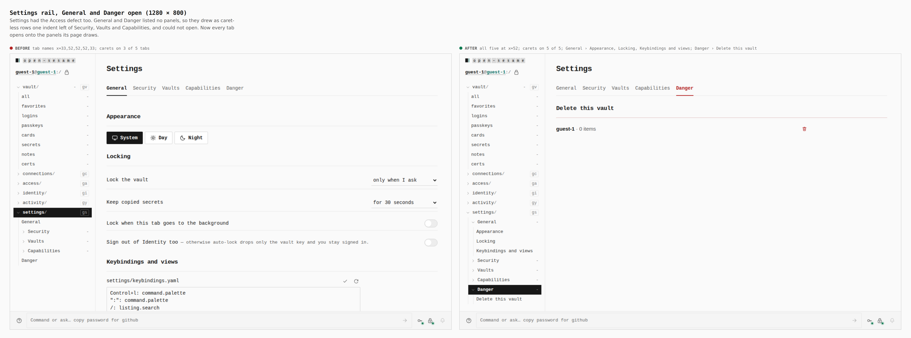
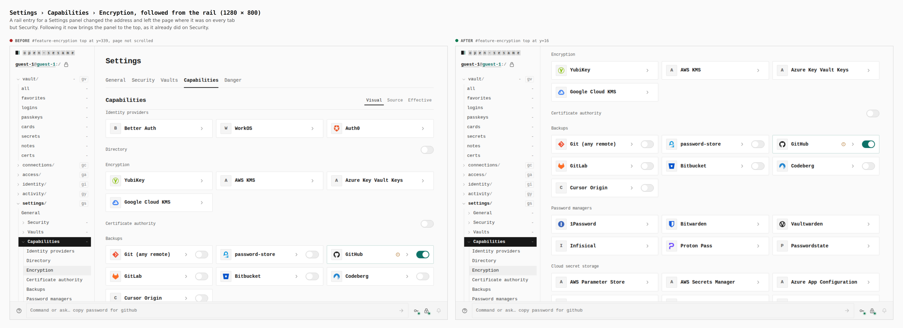
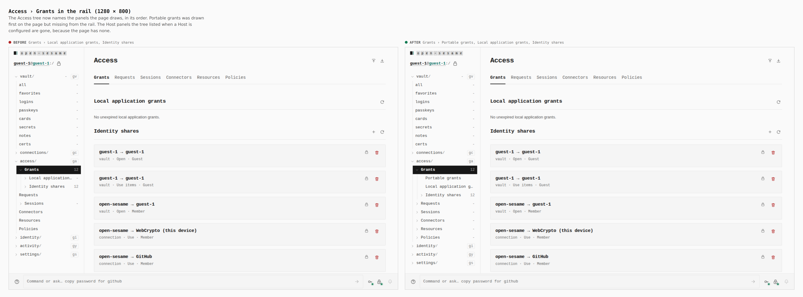
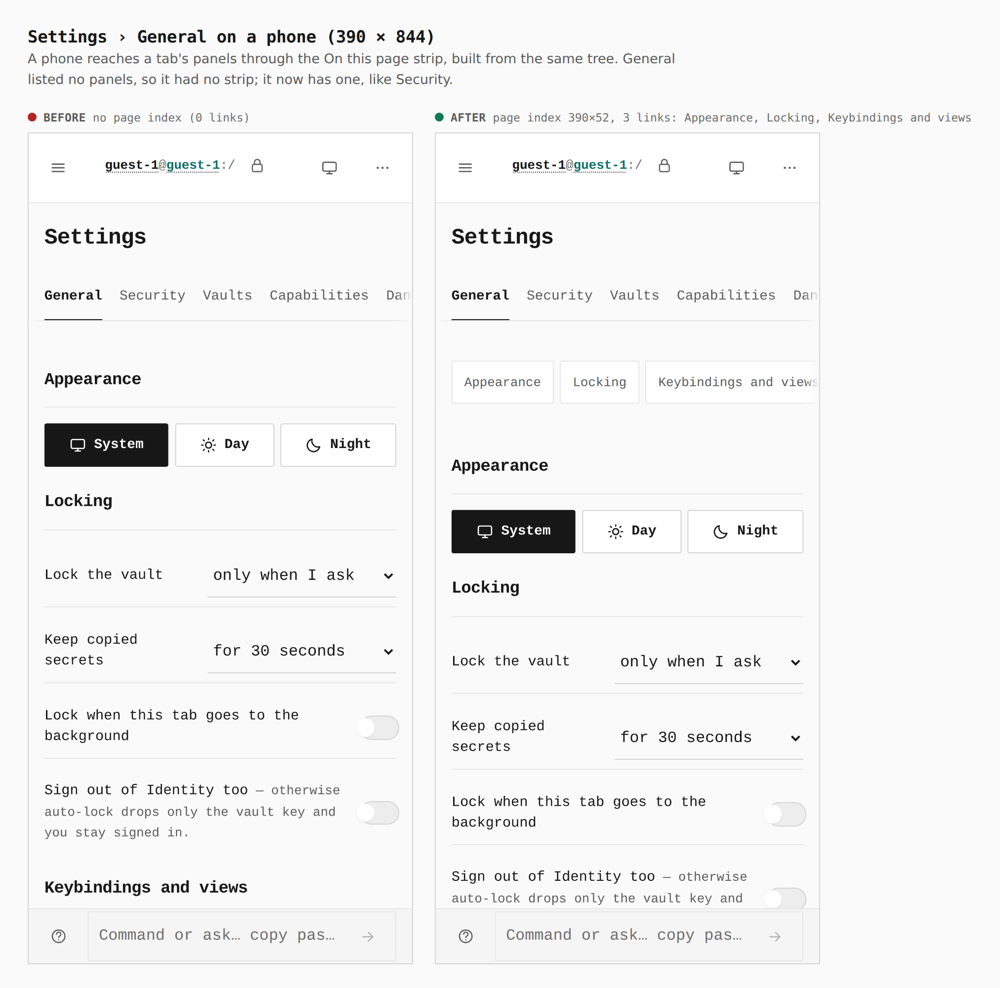

# Every rail tab is a sibling, and every panel link lands

After the Access fix (`../2026-09-27-access-rail/`), a review of every rail
tree found the same defect in Settings, plus two related gaps on the same
paths. An audit script opened each section in a real build, expanded every
branch, and listed each row's level, caret and name position.

| Section | Before | Change |
|---|---|---|
| Vault, Wallet | all rows are leaves | none needed |
| Connections, Identity | all rows at a level are branches | none needed |
| Activity | no subtree | none needed |
| Access | fixed in the previous commit; the tree still named Host panels the page does not draw and missed Portable grants | the tree names what the page draws, in page order |
| **Settings** | General and Danger had no panels in the tree, so they drew caret-less, one indent left of Security, Vaults and Capabilities | General and Danger list their panels |
| **Settings panel links** | only Security scrolled to a `#panel`; every other tab changed the address and stayed put | every tab scrolls to the panel |

Before/after come from two real Pages builds (`VITE_BASE=/OpenSesame/`),
walked with the same steps (`journey.json`): `main` at `2338c69c` (only
`apps/pages/src` reverted) and this branch. Every number below was printed by
the capture run (`measure`, `count`, `address`).

## Settings rail, 1280

| | General | Security | Vaults | Capabilities | Danger | carets |
|---|---|---|---|---|---|---|
| before | x=33 | x=52 | x=52 | x=52 | x=33 | 3 of 5 |
| after | **x=52** | x=52 | x=52 | x=52 | **x=52** | **5 of 5** |

## A Settings panel link lands, 1280

Following Settings › Capabilities › Encryption from the rail, at the address
`/settings/capabilities#feature-encryption`:

| | `#feature-encryption` top |
|---|---|
| before | y=339 (page not scrolled) |
| after | **y=16** |

## Access › Grants, 1280

| | Grants' panels in the rail |
|---|---|
| before | Local application grants, Identity shares |
| after | **Portable grants**, Local application grants, Identity shares (the page's order) |

## Settings › General on a phone, 390

| | On this page strip |
|---|---|
| before | none (0 links) |
| after | 390×52, **3 links**: Appearance, Locking, Keybindings and views |
