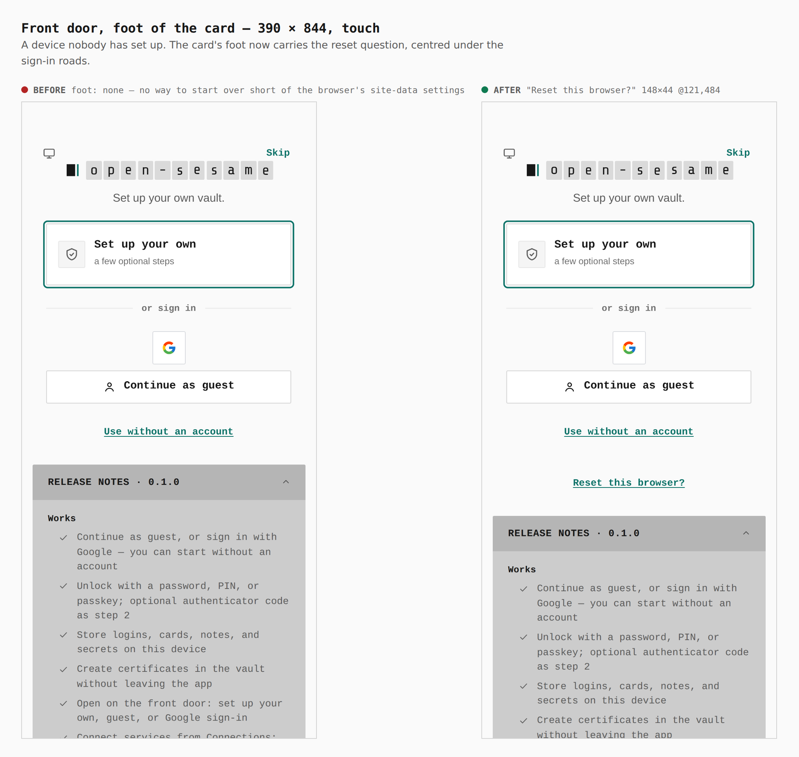
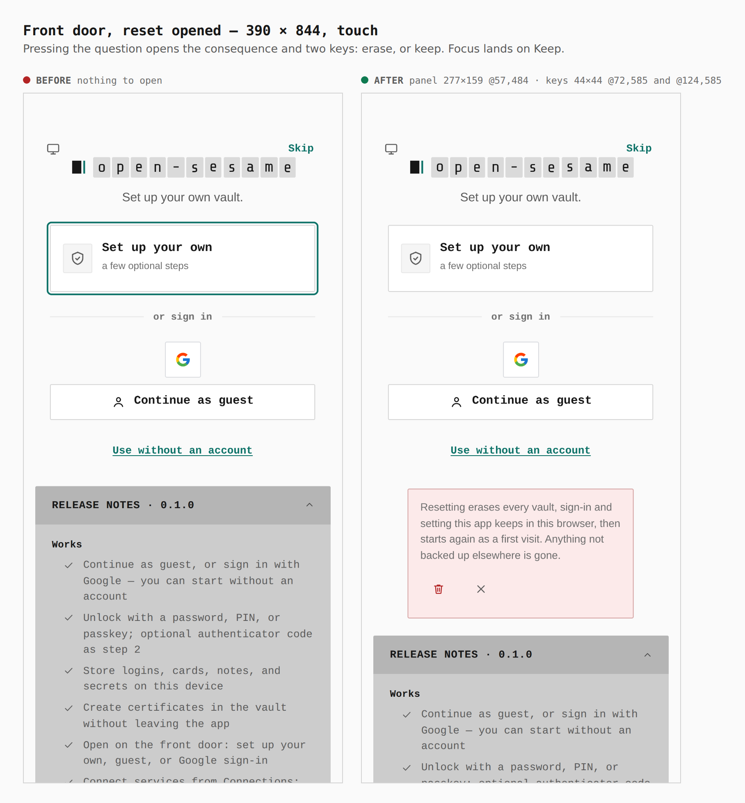
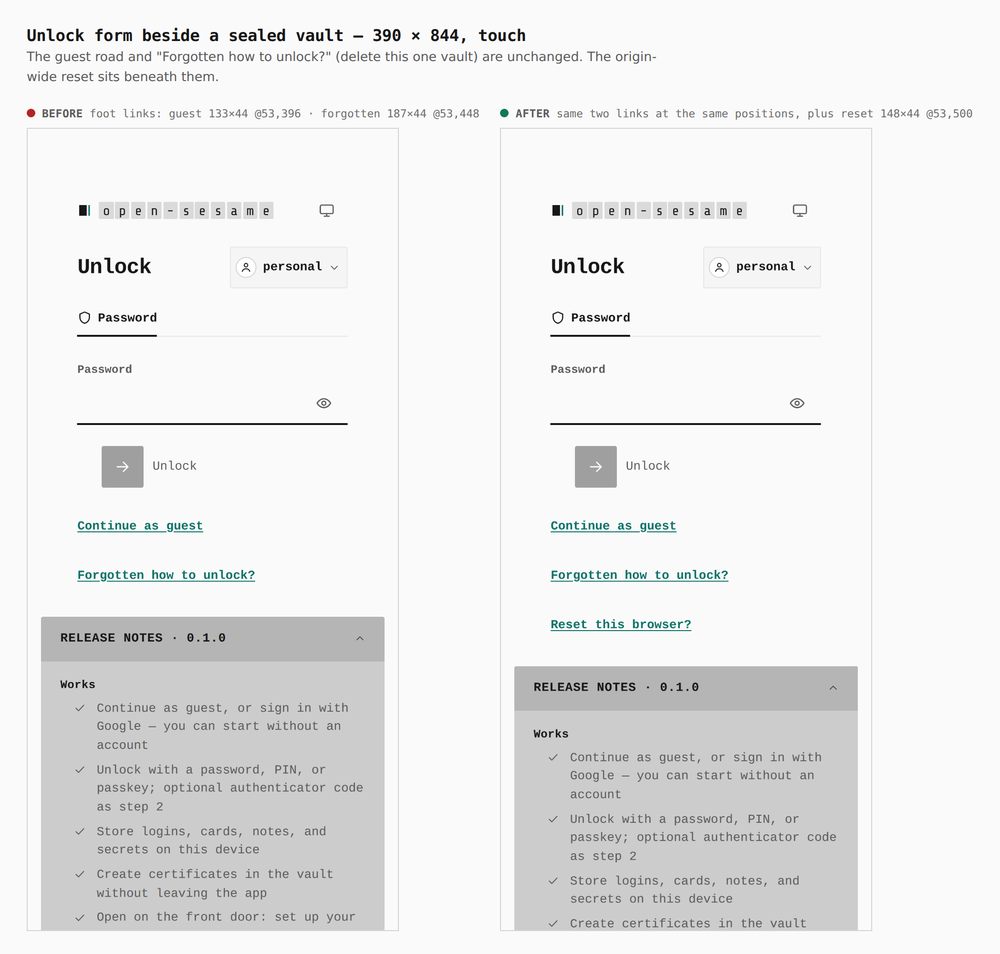
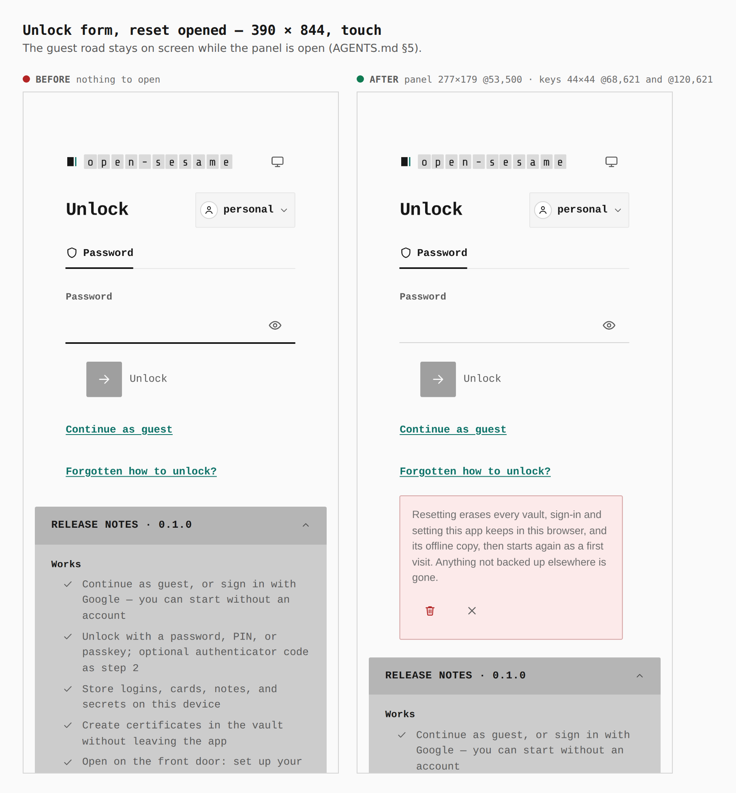
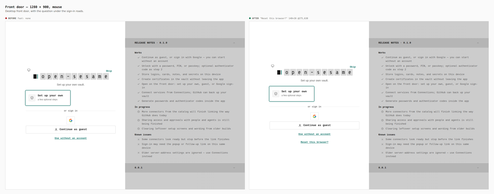
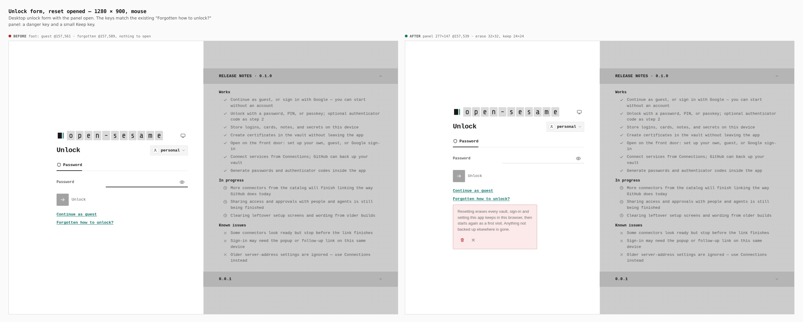
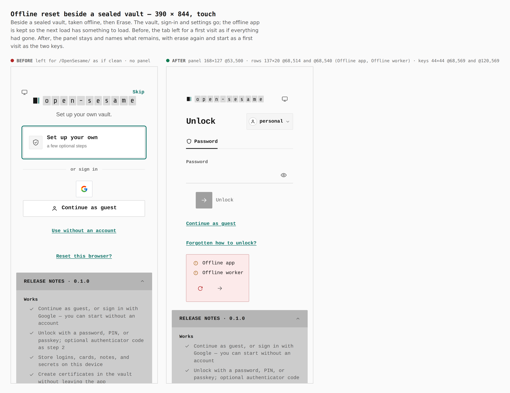
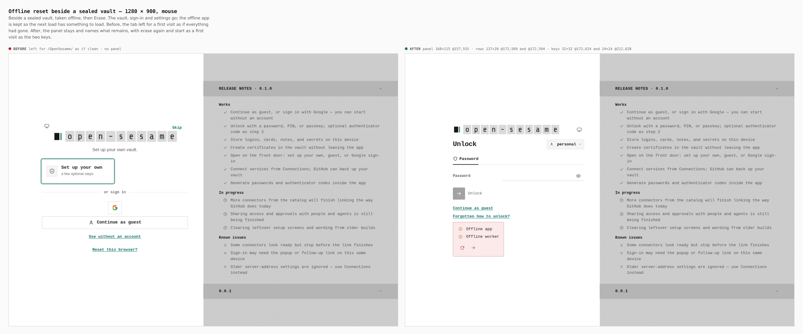

# Reset this browser, from the lock screens

These are before/after captures from two real builds, `main` at `2338c69c` and
this branch, walked the same way with
`apps/pages/scripts/capture-evidence.mjs` and [`journey.json`](journey.json).
Every measurement was read from the browser during the capture.

The change adds "Reset this browser?" to the front door, the unlock form and
the vault list. Confirming it signs out, then clears what the app owns on the
origin, and nothing else: its origin-private files, its IndexedDB database, its
local and session storage keys, its Cache API caches and its service worker.
The origin is shared with every other GitHub Pages site of the account, so each
store is cleared by the app's own names (see the last section). It then loads the app root as a first
visit. When the device is offline it keeps the app shell (the service worker
and its caches, which hold only release assets), so the reload still loads. The vault list only appears with several vaults on the device, and this
journey doesn't set that up. Its placement is covered by `VaultsScreen.test.tsx`.

## Front door, 390 × 844 (touch)

Before, the card had no foot. After, it has `"Reset this browser?" 148×44 @121,484`.

After: panel `277×159 @57,484`, keys `44×44 @72,585` and `@124,585`.

## Unlock form beside a sealed vault, 390 × 844 (touch)

The guest link (`133×44 @53,396`) and the forgotten link (`187×44 @53,448`)
stay where they were. The reset link is added beneath them at `148×44 @53,500`.

After: panel `277×159 @53,500`, keys `44×44 @68,602` and `@120,602`. The guest
road stays on screen while the panel is open.

## Desktop, 1280 × 900 (mouse)

## What the reset did in a real browser

This was checked against `vite preview` of the branch build, with its service
worker and caches live. It is not part of the capture above.

| state | OPFS files | IndexedDB | caches | service workers |
|---|---|---|---|---|
| first visit | 3 | none | 1 | 1 |
| sealed vault, locked | 9 | `opensesame-history-backups` | 2 | 1 |
| after reset + reload | 3 | none | 1 | 1 |

After the reset the tab landed on `/OpenSesame/` showing the front door and the
guest road, with no console or page errors. A second tab that was open on
`/vault` reloaded itself to `/OpenSesame/`.

The same journey with the browser taken offline before the reset:

| state | OPFS files | caches | service workers | page controlled by the worker |
|---|---|---|---|---|
| sealed vault, locked, online | 9 | 1 | 1 | yes |
| after offline reset + reload | 3 | 1 (kept) | 1 (kept) | yes |

Offline, the reload still loaded the front door from the service worker, with
no page errors.

## When something is left behind (follow-up fix)

These two sheets come from a second pair of builds: the branch before the
review fixes (`cf05556d`) and the branch after them, walked with
[`journey-left.json`](journey-left.json). The earlier sheets above are
unchanged. The journey seals a password vault, opens the unlock form, takes
the browser offline (`goOffline`, a new capture verb), and presses Erase.

Before, the tab went to `/OpenSesame/` as if everything had been erased,
though the offline app had been kept. After, the tab stays on `/vault`. The
panel (`168×127 @53,500`) lists what remains, one `StatusMark` per row:
`Offline app: kept while offline` and `Offline worker: kept while offline`
(`137×20 @68,514`, `@68,540`). Its two keys are `Erase again` and `Start as a
first visit` (`44×44 @68,569`, `@120,569`). A store that refused shows the
same way, with an error mark reading `<area>: not erased`.

Desktop: the panel is `168×115 @157,555` and the keys are `32×32` and `24×24`.

## Only what the app owns: the fixed build in a real browser

Checked against `vite preview` of the branch build at
`http://localhost:4188/OpenSesame/`. Another site's data was seeded on the same
origin first: a localStorage key, a sessionStorage key in the app's tab, two
caches (one named like ours but under `/other-site/`), an IndexedDB database,
an OPFS file and a service worker at another scope. A worker script cannot be
routed, so that site's worker came from a temporary file at
`/OpenSesame/other-site-sw.js` with scope `/OpenSesame/other-site/`. The app
then got a guest vault, its own worker and cache, and
`opensesame-history-backups`. A second tab was open on the app.

| state | app files | app keys | app cache | app DB | app worker | the other site's data (all 7 items) |
|---|---|---|---|---|---|---|
| before reset | 14 | 3 | 1 | yes | yes | present |
| after reset, online | 0 | 0 | 0 | no | no | **all survive** |
| after reset, offline | 0 | 0 | 1 (kept) | no | yes (kept) | **all survive** |
| after reset, "online" but the probe fails | 0 | 0 | 1 (kept) | no | yes (kept) | **all survive** |

Online, the tab and the second tab both loaded `/OpenSesame/` only after the
reset was done. That load was held on a placeholder page, so nothing a first
visit writes could be mistaken for leftovers. No page or console errors.
Offline, and with the network probe refused while `navigator.onLine` stayed
true, the panel stayed with the two kept marks. `Start as a first visit` then
loaded the front door from the kept worker.

