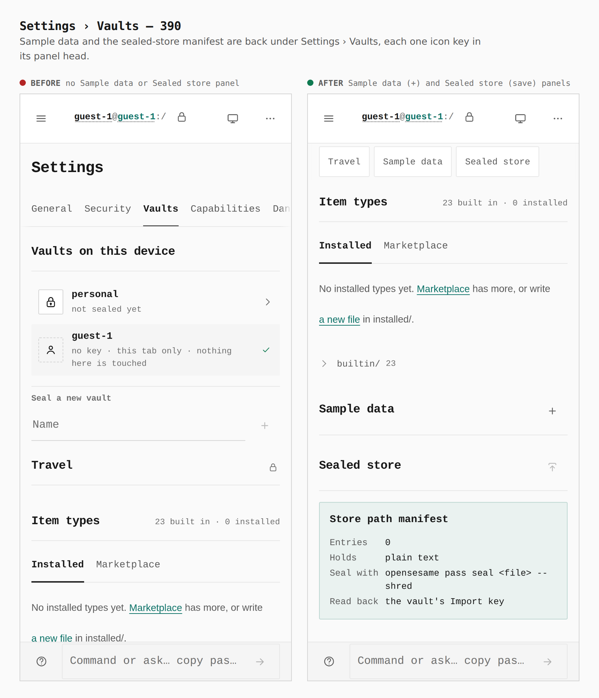
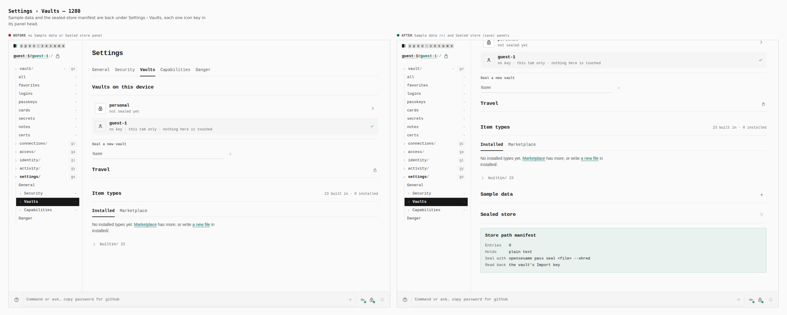
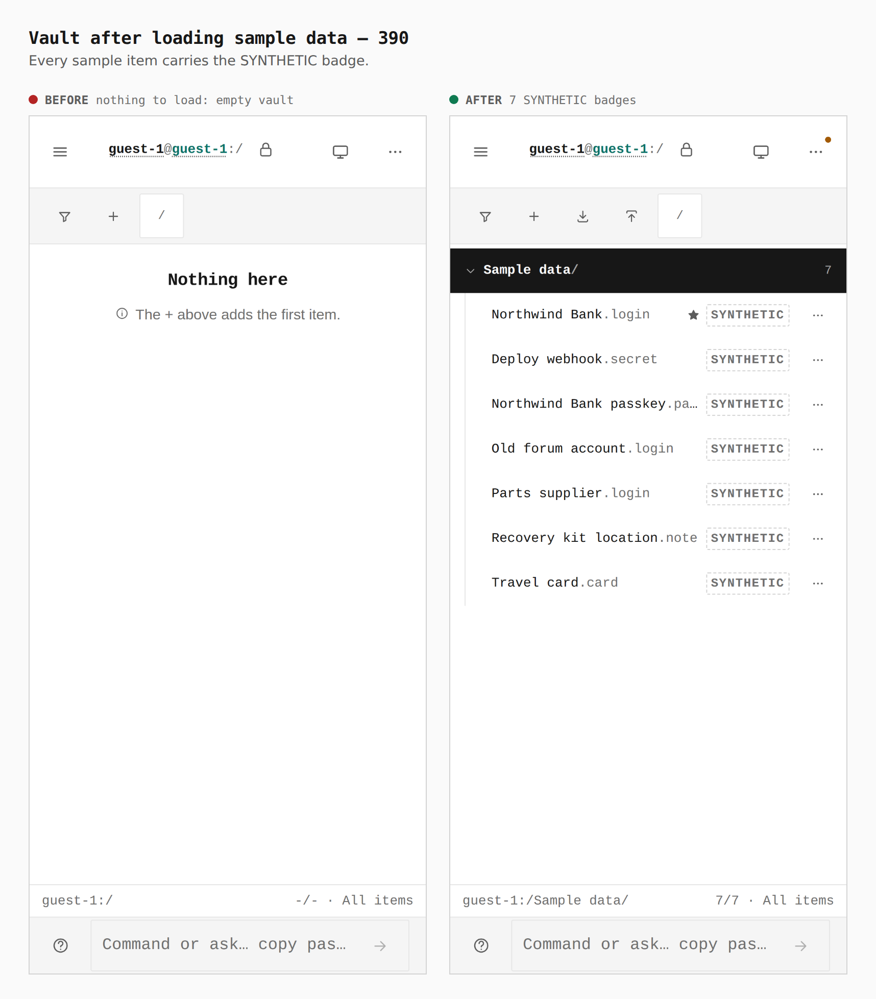
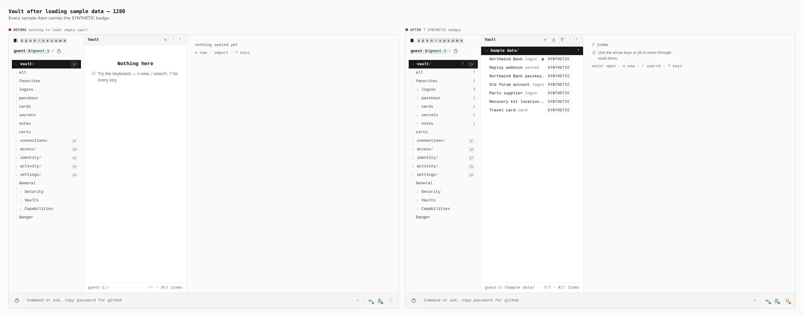
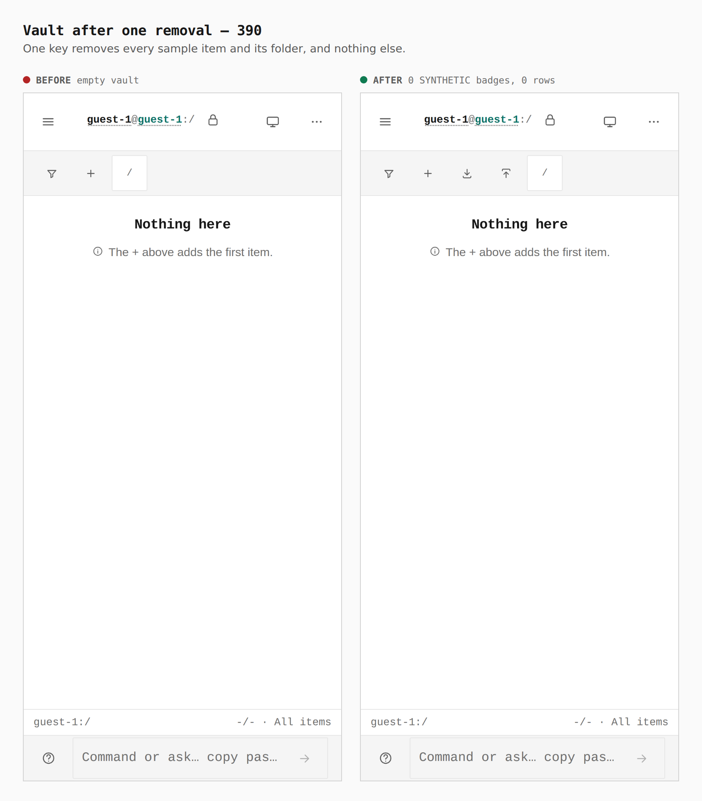
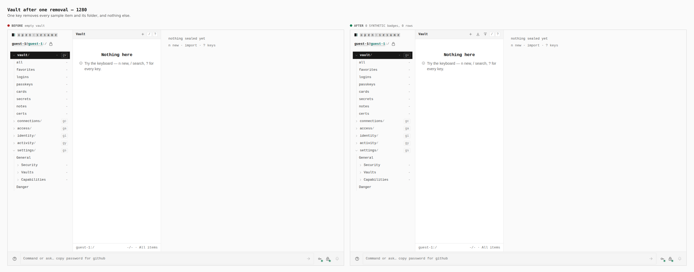
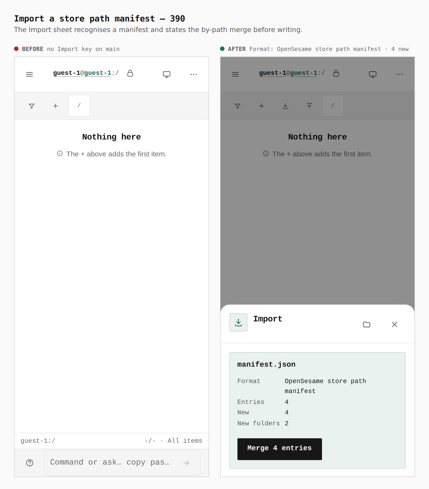
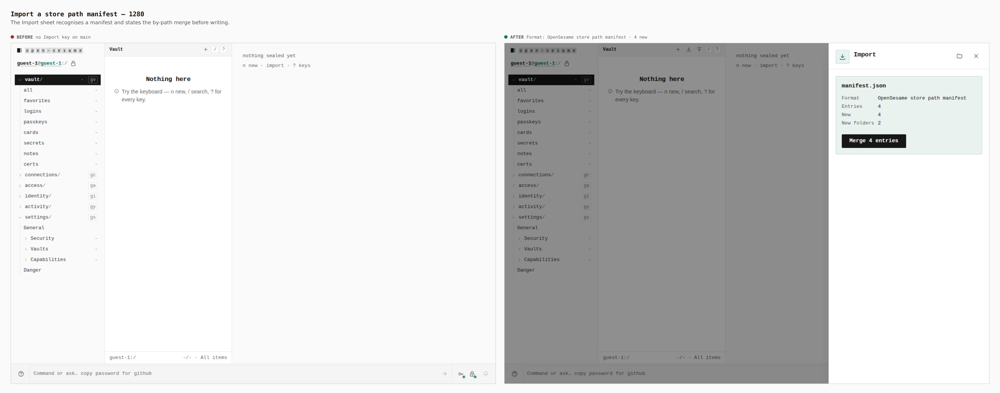
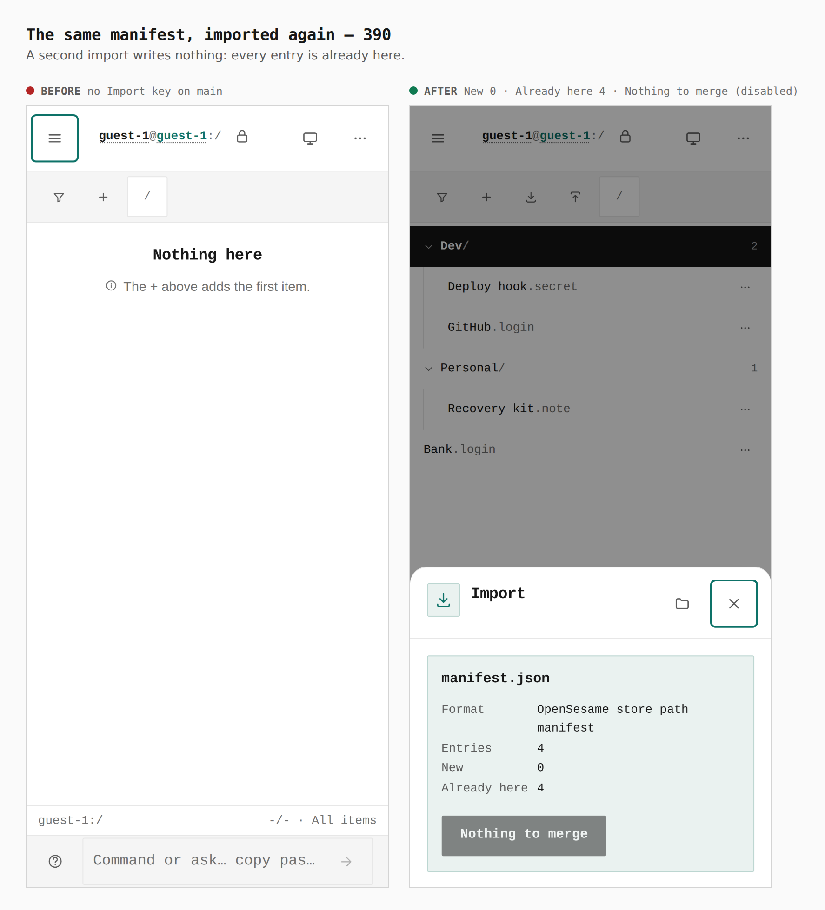
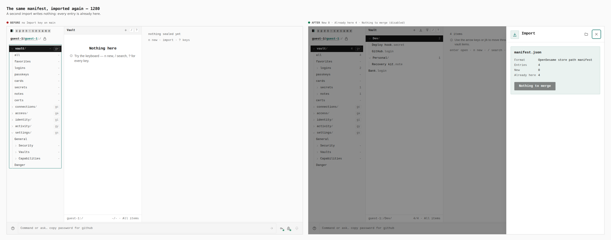

# Sample data and the sealed-store manifest, restored

Before/after captures from two real builds, walked the same way by
`apps/pages/scripts/capture-evidence.mjs` over `journey.json`: `main` at
`24124002` (built in a separate worktree, captured with `EVIDENCE_DIST`) and
this branch. Each continues as guest, opens Settings › Vaults, presses Load
sample data, looks at the vault, presses the one removal key, looks again,
then imports [`manifest.json`](manifest.json) (the four synthetic entries of
`spec/conformance/store-manifest.json`) through the vault's Import key twice.
Every number below was read from the browser by the journey's `count`,
`measure` and `report` steps.

| screen | before → after |
|---|---|
| Settings › Vaults, 390 / 1280 | `#sample-data` 0, `#sealed-store` 0 → 1 and 1; the Sample data key 44×44 (390) / 32×32 (1280) in the panel head |
| vault after loading | nothing to load, 0 rows → 8 rows (`Sample data/` + 7 items), `.vtree__syn` 7 |
| vault after one removal | 0 rows → 0 rows, `.vtree__syn` 0 (the guest vault held no real items) |
| import the manifest | no Import key on `main` → Format OpenSesame store path manifest · Entries 4 · New 4 · New folders 2; after the commit, Added 4 |
| import it again | no Import key on `main` → Entries 4 · New 0 · Already here 4 · “Nothing to merge” disabled; tree still 6 rows (2 folders, 4 items) |

That removal leaves real items alone is shown by a separate real-browser run
over the same build (a guest vault with one real secret, sample data loaded
beside it, then removed — the secret remains, 0 badges), and by
`packages/app-core/src/lib/vault/body-edits-sample.test.ts` and
`store-sample.test.ts`.

The manifest the Sealed store key saved in that run was then sealed by the
native CLI, twice:

```
$ opensesame pass seal manifest.json --shred
{"manifest_shredded":true,"rejected":[],"sealed":2,"skipped":[],…}
$ opensesame pass ls
Dev/GitHub
Real token
$ opensesame pass seal manifest.json --shred      # the same file again
{"manifest_shredded":true,"rejected":[],"sealed":0,"skipped":["Real token","Dev/GitHub"],…}
```

## Settings › Vaults




## Sample data loaded — every item badged




## One key removes it all




## A store path manifest through the Import key




## The same manifest again — nothing to merge



