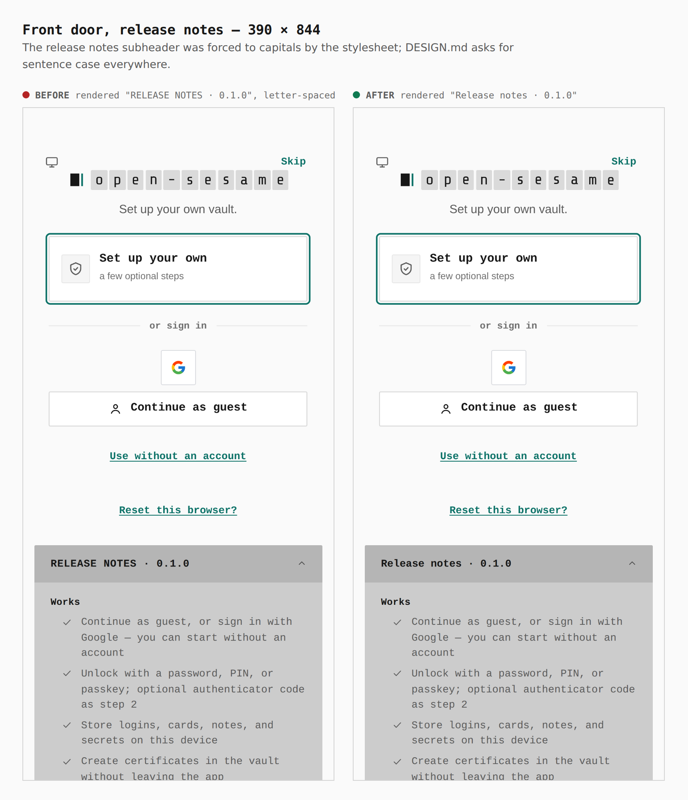
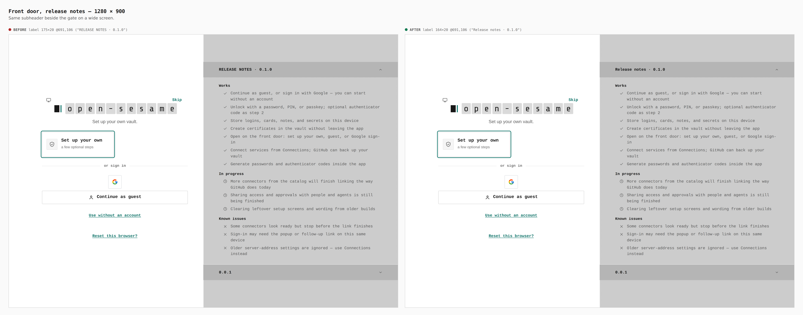
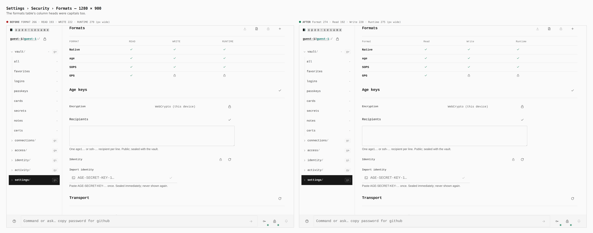

# Sentence case, as DESIGN.md asks

Before/after captures from two real builds, walked the same way with
`apps/pages/scripts/capture-evidence.mjs` and [`journey.json`](journey.json):
this branch with and without the stylesheet change. Every measurement was
read from the browser during the capture.

DESIGN.md § Overview asks for "sentence case everywhere", and § Typography says
labels are "never all-caps". Four rules forced capitals and letter-spacing on
strings that are written in sentence case: the release notes subheader beside
the gate (`screens/unlock.css`), the Formats table's column heads and the SOPS
key-group name (`sections/settings/vault-key-protection.css`), and the setup
MFA group titles (`screens/setup/steps/steps.css`). The rules are gone, so each
label renders as written, and `pnpm lint:design` now rejects any
`text-transform: uppercase | capitalize` in the Pages stylesheets
(`sentence-case`).

The SOPS group name and the setup MFA titles take the same one-line change and
are not captured here: reaching them needs a SOPS document and the setup
ceremony, and the lint rule covers them.

## Front door, release notes — 390 × 844

Rendered `RELEASE NOTES · 0.1.0` → `Release notes · 0.1.0`.

## Front door, release notes — 1280 × 900

Label `175×20 @691,106` → `164×20 @691,106`.

## Settings › Security › Formats — 1280 × 900

`FORMAT 266 · READ 193 · WRITE 222 · RUNTIME 279` → `Format 274 · Read 192 ·
Write 220 · Runtime 275` (column widths in px).
