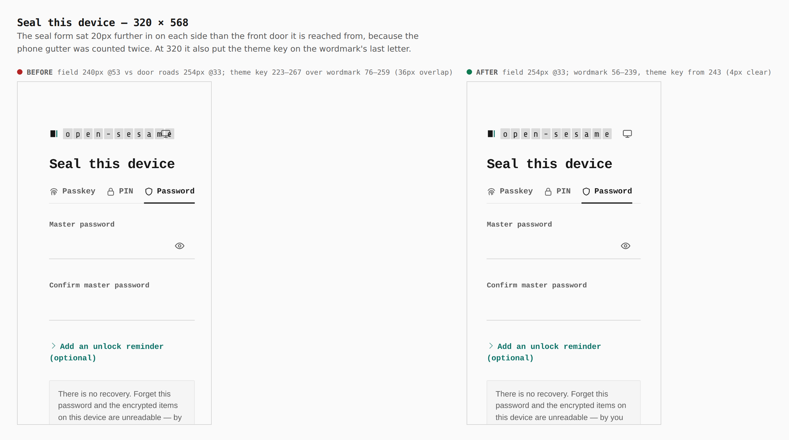
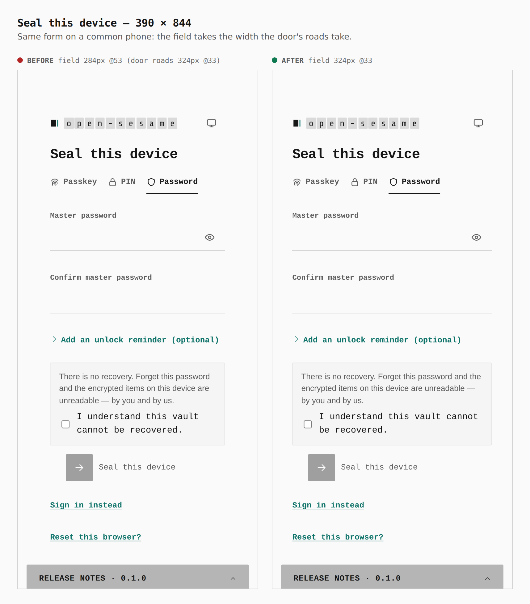
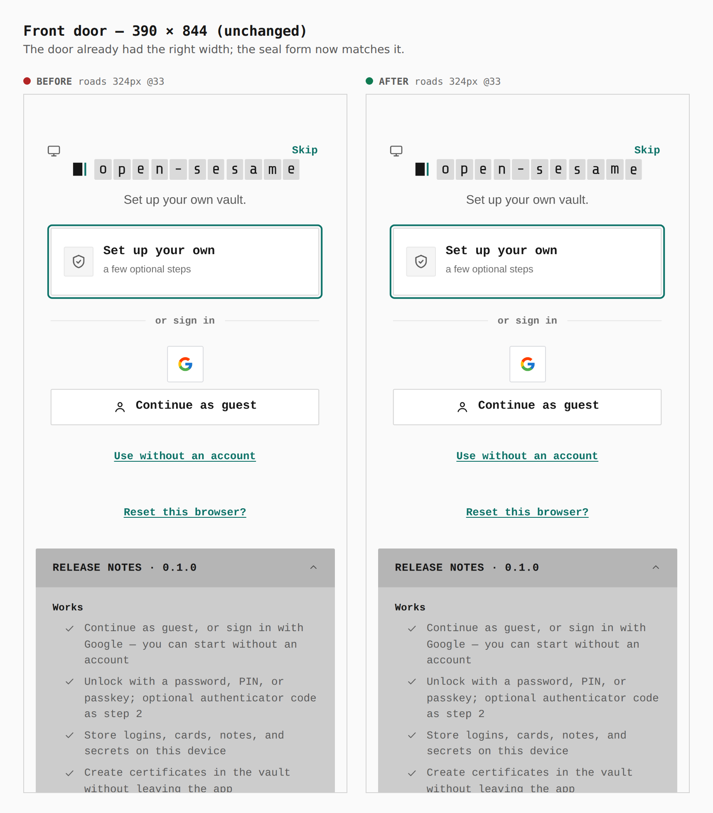
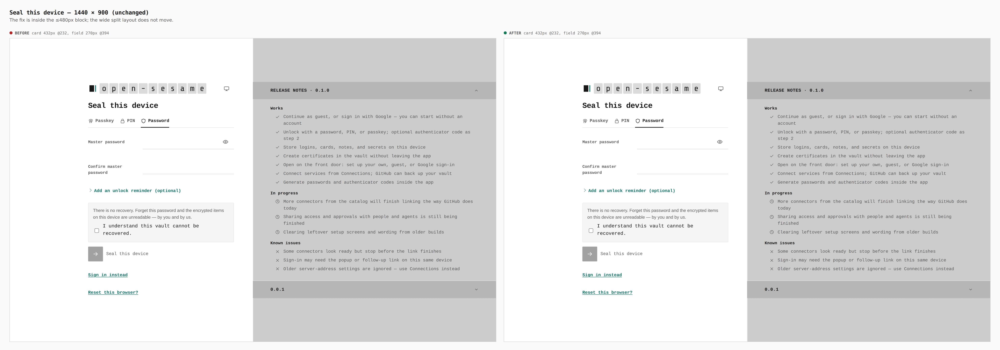

# The seal and unlock forms keep the front door's width on a phone

Before/after captures from two real builds, `main` at `3a832827` and this
branch, walked the same way with `apps/pages/scripts/capture-evidence.mjs` and
[`journey.json`](journey.json). Every measurement was read from the browser
during the capture.

`ed1d403d` moved the unlock shell's horizontal pad onto the card
(`.unlock__card { width: min(calc(100% - 2.5rem), 27rem) }`) so the release
notes could run edge to edge on wide screens. The `(max-width: 480px)` block
still gave `.unlock` its own 0.9rem pad, so on a phone the gutter was counted
twice: the seal and unlock forms sat 20px further in on each side than the
front door they are reached from (`.door .unlock__card` sets its own width and
was not affected). The phone block now sizes the card to `min(100%, 27rem)`,
the width it had before `ed1d403d`. Found by `pnpm test:visual`, whose
`vault-unlock-mobile` baseline (captured before `ed1d403d`) has the field at
x=33.

## Seal this device, 320 × 568

Before: field `240px @53` against the door's roads at `254px @33`; the theme
key (`223–267`) sat on the wordmark (`76–259`), 36px of overlap. After: field
`254px @33`, the door's own measure; wordmark `56–239`, theme key from `243`.

## Seal this device, 390 × 844

Before: field `284px @53`. After: field `324px @33`, the width of the door's
roads.

## Front door, 390 × 844 (unchanged)

Roads `324px @33` in both builds.

## Seal this device, 1440 × 900 (unchanged)

Card `432px @232`, field `270px @394` in both builds: the change is inside the
phone block.
