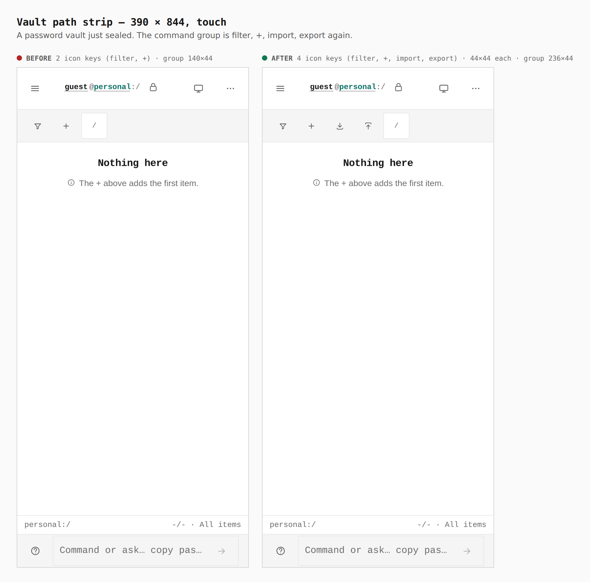
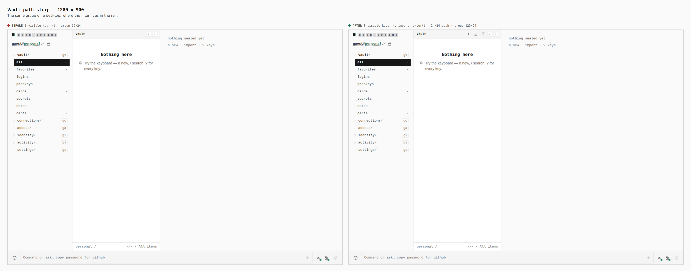
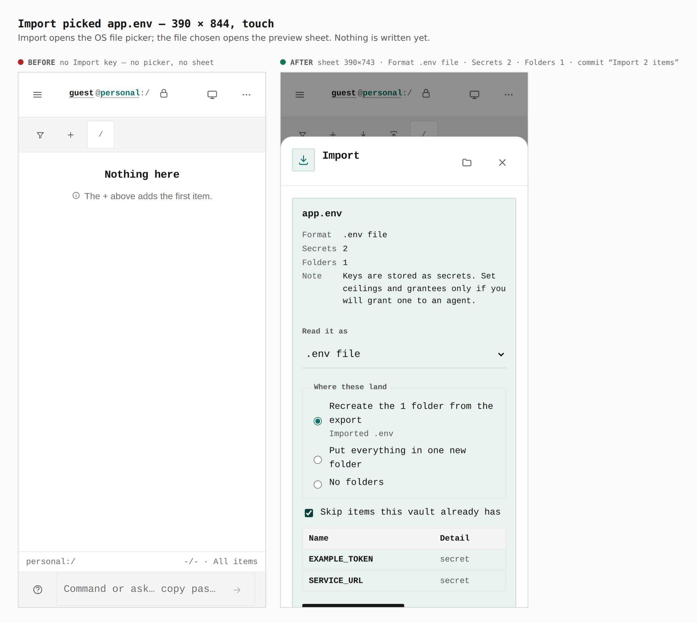
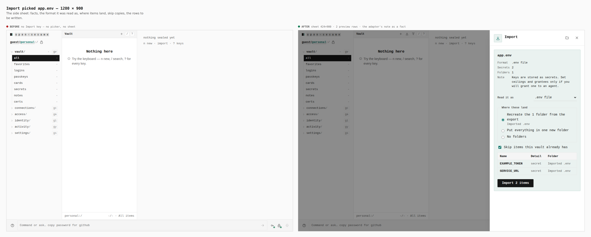
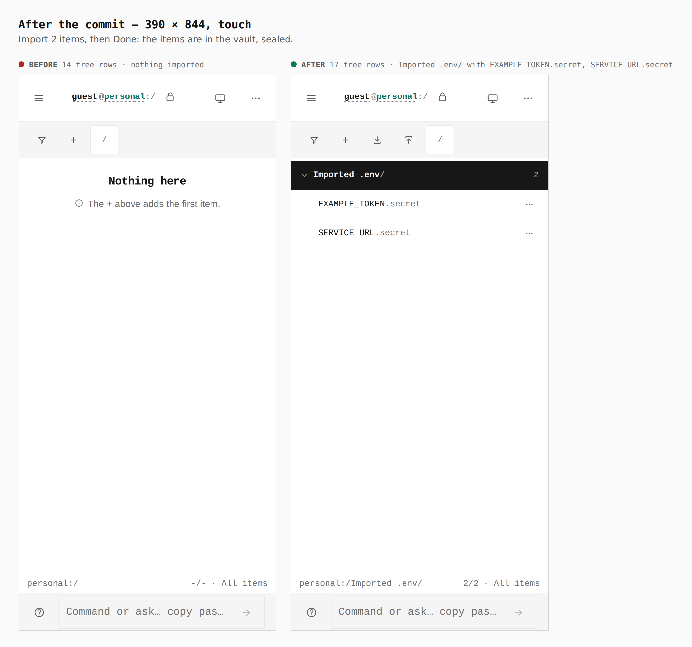
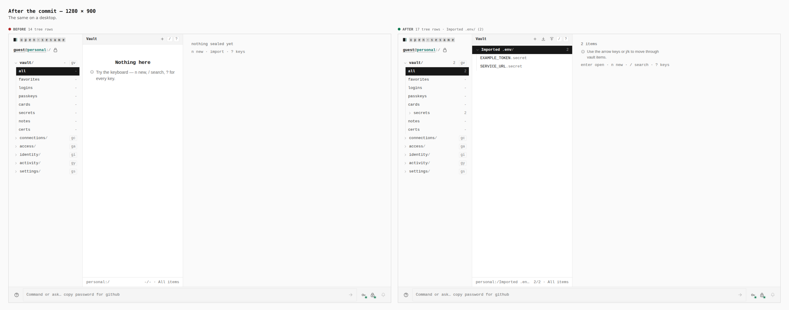
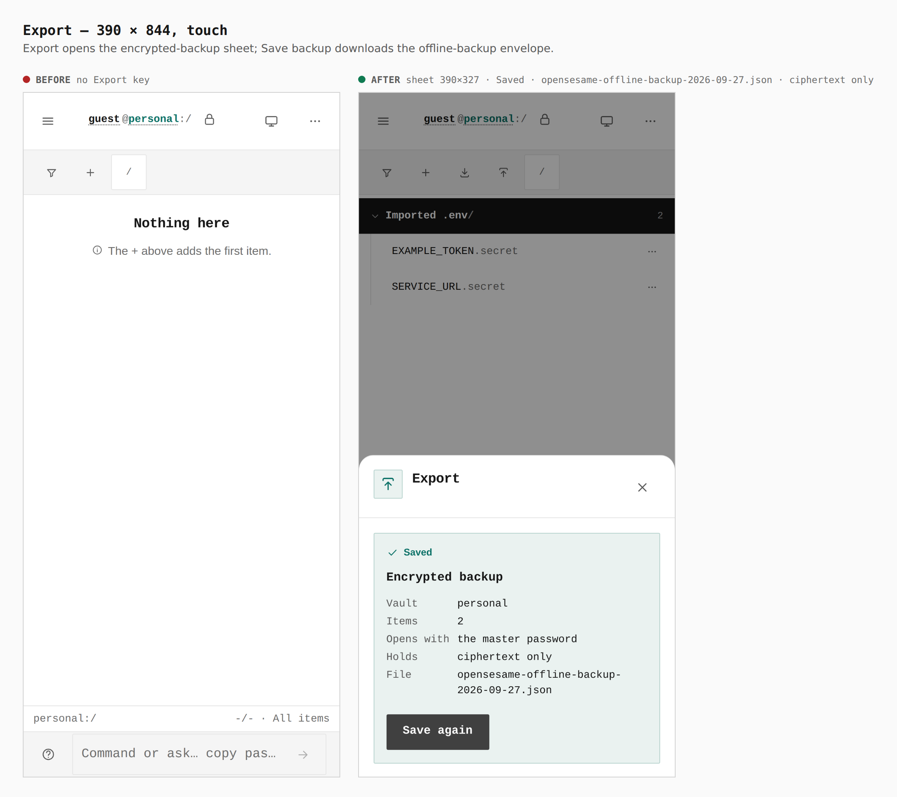
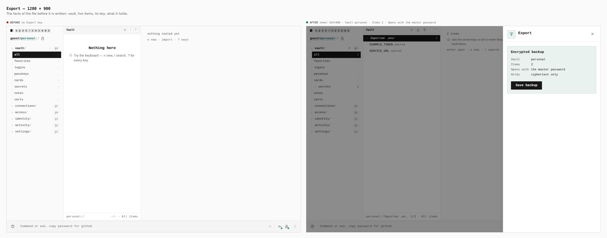

# The vault's Import and Export keys, restored

Before/after captures from two real builds, walked the same way by
`apps/pages/scripts/capture-evidence.mjs` over `journey.json`: `main` at
`24124002` (built in a separate worktree, captured with `EVIDENCE_DIST`) and
this branch. Each seals a password vault on this device, presses Import and
answers the OS file picker with [`app.env`](app.env) (two made-up keys), commits
the preview, then opens Export and saves the backup. Every number below was read
from the browser by the journey's `measure`, `count` and `report` steps.

| screen | before → after |
|---|---|
| path strip, 390 | 2 icon keys, group 140×44 → 4 icon keys (filter, +, import, export), 44×44 each, group 236×44 |
| path strip, 1280 | 1 visible key, group 69×24 → 3 visible keys (+, import, export), 24×24 each, group 125×24 |
| import preview, 390 / 1280 | no key, no sheet → sheet 390×743 / 424×900: Format .env file · Secrets 2 · Folders 1 · “Import 2 items” |
| after the commit | 14 tree rows → 17: `Imported .env/` with `EXAMPLE_TOKEN.secret`, `SERVICE_URL.secret` |
| export | no key → sheet 390×327 / 424×900: Vault personal · Items 2 · Opens with the master password · Saved `opensesame-offline-backup-2026-09-27.json` |

The file Export saved was then opened by the CLI, with the master password typed
at a terminal:

```
$ opensesame-id vault verify opensesame-offline-backup-2026-09-27.json
OK — opensesame-offline-backup: bound to personal, revision 2, 2 items
$ opensesame-id vault ls opensesame-offline-backup-2026-09-27.json
Imported .env/API_KEY.secret	secret
Imported .env/DATABASE_URL.secret	secret
```

(that run used its own two-key fixture; the backup held no plaintext value), and
the same file picked with Import in a fresh password vault restored both items.

## Path strip — 390 × 844, touch



## Path strip — 1280 × 900



## Import preview — 390 × 844, touch



## Import preview — 1280 × 900



## After the commit — 390 × 844, touch



## After the commit — 1280 × 900



## Export, saved — 390 × 844, touch



## Export — 1280 × 900


