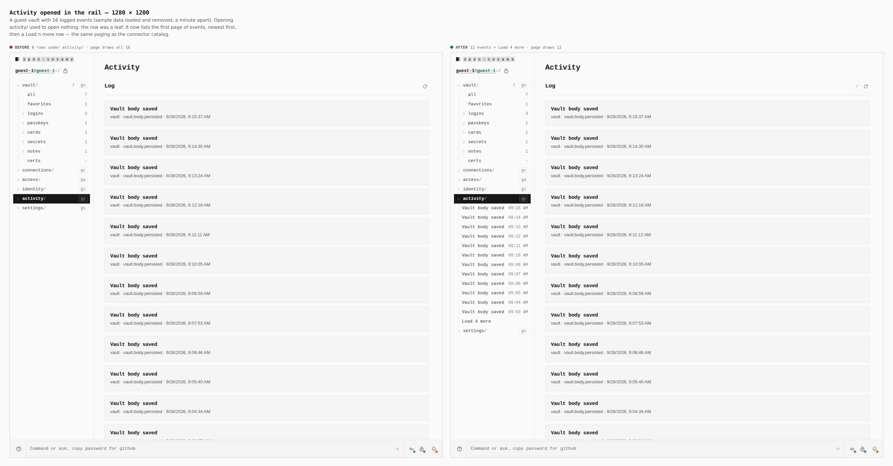
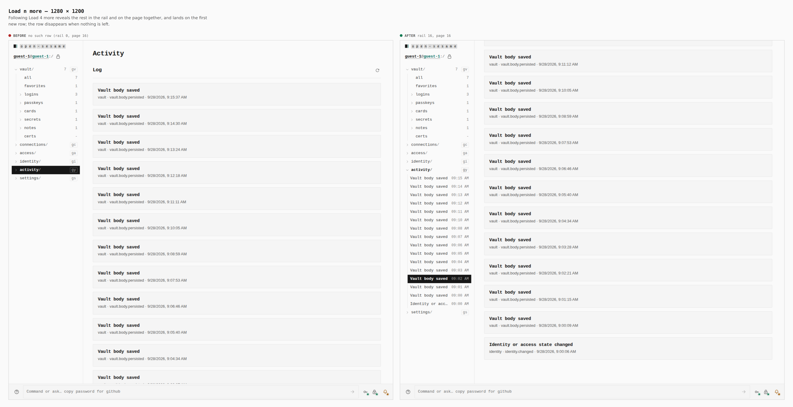
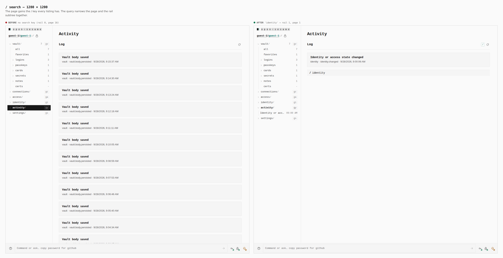
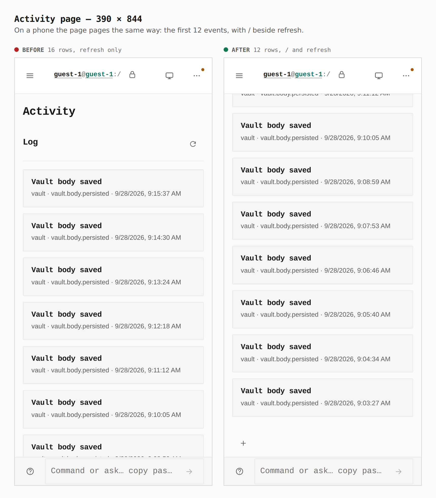
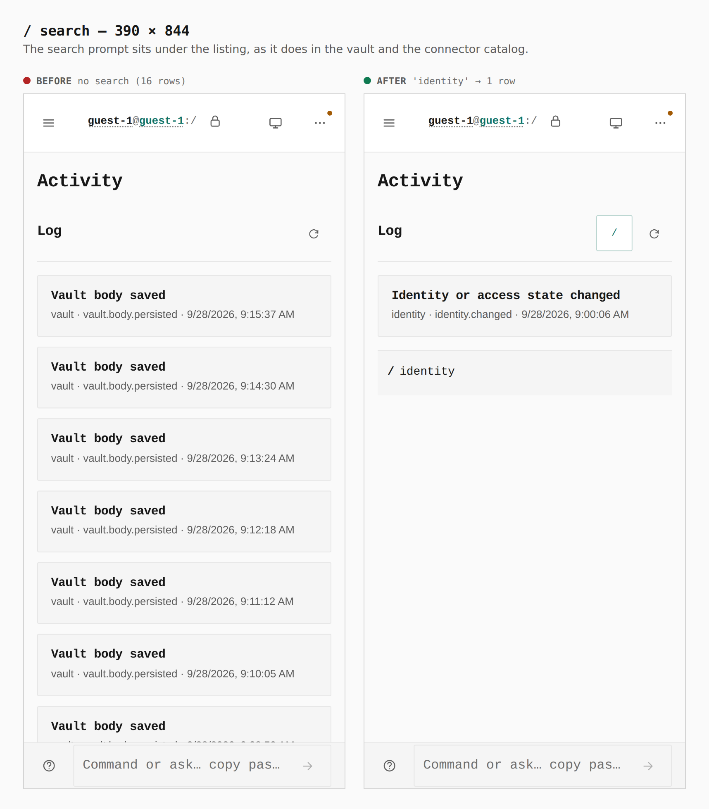

# Activity: a paged, searchable listing in the rail and on the page

Before/after from two real builds: the base (`38cf0c11`) and this branch, walked the same way (`journey.json`). The counts come from the browser (`count` steps), not from the diff.

**How the data was made.** A guest vault loads and removes sample data 15 times, which the app logs as real `Vault body saved` events. The log merges an identical event that follows within 60 seconds, so the journey installs a fixed page clock (`2026-09-28T09:00Z`) and moves it forward 65 seconds between presses. That stands in for a person doing this over a quarter of an hour. Both builds end up with the same 16 events.

## Activity opened in the rail — 1280 × 1200

`activity/` was a leaf, so opening it showed nothing, and the page drew all 16 events at once. It now opens to the first page of events, newest first, followed by **Load 4 more**. This is the paging the connector catalog already had.

**Before:** 0 rows under `activity/` · page 16 · **After:** rail 12 + `Load 4 more` · page 12

## Load n more — 1280 × 1200

Following the row shows the rest in the rail and on the page together, and lands on the first new event.

**Before:** no such row · **After:** rail 16, page 16

## / search — 1280 × 1200

The page now has the `/` key that every listing has. The query narrows the page and the rail subtree together.

**Before:** no search key · **After:** `identity` gives rail 1, page 1

## Activity page — 390 × 844

**Before:** 16 rows, refresh only · **After:** 12 rows, `/` and refresh

## / search — 390 × 844

**Before:** no search · **After:** `identity` gives 1 row

